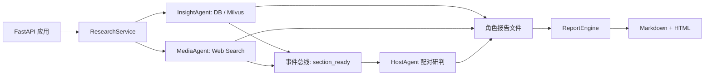
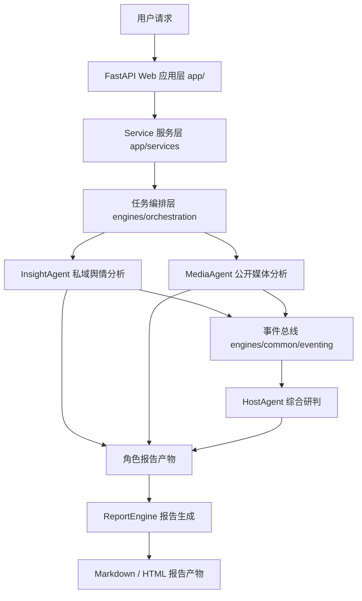
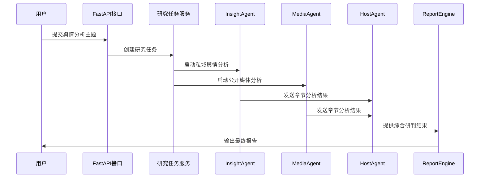
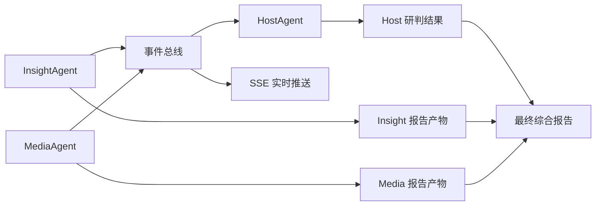

# 01_项目全景整体架构分析


## 1. 项目背景与整体定位

该项目是一个围绕舆情主题分析构建的后端智能分析平台。它并不是单一的接口服务，也不是只负责调用大模型生成文本的脚本，而是把 Web 应用、任务编排、多角色分析、事件流转、报告生成等能力组合在一起，形成一条完整的舆情研判链路。

从使用方式上看，系统接收一个舆情主题，例如某个社会事件、公共话题、品牌事件或网络热点，然后分别从私域舆情数据和公开网络信息中提取线索。不同分析角色完成自己的阶段性研究后，系统再通过主持人角色进行综合判断，最后由报告引擎生成 Markdown 和 HTML 形式的综合分析报告。

因此，这个项目时不能只看某一个接口，也不能只看某一个 Agent。而是先从整体链路入手：请求从哪里进入，任务由谁调度，分析结果如何流转，最终报告如何形成。

### 1.1 项目的核心目标

围绕一个输入主题，自动完成多来源舆情信息分析，并输出一份结构化的综合研判报告。

这个目标可以拆成几个更具体的能力：

- 接收舆情分析主题，并启动后台研究任务。
- 从私域数据库中检索相关舆情内容。
- 从公开网络搜索中获取外部信息补充。
- 将不同来源的信息整理为统一研究维度下的分析结果。
- 对多个分析角色的结果进行综合研判。
- 将阶段性结果聚合为最终报告。
- 通过接口和实时事件流向外部提供任务进度、分析结果和报告文件。

也就是说，系统并不是简单地“把问题发给大模型”，而是先组织信息来源，再分角色分析，再汇总裁判，最后生成报告。这种设计让系统具备更强的结构化分析能力，也方便后续扩展更多数据源、更多角色或更多报告类型。

### 1.2 系统面向的主要业务场景

系统主要面向舆情研究、事件研判和报告生成这类场景。输入通常是一个简短主题，输出则是一组分角色报告和一份最终综合报告。

典型场景包括：

- 对某个热点事件进行背景、传播、情绪、群体差异和深层影响分析。
- 对私域舆情库中的微博、抖音等数据进行主题召回和证据提取。
- 对公开媒体信息进行搜索、筛选和摘要。
- 将多个分析来源形成的结论进行对照，识别共识、分歧和风险。
- 生成可阅读、可下载、可归档的 Markdown / HTML 报告。

这些场景的共同特点是：信息来源较多、分析链路较长、最终结果需要结构化呈现。因此项目采用了分层架构和多 Agent 协作方式，而不是把所有逻辑写在一个接口函数中。

### 1.3 一次舆情分析任务的基本形态

一次舆情分析任务可以理解为从一个 `query` 开始。这个 `query` 是用户关注的主题，例如“高考”“某品牌舆情”“某公共事件”等。

系统拿到这个主题后，会启动两个主要分析方向：

- `InsightAgent`：面向私域舆情库，从已有数据库和可选向量库中寻找相关内容。
- `MediaAgent`：面向公开媒体信息，通过 Web 搜索工具获取外部资料。

两个角色分别完成分析后，会按照统一的研究维度产出章节结果。`HostAgent` 负责接收这些章节结果，并对不同来源的分析内容进行综合研判。最后，`ReportEngine` 会读取已有的角色产物，把它们聚合成最终报告。

这条链路中，每个角色都有相对独立的职责，但又通过统一的维度、事件和报告文件连接起来。

### 1.4 架构总览

基于 FastAPI + LangGraph 的舆情研究平台。API 层接收舆情分析主题后，会通过应用服务层启动两个主要研究角色：`InsightAgent` 和 `MediaAgent`。二者在同一套固定五维研究框架下产出章节，并在章节完成时发布 `section_ready` 事件。

`HostAgent` 监听这些事件，按 `section_key` 将 Insight 与 Media 的同维章节配对，生成主持人研判和最终裁判报告。最后，`ReportEngine` 聚合 Host、Insight、Media 以及讨论记录，生成最终 Markdown / HTML 报告产物。

先从这张图看完整链路：



从这张图可以看到主线 `FastAPI` 负责对外接收请求，`ResearchService` 负责启动研究任务，`InsightAgent` 和 `MediaAgent` 分别从私域数据与公开网络中完成分析，`HostAgent` 负责把两个来源的同维度结论放在一起研判，`ReportEngine` 则负责把各角色产物整理成最终报告。

换句话说，这个项目不是单次大模型调用，而是一条围绕“主题输入 -> 多源分析 -> 事件配对 -> 综合研判 -> 报告生成”展开的后端分析流水线。


## 2. 项目目录结构总览

该项目拆分 Web 应用层、智能引擎层、报告产物分别放在不同目录中。先从一级目录入手，快速建立对项目职责划分的整体认识。

项目根目录大致如下：

```text
sentiment_platform/
├── app/
├── data/
├── engines/
├── front/
├── sql/
├── main.py
├── pyproject.toml
├── uv.lock
├── .env
```

先不要深入每一个子目录的内部实现，只关注它们在系统中的位置和职责。

### 2.1 根目录中的关键文件与目录

根目录中的文件可以分成几类：

- `main.py`：后端服务启动入口。
- `pyproject.toml`：Python 项目依赖和构建配置。
- `uv.lock`：依赖锁定文件，用于保证环境一致性。
- `.env`：本地运行配置文件，包含数据库、大模型、搜索服务等配置。
- `app/`：FastAPI 应用层代码。
- `engines/`：核心分析引擎和多 Agent 逻辑。
- `data/`：运行后产生的数据和报告文件。
- `sql/`：舆情数据表结构。
- `front/`：页面交互层。本篇只在整体链路中提及，不展开前端技术细节。

项目把“应用入口”和“智能分析引擎”做了拆分。`app/` 更接近 Web 后端，`engines/` 才是复杂业务和智能分析逻辑的核心位置。

### 2.2 `main.py`：后端服务启动入口

`main.py` 是服务启动入口，主要做两件事：

- 从 `app.main` 导入 FastAPI 应用对象 `app`。
- 在直接运行时，通过 `uvicorn.run()` 启动服务。

它本身不承载复杂业务逻辑，而是一个“启动器”。真正的 FastAPI 应用实例、路由注册、生命周期管理，都放在 `app/main.py` 中。

### 2.3 `app/`：FastAPI Web 应用层

`app/` 目录是系统的 Web 应用层，主要负责接收外部请求、定义接口、管理依赖和组织应用服务。它并不直接实现复杂的舆情分析，而是把请求转交给服务层或引擎层。

典型职责包括：

- 注册 FastAPI 应用和路由。
- 定义请求体和响应体模型。
- 提供研究任务、报告生成、配置管理、Host 研判等 API。
- 管理服务对象和依赖注入。
- 通过 SSE 暴露实时事件流。

从分层角度看，`app/` 是系统对外的入口层。它让外部调用者不需要关心底层 Agent 如何执行，只需要通过 API 发起任务、查询状态或获取报告。

### 2.4 `engines/`：核心智能分析引擎层

`engines/` 是项目中最核心的目录。它包含多 Agent 执行、任务编排、数据库检索、Web 搜索、向量检索、事件总线、报告生成等逻辑。

主要子模块包括：

- `contracts/`：跨模块共享的契约定义，例如配置、研究维度、事件模型、角色定义。
- `common/`：公共能力，例如事件总线、报告 IO、运行时工具、通用节点。
- `orchestration/`：任务编排逻辑，用于启动研究角色和管理 Host 。
- `llm/`：大模型调用统一封装。
- `insight_agent/`：私域舆情分析角色。
- `media_agent/`：公开媒体分析角色。
- `host_agent/`：主持人综合研判角色。
- `report_engine/`：最终报告生成引擎。

如果说 `app/` 解决“外部怎么调用系统”，那么 `engines/` 解决“系统内部如何完成分析”。

### 2.5 `data/report/`：分析报告与运行产物目录

`data/report/` 用于保存分析过程中的报告产物。不同角色通常会写入不同子目录，例如：

- `data/report/insight/`
- `data/report/media/`
- `data/report/host/`
- `data/report/`

这些文件包括 Markdown、HTML、JSON 状态等。最终报告生成时，系统会读取已有角色产物，再交给报告引擎进行聚合和渲染。

因此，`data/report/` 不只是普通输出目录，它也是系统运行链路中非常重要的“**结果交接区**”。

### 2.6 `sql/`：舆情数据表结构

`sql/` 目录中保存了舆情数据相关的数据表结构，例如微博和抖音内容表、评论表等。`InsightAgent` 面向私域舆情库进行分析时，会依赖这些数据结构完成内容召回。


## 3. 后端技术栈总览

这个项目的后端不是只依赖 FastAPI 提供接口能力，而是同时整合了数据库访问、异步任务、大模型调用、搜索服务、向量检索、Markdown 渲染和实时事件推送等能力。

### 3.1 FastAPI

FastAPI 是项目的 Web 应用框架。它负责创建后端应用、注册路由、解析请求、校验参数并返回响应。

FastAPI 层本身并不适合承载过重的业务逻辑，因此项目把具体执行逻辑放到了 `app/services/` 和 `engines/` 中。

### 3.2 Pydantic

**请求响应模型与数据校验**，Pydantic 在项目中主要用于定义结构化数据模型。`app/schemas/` 下的请求与响应模型，以及 `engines/contracts/` 中的一些事件和配置契约，都体现了这种用法。

它的价值在于：

- 让接口输入输出更加明确。
- 自动完成字段校验和类型转换。
- 让复杂事件、报告状态和配置项具备统一结构。
- 减少手写参数检查代码。

在多模块协作的项目中，清晰的数据模型尤其重要。因为一个事件或任务结果往往会跨越多个模块，如果缺少统一结构，后续维护会变得困难。

### 3.4 pydantic-settings

项目中的配置集中定义在 `engines/contracts/config.py`。这里使用 `pydantic-settings` 从 `.env` 和环境变量中加载配置。

配置内容覆盖范围较广，包括：

- 服务监听地址和端口。
- 数据库连接信息。
- 不同角色的大模型 API 配置。
- Web 搜索服务配置。
- 报告输出目录。
- Milvus 向量检索配置。
- 聚类、召回和检索参数。

### 3.5 SQLAlchemy

SQLAlchemy 是项目访问数据库的重要基础。`InsightAgent` 需要从私域舆情库中检索微博、抖音等平台数据，而这些查询逻辑不适合直接拼接 SQL 字符串。

项目中通过 SQLAlchemy 构造查询，能够让不同平台的数据检索逻辑更规范，也方便在平台适配器中复用通用查询能力。

### 3.6 aiomysql / pymysql

项目依赖中同时包含 `aiomysql` 和 `pymysql`，用于支持 MySQL 数据库连接。私域舆情库默认配置中也体现了 MySQL 作为主要数据来源。

从整体链路看，数据库连接能力服务于 `InsightAgent`。当系统接收到一个分析主题后，私域分析角色需要根据关键词、评论内容、热度等条件从数据库中召回相关记录。

### 3.7 LangGraph

LangGraph 用于组织 Agent 内部的多步骤流程。相比把所有步骤写成一个长函数，LangGraph 更适合表达“节点 + 状态 + 流转”的执行方式。

在本项目中，典型的 Agent 流程包括：

- 规划分析维度。
- 检索或搜索资料。
- 整理证据。
- 生成章节内容。
- 格式化报告。
- 保存产物。

这些步骤具有明确顺序，也可能存在循环或条件判断。用图结构组织后，流程边界会更清楚。

### 3.8 OpenAI SDK 与 LangChain OpenAI

项目中使用 OpenAI 兼容接口以及 LangChain OpenAI 相关能力来调用大模型。不同角色可以配置不同的模型、Base URL、API Key 和 Provider。

这种角色级模型配置非常重要。因为 `InsightAgent`、`MediaAgent`、`HostAgent` 和 `ReportEngine` 的任务不同，对模型能力、成本和响应风格的要求也不同。

统一的 LLM 客户端封装可以减少各模块重复写模型调用逻辑，也方便后续切换模型供应商。

当前项目没有把所有角色都绑定到同一个模型，而是采用了“按角色选择模型”的方式。这样做的原因是，不同角色处理的信息类型和输出目标并不相同：有的角色更重视中文语义理解和证据归纳，有的角色更重视长上下文资料处理，有的角色更重视报告写作稳定性，有的角色则更适合使用成本较低、响应较快的模型来做阶段性裁判。

当前配置中的模型选择：

- `InsightAgent` 当前选择 `kimi-k2.6`。这个角色主要处理私域舆情库中的中文内容、评论文本、平台数据和证据材料，需要较强的中文语义理解、长文本归纳和结构化分析能力。Kimi 系列模型在中文长文本理解、材料压缩和证据型写作上比较适合承担这类任务。
- `MediaAgent` 当前选择 `gemini-2.5-pro`。这个角色需要处理公开网络搜索结果，输入材料往往来源复杂、长度较长、信息密度不均。Gemini 2.5 Pro 更适合处理长上下文、多来源资料整合和复杂推理，因此适合用来完成公开媒体侧的资料筛选、观点提炼和章节写作。
- `ReportEngine` 当前也选择 `gemini-2.5-pro`。最终报告生成需要把 Host、Insight、Media 等多方材料重新组织成一份结构完整、表达统一的综合报告，对长上下文整合、章节衔接和正式文稿生成能力要求较高，所以继续使用 Gemini 2.5 Pro 可以保证报告成稿质量。
- `HostAgent` 当前选择 `deepseek-chat`。HostAgent 更像主持人或裁判角色，重点是对两个分析角色的同维度结论进行比较、提炼共识、指出分歧和风险。这个过程需要稳定的中文对话、判断和总结能力，同时调用频次可能较高，因此选择 DeepSeek 可以在效果、速度和成本之间取得较好的平衡。

因此，角色级模型配置并不是为了增加复杂度，而是为了让每个模型负责自己更擅长的任务。后续如果某个角色的质量、成本或响应速度不符合预期，也可以只调整该角色的模型配置，而不影响其他角色。


### 3.9 Tavily / Bocha / Anspire

`MediaAgent` 需要从公开网络中获取信息，因此项目集成了多个搜索服务提供方：

- Tavily    全球化 Agent 搜索标杆，深度研究型全球搜索引擎。
- Bocha  国内的高性能 Bing 替代品，高性价比的中文知识搜索引擎。
- Anspire  主打企业级合规,面向企业级和多模态智能体的高可用搜索引擎。

这些服务通过适配器封装为统一的搜索能力。这样 `MediaAgent` 不需要关心具体搜索供应商的响应格式，只需要接收归一化后的搜索结果。

多搜索提供方设计也为后续降级和替换留下空间。例如某个搜索服务不可用时，可以切换到其他服务。


**三者区别：**

| **搜索引擎**     | **核心优势 **                                                | **劣势 **                                                    | **最佳适用场景（针对尚舆平台）**                             |
| ---------------- | ------------------------------------------------------------ | ------------------------------------------------------------ | ------------------------------------------------------------ |
| **Tavily**       | 海外英文资源覆盖极广，能在后台深度阅读多网页并直接返回高质量长篇研究摘要。 | 中文生态（如微信、小红书等）穿透力极差；服务器在海外，国内直连存在网络延迟及**数据出海合规风险**。 | **海外舆情监测**、外媒报道追踪、跨境出海调研、前沿科技/美股动态。 |
| Bocha (博查)     | 极懂国内中文网络；**自带 Reranker（二次语义重排）**，相关性极高；节点在国内，超低延迟且并发稳定。 | 纯硬核英文学术或海外极冷门站点的深度抓取能力，略逊色于 Tavily。 | **国内泛互联网舆情**（时政、社会热点、A股）、需控制 Token 成本的高频实时预警。 |
| Anspire (安思派) | **数据绝对合规不出海**；主打打破信息孤岛（多渠道全网深层搜索）；企业级生态集成度极高（Dify/企微/飞书）。 | 整体偏商业化定制收费；对个人开发者而言，开源社区案例与知名度暂不如前两者。 | **政企国资涉密舆情**、要求严格的数据审计、定制化的内部商业智库。 |


### 3.10 Milvus / pymilvus

Milvus 用于支持向量检索。项目中 `InsightAgent` 除了可以从数据库中按关键词和热度召回内容，还可以在配置开启时使用 Milvus 进行语义向量召回。

向量检索的价值在于，它不只依赖关键词完全匹配，还可以找到语义相近的内容。这对舆情分析很有用，因为用户讨论同一事件时，表达方式可能非常多样。

### 3.11 SSE

SSE，全称 Server-Sent Events，用于后端向前端或其他消费方持续推送事件。舆情分析任务通常耗时较长，如果只有普通 HTTP 请求，调用方很难实时知道任务进度。

项目通过 SSE 推送：

- 角色启动进度。
- 章节分析进度。
- 任务完成结果。
- 错误信息。
- HostAgent 讨论消息。

这样系统在执行长任务时，可以持续向外部暴露运行状态。

### 3.12 Mistune

最终报告通常先以 Markdown 形式生成，再渲染为 HTML。Mistune 就用于完成 Markdown 到 HTML 的转换。

- Markdown 易于生成、编辑和归档。
- HTML 易于浏览器预览和下载展示。


## 4. 系统整体分层架构

在项目中，不同目录并不是简单地按文件类型划分，而是对应着不同层次的系统职责。Web 应用层负责接收请求和暴露接口，服务层负责组织业务动作，引擎层负责执行复杂分析任务，报告层负责聚合结果并生成最终产物。

整体架构可以概括为下面这张图：



这张图展示了系统的主干结构。用户请求并不会直接进入 Agent 内部，而是先经过 Web 应用层和服务层。服务层再调用编排层，由编排层启动具体分析角色。分析结果一方面通过事件系统流向 HostAgent，另一方面写入报告目录，供最终报告引擎聚合使用。

### 4.1 Web 应用层的职责边界

Web 应用层位于 `app/` 目录。它的核心职责是对外提供 HTTP API，并把请求转交给内部服务。

它不直接实现复杂的检索、搜索、模型调用或报告生成逻辑。这样做可以保持接口层轻量，也让核心业务逻辑更容易被复用

### 4.2 Service 服务层的职责边界

Service 服务层位于 `app/services/`。它处在 API 和引擎之间，负责把接口请求转换成具体业务动作。

例如：

- `ResearchService` 负责启动研究任务和获取最新结果。
- `ReportService` 负责创建报告生成任务、查询任务状态和获取下载文件。
- `HostService` 负责启动或停止 HostAgent 运行时，并读取讨论记录。
- `ConfigService` 负责读取和更新运行配置。

Service 层不直接处理底层，但它知道应该调用哪个编排器、哪个任务存储、哪个报告服务。它相当于应用层的业务协调者。

### 4.3 Orchestration 编排层的职责边界

编排层位于 `engines/orchestration/`。它比 Service 层更接近执行引擎，负责把一个业务任务拆成多个角色任务。

例如研究任务启动后，编排层会根据角色注册表启动：

- `InsightAgent`
- `MediaAgent`

每个角色都有自己的输出目录和调用入口。编排层还会负责发布进度、结果和错误事件，让其他模块能够感知任务状态。

可以把编排层理解为“后台任务调度者”。它不关心 HTTP 请求细节，也不直接渲染最终报告，而是负责把分析角色真正跑起来。

### 4.4 Agent 引擎层的职责边界

Agent 引擎层包含 `insight_agent/`、`media_agent/` 和 `host_agent/`。这是系统中最具业务价值的部分。

三个角色的关注点不同：

- `InsightAgent` 关注私域舆情库。
- `MediaAgent` 关注公开媒体信息。
- `HostAgent` 关注多方结果的综合研判。

Agent 内部会调用数据库、搜索服务、大模型、证据整理工具和报告保存工具。相比 Web 层，Agent 层更关心“如何分析”。

### 4.5 ReportEngine 报告生成层的职责边界

`ReportEngine` 位于 `engines/report_engine/`。它负责把已有角色产物聚合成最终报告。

它的核心职责包括：

- 加载 Host、Insight、Media 等角色报告。
- 聚合不同来源的分析内容。
- 调用报告生成模型生成最终 Markdown。
- 将 Markdown 渲染为 HTML。
- 将最终报告写入文件系统。

报告生成层和研究任务执行层是相对独立的。研究任务负责产生分析材料，报告引擎负责将这些材料整理成正式报告。

## 5. 核心业务流程总览

系统的主流程可以理解为：接收一个舆情主题，启动不同分析角色并行处理，等待角色产出阶段性结果，再由主持人角色进行综合研判，最后将多方结果整理成完整报告。这里先从端到端流程上建立整体印象，不展开每个节点内部的具体算法与实现。



这条流程中有两个重点：

- 研究阶段和报告阶段不是同一件事。研究阶段负责产生材料，报告阶段负责聚合材料。
- Insight 和 Media 是并行角色，Host 是综合研判角色，它依赖前两个角色的结果。


## 6. 系统中的核心角色

这个项目采用了多角色协作的设计方式。不同角色关注的信息来源和分析角度不同，最终通过统一的研究维度进行对齐，再由 HostAgent 做综合判断。这样的设计使系统能够同时覆盖私域数据、公开信息和综合研判三个层面。

### 6.1 InsightAgent：私域舆情数据分析角色

`InsightAgent` 的核心任务是从私域舆情库中寻找与主题相关的线索。它关注的是系统已有的数据资产，例如微博内容、微博评论、抖音内容、抖音评论等。

它通常会处理以下问题：

- 数据库中有哪些内容与当前主题相关。
- 哪些内容热度较高。
- 评论中反映出哪些情绪和观点。
- 不同平台或不同群体之间是否存在表达差异。
- 私域数据中能支持哪些分析结论。

从系统定位看，InsightAgent 提供的是“内部数据视角”。这个视角往往更接近平台沉淀数据，适合发现实际讨论中的细节。

### 6.2 MediaAgent：公开媒体信息分析角色

`MediaAgent` 的核心任务是从公开网络信息中获取补充材料。它通过搜索服务查找相关报道、公开文章、网页内容或其他公开来源。

它通常会处理以下问题：

- 公开媒体如何描述这个事件。
- 哪些信息源提供了关键背景。
- 事件在公开网络中的传播脉络是什么。
- 是否存在外部风险、延伸影响或新的信息点。

从系统定位看，MediaAgent 提供的是“外部公开信息视角”。这个视角可以弥补私域数据库覆盖不足的问题。

### 6.3 HostAgent：多方观点综合研判角色

`HostAgent` 的核心任务是接收不同分析角色的章节结果，并进行综合判断。它更像一个主持人或裁判者，负责把多方观点放在同一个维度下比较。

它关注的问题包括：

- InsightAgent 和 MediaAgent 的结论是否一致。
- 两个来源分别提供了哪些独特证据。
- 哪些结论可以形成共识。
- 哪些地方存在分歧或信息不足。
- 当前主题后续可能有哪些风险。

HostAgent 的价值在于，它把多个角色从“各自分析”推进到“综合研判”。如果没有这一层，最终报告可能只是多个分析结果的堆叠，而不是有判断、有取舍的综合报告。

### 6.4 ReportEngine：最终报告整理与生成角色

`ReportEngine` 负责最终报告生成。它不是普通 Agent，但在整体链路中扮演非常重要的收束角色。

它会把以下材料聚合起来：

- InsightAgent 的私域分析报告。
- MediaAgent 的公开媒体分析报告。
- HostAgent 的综合研判结果。
- Host 讨论记录或结构化状态。

然后，报告引擎会调用大模型生成最终 Markdown 报告，再渲染为 HTML 并保存。它的目标是把分散的阶段性材料整理成一份结构完整、表达统一、便于阅读的正式报告。

### 6.5 多角色协作带来的结构优势

多角色设计带来的最大好处，是让系统中的职责边界更加清晰。

如果把所有分析逻辑放在一个大模型调用中，系统很难解释信息来源，也很难控制分析结构。拆分角色之后，每个角色都可以围绕自己的数据来源和目标工作：

- 私域分析由 InsightAgent 负责。
- 公开搜索由 MediaAgent 负责。
- 综合判断由 HostAgent 负责。
- 报告成稿由 ReportEngine 负责。

这种方式让系统更容易扩展。后续如果要增加新的数据来源，可以新增分析角色；如果要调整最终报告风格，可以主要修改报告引擎；如果要优化研判逻辑，可以集中调整 HostAgent。

## 7. 数据流与事件流概览

除了普通的接口调用，这个项目还包含事件驱动机制。InsightAgent 和 MediaAgent 在分析过程中会产出章节结果，HostAgent 通过事件接收这些结果并进行配对研判。同时，系统还会将进度、结果、错误等事件推送给外部消费方，用于展示实时运行状态。



这张图可以看出，系统中同时存在两条重要通道：

- 事件通道：用于运行时通知，例如进度、章节完成、错误、讨论消息。
- 文件通道：用于保存阶段性报告和最终报告。


### 7.1 Agent 章节结果事件

`section_ready` 是理解 HostAgent 的关键事件。InsightAgent 和 MediaAgent 不是等完整报告全部完成后才交给 HostAgent，而是在章节完成时就可以发布事件。

事件中会包含：

- 来源角色。
- 章节 key。
- 章节标题。
- 章节内容。
- 证据或辅助信息。

HostAgent 收到事件后，会根据 `section_key` 判断同一研究维度下的不同来源是否到齐。如果到齐，就可以启动该章节的综合研判。

### 7.2 HostAgent 研判事件

HostAgent 在处理章节配对和最终裁判时，也会产生讨论消息或研判结果。这些内容可以被保存为报告，也可以通过实时事件流被外部观察。

HostAgent 事件让系统具备了“过程可见性”。它不仅告诉外部最终报告是什么，也能展示系统在分析过程中如何逐步形成判断。

### 7.3 SSE 实时推送事件

SSE 负责把后端事件持续推送出去。对于长时间运行的任务，实时推送可以改善使用体验。

系统可以推送的信息包括：

- 当前角色正在执行哪个阶段。
- 某个角色是否完成。
- 某个角色是否失败。
- HostAgent 是否产生新的讨论消息。
- 最终结果是否已经可用。

这使得外部不需要反复轮询所有状态，也能及时感知任务进展。

### 7.4 报告文件产物流

除了事件，系统还会把角色结果落盘为文件。报告文件产物流通常是：

```text
InsightAgent 产物
MediaAgent 产物
HostAgent 产物
        ↓
ReportEngine 聚合
        ↓
最终 Markdown / HTML 报告
```

文件产物的好处是便于归档、下载和二次处理。

## 8. 配置体系与运行环境

一个多 Agent 系统通常会依赖较多外部资源，例如数据库、大模型服务、搜索服务和向量数据库。`sentiment_platform_v5` 将这些配置集中放在 `.env` 与配置模型中，由 `pydantic-settings` 负责加载和校验。理解配置体系，有助于后续定位服务启动、模型调用、搜索失败、数据库连接等问题。

### 8.1 `.env` 文件的作用

`.env` 是项目的本地配置文件。它不应该被理解为普通文本常量，而是整个系统运行时的重要控制入口。

它通常控制：

- 服务运行在哪个地址和端口。
- 数据库连接到哪里。
- 每个角色使用哪个大模型。
- Web 搜索使用哪个供应商。
- 报告文件保存到哪里。
- 是否启用向量检索。
- Milvus 连接信息是什么。

项目中通过 `engines/contracts/config.py` 定义 `Settings` 模型，并指定 `.env` 位于项目根目录。这样即使运行命令所在目录不同，也能稳定读取项目配置。

### 8.2 服务运行配置

服务运行配置主要包括：

- `HOST`
- `PORT`

这些配置决定 FastAPI 服务监听地址、端口和日志级别。`main.py` 启动 Uvicorn 时会读取这些配置。

例如，`HOST` 决定服务绑定到本机还是所有网卡，`PORT` 决定访问端口

### 8.3 数据库连接配置

数据库配置主要服务于私域舆情分析链路。典型字段包括：

- `DB_DIALECT`
- `DB_HOST`
- `DB_PORT`
- `DB_USER`
- `DB_PASSWORD`
- `DB_NAME`
- `DB_CHARSET`

这些配置共同决定系统如何连接舆情数据库。`InsightAgent` 在召回私域数据时，会依赖这些连接信息。

### 8.4 不同角色的大模型配置

项目为不同角色提供了独立的大模型配置，例如：

- `INSIGHT_ENGINE_API_KEY`
- `INSIGHT_ENGINE_BASE_URL`
- `INSIGHT_ENGINE_MODEL_NAME`
- `MEDIA_ENGINE_API_KEY`
- `MEDIA_ENGINE_BASE_URL`
- `MEDIA_ENGINE_MODEL_NAME`
- `HOST_API_KEY`
- `HOST_BASE_URL`
- `HOST_MODEL_NAME`
- `REPORT_ENGINE_API_KEY`
- `REPORT_ENGINE_BASE_URL`
- `REPORT_ENGINE_MODEL_NAME`

这种设计意味着每个角色可以使用不同模型。比如，公开媒体分析可能需要更强的长文本阅读能力，报告生成可能需要更强的结构化写作能力，HostAgent 可能更关注对比和裁判能力。

角色级配置让系统更灵活，也让成本控制和能力调优有更大空间。

### 8.5 Web 搜索服务配置

Web 搜索配置主要服务于 `MediaAgent`。核心配置包括：

- `SEARCH_TOOL_TYPE`
- `TAVILY_API_KEY`
- `BOCHA_BASE_URL`
- `BOCHA_API_KEY`
- `ANSPIRE_BASE_URL`
- `ANSPIRE_API_KEY`

`SEARCH_TOOL_TYPE` 决定当前使用哪个搜索供应商。不同供应商的 API 格式不同，项目通过适配器把它们封装成统一搜索接口。

### 8.6 Milvus 向量检索配置

Milvus 相关配置主要服务于 InsightAgent 的语义召回能力。典型配置包括：

- `INSIGHT_VECTOR_ENABLED`
- `MILVUS_URI`
- `MILVUS_DB_NAME`
- `MILVUS_INSIGHT_COLLECTION`
- `INSIGHT_EMBEDDING_MODEL`
- `INSIGHT_VECTOR_TOP_K`

当向量检索启用后，系统可以基于语义相似度召回相关舆情内容。它和关键词检索形成互补：关键词检索更直接，向量检索更擅长发现表达不同但语义接近的内容。

### 8.7 报告输出目录配置

报告目录配置决定各角色产物保存在哪里。典型配置包括：

- `OUTPUT_DIR`
- `HOST_REPORT_DIR`
- `INSIGHT_REPORT_DIR`
- `MEDIA_REPORT_DIR`

这些目录不仅是文件保存位置，也影响最终报告引擎读取输入材料的路径。配置错误可能导致报告生成时找不到上游产物。

## 9. 报告产物与文件输出

系统运行结束后，不同角色会把自己的分析结果保存到对应目录中。最终报告不是凭空生成的，而是基于 InsightAgent、MediaAgent、HostAgent 的阶段性产物再次聚合生成。因此，理解报告文件的保存位置和类型，对于后续调试完整流程非常重要。

### 9.1 InsightAgent 报告目录

InsightAgent 的报告通常保存在 `data/report/insight/`。这里的内容来自私域舆情库分析，通常包含基于数据库和可选向量检索得到的证据整理结果。

### 9.2 MediaAgent 报告目录

MediaAgent 的报告通常保存在 `data/report/media/`。这里的内容来自公开网络搜索和媒体信息分析。

### 9.3 HostAgent 研判报告目录

HostAgent 的报告通常保存在 `data/report/host/`。这里保存的是对 InsightAgent 和 MediaAgent 结果进行综合研判后的内容。

### 9.4 最终综合报告目录

最终综合报告通常保存在 `data/report/` 或其配置指定目录下。报告由 `ReportEngine` 生成，通常包含完整 Markdown 和 HTML 两类文件。

### 9.5 Markdown 报告文件

Markdown 文件适合归档和二次编辑。大模型生成报告时，Markdown 是比较自然的中间格式，既能表达标题层级，也能保留列表、段落和引用结构。

### 9.6 HTML 报告文件

HTML 文件适合浏览器预览和下载展示。项目通过 Markdown 渲染器将 Markdown 转换为完整 HTML 页面，并添加必要样式。

## 10. 本章小结

当前章节只建立整体认知，不展开每个 Agent 内部的节点实现。后续沿着 Web 应用层、任务编排层、Agent 执行流程、报告生成流程这几条主线继续深入。

- `app/` 是 Web 应用层，负责接口和服务组织。
- `engines/` 是核心引擎层，负责多 Agent 分析和报告生成。
- `InsightAgent`、`MediaAgent`、`HostAgent` 和 `ReportEngine` 分别承担不同职责。
- 系统同时使用事件流和文件产物流连接各个阶段。
- `.env` 配置决定数据库、大模型、搜索服务、向量检索和输出目录等运行参数。

为了保持整体视角，本章没有深入展开以下内容：

- FastAPI 路由和依赖注入的具体实现。
- ResearchService、ReportService、HostService 的内部方法。
- InsightAgent 的数据库召回、向量召回、排序和聚类细节。
- MediaAgent 的搜索规划、搜索适配和证据整理细节。
- HostAgent 的章节配对、阶段研判和最终裁判细节。
- ReportEngine 的聚合、生成、渲染和写入细节。

这些内容都属于后续可以继续深入的部分。当前阶段只需要先记住系统主链路和模块边界。

## 11. 下一章：FastAPI Web 应用层分析

下一章可以把视角收窄到 `app/` 目录，重点分析 FastAPI Web 应用层。

从以下几个方向展开：

- `app/main.py` 如何创建应用、注册路由和管理生命周期。
- `app/routers/` 如何划分不同业务接口。
- `app/schemas/` 如何定义请求和响应模型。
- `app/services/` 如何承接接口请求并调用底层引擎。
- `app/dependencies.py` 如何集中管理依赖注入。

这样能从“项目整体架构”过渡到“Web 应用层实现”，再继续向任务编排和 Agent 内部流程推进。

