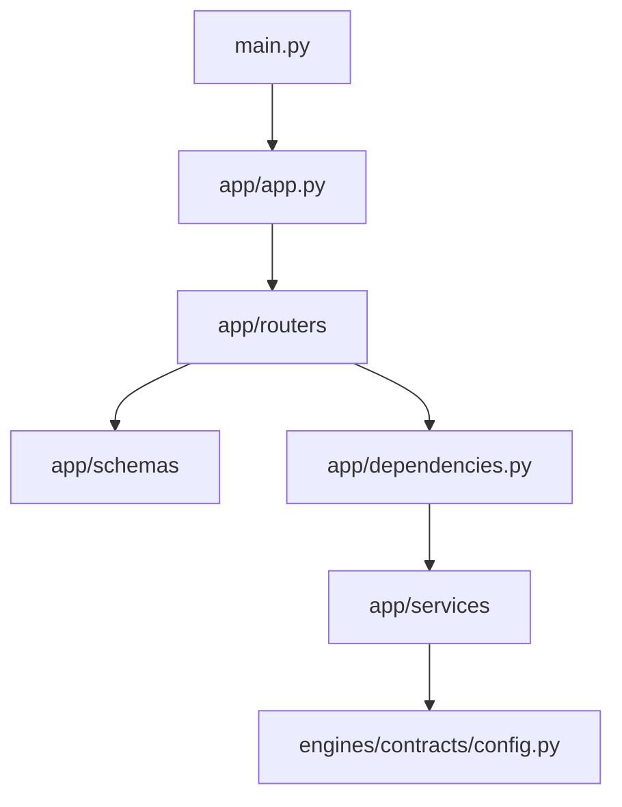
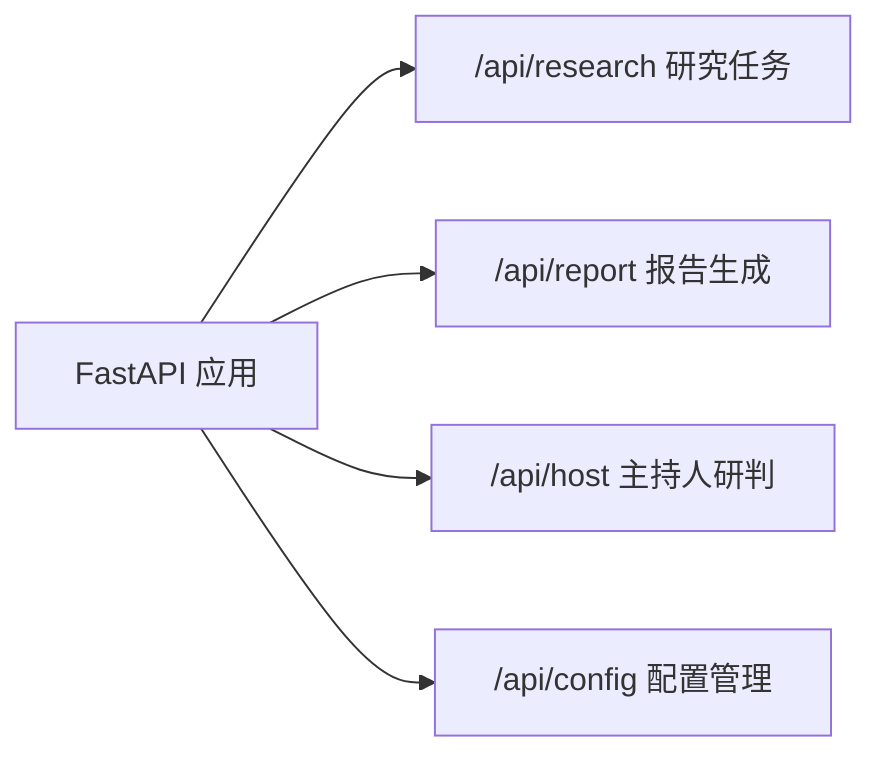
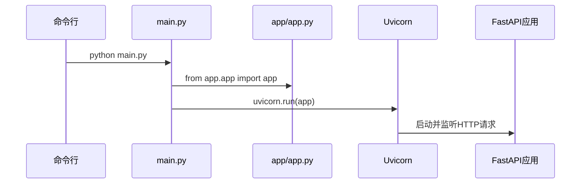
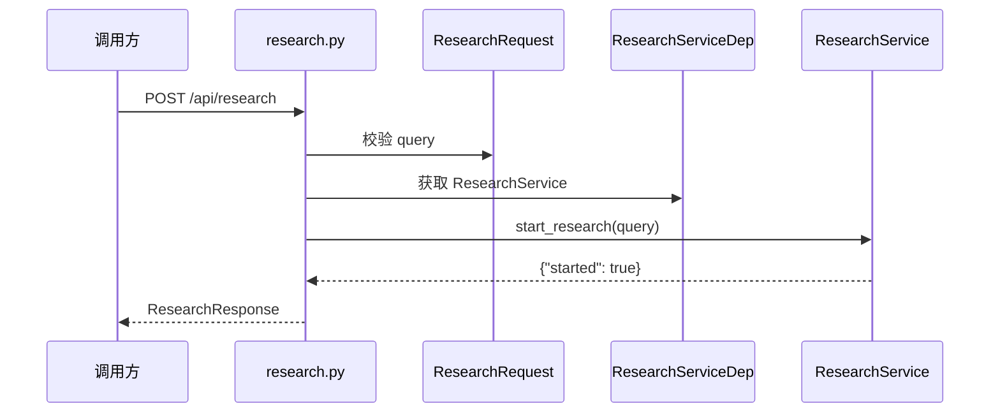
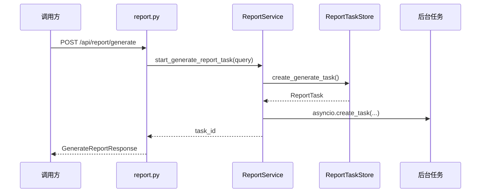
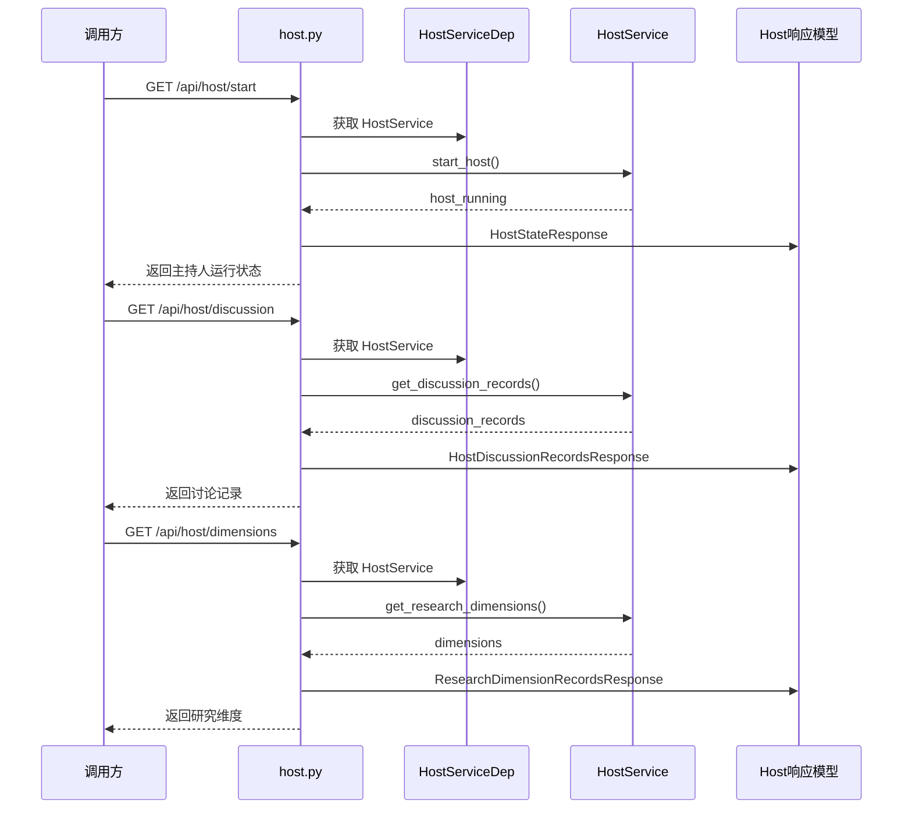
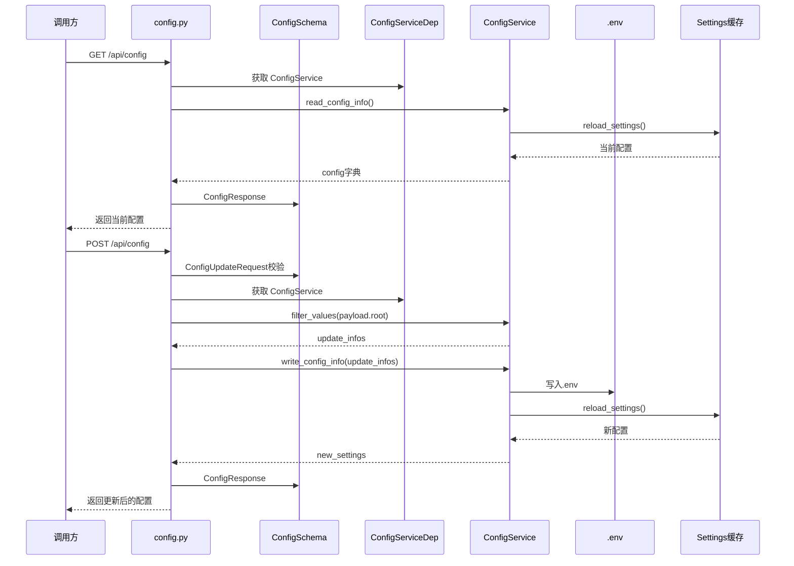
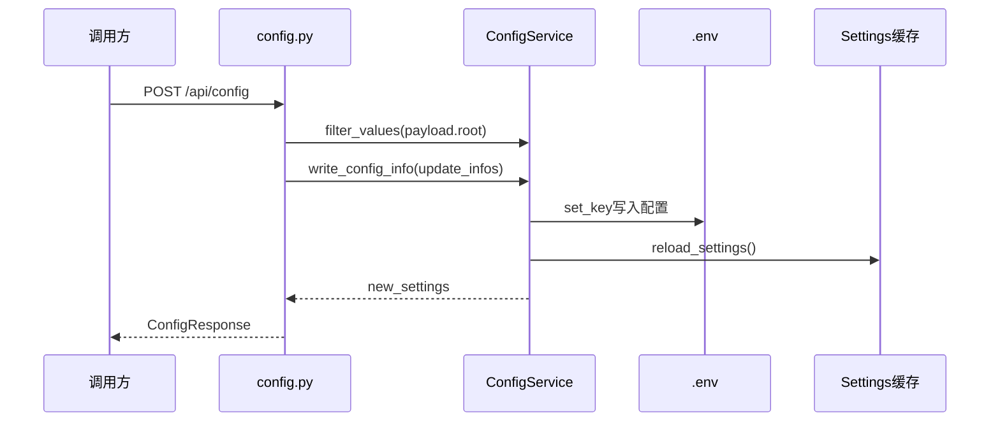
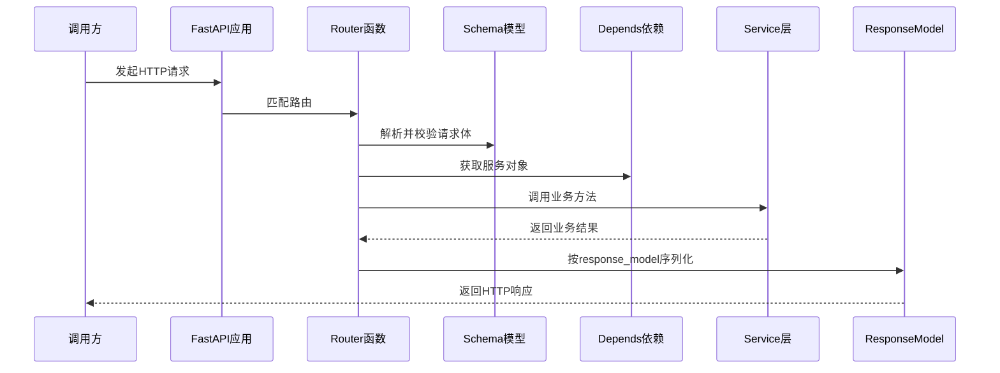

# 02_FastAPI的Web应用层

## Web 应用层总览

在整体架构中，FastAPI Web 应用层位于最外侧。它负责接收 HTTP 请求、完成请求参数校验、调用应用服务层，并将服务层结果转换为 HTTP 响应。它不直接承担复杂的 Agent 推理、数据库检索或报告生成算法，而是作为系统入口，把外部请求稳定地转交给内部业务模块。

当前 Web 应用层主要由以下目录和文件组成：

```text
sentiment_bak/
├── main.py
├── app/
│   ├── app.py
│   ├── dependencies.py
│   ├── routers/
│   │   ├── config.py
│   │   ├── host.py
│   │   ├── report.py
│   │   └── research.py
│   ├── schemas/
│   │   ├── config.py
│   │   ├── host.py
│   │   ├── report.py
│   │   └── research.py
│   └── services/
│       ├── config.py
│       ├── host.py
│       ├── research.py
│       └── report/
│           ├── service.py
│           └── task_store.py
└── engines/
    └── contracts/
        └── config.py
```

下面这张图理解 Web 应用层内部关系：



这张图体现了一个清晰的分层方向：入口文件只负责启动服务，`app/app.py` 负责创建 FastAPI 应用和注册路由，路由层负责处理 HTTP 请求，schema 层负责数据结构，依赖注入负责提供服务对象，service 层承接具体业务动作。

## 1. Web 应用层的职责

在一个后端项目中，Web 应用层经常容易被写得过重。所有逻辑都堆在路由函数里，短期看起来开发很快，但后续一旦接口增多、任务变复杂，就会出现代码难读、难测、难复用的问题。

### 1.1 Web 应用层不等于全部后端逻辑

Web 应用层主要解决“外部如何访问系统”的问题，而不是解决“系统如何完成智能分析”的全部问题。

它负责：

- 定义接口路径。
- 接收请求参数。
- 调用请求模型完成校验。
- 通过依赖注入获得服务对象。
- 调用服务层方法。
- 捕获异常并转换成 HTTP 错误响应。
- 返回符合 response model 的响应体。

它不应该直接负责：

- 大模型调用。
- 复杂 Agent 编排。
- 数据库检索细节。
- Web 搜索细节。
- 报告渲染细节。
- 长任务内部执行细节。

这样的边界划分有助于保持 Web 层清爽。后续即使 Agent 逻辑不断增强，Web 层也可以保持相对稳定。

### 1.2 当前 Web 层的四类业务入口

当前项目中，`app/routers/` 下有四个主要路由文件：

- `research.py`：研究任务接口。
- `report.py`：报告生成接口。
- `host.py`：主持人研判接口。
- `config.py`：系统配置接口。

这四类接口对应了平台的现有能力：



这种按业务能力拆分路由文件的方式很直观。研究相关接口放在 `research.py`，报告相关接口放在 `report.py`，配置相关接口放在 `config.py`，不会把所有接口堆在一个大文件里。

注意：本章分析时会重点讲清楚 Web 层结构、请求流向，而不是所有业务能力都已经完全实现。

## 2. 服务启动入口：`main.py`

项目根目录下的 `main.py` 是后端服务的启动入口。它的代码非常简洁：

```python
import uvicorn

from app.app import app

if __name__ == '__main__':
    uvicorn.run(app, host="0.0.0.0", port=5000)
```

该文件只承担启动职责，不承载具体业务逻辑。它从 `app.app` 导入 FastAPI 应用对象 `app`，然后通过 `uvicorn.run()` 启动服务。

### 2.1 启动链路

从服务启动角度看，链路是：



在这条链路，`main.py` 只是把应用交给 Uvicorn 运行，真正的应用构造在 `app/app.py` 中完成。

## 3. 应用对象创建：`app/app.py`

`app/app.py` 是 FastAPI 应用层的核心入口。它负责创建 `FastAPI` 实例、注册路由、配置跨域中间件，并提供根路径健康检查接口。

当前主要包含以下内容：

- 导入路由模块。
- 定义 `lifespan` 生命周期函数。
- 创建 FastAPI 应用对象。
- 注册 config、host、research、report 路由。
- 添加 CORS 中间件。
- 定义 `/` 根路径接口。

### 3.1 创建 FastAPI 应用实例

应用实例创建代码如下：

```python
app = FastAPI(title="舆情分析", version="1.0", lifespan=lifespan)
```

### 3.2 lifespan 生命周期函数

当前 `lifespan` 如下：

```python
@asynccontextmanager
async def lifespan(app: FastAPI):
    try:
        yield
    finally:
        pass
```

这个函数目前没有执行具体启动或关闭逻辑，但它为后续扩展留好了位置。

后续可以在 `yield` 之前加入启动逻辑，例如：

- 初始化全局资源。

也可以在 `finally` 中加入关闭逻辑，例如：

- 清理资源。

当前写成空生命周期，表示项目已经预留了生命周期扩展点。

### 3.3 路由注册

当前 `app/app.py` 中注册了四组路由：

```python
app.include_router(config.router)
app.include_router(host.router)
app.include_router(research.router)
app.include_router(report.router)
```

每个路由文件内部都定义了自己的 `prefix` 和 `tags`。这种写法让主应用不需要关心每个接口的具体路径，只需要把业务路由挂载进来。

路由注册后，接口路径大致如下：

- `/api/config`
- `/api/host`
- `/api/research`
- `/api/report`

从架构上看，`app/app.py` 是路由汇总点，`app/routers/*.py` 是具体接口定义点。

### 3.4 CORS 跨域中间件

当前项目添加了 CORS 中间件：

```python
app.add_middleware(
    CORSMiddleware,
    allow_origins=["*"],
    allow_methods=["*"],
    allow_headers=["*"],
)
```

这表示后端允许来自任意来源的跨域请求，允许任意 HTTP 方法和请求头。

在开发阶段，这样配置比较方便，前端页面可以从不同端口访问后端接口。但如果进入生产环境，通常需要收紧 `allow_origins`，只允许可信域名访问。

### 3.5 根路径接口

当前根路径接口如下：

```python
@app.get("/")
def root():
    return {"service": "舆情分析平台", "version": "1.0", "status": "running"}
```

这个接口可以作为简单健康检查。访问 `/` 时，如果能返回 `status: running`，说明 FastAPI 应用已经启动并能正常响应请求。

## 4. 路由层设计：`app/routers`

路由层是 Web 应用层中最直接面对 HTTP 请求的部分。它负责定义请求路径、请求方法、响应模型、接口描述和异常转换。

当前项目采用一个业务模块一个路由文件的方式：

```text
app/routers/
├── config.py
├── host.py
├── report.py
└── research.py
```

这种结构清晰且容易扩展。如果后续新增用户管理、任务历史、文件管理等能力，也可以继续新增对应路由文件。

### 4.1 路由函数的一般结构

当前项目中的路由函数大多遵循下面这种结构：

```python
@router.post("", response_model=ResearchResponse)
def start_research_endpoint(payload: ResearchRequest, service: ResearchServiceDep):
    try:
        return service.start_research(payload.query)
    except Exception as e:
        raise HTTPException(status_code=500, detail=str(e))
```

它包含几个关键部分：

- 装饰器定义 HTTP 方法和路径。
- `response_model` 声明响应结构。
- `payload` 接收请求体。
- `service` 通过依赖注入获得服务对象。
- `try/except` 将内部异常转换为 HTTP 错误。

这就是 FastAPI 路由函数的基本模式。

### 4.2 研究任务路由：`research.py`

`research.py` 的路由前缀是：

```python
router = APIRouter(prefix="/api/research", tags=["研究路由"])
```

它提供两个接口：

```text
POST /api/research
GET  /api/research/latest
```

`POST /api/research` 用于发起研究任务。它接收 `ResearchRequest`，从中读取 `query` 字段，然后调用：

```python
service.start_research(payload.query)
```

`GET /api/research/latest` 用于获取研究结果，调用：

```python
service.get_research_result()
```

当前 `ResearchService.start_research()` 返回 `{"started": True}`，表示接口骨架已经打通。`get_research_result()` 目前还是占位，后续可以接入真实的研究结果读取逻辑。

**完整代码：**

```python
from fastapi import APIRouter, HTTPException
from app.schemas.research import ResearchRequest, ResearchResponse, ResearchResultsResponse
from app.dependencies import ResearchServiceDep

router = APIRouter(prefix="/api/research", tags=["研究路由"])


@router.post("", response_model=ResearchResponse, description="开始研究接口")
async def start_research_endpoint(payload: ResearchRequest, service: ResearchServiceDep):
    try:
        return service.start_research(payload.query)
    except Exception as e:
        raise HTTPException(status_code=500, detail=str(e))


@router.get("/latest", response_model=ResearchResultsResponse, description="获取研究结果接口")
def get_research_result_endpoint(service: ResearchServiceDep):
    try:
        return service.get_research_result()
    except Exception as e:
        raise HTTPException(status_code=500, detail=str(e))

```

研究任务接口的调用流程：



### 4.3 报告路由：`report.py`

`report.py` 的路由前缀是：

```python
router = APIRouter(prefix="/api/report", tags=["报告路由"])
```

它提供四个接口：

```text
GET  /api/report/status
POST /api/report/generate
GET  /api/report/result/{task_id}
GET  /api/report/download/{task_id}/{file_type}
```

这些接口对应报告生成的完整操作：

- 查看报告输入是否准备好。
- 启动报告生成任务。
- 根据任务 ID 获取 HTML 结果。
- 下载 HTML 或 Markdown 报告文件。

其中 `POST /api/report/generate` 会调用：

```python
task = service.start_generate_report_task(payload.query)
```

服务层会创建一个报告任务，并通过 `asyncio.create_task()` 启动后台生成逻辑。

报告生成接口调用流程：



**完整代码：**

```python
from fastapi import APIRouter, HTTPException
from fastapi.responses import Response, FileResponse
from app.schemas.report import ReportStatusResponse, GenerateReportRequest, GenerateReportResponse
from app.dependencies import ReportServiceDep
from app.services.report.task_store import ReportTaskStatus

router = APIRouter(prefix="/api/report", tags=["报告路由"])


@router.get("/status", response_model=ReportStatusResponse, description="获取报告状态")
def get_report_status_endpoint(service: ReportServiceDep):
    try:
        report_status = service.get_report_status()
        return ReportStatusResponse(**report_status)
    except Exception as exc:
        raise HTTPException(status_code=500, detail=str(exc))


@router.post("/generate", response_model=GenerateReportResponse, description="开始生成报告")
async def generate_report_endpoint(payload: GenerateReportRequest, service: ReportServiceDep):
    try:
        task = service.start_generate_report_task(payload.query)
        return GenerateReportResponse(task_id=task.task_id)
    except Exception as e:
        raise HTTPException(status_code=500, detail=str(e))


@router.get("/result/{task_id}", description="获取报告生成结果")
def get_generate_result_endpoint(task_id: str, service: ReportServiceDep):
    task = service.get_generate_report_task(task_id)
    if task.status !=ReportTaskStatus.COMPLETED.value:
        raise HTTPException(status_code=400, detail="报告尚未完成")
    return Response(content=task.html_content, media_type="text/html")


@router.get("/download/{task_id}/{file_type}",description="下载HTML/MD格式报告")
def download_report_endpoint(task_id: str, file_type: str, service: ReportServiceDep):
    try:
        file_info = service.get_download_file(task_id, file_type)
        return FileResponse(
            file_info["file_path"],
            media_type=file_info["media_type"],
            filename=file_info["file_name"],
        )
    except Exception as exc:
        raise HTTPException(status_code=500, detail=str(exc))

```


### 4.4 Host 路由：`host.py`

`host.py` 的路由前缀是：

```python
router = APIRouter(prefix="/api/host", tags=["主持人Agent"])
```

它提供四个接口：

```text
GET /api/host/start
GET /api/host/stop
GET /api/host/discussion
GET /api/host/dimensions
```

这些接口围绕 HostAgent 的运行状态和讨论记录展开：

- `/start`：启动主持人讨论。
- `/stop`：停止主持人讨论。
- `/discussion`：获取讨论区中收集到的发言记录。
- `/dimensions`：获取两个 Agent 的发言维度记录。

当前 `HostService` 中对应方法仍然是占位实现，因此这一层更适合理解接口设计和后续扩展位置。

Host 路由调用流程：



Host 路由本身不直接保存讨论记录，也不直接执行 HostAgent 逻辑。它只负责把 HTTP 请求转换成对 `HostService` 的方法调用。等后续 HostAgent 运行时接入后，`HostService` 会成为 Web 层和主持人研判流程之间的连接点。

**完整代码：**

```python
from fastapi import APIRouter, HTTPException
from app.dependencies import HostServiceDep
from app.schemas.host import HostStateResponse, HostDiscussionRecordsResponse, ResearchDimensionRecordsResponse

router = APIRouter(prefix="/api/host", tags=["主持人 Agent"])


@router.get("/start", response_model=HostStateResponse, description="开始主持人讨论接口")
def start_host_endpoint(service: HostServiceDep):
    try:
        host_running = service.start_host()
        return HostStateResponse(host_running=host_running)
    except Exception as exc:
        raise HTTPException(status_code=500, detail=str(exc))


@router.get("/stop", response_model=HostStateResponse, description="停止主持人讨论接口")
def stop_host_endpoint(service: HostServiceDep):
    try:
        service.stop_host()
        return HostStateResponse(host_running=False)
    except Exception as exc:
        raise HTTPException(status_code=500, detail=str(exc))


@router.get("/discussion", response_model=HostDiscussionRecordsResponse,description=" 获取讨论区里收集到的发言记录")
def get_host_discussion_records_endpoint(service: HostServiceDep):
    try:
        discussion_records = service.get_discussion_records()
        return HostDiscussionRecordsResponse(**discussion_records)
    except Exception as exc:
        raise HTTPException(status_code=500, detail=str(exc))


@router.get("/dimensions", response_model=ResearchDimensionRecordsResponse,description="获取两个Agent的发言记录")
def get_host_research_dimensions_endpoint(service: HostServiceDep) -> ResearchDimensionRecordsResponse:
    try:
        research_dimension_records = service.get_research_dimensions()
        return ResearchDimensionRecordsResponse(dimensions=research_dimension_records)
    except  Exception as e:
        raise HTTPException(status_code=500,detail=str(e))

```


### 4.5 配置路由：`config.py`

`config.py` 的路由前缀是：

```python
router = APIRouter(prefix="/api/config", tags=["配置路由"])
```

它提供两个接口：

```text
GET  /api/config
POST /api/config
```

`GET /api/config` 用于读取当前配置，调用：

```python
service.read_config_info()
```

`POST /api/config` 用于更新配置，调用：

```python
update_infos = service.filter_values(payload.root)
new_settings = service.write_config_info(update_infos)
```

配置接口是当前 Web 层中实现比较完整的一组接口。它不仅读取配置，还会过滤允许更新的字段，写入 `.env`，并触发配置重新加载。

配置路由调用流程：



这组接口体现了 Web 层和运行配置之间的关系：路由层接收配置读取或更新请求，`ConfigService` 负责过滤字段、写入 `.env`、刷新 settings 缓存，最后通过 `ConfigResponse` 返回统一结构。也就是说，配置路由不是简单读写字典，而是在维护“接口请求、配置文件、运行时 settings”三者之间的一致性。


**完整代码：**

```python
from fastapi import APIRouter, HTTPException
from app.dependencies import ConfigServiceDep
from app.schemas.config import ConfigResponse, ConfigUpdateRequest

router = APIRouter(prefix="/api/config", tags=["配置路由"])


@router.get("", response_model=ConfigResponse, description="获取配置信息接口")
def get_config_endpoint(service: ConfigServiceDep):
    try:
        config = service.read_config_info()
        return ConfigResponse(config=config)
    except  Exception as e:
        raise HTTPException(status_code=500, detail=str(e))


@router.post("", response_model=ConfigResponse,description="修改配置信息接口")
def update_config_endpoint(payload: ConfigUpdateRequest, service: ConfigServiceDep):
    update_infos = service.filter_values(payload.root)

    new_settings = service.write_config_info(update_infos)

    return ConfigResponse(config=new_settings.model_dump(mode="json"))

```


## 5. Schema 层设计：`app/schemas`

`app/schemas` 目录用于定义接口请求和响应模型。它的作用是把接口的数据结构显式表达出来，让路由函数不直接处理松散的字典。

当前 schema 文件包括：

```text
app/schemas/
├── config.py
├── host.py
├── report.py
└── research.py
```

每个 schema 文件对应一个业务路由文件，这种对应关系很容易理解。

### 5.1 Schema 层的价值

Schema 层的价值不只是“定义几个类”。它在 Web 应用层中承担了接口契约的角色：

- 请求字段是否存在，由 schema 约束。
- 字段类型是否正确，由 schema 校验。
- 空字符串是否允许，由 validator 判断。
- 响应结构是否稳定，由 response model 保证。

当后续接口越来越多时，schema 能让接口边界保持清晰。

### 5.2 Research schema

**完整代码**

```python
from pydantic import BaseModel, Field, field_validator
class ResearchRequest(BaseModel):
    query: str = Field(..., description="研究主题")

    @field_validator("query")
    @classmethod
    def not_blank(cls, value: str) -> str:
        value = value.strip()
        if not value:
            raise ValueError("研究主题不能为空")
        return value

class ResearchResponse(BaseModel):
    started: bool = True

class ResearchRoleResult(BaseModel):
    final_report: str = ""
    report_file: str = ""

class ResearchResultsResponse(BaseModel):
    results: dict[str, ResearchRoleResult] = Field(default_factory=dict)

```

`ResearchRequest` 定义研究任务请求：

```python
class ResearchRequest(BaseModel):
    query: str = Field(..., description="研究主题")
```

通过 `field_validator` 对 `query` 做非空校验：

```python
@field_validator("query")
@classmethod
def not_blank(cls, value: str) -> str:
    value = value.strip()
    if not value:
        raise ValueError("研究主题不能为空")
    return value
```

这个校验很重要。保证调用方不能提交空字符串，也能把前后空格清理掉。

回调时机：FastAPI 准备把 JSON 转换成 Python 对象，在底层执行了：`payload = ResearchRequest(query="   ")`，并且发现 你给`query` 字段绑定了 `@field_validator("query")`。Pydantic 自动回调 `not_blank(cls, value="   ")`方法。

响应模型包括：

- `ResearchResponse`
- `ResearchRoleResult`
- `ResearchResultsResponse`

其中 `ResearchResultsResponse` 使用：

```python
results: dict[str, ResearchRoleResult] = Field(default_factory=dict)
```

后续研究结果可以按角色名组织，例如 `insight`、`media` 等。

### 5.3 Report schema

**完整代码**

```python
from pydantic import BaseModel, Field, field_validator
class GenerateReportRequest(BaseModel):
    query: str = Field("智能舆情分析报告", description="报告主题")

    @field_validator("query")
    @classmethod
    def not_blank(cls, v: str) -> str:
        v = v.strip()
        if not v:
            raise ValueError("报告主题不能为空")
        return v

class ReportStatusResponse(BaseModel):
    inputs_ready: bool = False
    files_found: list[str] = Field(default_factory=list)

class GenerateReportResponse(BaseModel):
    task_id: str = ""
```

`GenerateReportRequest` 定义报告生成请求：

```python
class GenerateReportRequest(BaseModel):
    query: str = Field("智能舆情分析报告", description="报告主题")
```

也通过 `field_validator` 保证报告主题不能为空。

报告相关响应模型包括：

- `ReportStatusResponse`
- `GenerateReportResponse`

`ReportStatusResponse` 中包含：

```python
inputs_ready: bool = False
files_found: list[str] = Field(default_factory=list)
```

报告生成前需要检查输入材料是否准备好，以及当前发现了哪些文件。

`GenerateReportResponse` 返回：

```python
task_id: str = ""
```

报告生成是任务化的，调用方拿到 `task_id` 后，可以继续查询结果。

### 5.4 Host schema

Host 相关 schema 主要描述主持人运行状态、讨论记录和研究维度。

**完整代码**

```python
from pydantic import BaseModel, Field

class HostStateResponse(BaseModel):
    host_running: bool

class HostDiscussionRecord(BaseModel):
    speaker_name: str = ""
    message_text: str = ""
    sent_at: str = ""
    dimension_key: str = ""

class HostDiscussionRecordsResponse(BaseModel):
    discussion_records: list[HostDiscussionRecord] = Field(default_factory=list)

class ResearchDimensionRecord(BaseModel):
    key: str
    title: str
    index: str

class ResearchDimensionRecordsResponse(BaseModel):
    dimensions: list[ResearchDimensionRecord]

```

核心模型包括：

- `HostStateResponse`
- `HostDiscussionRecord`
- `HostDiscussionRecordsResponse`
- `ResearchDimensionRecord`
- `ResearchDimensionRecordsResponse`

其中 `HostDiscussionRecord` 包含：

```python
speaker_name: str = ""
message_text: str = ""
sent_at: str = ""
dimension_key: str = ""
```

讨论记录至少需要表达：谁说的、说了什么、什么时候说的、对应哪个研究维度。

### 5.5 Config schema

**完整代码**

```python
from pydantic import BaseModel, Field, RootModel, field_validator
from typing import Any
class ConfigUpdateRequest(RootModel[dict[str, Any]]):
    @field_validator("root")
    @classmethod
    def not_empty(cls, v: dict[str, Any]) -> dict[str, Any]:
        if not v:
            raise ValueError("请求体不能为空")
        return v


class ConfigResponse(BaseModel):
    config: dict[str, Any] = Field(default_factory=dict, description="当前配置")
```

配置更新请求使用的是：

```python
class ConfigUpdateRequest(RootModel[dict[str, Any]]):
```

请求体本身就是一个字典，而不是固定字段模型。这样适合配置更新接口，因为配置项比较多，并且前端可能只提交部分字段。

也包含非空校验：

```python
if not v:
    raise ValueError("请求体不能为空")
```

响应模型是：

```python
class ConfigResponse(BaseModel):
    config: dict[str, Any] = Field(default_factory=dict, description="当前配置")
```

配置接口统一返回一个 `config` 字典。

## 6. 依赖注入：`app/dependencies.py`

`app/dependencies.py` 是当前 Web 层中非常关键的文件。负责告诉 FastAPI：路由函数需要的服务对象应该如何创建。

FastAPI 的依赖注入机制可以让路由函数直接声明需要哪个服务，而不需要在函数内部手动创建。

### 6.1 Annotated + Depends 的写法

项目使用了这种写法：

```python
ConfigServiceDep = Annotated[ConfigService, Depends(get_config_service)]
```

这表示 `ConfigServiceDep` 是一个可复用的依赖类型。路由函数中只要写：

```python
def get_config_endpoint(service: ConfigServiceDep):
```

FastAPI 就会自动调用 `get_config_service()`，并把返回的 `ConfigService` 实例注入进来。

这种写法的好处是路由函数非常干净，也能避免到处重复写 `Depends(...)`。

### 6.2 服务对象的创建方式

当前依赖文件中有四类服务：

- `ConfigService`
- `ResearchService`
- `ReportService`
- `HostService`

其中 `ConfigService`、`ResearchService`、`HostService` 每次依赖调用时都会创建新实例：

```python
def get_research_service():
    return ResearchService()
```

而 `ReportService` 使用了共享实例：

```python
_report_service = ReportService(
    task_store=ReportTaskStore(),
)
```

然后：

```python
def get_report_service():
    return _report_service
```

这说明报告服务需要在进程内保留任务状态，所以它不能每次请求都重新创建。否则上一次生成的任务信息就会丢失。

**完整代码**

```python
from typing import Annotated

from fastapi import Depends

from app.services.config import ConfigService
from app.services.research import ResearchService
from app.services.report.service import ReportService, ReportTaskStore
from app.services.host import HostService


def get_config_service():
    """
    获取配置服务
    :return:
    """
    return ConfigService()


ConfigServiceDep = Annotated[ConfigService, Depends(get_config_service)]


def get_research_service():
    """
    获取研究服务
    :return:
    """
    return ResearchService()


ResearchServiceDep = Annotated[ResearchService, Depends(get_research_service)]

_report_service = ReportService(
    task_store=ReportTaskStore(),
)

def get_report_service():
    """
    获取报告服务(共享)
    :return:
    """
    return _report_service

ReportServiceDep = Annotated[ReportService, Depends(get_report_service)]


def get_host_service():
    """
    获取主持人服务
    :return:
    """
    return HostService()

HostServiceDep = Annotated[HostService, Depends(get_host_service)]

```


### 6.3 为什么 ReportService 要共享

报告生成是一个异步后台任务。调用 `/api/report/generate` 后，服务会创建一个 `ReportTask`，然后返回 `task_id`。后续调用 `/api/report/result/{task_id}` 时，还需要根据这个 `task_id` 找回同一个任务。

如果 `ReportService` 每次请求都重新创建，那么任务注册表也会重新创建，后续查询就找不到任务。因此当前项目把 `_report_service` 作为模块级共享对象。

这个设计适合单进程开发环境。后续如果部署到多进程或多实例环境，任务状态就需要迁移到数据库、Redis 或其他共享存储中。

### 6.4 依赖注入带来的分层效果

依赖注入让路由层不需要知道服务对象如何构造，只需要声明自己需要什么。

整体关系如下：


这让 Web 层具备更好的可维护性。后续如果要替换服务实现，只需要调整 provider 函数，而不需要改每个路由函数。

## 7. Service 层：承接路由请求

`app/services` 是 Web 应用层和底层引擎之间的过渡层。路由函数不直接处理复杂业务，而是调用 service 方法完成动作。

当前 service 层包括：

```text
app/services/
├── config.py
├── host.py
├── research.py
└── report/
    ├── service.py
    └── task_store.py
```

目前配置服务和报告任务存储都会实现，研究服务和 Host 服务还处于骨架状态。

### 7.1 ResearchService

`ResearchService` 当前代码如下：

```python
from typing import Any

class ResearchService:

    def start_research(self, query: str) -> dict[str, Any]:
        return {"started":True}

    def get_research_result(self) -> dict[str, Any]:

        pass

```

这个服务目前主要用于打通研究接口调用链。

当前已经完成的是：

- 接收路由层传入的 `query`。
- 返回 `started=True`，表示任务启动响应结构已经确定。

后续可以在这里接入：

- 研究任务编排器。
- InsightAgent 启动逻辑。
- MediaAgent 启动逻辑。
- 研究结果读取逻辑。
- 进度事件发布逻辑。

### 7.2 HostService

`HostService` 当前是占位骨架：

```python
class HostService:

    def start_host(self):
        pass

    def stop_host(self):
        pass

    def get_discussion_records(self):
        pass

    def get_research_dimensions(self):
        pass

```

它对应 Host 路由中的四个接口。后续可以在这里接入：

- HostAgent 运行时启动。
- HostAgent 运行时停止。
- 讨论消息存储读取。
- 研究维度列表读取。

这个服务将来会承担 HostAgent 与 Web 层之间的适配职责。

### 7.3 ConfigService

`ConfigService` 是当前能够完整实现的服务。主要负责读取配置、过滤配置更新字段、写入 `.env` 并触发配置重新加载。

定义了一个允许更新的配置白名单：

```python
CONFIG_KEYS = [
    "DB_HOST", "DB_PORT", "DB_USER", "DB_NAME",
    "INSIGHT_ENGINE_API_KEY", "INSIGHT_ENGINE_BASE_URL", "INSIGHT_ENGINE_MODEL_NAME", "INSIGHT_ENGINE_MODEL_PROVIDER",
    "MEDIA_ENGINE_API_KEY", "MEDIA_ENGINE_BASE_URL", "MEDIA_ENGINE_MODEL_NAME", "MEDIA_ENGINE_MODEL_PROVIDER",
    "REPORT_ENGINE_API_KEY", "REPORT_ENGINE_BASE_URL", "REPORT_ENGINE_MODEL_NAME", "REPORT_ENGINE_MODEL_PROVIDER",
    "HOST_API_KEY", "HOST_BASE_URL", "HOST_MODEL_NAME", "HOST_MODEL_PROVIDER",
    "SEARCH_TOOL_TYPE", "TAVILY_API_KEY", "BOCHA_API_KEY", "BOCHA_BASE_URL",
    "ANSPIRE_API_KEY", "ANSPIRE_BASE_URL"
]
```

`read_config_info()` 会读取当前 settings，并只返回白名单中的配置项：

```python
def read_config_info(self):
   current = get_settings()
    return {
      key: "" if getattr(current, key, None) is None else str(getattr(current, key))
      for key in CONFIG_KEYS
    }

```

`filter_values()` 会从请求字典中过滤掉不允许更新的字段：

```python
def filter_values(self, payload: dict[str, Any]) -> dict[str, Any]:
    return {
            key: value if value is not None else ""
            for key, value in payload.items()
            if key in CONFIG_KEYS
   }
```

`write_config_info()` 会把配置写入 `.env`，同步更新 `os.environ`，最后调用 `reload_settings()`。

```python
def write_config_info(self, update_info: dict[str, Any]):
        """将更新写入 .env 并触发全局热加载。"""
        env_file_path = str(PROJECT_ROOT / ".env")

        # python-dotenv 的 set_key 自动处理读取、转义、写入和追加
        for key, value in update_info.items():
            set_key(env_file_path, key, str(value))
            os.environ[key] = value

        # 触发热更新
        return reload_settings()
```

**完整代码**

```python
import os
from typing import Any
from pathlib import Path
from dotenv import set_key
from engines.contracts.config import reload_settings

PROJECT_ROOT = Path(__file__).resolve().parents[2]
CONFIG_KEYS = [
    "DB_HOST", "DB_PORT", "DB_USER", "DB_NAME",
    "INSIGHT_ENGINE_API_KEY", "INSIGHT_ENGINE_BASE_URL", "INSIGHT_ENGINE_MODEL_NAME", "INSIGHT_ENGINE_MODEL_PROVIDER",
    "MEDIA_ENGINE_API_KEY", "MEDIA_ENGINE_BASE_URL", "MEDIA_ENGINE_MODEL_NAME", "MEDIA_ENGINE_MODEL_PROVIDER",
    "REPORT_ENGINE_API_KEY", "REPORT_ENGINE_BASE_URL", "REPORT_ENGINE_MODEL_NAME", "REPORT_ENGINE_MODEL_PROVIDER",
    "HOST_API_KEY", "HOST_BASE_URL", "HOST_MODEL_NAME", "HOST_MODEL_PROVIDER",
    "SEARCH_TOOL_TYPE", "TAVILY_API_KEY", "BOCHA_API_KEY", "BOCHA_BASE_URL",
    "ANSPIRE_API_KEY", "ANSPIRE_BASE_URL"
]


class ConfigService:

    def read_config_info(self):
        current = get_settings()
        return {
            key: "" if getattr(current, key, None) is None else str(getattr(current, key))
            for key in CONFIG_KEYS
        }

    def filter_values(self, payload: dict[str, Any]) -> dict[str, Any]:
        return {
            key: value if value is not None else ""
            for key, value in payload.items()
            if key in CONFIG_KEYS
        }

    def write_config_info(self, update_info: dict[str, Any]):
        """将更新写入 .env 并触发全局热加载。"""
        env_file_path = str(PROJECT_ROOT / ".env")

        # python-dotenv 的 set_key 自动处理读取、转义、写入和追加
        for key, value in update_info.items():
            set_key(env_file_path, key, str(value))
            os.environ[key] = value

        # 触发热更新
        return reload_settings()


if __name__ == "__main__":
    from engines.contracts.config import get_settings

    system_current_settings = get_settings()
    print(f"port: {system_current_settings.DB_HOST}")
    print(f"host_api_key: {system_current_settings.HOST_API_KEY}")

```

配置更新流程：



### 7.4 ReportService

`ReportService` 负责报告生成相关动作。当前需要实现任务创建和任务查询框架。

核心方法包括：

- `get_report_status()`
- `start_generate_report_task(query)`
- `get_generate_report_task(task_id)`
- `get_download_file(task_id, file_type)`
- `_run_report_generation(task, query)`

其中：

```python
def start_generate_report_task(self, query: str) -> ReportTask:
    task = self.task_store.create_generate_task()
    asyncio.create_task(self._run_report_generation(task, query))
    return task
```

这段代码说明报告生成采用后台任务方式。接口不会等待报告真正生成完成，而是先返回任务 ID。

当前 `_run_report_generation()` 还没有具体实现，后续在这里接入最终报告生成引擎。

**完整代码**

```python
import asyncio
from typing import Any
from app.services.report.task_store import ReportTaskStore, ReportTask


class ReportService:

    def __init__(
            self,
            task_store: ReportTaskStore
    ) -> None:
        self.task_store = task_store

    def get_report_status(self) -> dict[str, Any]:
        return {
            "inputs_ready": False,
            "files_found": []
        }

    def start_generate_report_task(self, query: str) -> ReportTask:
        task = self.task_store.create_generate_task()
        asyncio.create_task(self._run_report_generation(task, query))
        return task

    def get_generate_report_task(self, task_id: str) -> ReportTask:
        return self.task_store.get_generate_task(task_id)

    def get_download_file(self, task_id: str, file_type: str) -> dict[str, Any]:
        pass

    async def _run_report_generation(self, task: ReportTask, query: str) -> None:
        pass

```


### 7.5 ReportTaskStore

`ReportTaskStore` 是报告任务的进程内存储。

它维护两个字段：

```python
self.current_task: Optional[ReportTask] = None
self.tasks_registry: dict[str, ReportTask] = {}
```

其中：

- `current_task` 表示当前正在运行或最近创建的任务。
- `tasks_registry` 用于根据 `task_id` 查询任务。

创建任务时，如果已有任务正在运行，会抛出异常：

```python
if self.current_task and self.current_task.status == ReportTaskStatus.RUNNING:
    raise RuntimeError("已有报告生成任务在运行中")
```

**完整代码**

```python
from dataclasses import dataclass
from enum import Enum
import time
from typing import Optional


class ReportTaskStatus(str, Enum):
    RUNNING = "running"
    COMPLETED = "completed"
    ERROR = "error"


@dataclass
class ReportTask:
    task_id: str
    status: ReportTaskStatus = ReportTaskStatus.RUNNING
    html_content: str = ""
    report_file_path: str = ""
    report_file_name: str = ""
    markdown_file_path: str = ""
    markdown_file_name: str = ""

    def update_status(self, status: ReportTaskStatus) -> None:
        self.status = status


class ReportTaskStore:

    def __init__(self) -> None:
        self.current_task: Optional[ReportTask] = None
        self.tasks_registry: dict[str, ReportTask] = {}

    def create_generate_task(self) -> ReportTask:
        if self.current_task and self.current_task.status == ReportTaskStatus.RUNNING:
            raise RuntimeError("已有报告生成任务在运行中")
        if self.current_task and self.current_task.status in (
                ReportTaskStatus.COMPLETED,
                ReportTaskStatus.ERROR,
        ):
            self.current_task = None

        task = ReportTask(f"report_{int(time.time())}")
        self.current_task = task
        self.tasks_registry[task.task_id] = task
        return task

    def get_generate_task(self, task_id: str) -> Optional[ReportTask]:
        return self.tasks_registry.get(task_id)

```

## 8. 配置体系：`engines/contracts/config.py`

虽然 `engines/contracts/config.py` 不在 `app/` 目录下，但它和 Web 应用层关系很密切。配置接口读取和更新的就是这里定义的 settings。

**完整代码**

```python
"""全局运行配置契约。"""

from pathlib import Path
from typing import Literal, Optional
from functools import lru_cache

from pydantic import Field
from pydantic_settings import BaseSettings, SettingsConfigDict

PROJECT_ROOT: Path = Path(__file__).resolve().parents[2]
ENV_FILE: str = str(PROJECT_ROOT / ".env")


class Settings(BaseSettings):
    """全局配置;支持 .env 与环境变量自动加载。"""

    # ================== 服务器 ==================
    HOST: str = Field("0.0.0.0", description="监听地址")
    PORT: int = Field(5000, description="监听端口")

    # ================== 舆情库==================
    DB_DIALECT: str = Field("mysql", description="数据库类型:mysql 或 postgresql")
    DB_HOST: str = Field("localhost", description="数据库主机")
    DB_PORT: int = Field(3306, description="数据库端口")
    DB_USER: str = Field("root", description="数据库用户名")
    DB_PASSWORD: str = Field("", description="数据库密码")
    DB_NAME: str = Field("media_crawler", description="数据库名称")
    DB_CHARSET: str = Field("utf8mb4", description="字符集")

    # ================== insight 研究角色 LLM信息 ==================
    INSIGHT_ENGINE_API_KEY: Optional[str] = Field(None, description="Insight 角色 API 密钥")
    INSIGHT_ENGINE_BASE_URL: Optional[str] = Field("https://api.moonshot.cn/v1", description="Insight 角色 BaseUrl")
    INSIGHT_ENGINE_MODEL_NAME: str = Field("kimi-k2-0711-preview", description="Insight 角色模型名")
    INSIGHT_ENGINE_MODEL_PROVIDER: str = Field("openai", description="Insight 角色厂商(langchain provider)")

    # ================== media 研究角色 LLM信息==================
    MEDIA_ENGINE_API_KEY: Optional[str] = Field(None, description="Media 角色 API 密钥")
    MEDIA_ENGINE_BASE_URL: Optional[str] = Field("https://aihubmix.com/v1", description="Media 角色 BaseUrl")
    MEDIA_ENGINE_MODEL_NAME: str = Field("gemini-2.5-pro", description="Media 角色模型名")
    MEDIA_ENGINE_MODEL_PROVIDER: str = Field("openai", description="Media 角色厂商(langchain provider)")

    # ================== 报告引擎  LLM信息==================
    REPORT_ENGINE_API_KEY: Optional[str] = Field(None, description="报告引擎 API 密钥")
    REPORT_ENGINE_BASE_URL: Optional[str] = Field("https://aihubmix.com/v1", description="报告引擎 BaseUrl")
    REPORT_ENGINE_MODEL_NAME: str = Field("gemini-2.5-pro", description="报告引擎模型名")
    REPORT_ENGINE_MODEL_PROVIDER: str = Field("openai", description="报告引擎厂商(langchain provider)")

    # ================== HostAgent LLM信息 ==================
    HOST_API_KEY: Optional[str] = Field(None, description="HostAgent API 密钥")
    HOST_BASE_URL: Optional[str] = Field(None, description="HostAgent BaseUrl")
    HOST_MODEL_NAME: Optional[str] = Field(None, description="HostAgent 模型名")
    HOST_MODEL_PROVIDER: str = Field("openai", description="HostAgent 厂商(langchain provider)")

    # ================== Web 搜索 ==================
    SEARCH_TOOL_TYPE: Literal["TavilyAPI", "AnspireAPI", "BochaAPI"] = Field(
        "TavilyAPI", description="Web 搜索提供方"
    )
    TAVILY_API_KEY: Optional[str] = Field(None, description="Tavily API 密钥")
    BOCHA_BASE_URL: Optional[str] = Field("https://api.bocha.cn/v1/ai-search", description="Bocha BaseUrl")
    BOCHA_API_KEY: Optional[str] = Field(None, description="Bocha API 密钥")
    ANSPIRE_BASE_URL: Optional[str] = Field(
        "https://plugin.anspire.cn/api/ntsearch/search", description="Anspire BaseUrl"
    )
    ANSPIRE_API_KEY: Optional[str] = Field(None, description="Anspire API 密钥")

    # ================== 研究引擎 ==================
    MAX_SECTIONS: int = Field(5, description="报告最大章节数")
    SEARCH_TIMEOUT: int = Field(240, description="单次搜索请求超时(秒)")
    SEARCH_CONTENT_MAX_LENGTH: int = Field(20000, description="供 LLM 的搜索结果最大长度")
    MAX_CONTENT_LENGTH: int = Field(500000, description="搜索最大内容长度")
    OUTPUT_DIR: str = Field("data/report", description="报告输出目录")
    HOST_REPORT_DIR: str = Field("data/report/host", description="Host 研判报告输出目录")
    INSIGHT_REPORT_DIR: str = Field("data/report/insight", description="Insight 研究报告输出目录")
    MEDIA_REPORT_DIR: str = Field("data/report/media", description="Media 研究报告输出目录")

    # ================== Insight 向量检索、聚类==================
    INSIGHT_VECTOR_ENABLED: bool = Field(False, description="是否为 InsightAgent 启用 Milvus 向量检索")
    MILVUS_URI: str = Field("http://localhost:19530", description="Milvus 服务器地址(URI)")
    MILVUS_DB_NAME: str = Field("default", description="Milvus 数据库名称")
    MILVUS_INSIGHT_COLLECTION: str = Field("insight_evidence", description="Insight 证据集合(Collection)名称")
    INSIGHT_EMBEDDING_MODEL: str = Field("BAAI/bge-m3", description="Insight 检索所使用的 Embedding 模型名称/路径")
    INSIGHT_EMBEDDING_DEVICE: Optional[str] = Field(None, description="Embedding 模型运行设备，例如 'cuda' 或 'cpu'")
    INSIGHT_DENSE_DIM: int = Field(1024, description="BGE-M3 稠密向量维度")
    INSIGHT_VECTOR_TOP_K: int = Field(80, description="Milvus 每个检索通道的召回数量(Top K)")
    INSIGHT_VECTOR_FILTER_DAYS: int = Field(365, description="Milvus 检索的时间窗口天数限制；小于等于0则禁用时间过滤")
    INSIGHT_SYNC_BATCH_SIZE: int = Field(64, description="Milvus 批量计算 Embedding 和数据上载(Upsert)的批次大小")
    INSIGHT_CLUSTERING_ENABLED: bool = Field(True, description="是否为 InsightAgent 启用语义聚类")
    INSIGHT_CLUSTER_MODEL: Optional[str] = Field(None, description="用于语义聚类的 SentenceTransformer 模型路径或名称")
    INSIGHT_CLUSTER_MAX_RECORDS: int = Field(300, description="用于语义聚类的最大证据记录条数限制")
    INSIGHT_CLUSTER_MAX_CLUSTERS: int = Field(12, description="最大允许划分的语义聚类簇数")
    INSIGHT_CLUSTER_MIN_CLUSTER_SIZE: int = Field(3, description="期望的最小语义聚类簇大小")

    model_config = SettingsConfigDict(
        env_file=ENV_FILE,
        env_prefix="",
        case_sensitive=False,
        extra="allow",
    )


@lru_cache()
def get_settings() -> Settings:
    """获取配置单例（带缓存）"""
    return Settings()


def reload_settings():
    """清理配置缓存以触发热更新"""
    get_settings.cache_clear()

    return get_settings()

```

当前配置模型使用：

```python
class Settings(BaseSettings):
```

并通过：

```python
model_config = SettingsConfigDict(
    env_file=ENV_FILE,
    env_prefix="",
    case_sensitive=False,
    extra="allow",
)
```

指定从项目根目录的 `.env` 读取配置。

`env_file=ENV_FILE` (指定配置文件路径)

`env_prefix=""` (环境变量前缀)  空字符串，**在单词构成上**完全精确，不需要加前缀 

`case_sensitive=False` (大小写不敏感)

`extra="allow"` (允许额外字段)

### 8.1 get_settings 缓存

当前配置读取函数使用了 `lru_cache`：

```python
from functools import lru_cache

@lru_cache()
def get_settings() -> Settings:
    return Settings()
```

表示 settings 默认会被缓存，避免每次读取配置时都重新解析 `.env`。

### 8.2 reload_settings 热更新

配置更新后，需要清理缓存并重新读取：

```python
def reload_settings():
    get_settings.cache_clear()
    return get_settings()
```

这就是配置接口能够修改 `.env` 后立即返回新配置的基础。

### 8.3 配置项分类

当前 Settings 包含多类配置：

- 服务运行配置：`HOST`、`PORT`。
- 数据库配置：`DB_DIALECT`、`DB_HOST`、`DB_PORT` 等。
- Insight 模型配置。
- Media 模型配置。
- Report 模型配置。
- Host 模型配置。
- Web 搜索配置。
- 报告输出目录配置。
- Milvus 向量检索配置。

虽然本章重点是 FastAPI Web 层，但配置体系是 Web 层和引擎层之间的重要连接点。接口层通过配置服务读写 `.env`，引擎层通过 Settings 获取运行参数。

## 9. 异常处理与响应模型

当前路由层使用 `try/except` 包裹 service 调用，并将异常转换成 `HTTPException`。

例如：

```python
try:
    return service.start_research(payload.query)
except Exception as e:
    raise HTTPException(status_code=500, detail=str(e))
```

这种写法能保证内部异常不会直接暴露为未处理错误，而是以 HTTP 500 的形式返回。

### 9.1 HTTPException 的作用

`HTTPException` 是 FastAPI 提供的异常类型，用来主动返回 HTTP 错误。

常见用法是：

```python
raise HTTPException(status_code=500, detail=str(e))
```

其中：

- `status_code` 表示 HTTP 状态码。
- `detail` 表示错误详情。

### 9.2 response_model 的作用

路由装饰器中的 `response_model` 用来声明响应结构：

```python
@router.post("", response_model=ResearchResponse)
```

它的作用包括：

- 生成 API文档。
- 约束接口响应字段。
- 对返回结果进行序列化。

因此，`response_model` 是接口契约的一部分。后续修改响应结构时，应该优先修改 schema，而不是在路由里临时拼字典。


## 10. 一次请求在 Web 层中的完整流转

一次请求在 Web 层中的完整流转路径：



这个流程适用于当的大部分接口。区别只在于不同路由调用不同 service，不同 service 再执行不同业务动作。

### 10.1 研究任务请求流

研究任务请求流是：

```text
POST /api/research
    -> ResearchRequest 校验 query
    -> ResearchServiceDep 注入 ResearchService
    -> ResearchService.start_research(query)
    -> ResearchResponse 返回 started
```

当前它主要用于打通任务启动入口，后续可以继续接入真实研究任务编排。

### 10.2 报告生成请求流

报告生成请求流是：

```text
POST /api/report/generate
    -> GenerateReportRequest 校验 query
    -> ReportServiceDep 注入共享 ReportService
    -> ReportTaskStore 创建任务
    -> asyncio.create_task 启动后台任务
    -> GenerateReportResponse 返回 task_id
```

这是当前 Web 层中比较典型的“接口触发后台任务”模式。

### 10.3 配置更新请求流

配置更新请求流是：

```text
POST /api/config
    -> ConfigUpdateRequest 校验请求体非空
    -> ConfigServiceDep 注入 ConfigService
    -> filter_values 过滤允许更新的字段
    -> write_config_info 写入 .env
    -> reload_settings 清理缓存并重新加载
    -> ConfigResponse 返回最新配置
```

这一条链路体现了 Web 层如何连接配置文件和运行时 settings。

### 10.4 Host 请求流

Host 相关请求流围绕主持人运行状态、讨论记录和研究维度展开。以启动 Host 为例，请求流是：

```text
GET /api/host/start
    -> HostServiceDep 注入 HostService
    -> HostService.start_host()
    -> HostStateResponse 返回 host_running
```

Host 路由的特点是请求体较少，更多是通过接口动作触发服务方法，或者读取服务层整理好的状态数据。

## 11. 本章小结

本章搭建FastAPI Web 应用层。当前项目的 Web 层虽然部分 service 还处于占位阶段，但整体分层已经比较明确。

可以把这一层总结为以下结构：

```text
main.py
  -> app/app.py
      -> app/routers
          -> app/schemas
          -> app/dependencies
              -> app/services
                  -> engines/contracts/config.py
```

这条结构说明：

- `main.py` 负责启动服务。
- `app/app.py` 负责创建 FastAPI 应用并注册路由。
- `routers` 负责定义接口。
- `schemas` 负责定义请求和响应结构。
- `dependencies` 负责提供服务对象。
- `services` 负责承接业务动作。
- `engines/contracts/config.py` 为配置接口和后续引擎调用提供运行参数。

后续沿着这个边界补全服务层能力，让 Web 层保持稳定，把复杂逻辑逐步下沉到任务编排层和引擎层。
