# 03_研究任务编排与双Agent运行骨架

## 课程目标

前面两章已经完成了两个层次的铺垫：

- 第一章从整体上认识项目：这是一个围绕舆情主题展开的多角色智能分析平台。
- 第二章进入 Web 应用层：理解 FastAPI 如何接收请求、校验参数、注入 Service，并把业务动作转交给服务层。

从本章开始，代码视角正式从 `app/` 目录下沉到 `engines/` 目录。也就是说，我们不再只关心“接口如何返回”，而是开始关心“研究任务如何真正被启动”。

本章要讲清楚一条新的主线：

```text
POST /api/research
    -> ResearchService
    -> engines/orchestration/research.py
    -> insight / media 两个研究角色
    -> LLMClient
    -> 进度事件 / 完成事件 / 错误事件
```

这一章仍然不是完整 Agent 实现。 `InsightAgent` 和 `MediaAgent` 的内部逻辑还没有展开，真实数据库检索、Web 搜索、证据整理、报告保存也还没有完成。本章的重点是先把“后台研究任务运行骨架”搭起来。

这一步非常关键，后续所有复杂能力都依赖这层骨架：Agent 要通过编排层启动，进度要通过事件总线发布，LLM 调用要通过统一客户端完成，网络失败要通过重试器处理。只有这些底座清楚，后面讲数据库、搜索、HostAgent、ReportEngine 才不会散。

## 1. 本章涉及的模块

当前第二天代码主要涉及以下目录：

```text
├── app/
│   └── services/
│       └── research.py
├── engines/
│   ├── orchestration/
│   │   └── research.py
│   ├── insight_agent/
│   │   └── agent.py
│   ├── media_agent/
│   │   └── agent.py
│   ├── common/
│   │   ├── llm_client.py
│   │   ├── progress.py
│   │   ├── eventing/
│   │   │   ├── events.py
│   │   │   ├── bus.py
│   │   │   └── publishers.py
│   │   └── runtime/
│   │       ├── call_retry.py
│   │       └── role_log.py
│   └── contracts/
│       ├── config.py
│       └── roles.py
```

这些模块可以分成五组：

- `app/services/research.py`：从 Web 应用层进入引擎层的入口。
- `engines/orchestration/research.py`：研究任务编排层，负责启动 `insight` 和 `media`。
- `engines/insight_agent/agent.py`、`engines/media_agent/agent.py`：两个 Agent 的统一调用入口。
- `engines/common/eventing/`：发布订阅机制，也就是进程内事件总线。
- `engines/common/llm_client.py`、`engines/common/runtime/call_retry.py`：统一大模型客户端和重试器。

本章会按照“请求如何进入 -> 任务如何启动 -> 事件如何流动 -> LLM 如何统一调用 -> 失败如何重试”的顺序展开。

## 2. 从 ResearchService 进入编排层

上一章讲过，`app/routers/research.py` 中的接口并不直接执行复杂业务，而是调用 `ResearchService`：

```python
@router.post("", response_model=ResearchResponse, description="开始研究接口")
async def start_research_endpoint(payload: ResearchRequest, service: ResearchServiceDep):
    try:
        return service.start_research(payload.query)
    except Exception as e:
        raise HTTPException(status_code=500, detail=str(e))
```

这段代码中，路由层只负责 HTTP 相关工作：

- 解析请求体。
- 校验 `query`。
- 获取 `ResearchService`。
- 返回符合 `ResearchResponse` 的响应。

真正的研究任务启动发生在 `app/services/research.py`：

```python
from typing import Any
from engines.orchestration.research import run_research

class ResearchService:

    def start_research(self, query: str) -> dict[str, Any]:

        run_research(query)
        return {"started": True}

    def get_research_result(self) -> dict[str, Any]:
        pass
```

这里的变化很小，但架构意义很大。

之前 `ResearchService.start_research()` 只是返回 `{"started": True}`。现在它会调用：

```python
run_research(query)
```

这表示研究任务已经从 Web 层下沉到了引擎编排层。

### 2.1 请求流转图

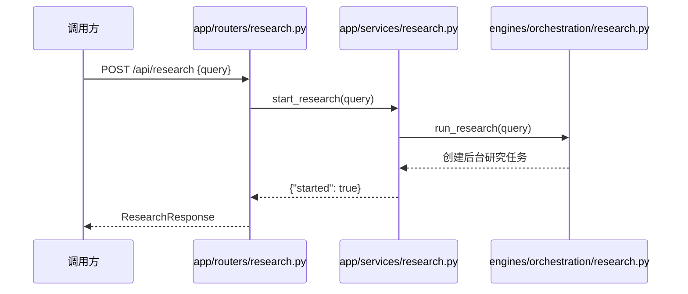

这里有一个非常重要的设计点：`POST /api/research` 不等待研究任务全部完成，而是立即返回 `started: true`。

原因很简单：真实研究任务可能要执行数据库检索、Web 搜索、大模型生成、报告落盘，这些操作都可能耗时较长。HTTP 接口如果一直等待任务完成，用户体验和系统稳定性都会变差。

所以采用的是“接口触发后台任务”的方式。

## 3. Orchestration 编排层的作用

接下来进入 `engines/orchestration/research.py`。这个文件是本章的主角。

为什么要有编排层？因为项目不是一个大模型调用函数，而是多角色协作系统。

完整项目中的研究流程至少包含两个并行角色：

- `InsightAgent`：偏私域舆情数据研究。
- `MediaAgent`：偏公开媒体信息研究。

后面还会继续接入：

- `HostAgent`：对两个角色的章节结果进行综合研判。
- `ReportEngine`：聚合各角色产物，生成最终报告。

如果没有编排层，路由层或 Service 层就必须知道每个 Agent 怎么启动、怎么配置模型、怎么发布进度、怎么处理错误。这会导致 Web 层越来越重。

编排层的职责就是把这些“任务调度问题”集中管理。

### 3.1 编排层负责什么

`engines/orchestration/research.py` 主要负责：

- 维护研究角色注册表。
- 为每个角色创建后台任务。
- 为每个角色创建 `LLMClient`。
- 找到每个角色的输出目录。
- 给 Agent 传入进度回调。
- 在角色成功时发布完成事件。
- 在角色失败时发布错误事件。

它不负责：

- 数据库怎么查。
- Web 搜索怎么调。
- Prompt 怎么写。
- 报告怎么保存。
- HostAgent 怎么研判。

这就是边界。编排层只管“调度”，具体分析交给 Agent。

## 4. 研究角色注册表

在编排层中，首先出现的是类型定义和角色注册表：

```python
ProgressCallback = Callable[[ProgressUpdate], None]
AgentInvoker = Callable[[str, str, LLMClient, str, ProgressCallback | None], Awaitable[None]]

_RESEARCH_INVOKERS: dict[str, AgentInvoker] = {
    "insight": invoke_insight_agent,
    "media": invoke_media_agent,
}
```

这里有两个重点。

第一，`AgentInvoker` 规定了所有研究角色入口函数的统一签名：

```text
query              用户输入的研究主题
role               当前角色标识
llm_client         当前角色的大模型客户端
output_dir         当前角色的输出目录
progress_callback  当前角色上报进度的回调函数
```

第二，`_RESEARCH_INVOKERS` 是一个角色注册表。

```text
"insight" -> invoke_insight_agent
"media"   -> invoke_media_agent
```

这样编排层不需要写很多分支判断。后续如果要新增角色，只需要新增一个入口函数，再放进这个字典。

### 4.1 注册表设计的价值

如果不用注册表，代码可能写成：

```python
if role == "insight":
    await invoke_insight_agent(...)
elif role == "media":
    await invoke_media_agent(...)
```

短期看没问题，但角色一多就会变乱。

注册表让代码变成：

```python
await _RESEARCH_INVOKERS[role](...)
```

编排层只认“角色名”和“统一入口协议”，不关心每个 Agent 内部实现。这是面向扩展的写法。

### 4.2 角色注册流程图

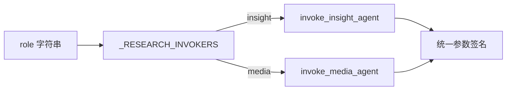

这一层先把角色入口统一起来，后面才能进一步统一事件、模型、输出目录和异常处理。

## 5. run_research：创建后台任务

研究任务的入口函数是：

```python
def run_research(query: str) -> None:
    for role in _RESEARCH_INVOKERS:
        asyncio.create_task(run_research_role(role, query))
```

它做的事情很直接：

- 遍历 `_RESEARCH_INVOKERS` 中的角色。
- 为每个角色创建一个异步任务。
- 每个任务执行 `run_research_role(role, query)`。

当前注册表中有两个角色：

```text
insight
media
```

所以一次 `run_research(query)` 会启动两个后台任务：

```text
run_research_role("insight", query)
run_research_role("media", query)
```

### 5.1 为什么用 asyncio.create_task

`asyncio.create_task()` 的含义是：把一个协程注册到当前事件循环中，让它在后台运行。

对于 FastAPI 来说，请求处理函数本身运行在事件循环中。研究任务被创建为后台任务后，接口可以先返回：

```json
{"started": true}
```

而 `InsightAgent` 和 `MediaAgent` 继续在后台执行。

### 5.2 后台任务启动流程

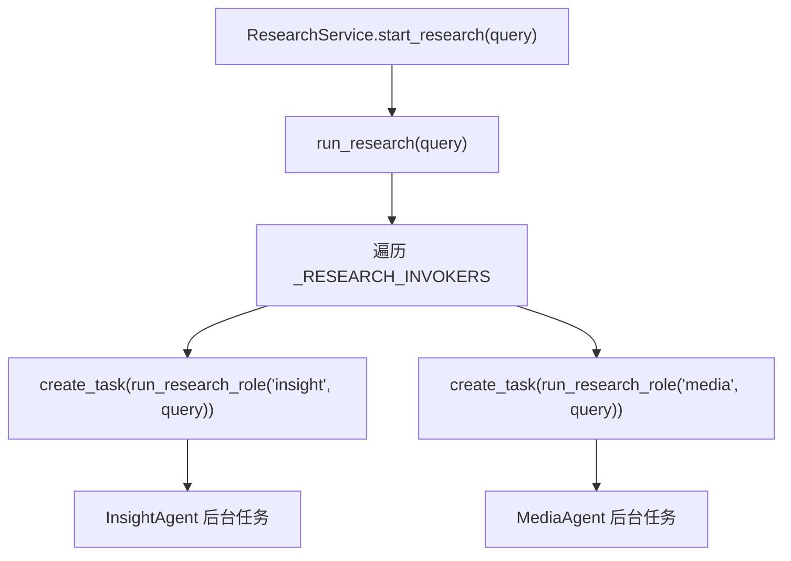

这就是本章最核心的任务启动骨架。

不过，任务创建出来以后，单个任务内部还要做很多统一处理：进度、异常、LLM 客户端、输出目录。这些逻辑集中在 `run_research_role()`。

## 6. 单个角色的执行模板

`run_research_role()` 是所有研究角色共用的执行模板：

```python
async def run_research_role(role: str, query: str) -> None:
    with route_logs_by_role(role):
        try:
            _publish_role_progress(role, ProgressUpdate("starting", "正在初始化研究角色...", 0))
            await _execute_research_flow(role, query)
            publish_role_result(RoleResultEvent(role=role))
        except Exception as exc:
            logger.error(f"{role} 研究角色执行失败: {exc}")
            publish_role_error(RoleErrorEvent(role=role, error=str(exc)))
```

这段代码可以拆成四步：

```text
1. 进入当前角色的日志上下文
2. 发布角色 starting 进度
3. 执行角色真正的研究流程
4. 成功发布 RoleResultEvent，失败发布 RoleErrorEvent
```

它本质上是一个“后台任务执行模板”。

这样的模板可以避免每个 Agent 重复写：

- 开始进度。
- try/except。
- 成功事件。
- 错误事件。
- 日志上下文。

Agent 只关心自己的分析逻辑，公共的运行时逻辑由编排层包起来。

### 6.1 单角色执行时序图

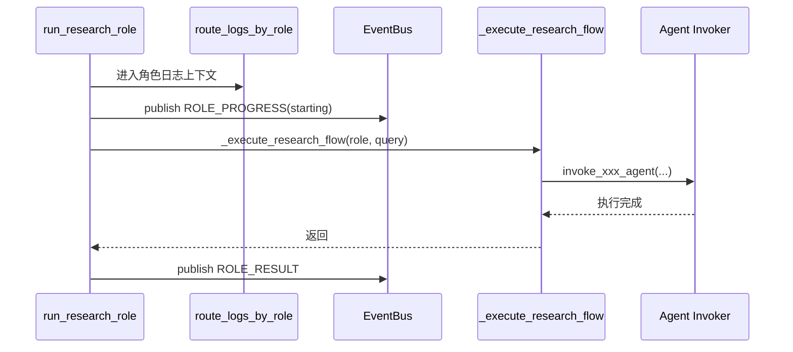

如果 Agent 内部抛出异常，流程会变成：

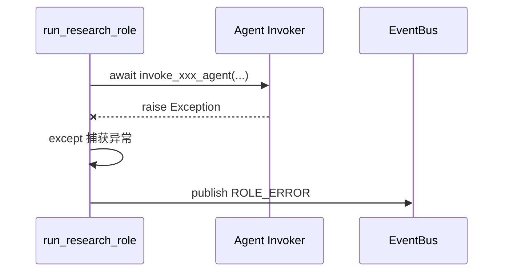

这就是“错误不在 Agent 内部乱处理，而由统一模板转成事件”的设计。

## 7. 组装运行资源

`_execute_research_flow()` 负责为当前角色准备运行资源：

```python
async def _execute_research_flow(role: str, query: str) -> None:
    llm_client = LLMClient.from_role(role)
    output_dir = getattr(config.get_settings(), ROLE_INFOS[role].report_dir_setting)
    await _RESEARCH_INVOKERS[role](
        query,
        role,
        llm_client,
        output_dir,
        lambda update: _publish_role_progress(role, update),
    )
```

这里有四个关键点。

第一，按角色创建 LLM 客户端：

```python
llm_client = LLMClient.from_role(role)
```

第二，按角色读取输出目录：

```python
output_dir = getattr(config.get_settings(), ROLE_INFOS[role].report_dir_setting)
```

第三，从注册表中找到当前角色的 Agent 入口：

```python
_RESEARCH_INVOKERS[role]
```

第四，传入一个进度回调闭包：

```python
lambda update: _publish_role_progress(role, update)
```

这一行非常重要。它是本章第一个需要重点理解的闭包。

### 7.1 progress_callback 中的闭包

`lambda update: _publish_role_progress(role, update)` 捕获了外层变量 `role`。

也就是说，对于 `insight` 任务，它等价于：

```python
lambda update: _publish_role_progress("insight", update)
```

对于 `media` 任务，它等价于：

```python
lambda update: _publish_role_progress("media", update)
```

Agent 内部只需要调用：

```python
self.progress_callback(ProgressUpdate(status, message, pct))
```

它不需要每次都手动传 `role`，因为 `role` 已经被外层闭包绑定进去了。

这就是闭包的作用：把一部分上下文提前封装到函数里，让下游调用者只关心剩余参数。

### 7.2 闭包传递进度的流程图

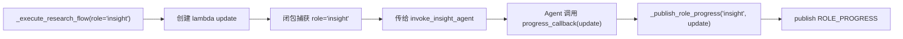

这比让 Agent 自己拼事件更好，因为事件发布规则被收口在编排层。

## 8. Agent 入口函数

当前两个 Agent 文件都已经建立统一入口。

`engines/insight_agent/agent.py`：

```python
async def invoke_insight_agent(
        query: str,
        role: str,
        llm_client: LLMClient,
        output_dir: str,
        progress_callback: Callable[[ProgressUpdate], None] | None = None,
) -> None:
    pass
```

`engines/media_agent/agent.py`：

```python
async def invoke_media_agent(
        query: str,
        role: str,
        llm_client: LLMClient,
        output_dir: str,
        progress_callback: Callable[[ProgressUpdate], None] | None = None,
) -> None:
    pass
```

当前函数体还是 `pass`，但这不是没有价值。因为第二天的重点是先确定“编排层如何调用 Agent”。

统一协议确定后，后续补内部逻辑时就不会破坏上游。

### 8.1 后续 Agent 内部会做什么

`InsightAgent` 后续会偏向：

```text
读取私域数据库
执行关键词召回
可选执行 Milvus 向量召回
整理证据
调用 LLM 写章节
保存私域研究报告
发布 section_ready 事件
```

`MediaAgent` 后续会偏向：

```text
规划搜索词
调用公开 Web 搜索
整理网页来源
调用 LLM 写章节
保存公开媒体研究报告
发布 section_ready 事件
```

这些内容都属于后面的 Agent 内部流程。本章只负责让它们能被统一调度。

## 9. ProgressUpdate：统一进度模型

当前进度模型定义在 `engines/common/progress.py`：

```python
from dataclasses import dataclass

@dataclass(frozen=True)
class ProgressUpdate:
    status: str
    message: str
    progress_pct: int
```

它只有三个字段：

```text
status        当前状态
message       展示文案
progress_pct  进度百分比
```

这个模型很小，但非常关键。因为 `InsightAgent` 和 `MediaAgent` 未来会有不同的执行步骤，如果各自随便返回进度，前端和事件系统会很难统一展示。

而统一为 `ProgressUpdate` 后，Agent 只需要上报：

```python
ProgressUpdate("searching", "正在搜索公开媒体信息...", 30)
```

编排层再把它转换成 `RoleProgressEvent`。

### 9.1 ProgressUpdate 与 RoleProgressEvent 的边界

这里需要特别区分两个看起来很像的对象：

```text
ProgressUpdate      纯数据对象，面向 Agent
RoleProgressEvent   事件对象，面向 EventBus
```

`ProgressUpdate` 属于 Agent 向编排层汇报进度时使用的数据结构。它放在 `engines/common/progress.py`，位置是中立的，不依赖事件总线，也不依赖发布器。Agent 只需要知道“我要汇报一个状态、文案和百分比”，不需要知道后面有没有 EventBus、SSE 或其他订阅者。

`RoleProgressEvent` 属于事件系统的一部分，定义在 `engines/common/eventing/events.py`。它表示“某个角色产生了一条可发布到事件总线的进度事件”，因此它面向的是 EventBus 和订阅者。

二者之间的转换点在 `engines/orchestration/research.py`：

```python
def _publish_role_progress(role: str, update: ProgressUpdate) -> None:
    publish_role_progress(RoleProgressEvent(
        role=role,
        status=update.status,
        message=update.message,
        progress_pct=update.progress_pct,
    ))
```

这段代码说明，Agent 不直接构造 `RoleProgressEvent`。Agent 只产生 `ProgressUpdate`，编排层知道事件系统，所以由编排层负责把纯进度数据转换成事件对象。所以这是为什么将ProgressUpdate 不放进 eventing 目录的原因。

这个分层关系可以这样理解：

```text
agent 不知道 eventing
    -> ProgressUpdate(common/progress.py)
        -> orchestrator 转换
            -> RoleProgressEvent(common/eventing/events.py)
                -> EventBus(common/eventing/bus.py)
```

对应流程图如下：

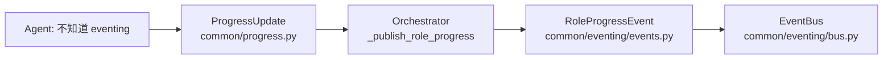

如果把 `ProgressUpdate` 放进 `eventing/` 目录，Agent 为了汇报进度就需要依赖事件系统。这样 Agent 就会间接知道 EventBus 的存在，破坏了当前这条依赖线。所以它放在 `common/progress.py` 这种中立位置，比放进 `common/eventing/` 更合适。这样 Agent 入口保持轻量，事件发布职责也仍然收口在编排层。

## 10. Pub/Sub 机制：事件总线

接下来进入本章最重要的底层机制：发布订阅，也就是 Pub/Sub。

Pub/Sub 的核心思想是：

```text
发布者只负责发布事件，不关心谁会接收。
订阅者只负责订阅事件，不关心谁会发布。
```

编排层发布角色进度、完成、错误事件。未来 SSE、HostAgent都可以订阅这些事件。

这样可以避免模块之间互相直接调用。

### 10.1 事件类型

事件类型定义在 `engines/common/eventing/events.py`：

```python
class EventType(str, Enum):
    SECTION_READY = "section_ready"
    ROLE_PROGRESS = "role_progress"
    HOST_DISCUSSION_MESSAGE = "host_discussion_message"
    ROLE_ERROR = "role_error"
    ROLE_RESULT = "role_result"
```

当前第二天重点是：

```text
ROLE_PROGRESS  角色进度
ROLE_RESULT    角色完成
ROLE_ERROR     角色失败
```

后续完整链路中还会用到：

```text
SECTION_READY
HOST_DISCUSSION_MESSAGE
```

其中 `SECTION_READY` 是 HostAgent 配对研判的关键。Insight 和 Media 不是等整份报告完成才交给 Host，而是在每个章节完成时发布 `section_ready`。HostAgent 收到同一维度的两边结果后，再做综合研判。

### 10.2 事件载荷模型

当前事件载荷使用 Pydantic 模型：

```python
class RoleProgressEvent(BaseModel):
    role: str
    status: str
    message: str = ""
    progress_pct: int = 0

class RoleResultEvent(BaseModel):
    role: str

class RoleErrorEvent(BaseModel):
    role: str
    error: str
```

用 Pydantic 模型的好处是结构清楚。读到 `RoleProgressEvent` 时，就知道这个事件至少应该包含 `role`、`status`、`message`、`progress_pct`。

### 10.3 事件总线的数据结构

事件总线定义在 `engines/common/eventing/bus.py`：

```python
EventCallback = Callable[[EventType, dict[str, Any]], None]

_subscribers: dict[EventType, set[EventCallback]] = {}
```

这里的 `_subscribers` 是整个 Pub/Sub 机制的核心。

它的结构可以理解为：

```text
{
  EventType.ROLE_PROGRESS: {callback1, callback2},
  EventType.ROLE_RESULT:   {callback3},
  EventType.ROLE_ERROR:    {callback4, callback5}
}
```

也就是说，每种事件类型下面维护一组回调函数。

### 10.4 subscribe：订阅事件

订阅函数如下：

```python
def subscribe(event_type: EventType, callback: EventCallback) -> None:
    _subscribers.setdefault(event_type, set()).add(callback)
```

这段代码有一个细节。`setdefault` 会在事件类型不存在时创建一个空集合。

例如：

```python
subscribe(EventType.ROLE_PROGRESS, [handle_event])
```

### 10.5 publish：发布事件

发布函数如下：

```python
def publish(event_type: EventType, data: dict[str, Any]) -> None:
    for callback in list(_subscribers.get(event_type, ())):
        try:
            callback(event_type, data)
        except Exception as exc:
            logger.error(...)
```

它会根据事件类型找到所有订阅者，然后逐个调用。

这里使用：

```python
list(_subscribers.get(event_type, ()))
```

是为了复制一份当前订阅者列表，避免回调执行过程中修改订阅集合导致遍历异常。

### 10.6 unsubscribe：取消订阅

取消订阅函数如下：

```python
def unsubscribe(callback: EventCallback) -> None:
    for subs in _subscribers.values():
        subs.discard(callback)
```

它会遍历所有事件类型，把这个 callback 从订阅集合中移除。

### 10.7 Pub/Sub 流程图

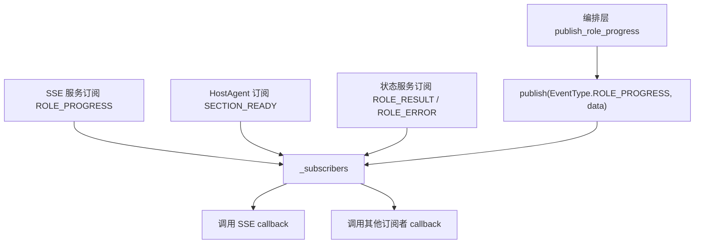

### 10.8 为什么 Pub/Sub 适合这个项目

舆情分析任务是长任务，而且角色Agent之间有协作。

如果没有事件总线，可能会变成：

```text
InsightAgent 直接调用 HostAgent
InsightAgent 直接调用 SSE
```

这样依赖关系会很乱。

有了 Pub/Sub 后，Agent 或编排层只需要发布事件：

```text
我完成了
我失败了
我有新进度
我有一个章节 ready
```

谁关心这些事件，谁自己去订阅。

这就是事件驱动解耦。

## 11. publishers

底层事件总线已经提供了 `publish()`，为什么还要有 `publishers.py`？

因为业务代码直接写：

```python
publish(EventType.ROLE_PROGRESS, event.model_dump())
```

会有两个问题：

- 每次都要手动传 `EventType`，容易写错。
- 每次都要记得 `model_dump()`，容易漏掉。

所以当前项目封装了：

```python
def publish_role_progress(event: RoleProgressEvent) -> None:
    publish(EventType.ROLE_PROGRESS, event.model_dump())

def publish_role_result(event: RoleResultEvent) -> None:
    publish(EventType.ROLE_RESULT, event.model_dump())

def publish_role_error(event: RoleErrorEvent) -> None:
    publish(EventType.ROLE_ERROR, event.model_dump())
```

业务代码就可以写得更清楚：

```python
publish_role_progress(RoleProgressEvent(...))
```

这是一层很薄的封装，但它把“事件类型”和“载荷序列化”固定住了。

### 11.1 publishers 在整体链路中的位置

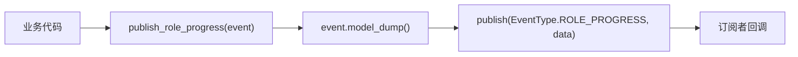

到这里，事件系统就形成了完整闭环：

```text
定义事件 -> 订阅事件 -> 发布事件 -> 执行回调
```

下一步要看的是：事件由谁产生。当前主要由编排层产生，也就是 `_publish_role_progress()`。

## 12. 编排层中的事件发布

编排层中有一个小函数：

```python
def _publish_role_progress(role: str, update: ProgressUpdate) -> None:
    publish_role_progress(RoleProgressEvent(
        role=role,
        status=update.status,
        message=update.message,
        progress_pct=update.progress_pct,
    ))
```

它把 `ProgressUpdate` 转换成 `RoleProgressEvent`。

为什么不让 Agent 直接发布 `RoleProgressEvent`？

因为 Agent 内部应该尽量关注业务步骤，比如检索、搜索、写作。它只需要告诉外部：

```python
ProgressUpdate("searching", "正在搜索...", 30)
```

至于这个进度如何包装成事件、事件类型是什么、怎么发送给订阅者，应该由公共基础设施处理。

这也是分层的一部分。

## 13. LLMClient 的整体设计

讲完编排和事件之后，接下来进入另一个核心：`LLMClient`。

当前项目把大模型调用封装在：

```text
engines/common/llm_client.py
```

这个类不是普通工具函数，而是一个统一的大模型调用门面。

它解决几个问题：

- 不同角色如何读取自己的模型配置。
- Prompt 如何统一格式化。
- 当前时间如何注入 prompt。
- 不同厂商参数如何适配。
- 文本输出和结构化输出如何统一。
- 网络失败时如何交给重试器处理。

**完整代码：**

```python
from datetime import datetime
from typing import Any, Callable, Optional, TypeVar
from pydantic import BaseModel
from langchain.chat_models import init_chat_model
from langchain_core.language_models.chat_models import BaseChatModel
from langchain_core.messages import BaseMessage, HumanMessage, SystemMessage
from engines.common.runtime.call_retry import with_retry
from engines.contracts import config
from engines.contracts.roles import ROLE_INFOS

T = TypeVar("T", bound=BaseModel)

def _prepend_time_context(user_prompt: str) -> str:
    current_time = datetime.now().strftime("%Y年%m月%d日%H时%M分")
    time_prefix = f"今天的实际时间是{current_time}"
    if user_prompt:
        return f"{time_prefix}\n{user_prompt}"
    return time_prefix


def _format_messages(system_prompt: str, user_prompt: str) -> list[BaseMessage]:

    return [
        SystemMessage(content=system_prompt),
        HumanMessage(content=_prepend_time_context(user_prompt)),
    ]


def _adapt_moonshot(params: dict[str, Any], is_structured: bool) -> dict[str, Any]:
    adapted = params.copy()
    if is_structured:
        adapted["extra_body"] = {"thinking": {"type": "disabled"}}
        adapted["temperature"] = 0.6
    else:
        adapted["temperature"] = 1.0
    return adapted


_PROVIDER_ADAPTERS: dict[str, Callable[[dict[str, Any], bool], dict[str, Any]]] = {
    "moonshot": _adapt_moonshot,
    "kimi": _adapt_moonshot,
}


class LLMClient:
    def __init__(
            self,
            api_key: str,
            model_name: str,
            base_url: Optional[str] = None,
            engine_name: str = "Engine",
            model_provider: str = "openai",
            timeout: float = 1800,
    ) -> None:
        self.api_key = api_key
        self.model_name = model_name
        self.base_url = base_url
        self.engine_name = engine_name
        self.model_provider = model_provider
        self.timeout = timeout

    @classmethod
    def from_role(cls, role: str) -> "LLMClient":
        role_info = ROLE_INFOS.get(role)
        role_info_prefix = role_info.config_prefix
        return cls(
            api_key=getattr(config.get_settings(), f"{role_info_prefix}_API_KEY"),
            model_name=getattr(config.get_settings(), f"{role_info_prefix}_MODEL_NAME"),
            base_url=getattr(config.get_settings(), f"{role_info_prefix}_BASE_URL"),
            engine_name=role_info.display_name,
            model_provider=getattr(config.get_settings(), f"{role_info_prefix}_MODEL_PROVIDER"),
        )

    @with_retry
    async def generate_text(self, system_prompt: str, user_prompt: str, **kwargs) -> str:
        """完整文本生成：底层采用流式规避网关超时，外层重试防御网络闪断。"""
        llm = self._build_chat_model(**kwargs)
        text_chunks = []
        async for chunk in llm.astream(_format_messages(system_prompt, user_prompt)):
            text = chunk.text
            if text:
                text_chunks.append(text)
        return "".join(text_chunks)

    @with_retry
    async def generate_object(self,
                              system_prompt: str,
                              user_prompt: str,
                              output_model: type[T],
                              **kwargs) -> T:
        llm = self._build_chat_model(is_structured=True, **kwargs)
        structured = llm.with_structured_output(output_model, method="function_calling")
        result = await structured.ainvoke(_format_messages(system_prompt, user_prompt))
        if result is None:
            raise ValueError(f"{self.engine_name} 返回 None")
        return result

    def _build_chat_model(self, is_structured: bool = False, **kwargs) -> BaseChatModel:
        params = self._adapt_provider_params(kwargs, is_structured)
        return init_chat_model(
            model=self.model_name,
            model_provider=self.model_provider,
            api_key=self.api_key,
            base_url=self.base_url,
            timeout=self.timeout,
            max_retries=0,  # 关闭底层 SDK 重试,交由 @with_retry 统一接管
            **params,
        )

    def _adapt_provider_params(self, params: dict[str, Any], is_structured: bool) -> dict[str, Any]:
        model = self.model_name.lower()
        for keyword, adapter in _PROVIDER_ADAPTERS.items():
            if keyword in model:
                return adapter(params, is_structured)
        return params

```


```python
class PersonInfo(BaseModel):
    name: str = Field(description="人物的名字")
    age: int = Field(description="人物的年龄")
    hobby: str = Field(description="人物的爱好")

async def test_main():
    client = LLMClient(
        api_key="sk-your-api-key-here",  
        model_name="moonshot-v1-8k",    
        model_provider="moonshot",     
        base_url="https://api.moonshot.cn/v1" 
    )

    system_prompt = "你是一个精准的信息提取助手。"
    user_prompt = "帮我提取这段话里的信息：李雷今年25岁，他非常喜欢打篮球。"

    print(f"正在调用 {client.model_provider} 的 {client.model_name} 模型提取信息...")
   
        result: PersonInfo = await client.generate_object(
            system_prompt=system_prompt,
            user_prompt=user_prompt,
            output_model=PersonInfo
        )

if __name__ == "__main__":
    asyncio.run(test_main())
```


### 13.1 LLMClient 使用了哪些设计思想

当前 `LLMClient` 中能看到几个很典型的设计模式或设计思想：

- 工厂方法：`from_role()` 根据角色创建客户端。
- 门面模式：对外只暴露 `generate_text()`、`generate_object()`，隐藏 LangChain 细节。
- 适配器模式：`_PROVIDER_ADAPTERS` 根据模型厂商调整参数。
- 装饰器模式：`@with_retry` 给模型调用增加重试能力。
- 策略表：`_PROVIDER_ADAPTERS` 是一张“关键词 -> 适配函数”的策略映射。

这些设计并不是为了炫技，而是为了解决真实项目里的变化点。

大模型供应商会变，角色配置会变，输出形式会变，网络稳定性也会变。如果每个 Agent 都自己处理这些细节，代码会迅速重复且难维护。

## 14. from_role：工厂方法

`LLMClient.from_role()` 是一个工厂方法：

```python
@classmethod
def from_role(cls, role: str) -> "LLMClient":
    role_info = ROLE_INFOS.get(role)
    role_info_prefix = role_info.config_prefix
    return cls(
        api_key=getattr(config.get_settings(), f"{role_info_prefix}_API_KEY"),
        model_name=getattr(config.get_settings(), f"{role_info_prefix}_MODEL_NAME"),
        base_url=getattr(config.get_settings(), f"{role_info_prefix}_BASE_URL"),
        engine_name=role_info.display_name,
        model_provider=getattr(config.get_settings(), f"{role_info_prefix}_MODEL_PROVIDER"),
    )
```

调用方只需要写：

```python
llm_client = LLMClient.from_role("insight")
```

它内部会根据 `ROLE_INFOS` 找到配置前缀：

```python
"insight" -> "INSIGHT_ENGINE"
```

然后读取：

```text
INSIGHT_ENGINE_API_KEY
INSIGHT_ENGINE_MODEL_NAME
INSIGHT_ENGINE_BASE_URL
INSIGHT_ENGINE_MODEL_PROVIDER
```

如果角色是 `media`，则读取：

```text
MEDIA_ENGINE_API_KEY
MEDIA_ENGINE_MODEL_NAME
MEDIA_ENGINE_BASE_URL
MEDIA_ENGINE_MODEL_PROVIDER
```

### 14.1 from_role 流程图

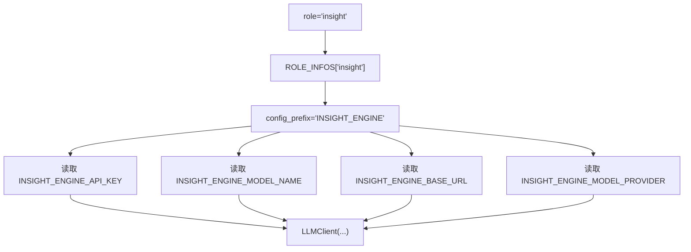

这就是工厂方法的价值：把创建对象的细节藏起来，让调用方只表达“我要哪个角色的客户端”。

## 15. 门面模式

`LLMClient` 对外主要提供两个方法

```python
async def generate_text(self, system_prompt: str, user_prompt: str, **kwargs) -> str:
    ...
```

和：

```python
async def generate_object(
    self,
    system_prompt: str,
    user_prompt: str,
    output_model: type[T],
    **kwargs
) -> T:
    ...
```

这就是门面模式的体现。

Agent 不需要知道：

- LangChain 怎么初始化模型。
- Message 对象怎么构造。
- 流式输出怎么拼接。
- 结构化输出怎么调用。
- 厂商参数怎么适配。
- SDK 重试怎么关闭。

Agent 只需要调用：

```python
await llm_client.generate_text(system_prompt, user_prompt)
```

或者：

```python
await llm_client.generate_object(system_prompt, user_prompt, SomePydanticModel)
```

复杂细节都被 `LLMClient` 这个门面挡住。

## 16. Prompt 格式化与时间上下文

`LLMClient` 中有两个辅助函数：

```python
def _prepend_time_context(user_prompt: str) -> str:
    current_time = datetime.now().strftime("%Y年%m月%d日%H时%M分")
    time_prefix = f"今天的实际时间是{current_time}"
    if user_prompt:
        return f"{time_prefix}\n{user_prompt}"
    return time_prefix
```

和：

```python
def _format_messages(system_prompt: str, user_prompt: str) -> list[BaseMessage]:
    return [
        SystemMessage(content=system_prompt),
        HumanMessage(content=_prepend_time_context(user_prompt)),
    ]
```

这两个函数解决的是 prompt 统一格式问题。

舆情系统经常会问“最近”“今天”“当前热点”。如果不注入当前时间，大模型可能会依据旧知识回答，或者对相对时间理解不稳定。

所以项目会把真实时间加到用户 prompt 前面。

### 16.1 Prompt 格式化流程

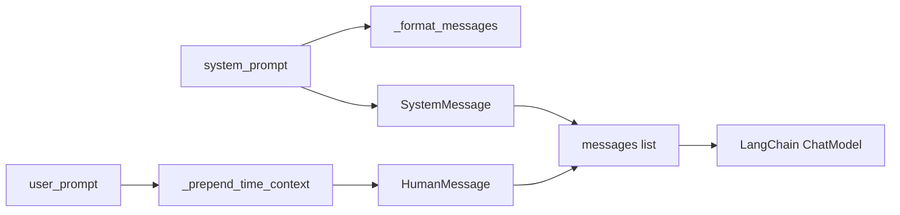

这看似是小细节，但对舆情分析这种时间敏感任务很重要。

## 17. 适配器模式

不同大模型供应商支持的参数并不完全一样。当前代码中有一个厂商适配表：

```python
_PROVIDER_ADAPTERS: dict[str, Callable[[dict[str, Any], bool], dict[str, Any]]] = {
    "moonshot": _adapt_moonshot,
    "kimi": _adapt_moonshot,
}
```

以及一个适配函数：

```python
def _adapt_moonshot(params: dict[str, Any], is_structured: bool) -> dict[str, Any]:
    adapted = params.copy()
    if is_structured:
        adapted["extra_body"] = {"thinking": {"type": "disabled"}}
        adapted["temperature"] = 0.6
    else:
        adapted["temperature"] = 1.0
    return adapted
```

当模型名中包含 `moonshot` 或 `kimi` 时，就会使用 `_adapt_moonshot()` 调整参数。

匹配逻辑在这里：

```python
def _adapt_provider_params(self, params: dict[str, Any], is_structured: bool) -> dict[str, Any]:
    model = self.model_name.lower()
    for keyword, adapter in _PROVIDER_ADAPTERS.items():
        if keyword in model:
            return adapter(params, is_structured)
    return params
```

### 17.1 为什么这是适配器模式

适配器模式的目标是：把不同供应商的差异转换成系统内部统一能接受的形式。

在这里，Agent 不需要知道 Kimi 结构化输出时要不要关 thinking，也不需要知道 temperature 怎么调。Agent 只调用 `generate_object()`。

供应商差异被封装在：

```text
_PROVIDER_ADAPTERS
_adapt_moonshot
_adapt_provider_params
```

### 17.2 适配器流程图

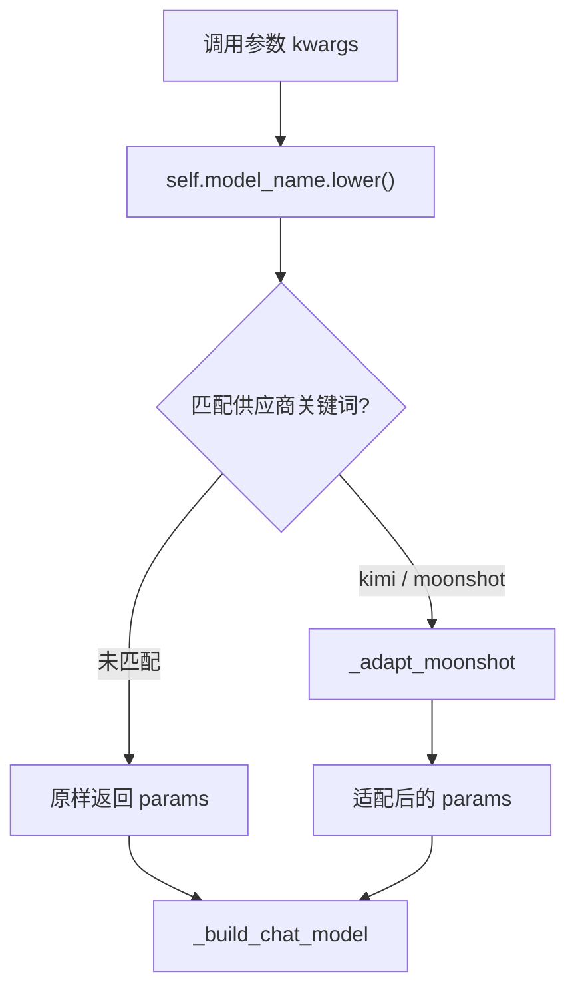

后续如果要支持某个新供应商，只需要新增适配函数，再放进 `_PROVIDER_ADAPTERS`。

## 18. generate_text：流式文本生成

`generate_text()` 用于普通文本生成：

```python
@with_retry
async def generate_text(self, system_prompt: str, user_prompt: str, **kwargs) -> str:
    llm = self._build_chat_model(**kwargs)
    text_chunks = []
    async for chunk in llm.astream(_format_messages(system_prompt, user_prompt)):
        text = chunk.text
        if text:
            text_chunks.append(text)
    return "".join(text_chunks)
```

这里有三个重点。

第一，它被 `@with_retry` 装饰。这意味着模型调用失败时会自动重试。

第二，它使用 `astream()` 流式读取输出，而不是一次性等待完整结果。

第三，它把每个 chunk 的文本拼接起来，最后返回完整字符串。

### 18.1 流式生成流程图

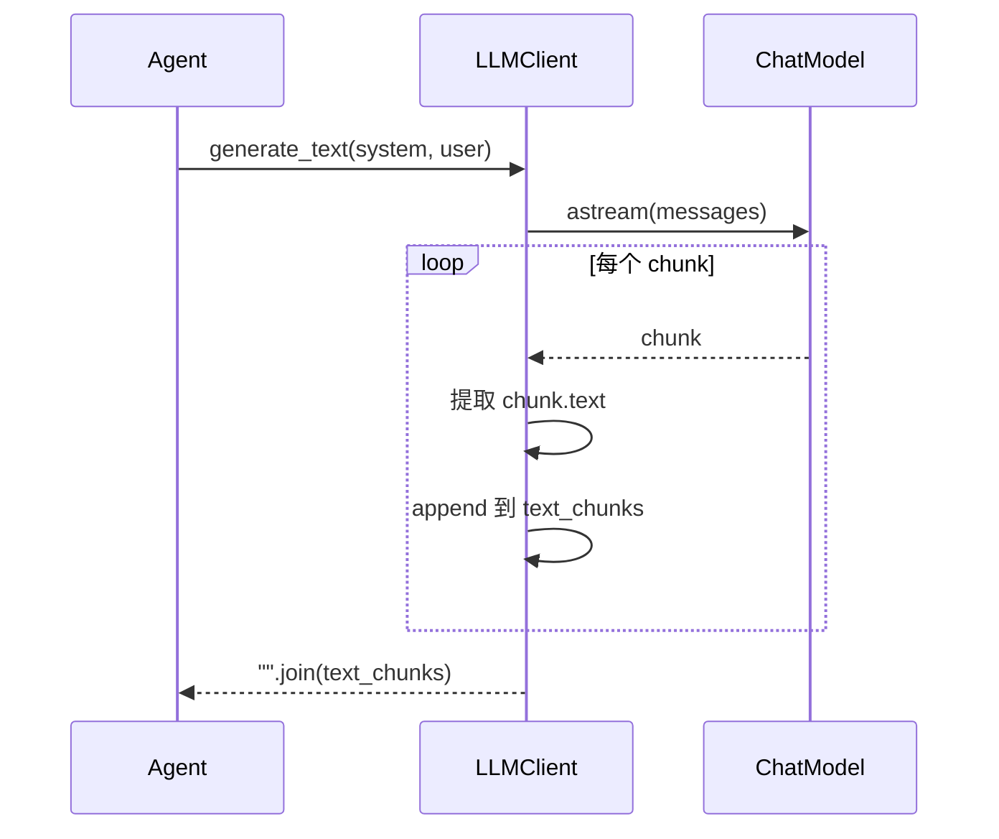

流式输出适合长文本报告生成，因为它可以降低网关超时风险，也方便后续扩展实时输出。

## 19. generate_object：结构化输出

`generate_object()` 用于让大模型输出 Pydantic 对象：

```python
@with_retry
async def generate_object(
    self,
    system_prompt: str,
    user_prompt: str,
    output_model: type[T],
    **kwargs
) -> T:
    llm = self._build_chat_model(is_structured=True, **kwargs)
    structured = llm.with_structured_output(output_model, method="function_calling")
    result = await structured.ainvoke(_format_messages(system_prompt, user_prompt))
    if result is None:
        raise ValueError(f"{self.engine_name} 返回 None")
    return result
```

它适合后续这些场景：

- 生成搜索计划。
- 生成章节结构。
- 生成 Host 研判对象。
- 生成报告元数据。

相比让模型返回一段 Markdown，再用字符串解析，结构化输出更稳定。

### 19.1 结构化输出流程

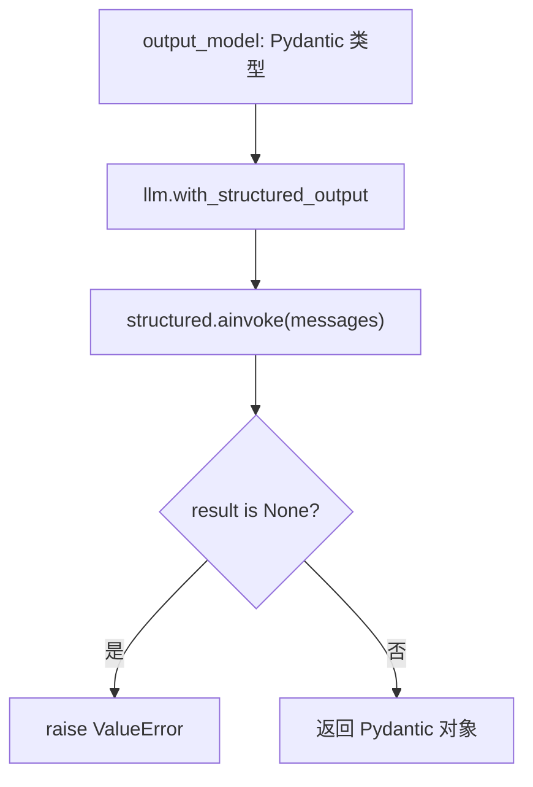

这也是后续 Agent 复杂化时的重要基础。

## 20. 重试器：装饰器与闭包

接下来讲本章另一个核心：`engines/common/runtime/call_retry.py`。

当前重试器不是普通函数，而是通过装饰器给异步函数增加重试能力。

### 20.1 RetryConfig

重试配置定义如下：

```python
@dataclass
class RetryConfig:
    max_retries: int = 3
    initial_delay: float = 1.0
    backoff_factor: float = 2.0
    max_delay: float = 60.0

    def delay_for(self, attempt: int) -> float:
        return min(self.initial_delay * (self.backoff_factor ** attempt), self.max_delay)
```

当前实际配置是：

```python
RETRY_CONFIG = RetryConfig(
    max_retries=4,
    initial_delay=15.0,
    backoff_factor=2.0,
    max_delay=120.0,
)
```

这表示：

- 最多重试 4 次。
- 第一次等待 15 秒。
- 后续按 2 倍退避。
- 最大等待不超过 120 秒。

### 20.2 指数退避流程图

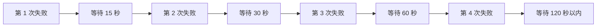

这种方式叫指数退避。它比固定间隔重试更适合网络服务，因为服务短暂抖动时可以逐步拉开请求频率。

### 20.3 哪些错误不重试

代码中有一个判断：

```python
def _is_non_retryable(exc: Exception) -> bool:
    status = getattr(exc, "status_code", None)
    if status is None:
        response = getattr(exc, "response", None)
        status = getattr(response, "status_code", None)
    return isinstance(status, int) and 400 <= status < 500 and status != 429
```

含义是：

- 大部分 4xx 错误不重试。
- 429 限流错误可以重试。

原因是 400、401、403 这类错误通常表示请求参数、鉴权、权限有问题，重试也不会好。429 则常常是临时限流，等待后可能恢复。

## 21. with_retry：刚性重试装饰器

`with_retry` 是一个装饰器：

```python
def with_retry(func: Callable) -> Callable:
    if not asyncio.iscoroutinefunction(func):
        raise TypeError(f"重试装饰器只能装饰 async 函数,得到的是同步函数 {func.__name__}")

    @wraps(func)
    async def wrapper(*args, **kwargs) -> Any:
        cfg = RETRY_CONFIG
        for attempt in range(cfg.max_retries + 1):
            try:
                return await func(*args, **kwargs)
            except Exception as e:
                delay = _evaluate_failure(func.__name__, attempt, e, cfg)
                if delay is None:
                    raise
                await asyncio.sleep(delay)

    return wrapper
```

这段代码需要重点理解，因为它同时涉及装饰器和闭包。

### 21.1 装饰器做了什么

当代码写：

```python
@with_retry
async def generate_text(...):
    ...
```

它等价于：

```python
generate_text = with_retry(generate_text)
```

也就是说，原始的 `generate_text` 函数被传入 `with_retry`，然后 `with_retry` 返回一个新的 `wrapper` 函数。

以后调用 `generate_text()` 时，实际调用的是 `wrapper()`。

### 21.2 闭包在哪里

`wrapper()` 定义在 `with_retry()` 内部：

```python
async def wrapper(*args, **kwargs) -> Any:
    ...
    return await func(*args, **kwargs)
```

这里的 `func` 是外层函数 `with_retry(func)` 的参数。

当 `with_retry` 返回 `wrapper` 后，外层函数已经执行完了，但 `wrapper` 仍然能访问 `func`。这就是闭包。

这里还需要注意 `@wraps(func)`：

```python
@wraps(func)
async def wrapper(*args, **kwargs) -> Any:
    ...
```

`@wraps(func)` 来自 `functools`，它的作用不是实现重试，也不是实现闭包，而是把原始函数 `func` 的元信息复制到 `wrapper` 上。

如果没有 `@wraps(func)`，被装饰后的函数在外部看起来会变成 `wrapper`。例如：

```python
generate_text.__name__
```

可能得到的是：

```text
wrapper
```

而不是：

```text
generate_text
```

这会影响日志、调试、错误提示、自动文档和测试定位。当前重试器里 `_evaluate_failure()` 会使用：

```python
func.__name__
```

来打印失败函数名称。`@wraps(func)` 可以让被装饰函数尽量保留原来的名字、文档字符串和模块信息，使装饰器对外更透明。

所以这段装饰器里有两层含义：

```text
闭包：wrapper 捕获 func，用来调用原始函数。
wraps：wrapper 继承 func 的元信息，让调试和日志更友好。
```

### 21.3 with_retry 执行流程图

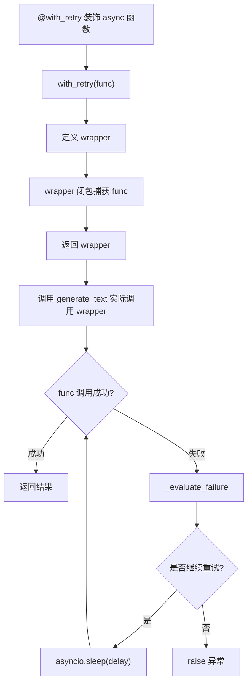

## 22. with_graceful_retry：柔性重试

除了 `with_retry`，项目中还有：

```python
def with_graceful_retry(func: Callable) -> Callable:
    ...
```

它和 `with_retry` 的区别在于失败后的处理方式。

`with_retry` 是刚性的：

```text
重试失败 -> 抛异常 -> 上层捕获 -> 发布 ROLE_ERROR
```

`with_graceful_retry` 是柔性的：

```text
重试失败 -> 返回默认值 -> 主流程继续
```

代码中通过这一行获取默认返回值：

```python
default_return = getattr(args[0], "retry_default_return", None) if args else None
```

这表示如果被装饰的是某个对象的方法，就尝试从实例上读取 `retry_default_return`。

### 22.1 两种重试方式的适用场景

刚性重试适合关键步骤：

- LLM 生成最终章节。
- 生成结构化研判对象。
- 关键数据保存。

这些步骤失败后，任务就应该失败。

柔性重试适合可降级步骤：

- 某个辅助搜索源失败。
- 某个可选摘要失败。

这些步骤失败后，可以返回空结果或默认结果，让主流程继续。

### 22.2 刚性与柔性重试对比

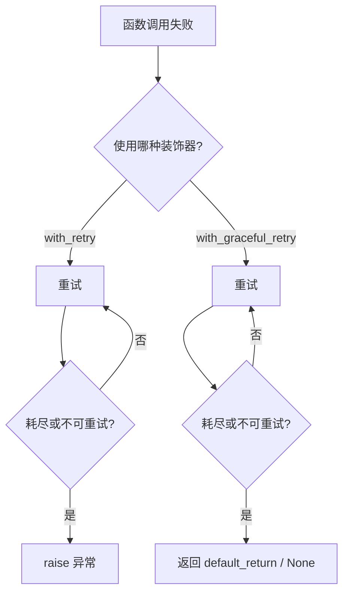

重试器是当前项目中很适合讲解 Python 高阶函数、装饰器和闭包的地方。

## 23. LLMClient 与重试器如何结合

`LLMClient` 中的两个核心方法都使用了 `@with_retry`：

```python
@with_retry
async def generate_text(...):
    ...
```

```python
@with_retry
async def generate_object(...):
    ...
```

这意味着 Agent 调用模型时，不需要自己写重试逻辑。

Agent 只写：

```python
text = await llm_client.generate_text(system_prompt, user_prompt)
```

如果底层模型调用临时失败，重试器会自动接管。

如果重试后仍然失败，异常会抛回编排层：

```python
except Exception as exc:
    publish_role_error(RoleErrorEvent(role=role, error=str(exc)))
```

于是模型失败最终会变成 `ROLE_ERROR` 事件。

### 23.1 LLM 失败到事件发布的流程

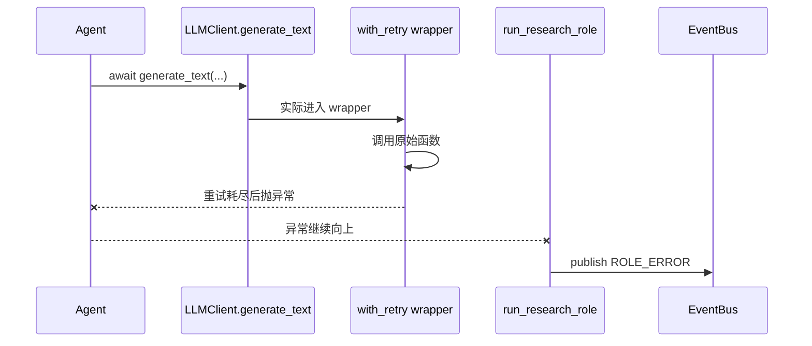

这条链路说明：重试器不是孤立工具，它和编排层的错误事件机制是连在一起的。

## 24. role_log：角色日志上下文

当前代码中还有一层角色日志上下文：

```python
with route_logs_by_role(role):
    ...
```

它定义在 `engines/common/runtime/role_log.py`。

核心逻辑是给 loguru 增加一个文件 handler：

```python
handler_id = logger.add(
    str(_LOG_DIR / f"{role}.log"),
    format="{time:YYYY-MM-DD HH:mm:ss} | {level} | [{extra[role]}] {name} - {message}",
    level="INFO",
    encoding="utf-8",
    rotation="1 MB",
    filter=lambda record: (
            record["extra"].get("role") == role
    ),
)
```

然后通过：

```python
with logger.contextualize(role=role):
    yield
```

让上下文内部的日志都带上当前 `role`。

### 24.1 这里也有闭包

注意这一段：

```python
filter=lambda record: (
        record["extra"].get("role") == role
)
```

这个 `lambda` 捕获了外层的 `role`。

当 `role == "insight"` 时，这个 filter 就只允许 `extra.role == "insight"` 的日志进入 `insight.log`。

当 `role == "media"` 时，它只允许 `extra.role == "media"` 的日志进入 `media.log`。

这也是闭包的实际应用。

### 24.2 角色日志流程图

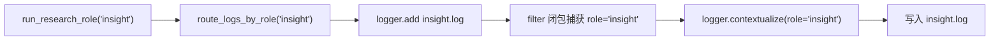

在完整项目中，`InsightAgent` 和 `MediaAgent` 会并发运行。角色日志能让排查问题更容易。

## 25. 本章实现部分

当前 代码已经搭出了运行骨架，但还不是完整研究链路。

已经完成的部分：

```text
ResearchService 调用 run_research
run_research 创建 insight / media 后台任务
run_research_role 统一处理进度、成功、失败
LLMClient 支持按角色读取模型配置
事件总线支持发布订阅
重试器支持 async 函数重试
Agent 入口签名已经统一
```

还没有完成的部分：

```text
InsightAgent 内部逻辑仍是 pass
MediaAgent 内部逻辑仍是 pass
ResearchService.get_research_result() 仍是 pass
角色报告还没有真正落盘
section_ready 事件还没有由 Agent 发布
HostAgent 还没有订阅 section_ready 并配对研判
SSE 还没有把事件推到前端
ReportEngine 还没有聚合角色产物
```

所以本章的正确理解是：

```text
第二天不是完成智能分析本身，而是完成智能分析的运行骨架。
```

这和工程开发的节奏是一致的：先稳定入口和调度方式，再逐步补具体业务能力。

## 26. 本章完整流程图

下面用一张图把本章内容串起来：

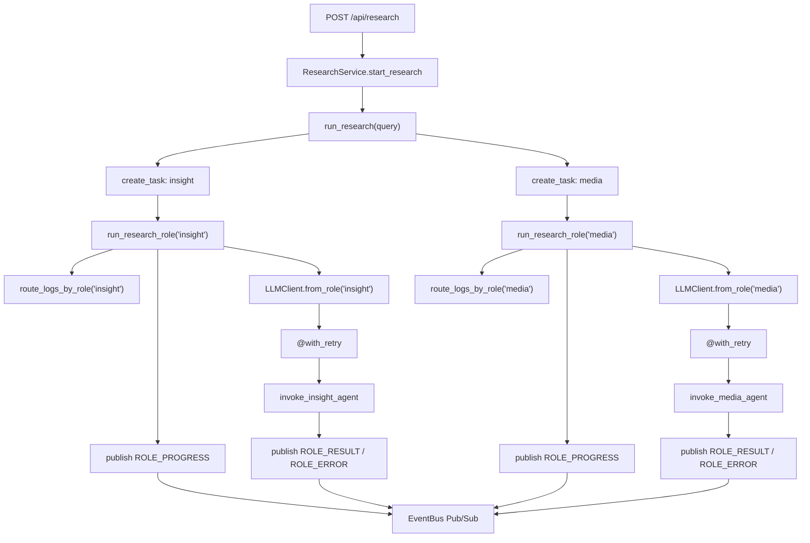

这张图可以作为本章复盘图。

## 26. 本章小结

本章完成了从 Web 应用层到引擎编排层的过渡。

现在系统已经形成了这条主线：

```text
ResearchService
  -> run_research
      -> run_research_role(insight)
      -> run_research_role(media)
          -> LLMClient.from_role
          -> invoke_xxx_agent
          -> publish_role_progress / result / error
```

本章最重要的不是某一个函数，而是几个工程思想：

- 用编排层隔离 Web 层和 Agent 层。
- 用注册表管理多个角色入口。
- 用 Pub/Sub 机制解耦事件发布者和订阅者。
- 用 `ProgressUpdate` 统一进度格式。
- 用 `LLMClient` 封装模型调用细节。
- 用适配器表处理不同模型供应商差异。
- 用装饰器和闭包实现可复用重试逻辑。
- 用闭包把角色上下文绑定进回调函数和日志过滤器。

下一章可以继续沿着这条链路往下写。比较自然的方向是：先让 `InsightAgent` 和 `MediaAgent` 产生最小可运行的角色报告，并让 `ResearchService.get_research_result()` 能从报告目录读取最新结果。

只有角色报告能稳定生成，后续的 HostAgent 研判和最终 ReportEngine 聚合才有材料可用。
