#    04_InsightAgent私域检索与向量混合召回

## 课程目标

上一章已经把研究任务的运行骨架搭起来了：

```text
ResearchService
    -> orchestration.run_research
        -> invoke_insight_agent
        -> invoke_media_agent
        -> ProgressUpdate
        -> EventBus
```

但是上一章中的 `InsightAgent` 还没有真正开始分析数据。它只是被编排层启动，并且拥有了统一的入口参数、进度回调和 LLMClient。

从本章开始，`InsightAgent` 要获得第一批真正可用的数据能力：**私域舆情库检索**。

本章要讲清楚两条检索线：

```text
MySQL 结构化检索
    keyword_recall
    comment_recall
    hot_recall

Milvus 向量检索
    MySQL 数据同步到 Milvus
    BGE-M3 生成 dense/sparse 向量
    Milvus hybrid_search 混合检索
```

这一章仍然不是完整的 InsightAgent 图节点实现。暂时不讲 `RetrievalNode`、`RankNode`、`EvidenceRecord`、章节分配和报告生成。当前重点是“数据从哪里来、如何被召回、如何被统一成标准结果，后续 `InsightRetrievalService` 会把 MySQL 召回和 Milvus 召回合并成统一证据池，再接入检索编排服务。

## 1. 本章涉及的模块

本章主要涉及 `engines/insight_agent/tools/` 下的代码：

```text
sentiment_bak/
└── engines/
    └── insight_agent/
        └── tools/
            ├── connection.py
            ├── platform_mappings.py
            ├── db_search/
            │   ├── repository.py
            │   ├── search_results.py
            │   ├── record_mapper.py
            │   ├── hotness.py
            │   └── queries/
            │       ├── columns.py
            │       └── builder.py
            └── vector_search/
                ├── repository.py
                ├── embedder.py
                ├── schemas.py
                ├── search_results.py
                └── source/
                    ├── models.py
                    ├── register.py
                    ├── reader.py
                    └── sync.py
```

这些模块可以分成四组：

- `platform_mappings.py`：描述不同平台的表结构差异。
- `db_search/`：基于 MySQL 的结构化召回。
- `vector_search/source/`：从 MySQL 读取原始数据并转换为向量文档。
- `vector_search/`：Milvus collection 管理、向量写入和混合检索。

本章会按照这个顺序展开：

```text
平台字段映射
    -> SQLAlchemy 基础知识
    -> MySQL 三路召回
    -> Milvus 基础知识
    -> 向量文档同步
    -> dense + sparse 混合检索
```

## 2. 为什么先做私域检索

`InsightAgent` 和 `MediaAgent` 的定位不同。

`MediaAgent` 面向公开信息，后面会更依赖 Web 搜索。  
`InsightAgent` 面向私域舆情库，核心数据来自数据库和向量库。

所以 `InsightAgent` 的第一步不是写 Prompt，也不是直接调用 LLM，而是先解决一个更基础的问题：

> 给定一个舆情主题，系统如何从私域数据中找出相关内容、相关评论和高热内容？

如果没有检索层，后续 LLM 只能凭空生成分析；如果检索层不统一，后续排序、聚类、章节写作都会很乱。当前先实现检索工具层，是为了让后续的 Agent 图节点有真实输入。

整体位置如下：

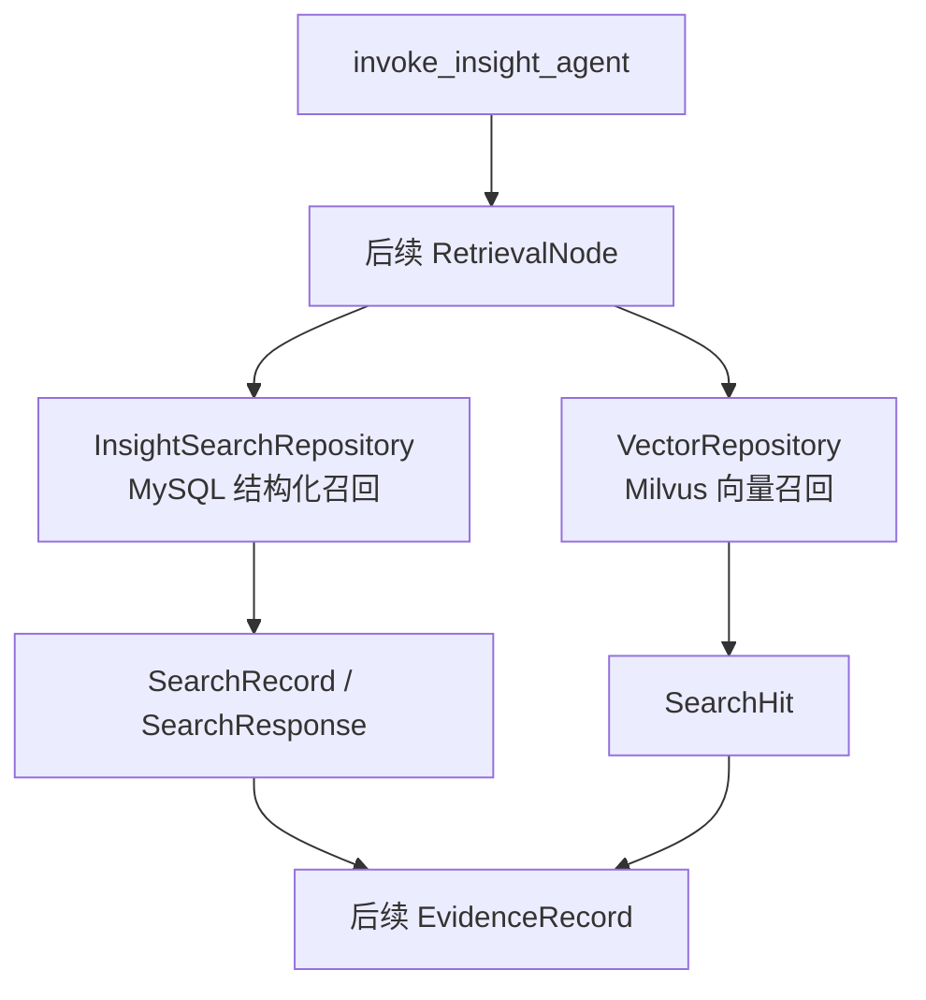

这一章讲的是图中的 `InsightSearchRepository` 和 `VectorRepository`，也就是 `InsightAgent` 后续的数据入口。

## 3. 平台字段映射：先统一表结构差异

项目目前支持两个平台的数据：

```text
douyin
weibo
```

每个平台都有内容表和评论表：

```text
douyin_aweme
douyin_aweme_comment
weibo_note
weibo_note_comment
```

问题在于，不同平台的字段名并不完全一致。

例如内容字段：

```text
douyin_aweme.title
weibo_note.content
```

点赞字段：

```text
douyin_aweme.liked_count
weibo_note.liked_count
douyin_aweme_comment.like_count
weibo_note_comment.comment_like_count
```

如果查询逻辑直接写死这些字段，代码会很快变成大量 `if platform == ...`。

所以当前项目先用 `platform_mappings.py` 做统一映射。

### 3.1 ContentTableMapping

内容表映射定义如下：

```python
@dataclass
class ContentTableMapping:
    table_name: str
    text_col: str
    published_at_col: str
    source_keyword_col: str
    engagement_cols: Mapping[str, str]
    search_fields: tuple[str, ...]
```

它表达的是：

```text
某个平台的内容表叫什么
正文在哪一列
发布时间在哪一列
来源关键词在哪一列
互动指标分别对应哪些列
哪些字段参与关键词搜索
```

例如抖音内容表：

```python
ContentTableMapping(
    table_name="douyin_aweme",
    text_col="title",
    published_at_col="create_time",
    source_keyword_col="source_keyword",
    engagement_cols={
        "likes": "liked_count",
        "comments": "comment_count",
        "shares": "share_count",
        "collects": "collected_count",
    },
    search_fields=("title", "source_keyword"),
)
```

这里有一个设计点：`engagement_cols` 的 key 是系统内部统一指标名，value 是数据库真实字段名。

```text
统一指标名 likes       -> 数据库列 liked_count
统一指标名 comments    -> 数据库列 comment_count
统一指标名 shares      -> 数据库列 share_count
统一指标名 collects    -> 数据库列 collected_count
```

后续热度计算、SQL 投影和结果映射都依赖这层统一命名。

### 3.2 CommentTableMapping

评论表映射比内容表少一个 `source_keyword_col`：

```python
@dataclass
class CommentTableMapping:
    table_name: str
    text_col: str
    published_at_col: str
    engagement_cols: Mapping[str, str]
    search_fields: tuple[str, ...]
```

原因是评论表通常没有来源关键词字段。评论数据更适合作为观点、情绪、反馈证据。

### 3.3 PlatformSearchMapping

一个平台的完整检索映射由两部分组成：

```python
@dataclass
class PlatformSearchMapping:
    platform_name: str
    content_mapping: ContentTableMapping
    comment_mapping: CommentTableMapping
```

然后通过 `PLATFORM_MAPPING` 注册：

```python
PLATFORM_MAPPING = {
    "douyin": PlatformSearchMapping(...),
    "weibo": PlatformSearchMapping(...),
}
```

这个注册表的意义是：查询层不再关心“抖音字段叫什么、微博字段叫什么”，只遍历平台映射。

### 3.4 映射层流程图

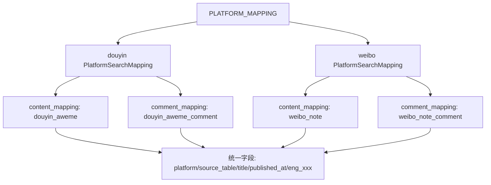

这一层是整个私域检索的基础。如果字段差异没有先被收口，后面的 SQLAlchemy 查询、热度计算和 Milvus 同步都会变得很难维护。

## 4. 什么这里不用 ORM 查询

进入 `db_search` 之前，需要先补一段 SQLAlchemy 基础知识。

SQLAlchemy 常见有两种使用方式：

```text
SQLAlchemy ORM
SQLAlchemy Core
```

当前 `db_search` 主要使用的是 **SQLAlchemy Core**。

### 4.1 ORM 是什么

ORM 的核心思想是：把数据库表映射成 Python 类，把表中的一行映射成 Python 对象。

例如：

```python
class WeiboNote(Base):
    __tablename__ = "weibo_note"

    id = mapped_column(Integer, primary_key=True)
    content = mapped_column(String)
```

查询时可以写：

```python
select(WeiboNote).where(WeiboNote.content.like("%高考%"))
```

ORM 适合这些场景：

- 业务实体比较稳定。
- 需要围绕对象做增删改查。
- 一张表对应一个核心模型。

### 4.2 Core 是什么

SQLAlchemy Core 更接近 SQL 表达式构造器。它不要求先定义 ORM 类，而是通过 `table()`、`column()`、`select()` 这类 API 动态构造 SQL。

当前项目中经常出现：

```python
select(...)
table(table_mapping.table_name)
column(field)
bindparam(...)
union_all(...)
```

这些都是 SQLAlchemy Core 风格。

Core 适合这些场景：

- 只读查询多。
- 查询结果需要统一投影。
- 多张表结构不完全一致。
- 经常要动态拼接字段和表名。
- 需要 `UNION ALL` 合并多个 SELECT。

当前 `db_search` 正是这种场景。

### 4.3  db_search 更适合 Core

`db_search` 要做的不是普通 CRUD，而是跨平台检索：

```text
douyin_aweme
douyin_aweme_comment
weibo_note
weibo_note_comment
    -> 统一投影
    -> UNION ALL
    -> SearchRecord
```

如果用 ORM，就需要定义四个模型，再写额外逻辑把四类对象转成同一个结果结构。

而 Core 可以直接构造统一 SELECT：

```text
select(
    literal(platform).label("platform"),
    literal(table_name).label("source_table"),
    column(text_col).label("title"),
    column(published_at_col).label("published_at"),
)
```

也就是说，Core 更适合当前这类“检索投影层”。

### 4.4 SQLAlchemy Core 基础 API

本章代码中最重要的几个 API 如下。

`select()` 用来构造查询：

```python
select(*content_search_columns(platform_mapping))
```

`table()` 用来声明查询来自哪张表：

```python
table(content_mapping.table_name)
```

`column()` 用字符串构造列对象：

```python
column(content_mapping.text_col)
```

`bindparam()` 用来绑定参数，避免把值直接拼到 SQL 字符串里：

```python
column(field).like(bindparam(f"term_{table_name}_{i}", search_term))
```

`or_()` 用来拼接多个条件：

```python
or_(*where_clauses)
```

`union_all()` 用来合并多条 SELECT：

```python
union_all(*select_queries)
```

`desc()` 用来倒序排序：

```python
order_by(desc(column("published_at")))
```

这些 API 的共同点是：它们不会立刻执行 SQL，而是构造一个 SQL 表达式对象。真正执行发生在：

```python
await conn.execute(statement)
```

### 4.5 SQLAlchemy Core 查询生命周期

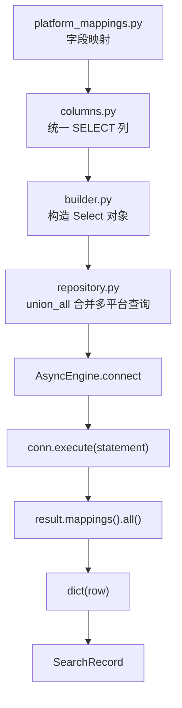

这张图要重点记住：`builder.py` 只是构造 SQL，`repository.py` 才执行 SQL。

## 5. 数据库连接

数据库连接统一放在 `engines/insight_agent/tools/connection.py`。

### 5.1 get_async_engine

核心函数是：

```python
def get_async_engine() -> AsyncEngine:
    global engine

    if engine is None:
        engine = create_async_engine(url=_build_db_url(), echo=True)
    return engine
```

这里使用了一个模块级变量 `engine` 做缓存。第一次调用时创建 `AsyncEngine`，后续复用同一个 engine。

`AsyncEngine` 是 SQLAlchemy 异步数据库引擎，适合在 FastAPI 和异步任务中使用。

### 5.2 URL.create

数据库连接地址通过 `URL.create()` 构造：

```python
URL.create(
    drivername="mysql+aiomysql",
    username=config.get_settings().DB_USER,
    password=config.get_settings().DB_PASSWORD,
    host=config.get_settings().DB_HOST,
    port=config.get_settings().DB_PORT,
    database=config.get_settings().DB_NAME,
)
```

这里的 `mysql+aiomysql` 表示：

```text
数据库类型: MySQL
异步驱动: aiomysql
```

所以后续可以写：

```python
async with engine.connect() as conn:
    result = await conn.execute(statement)
```

### 5.3 get_session_factory

同一个文件里还有：

```python
def get_session_factory() -> async_sessionmaker[AsyncSession]:
    global _session_factory
    if _session_factory is None:
        _session_factory = async_sessionmaker(get_async_engine(), expire_on_commit=False)
    return _session_factory
```

这个函数主要给 `vector_search/source/reader.py` 使用。因为同步 Milvus 时使用了 ORM 模型，需要通过 `AsyncSession` 查询原始表数据。

也就是说：

```text
db_search 使用 AsyncEngine + Core statement
vector_search/source 使用 AsyncSession + ORM model
```

同一个数据库连接底座，服务了两种不同的访问方式。

## 6. columns.py：统一 SELECT 返回列

`db_search/queries/columns.py` 负责定义“查询结果要返回哪些列”。

它不执行查询，也不决定查哪张表。它只负责把不同平台表字段投影成统一字段。

### 6.1 内容表投影

内容表投影函数是：

```python
def content_search_columns(platform_mapping: PlatformSearchMapping) -> list[ColumnElement]:
    content_mapping = platform_mapping.content_mapping
    return [
        literal(platform_mapping.platform_name).label("platform"),
        literal(content_mapping.table_name).label("source_table"),
        column("id").label("mysql_pk"),
        column(content_mapping.text_col).label("title"),
        column(content_mapping.published_at_col).label("published_at"),
        column(content_mapping.source_keyword_col).label("source_keyword"),
    ]
```

这里有三个重要动作。

第一，用 `literal()` 补充平台名和来源表：

```python
literal(platform_mapping.platform_name).label("platform")
literal(content_mapping.table_name).label("source_table")
```

数据库原表中可能没有 `platform` 字段，但统一结果需要知道这条数据来自哪个平台。

第二，用 `.label()` 统一字段名：

```python
column(content_mapping.text_col).label("title")
```

抖音的正文列叫 `title`，微博的正文列叫 `content`，但是查询结果统一叫 `title`。

第三，保留原始主键：

```python
column("id").label("mysql_pk")
```

后续映射 `SearchRecord` 时，需要知道这条记录在 MySQL 原表中的主键。

### 6.2 评论表投影

评论表投影函数是：

```python
def comment_search_columns(platform_mapping: PlatformSearchMapping) -> list[ColumnElement]:
    comment_mapping = platform_mapping.comment_mapping
    return [
        literal(platform_mapping.platform_name).label("platform"),
        literal(comment_mapping.table_name).label("source_table"),
        column("id").label("mysql_pk"),
        column(comment_mapping.text_col).label("title"),
        column(comment_mapping.published_at_col).label("published_at"),
        literal_column("NULL").label("source_keyword"),
    ]
```

注意评论表没有 `source_keyword`，所以这里用：

```python
literal_column("NULL").label("source_keyword")
```

为什么必须补这个字段？因为后面内容表和评论表会 `UNION ALL`。参与 UNION 的 SELECT 列数量和列顺序必须一致。

### 6.3 互动指标投影

互动指标投影函数是：

```python
def engagement_metric_columns(engagement_column_map: Mapping[str, str]) -> list[ColumnElement]:
    ...
```

它会把不同平台的互动字段统一成：

```text
eng_likes
eng_comments
eng_shares
eng_collects
eng_replies
```

例如：

```text
douyin_aweme.liked_count          -> eng_likes
weibo_note.shared_count           -> eng_shares
weibo_note_comment.sub_comment_count -> eng_replies
```

如果某张表没有某个指标，则补一个 0：

```python
literal_column("0")
```

这样后续结果映射时不用关心“这张表有没有收藏数、有没有转发数”。

### 6.4 safe_number_column

互动指标可能为空，也可能需要转成数值参与计算，所以有：

```python
def safe_number_column(col_name: str) -> ColumnElement:
    return func.coalesce(sa_cast(column(col_name), DECIMAL), 0.0)
```

这里包含三个 SQL 操作：

```text
column(col_name)       字符串列名转 SQLAlchemy 列对象
cast(..., DECIMAL)     转成可计算的数值类型
coalesce(..., 0.0)     如果为 NULL，则按 0 处理
```

这对热度计算很重要。否则任何一个指标为 NULL，都可能导致整体热度表达式异常或结果为空。

## 7. builder.py：构造三类数据库检索语句

`queries/builder.py` 负责构造 SQLAlchemy `Select` 对象。

当前有三类查询：

```text
build_content_search_query
build_comment_search_query
build_hotness_query
```

它们分别服务于：

```text
keyword_recall
comment_recall
hot_recall
```

### 7.1 内容关键词检索

内容检索函数是：

```python
def build_content_search_query(
    platform_mapping: PlatformSearchMapping,
    search_term: str,
    limit: int,
) -> Select:
    ...
```

它先读取内容表映射：

```python
content_mapping = platform_mapping.content_mapping
```

然后根据 `search_fields` 动态构造模糊匹配条件：

```python
where_clauses = [
    column(field).like(bindparam(f"term_{content_mapping.table_name}_{i}", search_term))
    for i, field in enumerate(content_mapping.search_fields)
]
```

例如抖音内容表的 `search_fields` 是：

```python
("title", "source_keyword")
```

那么会构造出类似：

```sql
title LIKE :term_douyin_aweme_0
OR source_keyword LIKE :term_douyin_aweme_1
```

最后组装 SELECT：

```python
select(
    *content_search_columns(platform_mapping),
    *engagement_metric_columns(content_mapping.engagement_cols),
)
.select_from(table(content_mapping.table_name))
.where(or_(*where_clauses))
.order_by(column("id"))
.limit(limit)
```

这里要注意：这个函数只构造“单个平台内容表”的查询。跨平台合并发生在 `repository.py`。

### 7.2 评论关键词检索

评论检索与内容检索类似，只是换成评论表映射：

```python
comment_mapping = platform_mapping.comment_mapping
```

评论检索服务的是观点和情绪线索：

```text
用户质疑
用户支持
用户吐槽
群体态度
具体反馈
```

所以 `comment_recall` 会单独成为一个召回通道，而不是混在 `keyword_recall` 里面。

### 7.3 热度召回

热度召回函数是：

```python
def build_hotness_query(
    platform_mapping: PlatformSearchMapping,
    time_period: HotRecallPeriod,
    limit: int,
) -> Select:
    ...
```

当前的设计是：`hot_recall` 查询两个平台四张表，也就是内容表和评论表都参与热度召回。

流程如下：

```text
计算时间窗口 start_time
遍历当前平台的内容表和评论表
为每张表构造时间过滤条件
为每张表构造热度分表达式
每张表按热度取 limit 条
当前平台内两张表 UNION ALL
```

对应代码结构：

```python
for table_mapping, search_columns in [
    (platform_mapping.content_mapping, content_search_columns),
    (platform_mapping.comment_mapping, comment_search_columns),
]:
    recent_record_condition = ...
    hot_score_expr = hot_score_metric_column(table_mapping)
    table_hot_query = select(...)
    platform_hot_queries.append(table_hot_query)

return union_all(*platform_hot_queries)
```

### 7.4 热度召回流程图

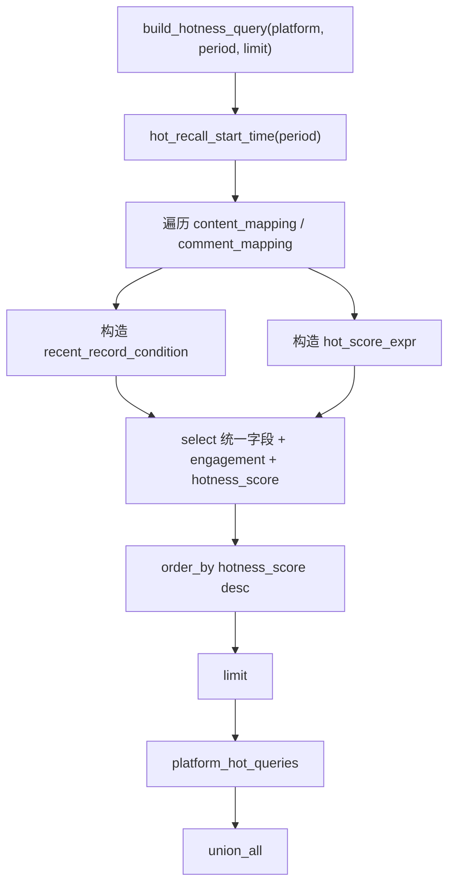

这段代码是本章 SQLAlchemy Core 最集中的例子。

## 8. hotness.py：热度规则

`db_search/hotness.py` 放的是热度相关规则。

### 8.1 HotRecallPeriod

```python
HotRecallPeriod = Literal["24h", "week", "year"]
```

这限制了热度召回的时间窗口只能是：

```text
24h
week
year
```

比直接传字符串更清晰，也方便 IDE 和类型检查提示。

### 8.2 ENGAGEMENT_METRICS

```python
ENGAGEMENT_METRICS = {
    "likes": "like",
    "comments": "comment",
    "shares": "share",
    "collects": "collect",
    "replies": "reply",
}
```

这里记录了系统统一互动指标。

当前 `columns.py` 会遍历它，为查询结果生成统一的 `eng_xxx` 列。

### 8.3 HotScoreWeights

```python
@dataclass
class HotScoreWeights:
    shares: float = 5.0
    comments: float = 4.0
    reply: float = 3.0
    collects: float = 2.0
    likes: float = 1.0
```

权重表达的是不同互动行为对热度的影响。

当前权重大致表示：

```text
分享 > 评论 > 回复 > 收藏 > 点赞
```

这很符合舆情传播场景：点赞表示轻量互动，分享和评论更能体现传播与讨论热度。

### 8.4 hot_recall_start_time

```python
def hot_recall_start_time(time_period: HotRecallPeriod) -> datetime:
    days_by_period = {"24h": 1, "week": 7, "year": 365}
    return datetime.now() - timedelta(days=days_by_period[time_period])
```

它把时间窗口转换成查询起始时间。

例如：

```text
time_period = "week"
    -> 从当前时间往前推 7 天
```

## 9. repository.py：三通道召回入口

`db_search/repository.py` 是数据库检索的对外入口。

它向外暴露三个方法：

```text
keyword_recall
comment_recall
hot_recall
```

这三个方法都返回 `SearchResponse`。

### 9.1 keyword_recall：主题内容召回

`keyword_recall` 当前只查询两个平台的内容表：

```text
douyin_aweme
weibo_note
```

它不查询评论表。这里不是为了简化而少查评论表，而是由业务目标决定的。

`keyword_recall` 的目标是先找到与主题直接相关的主内容，例如微博正文、抖音视频标题、采集时的来源关键词。这些内容更适合作为事件背景、事实进展和传播主体的基础材料。

评论表承担的是另一类任务：捕捉用户观点、情绪反馈、争议态度和深层原因。它已经由 `comment_recall` 单独负责。如果 `keyword_recall` 也把评论表查进来，同一批评论就会同时进入关键词通道和评论通道，容易造成两个问题：

- 主题内容通道里混入大量用户评论，影响对主内容的覆盖。
- 评论证据被重复召回，削弱 `comment_recall` 作为观点/情绪通道的解释性。

所以从业务分工看，`keyword_recall` 查询内容表就够了；评论表应该交给 `comment_recall` 负责。

所以当前边界是：

```text
keyword_recall = 找主题相关的主内容
comment_recall = 找用户观点和情绪线索
hot_recall = 找最近时间窗口内高互动内容/评论
```

### 9.2 comment_recall：评论观点召回

`comment_recall` 查询两个平台的评论表：

```text
douyin_aweme_comment
weibo_note_comment
```

它服务于后续这些分析维度：

```text
情绪观点
深层原因
群体反馈
争议焦点
```

评论表不一定代表传播热度最高，但往往代表真实用户态度。后续 LLM 写“情绪和观点”章节时，评论证据会很重要。

### 9.3 hot_recall：热度召回

`hot_recall` 查询两平台四张表：

```text
douyin_aweme
douyin_aweme_comment
weibo_note
weibo_note_comment
```

它不依赖关键词，而是按时间窗口和互动指标召回高热数据。

这给后续分析也提供另一种视角：

```text
即使某条内容没有命中当前关键词，只要它在近期有高互动，也可能值得进入证据池。
```

这也是多路召回的意义：不同通道从不同角度补充证据。

### 9.4 三路召回关系图

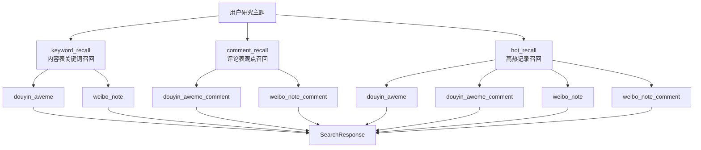

## 10. _execute_search：统一执行模板

三个召回方法最后都会调用：

```python
await self._execute_search(
    channel="keyword_recall",
    statement=statement,
    record_mapper=db_row_to_search_record,
)
```

`_execute_search()` 的职责是：

```text
执行 SQL
捕获必要异常
把 row 映射成 SearchRecord
封装 SearchResponse
```

### 10.1 _fetch_rows

真正执行 SQL 的地方是：

```python
async with engine.connect() as conn:
    result = await conn.execute(select_statement)
    rows = result.mappings().all()
    return [dict(row) for row in rows]
```

这里的 `result.mappings().all()` 很重要。

如果不用 `mappings()`，SQLAlchemy 返回的是 Row 对象；使用 `mappings()` 后，可以按字段名读取：

```python
row["platform"]
row["source_table"]
row["title"]
```

再转成普通字典，方便后续 mapper 处理。

### 10.2 SearchResponse

数据库检索统一返回：

```python
@dataclass
class SearchResponse:
    retrieval_channel: str
    search_results: list[SearchRecord]
    search_results_count: int
    search_error_message: Optional[str] = None
```

它保留了当前召回通道：

```text
keyword_recall
comment_recall
hot_recall
```

后续进入证据池时，通道信息会影响排序、解释。

## 11. db_row_to_search_record：统一行映射

`record_mapper.py` 把数据库行转换成 `SearchRecord`。

核心步骤是：

```text
读取 platform
从 PLATFORM_MAPPING 找平台配置
根据 source_table 判断是否评论表
选择对应 engagement_cols
组装 SearchRecord
```

### 11.1 为什么根据 source_table 判断

同一个平台有内容表和评论表，两类表的互动字段不一样。

例如抖音：

```text
内容表:
    liked_count
    comment_count
    share_count
    collected_count

评论表:
    like_count
    sub_comment_count
```

所以 mapper 需要判断：

```python
is_comment = result_row.get("source_table") == platform_mapping.comment_mapping.table_name
```

然后选择：

```python
platform_mapping.comment_mapping.engagement_cols
```

或：

```python
platform_mapping.content_mapping.engagement_cols
```

### 11.2 映射流程图

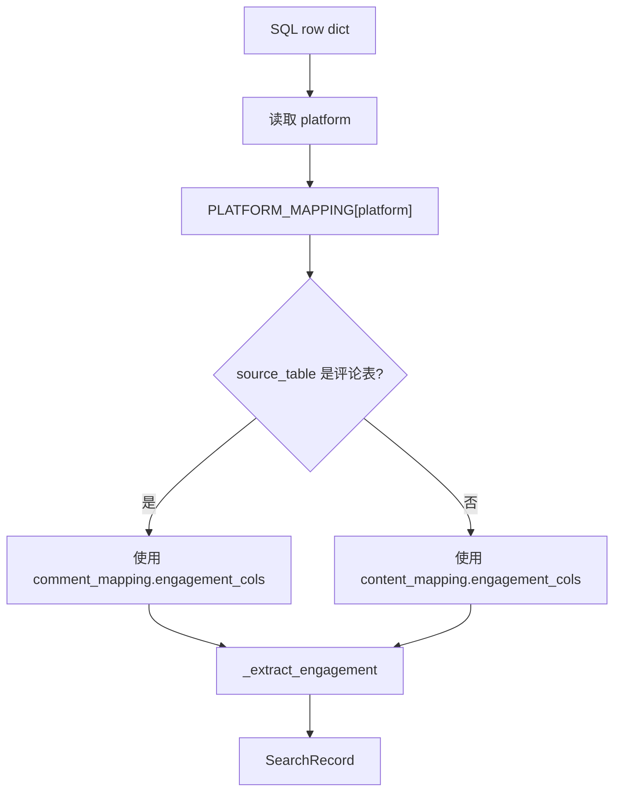

这种写法让 `keyword_recall`、`comment_recall`、`hot_recall` 都可以共用一个 mapper。


## 13. 为什么需要向量检索Milvus？

MySQL 结构化检索主要依赖关键词

例如：

```text
LIKE "%高考%"
```

它的问题是：只能命中表面文字。

如果用户搜索：

```text
高考志愿填报焦虑
```

数据库里可能出现的是：

```text
选专业太难了
家长和孩子意见冲突
分数出来之后很迷茫
```

这些内容和主题语义相关，但不一定包含“高考志愿填报焦虑”这些字面关键词。

这就是向量检索的价值：用语义相似度补充关键词检索。

### 13.1 Milvus 是什么

Milvus 是向量数据库。它主要解决的问题是：

```text
给定一个向量，在大量向量中快速找出最相似的 Top K。
```

在当前项目中：

```text
一条微博/抖音内容或评论
    -> BGE-M3 编码
    -> dense_vector / sparse_vector
    -> 存入 Milvus

用户 query
    -> BGE-M3 编码
    -> dense_vector / sparse_vector
    -> Milvus hybrid_search
    -> SearchHit
```

### 13.2 Collection

Milvus 中的 Collection 类似关系型数据库中的表。

当前项目的 collection 名称来自配置：

```python
settings.MILVUS_INSIGHT_COLLECTION
```

一个 collection 中会保存：

```text
标量字段:
    doc_id
    platform
    source_table
    mysql_pk
    record_type
    content
    published_at
    source_keyword
    like_count / comment_count / ...

向量字段:
    dense_vector
    sparse_vector
```

### 13.3 标量字段与向量字段

标量字段用于保存业务信息：

```text
platform = weibo
source_table = weibo_note
content = ...
```

向量字段用于相似度检索：

```text
dense_vector  稠密语义向量
sparse_vector 稀疏词项向量
```

Milvus 检索时会根据向量字段建立索引，提高相似搜索速度。

## 14. dense vector 与 sparse vector

当前使用 BGE-M3 同时生成两类向量。

### 14.1 dense_vector

dense vector 是稠密向量。

它通常是一个固定长度的浮点数组：

```text
[0.012, -0.083, 0.442, ...]
```

BGE-M3 默认维度是 1024，所以配置中有：

```python
INSIGHT_DENSE_DIM = 1024
```

dense vector 擅长表达语义相似。

例如：

```text
“志愿填报焦虑”
“选专业很迷茫”
```

字面不同，但语义接近，dense vector 可能能召回。

### 14.2 sparse_vector

sparse vector 是稀疏向量。

它不是完整数组，而是类似字典：

```python
{
    101: 0.7,
    202: 1.2,
}
```

key 可以理解为词项或 token id，value 是权重。

sparse vector 更接近关键词匹配和词项权重，适合补充 dense vector 的不足。

例如某些专有名词、事件名、平台词，sparse vector 往往更敏感。

### 14.3 为什么要混合

只用 dense vector：

```text
语义召回好，但可能弱化精确词匹配。
```

只用 sparse vector：

```text
精确词召回好，但语义泛化能力弱。
```

混合检索的目标是：

```text
dense vector 负责语义相似
sparse vector 负责关键词/词项匹配
Milvus hybrid_search 合并两路结果
```

对应流程：

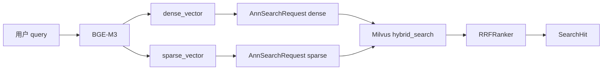

## 15. schemas.py：Collection Schema

`vector_search/schemas.py` 定义 Milvus collection 的字段和索引。

### 15.1 输出字段

```python
MILVUS_OUTPUT_FIELDS = [
    "doc_id", "platform", "source_table", "mysql_pk", "record_type",
    "content", "published_at", "source_keyword",
    "like_count", "comment_count", "share_count", "collect_count", "reply_count",
]
```

这些字段会在检索命中时返回给业务层。

### 15.2 build_collection_schema

schema 中先定义业务字段：

```python
schema.add_field("doc_id", DataType.VARCHAR, is_primary=True, max_length=256)
schema.add_field("platform", DataType.VARCHAR, max_length=32)
schema.add_field("source_table", DataType.VARCHAR, max_length=64)
schema.add_field("mysql_pk", DataType.INT64)
schema.add_field("record_type", DataType.VARCHAR, max_length=32)
schema.add_field("content", DataType.VARCHAR, max_length=65535)
schema.add_field("published_at", DataType.VARCHAR, max_length=64)
schema.add_field("source_keyword", DataType.VARCHAR, max_length=512)
```

然后定义互动字段：

```python
like_count
comment_count
share_count
collect_count
reply_count
```

最后定义向量字段：

```python
schema.add_field("dense_vector", DataType.FLOAT_VECTOR, dim=dense_dim)
schema.add_field("sparse_vector", DataType.SPARSE_FLOAT_VECTOR)
```

### 15.3 build_index_params

索引定义如下：

```python
index_params.add_index(
    field_name="dense_vector",
    index_type="AUTOINDEX",
    metric_type="COSINE",
)
```

dense vector 使用 `COSINE`，即余弦相似度。

sparse vector 使用：

```python
index_params.add_index(
    field_name="sparse_vector",
    index_type="SPARSE_INVERTED_INDEX",
    metric_type="IP",
)
```

sparse vector 使用倒排索引和内积相似度。


## 16. embedder.py：BGE-M3 编码器

`vector_search/embedder.py` 定义两个对象：

```python
@dataclass(frozen=True)
class VectorEmbedding:
    dense_vector: list[float]
    sparse_vector: dict[int, float]
```

和：

```python
class BgeM3Embedder:
    ...
```

### 16.1 cached_property

模型加载使用：

```python
@cached_property
def _model(self):
    return BGEM3FlagModel(self.model_name, **kwargs)
```

`cached_property` 的作用是：第一次访问 `_model` 时加载模型，后续访问复用已经加载好的模型。

这很重要，因为 embedding 模型加载通常比较慢，不能每次编码都重新加载。

### 16.2 encode_documents

当前编码逻辑是：

```python
output = self._model.encode(
    items,
    return_dense=True,
    return_sparse=True
)
```

这里明确要求 BGE-M3 返回：

```text
dense_vecs
lexical_weights
```

然后组装成：

```python
VectorEmbedding(
    dense_vector=list(map(float, dense_vector)),
    sparse_vector=_normalize_sparse_vector(sparse_vector),
)
```

### 16.3 lexical_weights 到 sparse_vector

BGE-M3 返回的稀疏信息叫 `lexical_weights`。

项目中用 `_normalize_sparse_vector()` 做清洗：

```python
def _normalize_sparse_vector(sparse_vector: dict) -> dict[int, float]:
    return {
        int(token_id): float(weight)
        for token_id, weight in sparse_vector.items()
        if float(weight or 0) > 0
    }
```

这一步保证：

```text
token_id 是 int
weight 是 float
权重大于 0
```

最后这个 dict 可以写入 Milvus 的 `SPARSE_FLOAT_VECTOR` 字段。

## 17. search_results.py：向量文档和命中结果

向量同步时，MySQL 中的一条内容或评论会被转换成 `VectorDocument`：

```python
@dataclass
class VectorDocument:
    doc_id: str
    platform: str
    source_table: str
    mysql_pk: int
    record_type: str
    content: str
    published_at: str
    source_keyword: str
    ...
```

### 17.1 doc_id

`doc_id` 是 Milvus 中的主键。

当前生成规则在 `source/register.py` 中：

```python
doc_id=f"{self.platform}:{self.mapping_config.table_name}:{row.id}"
```

例如：

```text
weibo:weibo_note:123
douyin:douyin_aweme_comment:456
```

这个 ID 具有稳定性。只要平台、表名、MySQL 主键不变，同一条数据同步多次仍然是同一个 doc。

### 17.2 to_milvus_record

`to_milvus_record()` 把业务数据和向量合并成 Milvus 可写入的 dict：

```python
def to_milvus_record(
    self,
    dense_vector: list[float],
    sparse_vector: dict[int, float],
) -> dict[str, Any]:
    return {
        ...,
        "dense_vector": dense_vector,
        "sparse_vector": sparse_vector,
    }
```

这一步是插入链路的关键：如果这里不写 `sparse_vector`，Milvus 中就只有稠密向量，后续混合检索的 sparse 分支就无法真正工作。

## 18. source/models.py：同步用 ORM 模型

前面讲 `db_search` 时说过，MySQL 检索使用 SQLAlchemy Core。

但 Milvus 同步这里使用 ORM 模型：

```python
class DouyinAweme(VectorSourceBase):
    __tablename__ = "douyin_aweme"

    id: Mapped[int] = mapped_column(Integer, primary_key=True)
    title: Mapped[str | None] = mapped_column(String)
    ...
```

为什么这里可以用 ORM？

因为同步场景是：

```text
按表读取原始数据
一行 ORM 对象 -> 一个 VectorDocument
```

它不像 `db_search` 那样要动态 UNION 多张表，也不需要统一 SELECT 投影。每张表顺序读取即可，所以 ORM 更直观。

### 18.1 DeclarativeBase

```python
class VectorSourceBase(DeclarativeBase):
    pass
```

这是 SQLAlchemy 2.x 的声明式基类。后续 ORM 模型都继承它。

### 18.2 Mapped 与 mapped_column

```python
id: Mapped[int] = mapped_column(Integer, primary_key=True)
```

`Mapped[int]` 表示 ORM 属性的 Python 类型。  
`mapped_column(Integer, primary_key=True)` 表示数据库列定义。

这是 SQLAlchemy 2.x 推荐写法。

## 19. source/register.py：同步注册表

`source/register.py` 负责把 ORM 模型和平台映射绑定起来。

### 19.1 VectorSyncMapper

核心类是：

```python
@dataclass
class VectorSyncMapper:
    model: type[VectorSourceBase]
    mapping_config: ContentTableMapping | CommentTableMapping
    platform: str
    record_type: str
```

它描述一张表如何同步到 Milvus：

```text
model          ORM 模型
mapping_config 字段映射
platform       平台名
record_type    post/comment
```

### 19.2 VECTOR_SYNC_REGISTRY

当前注册四张表：

```python
VECTOR_SYNC_REGISTRY = (
    VectorSyncMapper(DouyinAweme, PLATFORM_MAPPING["douyin"].content_mapping, "douyin", "post"),
    VectorSyncMapper(DouyinAwemeComment, PLATFORM_MAPPING["douyin"].comment_mapping, "douyin", "comment"),
    VectorSyncMapper(WeiboNote, PLATFORM_MAPPING["weibo"].content_mapping, "weibo", "post"),
    VectorSyncMapper(WeiboNoteComment, PLATFORM_MAPPING["weibo"].comment_mapping, "weibo", "comment"),
)
```

这和 `db_search` 的平台映射保持一致。

### 19.3 to_document

`to_document()` 把 ORM row 转成 `VectorDocument`：

```python
return VectorDocument(
    doc_id=f"{self.platform}:{self.mapping_config.table_name}:{row.id}",
    platform=self.platform,
    source_table=self.mapping_config.table_name,
    mysql_pk=int(row.id),
    record_type=self.record_type,
    content=str(_read_attr(row, self.mapping_config.text_col)),
    published_at=str(_read_attr(row, self.mapping_config.published_at_col)),
    source_keyword=_source_keyword(self.mapping_config, row),
    **_extract_engagement(self.mapping_config, row),
)
```

这里把平台映射再次复用起来，避免同步链路重新写一套字段规则。

### 19.4 同步注册流程图

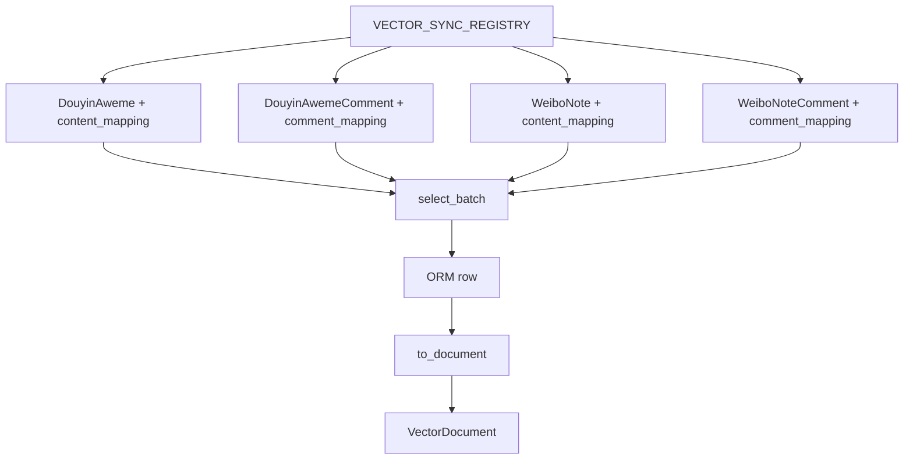

## 20.  MySQL数据 同步到 Milvus

向量库不是凭空有数据的。必须先把 MySQL 中的内容同步进去。

### 20.1 SourceDocumentReader

`SourceDocumentReader.iter_documents()` 会遍历 `VECTOR_SYNC_REGISTRY`：

```python
for mapper in self.registry:
    offset = 0
    while True:
        rows = await self._fetch_table_rows(mapper, batch_size, offset)
        if not rows:
            break
        raw_docs = [mapper.to_document(row) for row in rows]
        clean_docs = [doc for doc in raw_docs if doc.content.strip()]
        if clean_docs:
            yield clean_docs
        offset += batch_size
```

这段逻辑做了三件事：

```text
按注册表逐张表同步
每张表分页读取
过滤掉 content 为空的记录
```

### 20.2 select_batch

每个 mapper 负责构造自己的分页查询：

```python
return select(self.model).order_by(getattr(self.model, "id")).limit(limit).offset(offset)
```

这里使用 ORM 的 `select(self.model)`，返回的是 ORM 对象。

### 20.3 sync_data

同步入口是：

```python
async def sync_data(drop_existing: bool = False, batch_size: int | None = None) -> int:
    milvus_repository = VectorRepository()
    source_reader = SourceDocumentReader()
    batch_size = batch_size or config.get_settings().INSIGHT_SYNC_BATCH_SIZE

    milvus_repository.ensure_collection(drop_existing=drop_existing)

    total = 0
    async for documents in source_reader.iter_documents(batch_size=batch_size):
        count = milvus_repository.upsert_documents(documents)
        total += count
```

它的完整流程是：

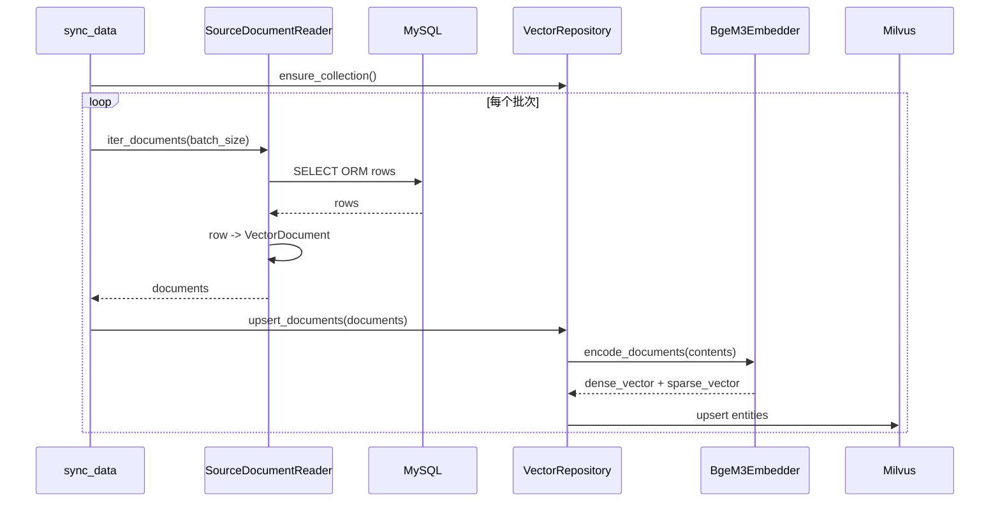

## 21. VectorRepository：集合管理、写入和搜索

`vector_search/repository.py` 是 Milvus 的对外入口。

它提供三个核心能力：

```text
ensure_collection
upsert_documents
search
```

### 21.1 ensure_collection

`ensure_collection()` 保证 Milvus collection 存在：

```python
if drop_existing and self.client.has_collection(self.collection_name):
    self.client.drop_collection(self.collection_name)

if self.client.has_collection(self.collection_name):
    return

schema = build_collection_schema(...)
index_params = build_index_params(...)
self.client.create_collection(...)
```

如果 `drop_existing=True`，会删除重建。

### 21.2 upsert_documents

`upsert_documents()` 做四步：

```text
确保 collection 存在
用 BGE-M3 编码所有文档 content
把 VectorDocument + VectorEmbedding 合并成 Milvus record
调用 client.upsert()
```

关键代码是：

```python
embeddings = self.embedder.encode_documents([doc.content for doc in documents])

entities = [
    doc.to_milvus_record(
        dense_vector=embedding.dense_vector,
        sparse_vector=embedding.sparse_vector,
    )
    for doc, embedding in zip(documents, embeddings)
    if embedding.dense_vector and embedding.sparse_vector
]
```

这里强调一点：`dense_vector` 和 `sparse_vector` 是一起写入 Milvus 的。

### 21.3 search

搜索入口是：

```python
def search(self, query: str, limit: int, filter_expr: str | None = None) -> list[SearchHit]:
    self.ensure_collection()

    query_embedding = self.embedder.encode_query(query)
    if not query_embedding or not query_embedding.dense_vector or not query_embedding.sparse_vector:
        return []

    return self._hybrid_search(query_embedding, limit, filter_expr)
```

这里和插入链路保持一致：查询也生成 dense 和 sparse 两种向量。

## 22. _hybrid_search：混合检索

`_hybrid_search()` 是 Milvus 检索核心。

### 22.1 dense_request

稠密检索请求：

```python
dense_request = AnnSearchRequest(
    data=[query_embedding.dense_vector],
    anns_field="dense_vector",
    param={"metric_type": "COSINE"},
    limit=limit,
    **request_filter,
)
```

含义是：

```text
用 query 的 dense_vector
去 collection 的 dense_vector 字段中查
相似度度量使用 COSINE
```

### 22.2 sparse_request

稀疏检索请求：

```python
sparse_request = AnnSearchRequest(
    data=[query_embedding.sparse_vector],
    anns_field="sparse_vector",
    param={"metric_type": "IP"},
    limit=limit,
    **request_filter,
)
```

含义是：

```text
用 query 的 sparse_vector
去 collection 的 sparse_vector 字段中查
相似度度量使用 IP
```

### 22.3 hybrid_search

最终调用：

```python
result = self.client.hybrid_search(
    collection_name=self.collection_name,
    reqs=[dense_request, sparse_request],
    ranker=RRFRanker(),
    limit=limit,
    output_fields=MILVUS_OUTPUT_FIELDS,
)
```

这里的 `reqs` 有两路：

```text
dense_request
sparse_request
```

Milvus 会分别执行两路搜索，再由 `RRFRanker` 融合排序。

### 22.4 RRFRanker 是什么

RRF 是 Reciprocal Rank Fusion，倒数排名融合。

它关注的是“某条记录在不同检索结果中的排名”，而不是直接比较两种相似度分数。

这样做的好处是：

```text
dense 和 sparse 的分数尺度不一样
RRF 可以基于排名融合，避免分数不可比的问题
```

简单理解：

```text
如果一条记录在 dense 检索中排名靠前，
并且在 sparse 检索中也排名靠前，
那么它最终排名会更靠前。
```

### 22.5 混合检索时序图

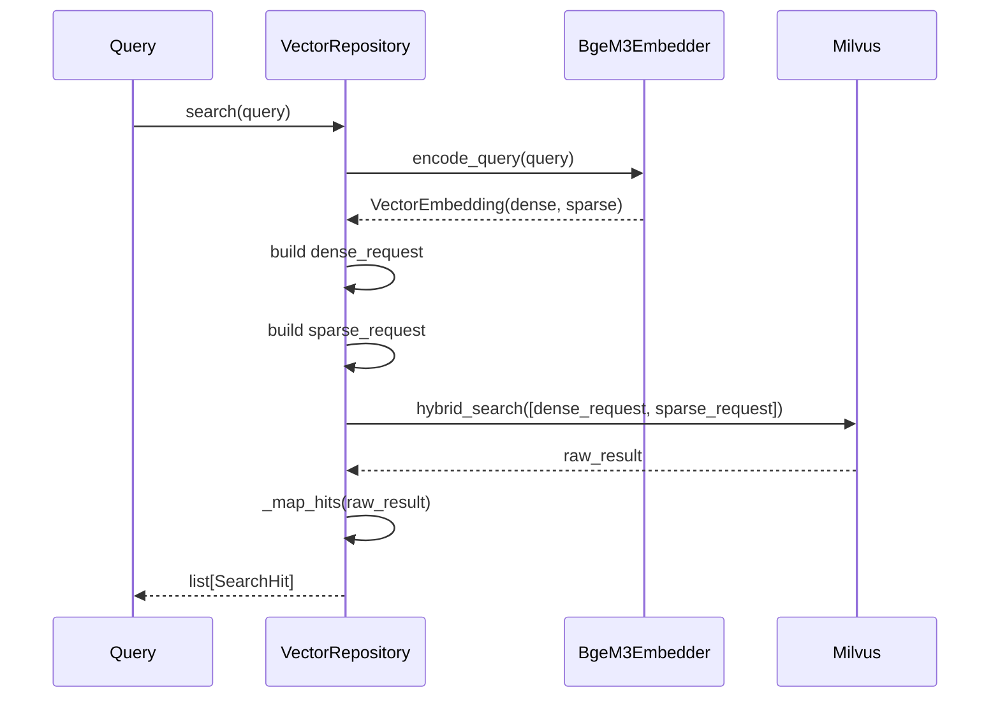

## 23. SearchHit：向量命中结果

Milvus 返回的是原始命中结果。项目会映射成：

```python
@dataclass(frozen=True)
class SearchHit:
    doc_id: str
    score: float
    channel: str
    entity: dict[str, Any]
```

当前 channel 固定为：

```text
semantic_recall
```

这是为了后续和 MySQL 的通道统一：

```text
keyword_recall
comment_recall
hot_recall
semantic_recall
```

后续 `EvidenceRecordMapper` 会把 `SearchHit` 转成统一证据。

## 24. MySQL 与 Milvus 两条线如何衔接

到这里，本章已经有两条数据路径。

第一条是在线查询路径：

```text
用户 query
    -> MySQL keyword/comment/hot recall
    -> SearchResponse
```

第二条是向量检索路径：

```text
同步阶段:
    MySQL rows -> VectorDocument -> BGE-M3 -> Milvus

查询阶段:
    query -> BGE-M3 -> Milvus hybrid_search -> SearchHit
```

整体关系如下：


这张图是本章的核心复盘图.**注意hot_recall是四张表的关联**

## 25. 为什么不把工具写入Agent的里？

后续 `InsightAgent` 会有很多节点：

```text
retrieval
rank
cluster
plan
section_assign
summarize
format_report
persist_report
```

如果把 MySQL 查询、Milvus 查询、同步逻辑都塞进 Agent 节点，节点会变得非常重。

当前拆成工具层有三个好处。

第一，职责清晰：

```text
db_search 只负责 MySQL 召回
vector_search 只负责 Milvus 召回
Agent 节点只负责编排业务步骤
```

第二，方便测试：

```text
可以单独测试 db_search
可以单独测试 vector_search
不用启动完整 Agent 图
```

第三，方便替换：

```text
以后可以调整热度权重
可以替换 embedding 模型
可以调整 Milvus schema
不影响编排层入口
```

检索细节不应该散落在图节点里，而应该由专门的 repository/service 承载。


## 26. 本章完整流程图

当前章先讲底层工具，不急着进入 `retrieval_service`。先理解“每条检索线怎么工作”，再理解“多条线如何合并”。

最后用一张图把本章串起来：

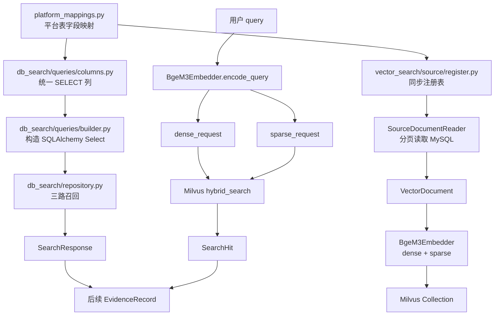

这张图体现了本章的主线：平台映射是基础，MySQL 召回和 Milvus 召回是两路召回，后续它们都会进入统一证据层。

## 27. 本章小结

本章完成了 `InsightAgent` 的私域检索底座。

当前已经具备：

```text
平台字段映射
SQLAlchemy Core 动态查询
keyword_recall 内容召回
comment_recall 评论召回
hot_recall 热度召回
SearchRecord / SearchResponse 统一返回结构
MySQL 到 Milvus 的同步模型
BGE-M3 dense/sparse 编码
Milvus Collection schema 和索引
Milvus hybrid_search 混合检索
SearchHit 向量命中结果
```

这一步的意义不是“让 LLM 直接生成报告”，而是先让 `InsightAgent` 拥有可靠的数据来源。

后续最自然的下一步是实现 `retrieval_service`：

```text
用户 query
    -> 构造 query plan
    -> 并发执行 keyword/comment/hot
    -> 可选执行 vector_search
    -> 合并成 EvidenceRecord
```

等这一层完成后，`RetrievalNode` 才能真正拿到全局证据池，后面的排序、聚类、章节分配和 LLM 写作才有材料可以使用。
