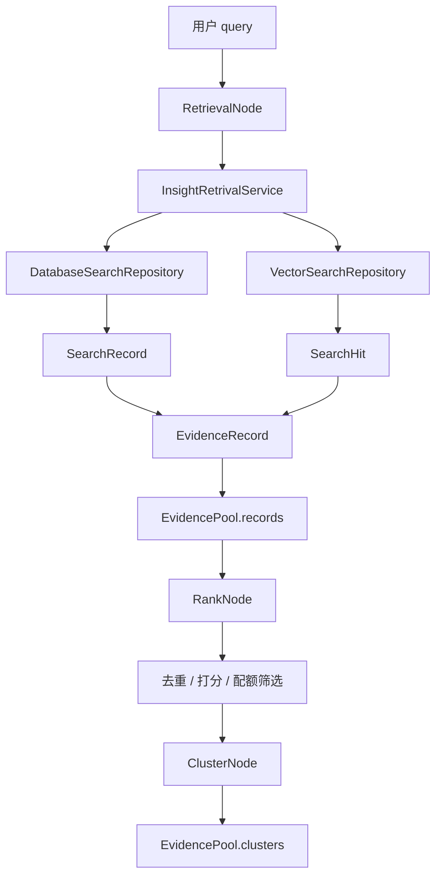
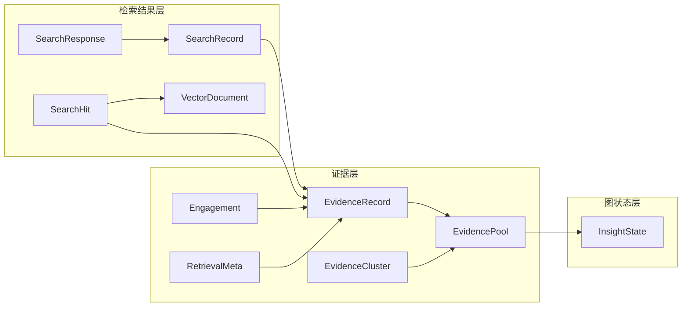
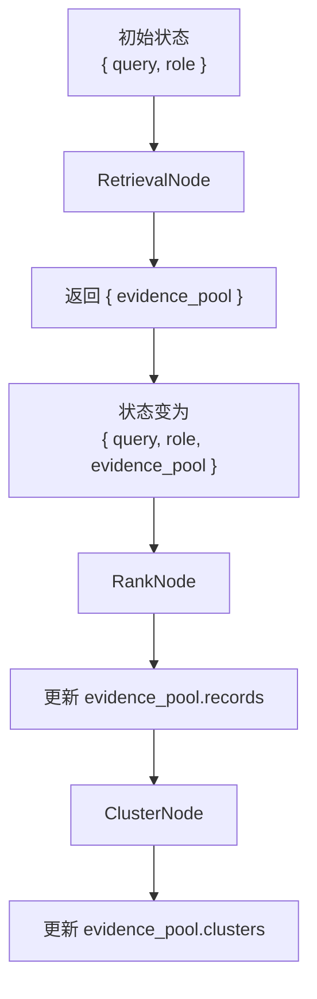
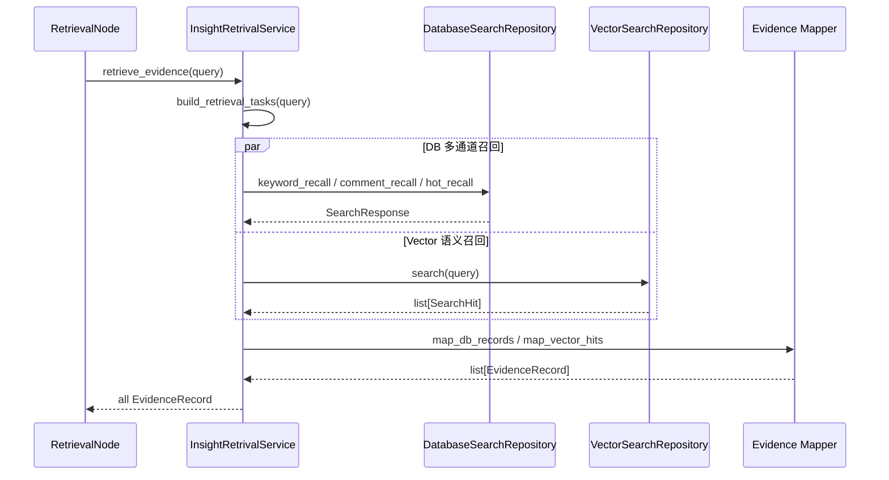
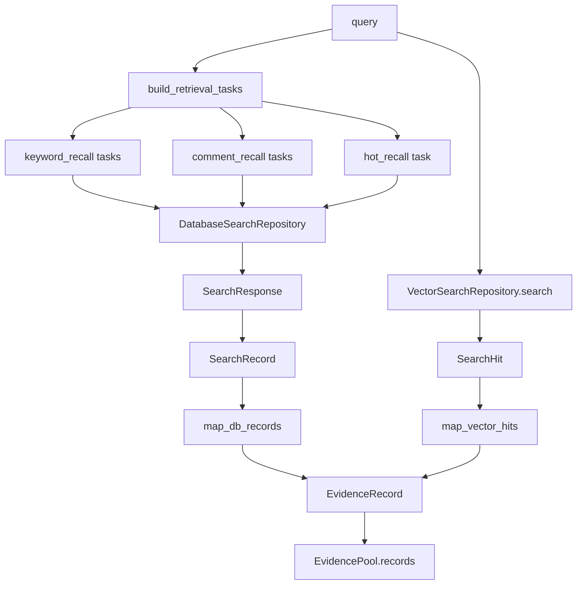
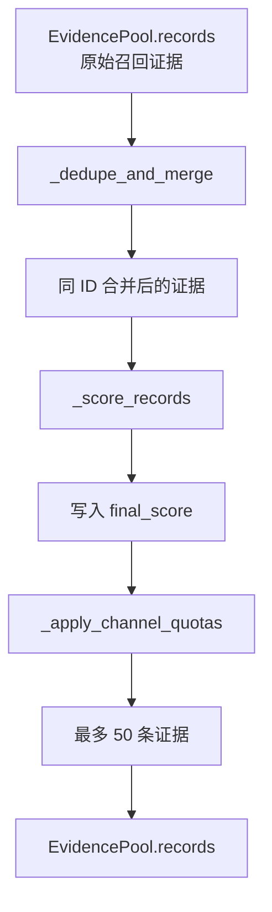
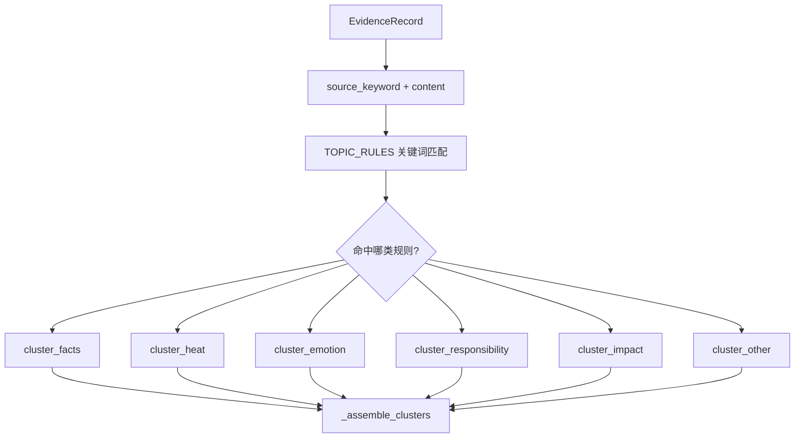
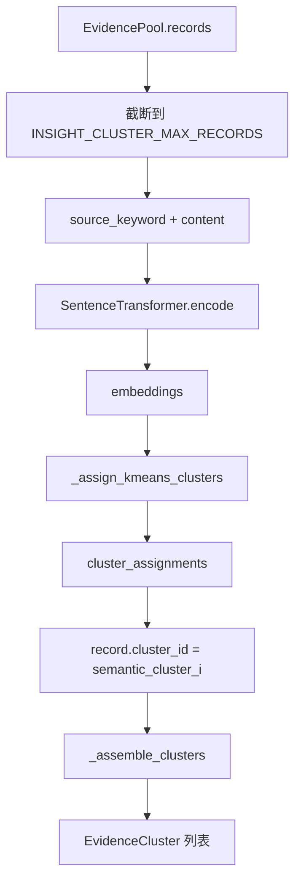
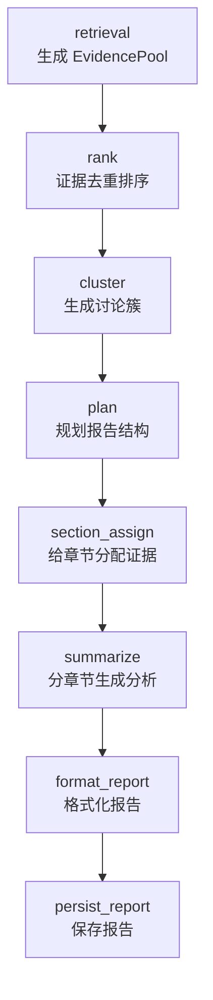
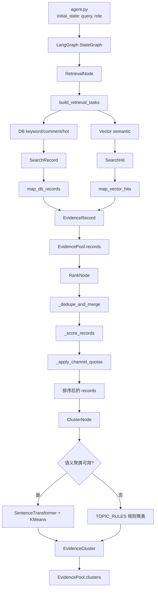

# 05_InsightAgent证据池排序与语义聚类

## 课程目标

上一章已经把 `InsightAgent` 的私域检索底座搭起来了：

```text
MySQL 结构化召回
    keyword_recall
    comment_recall
    hot_recall

Milvus 向量召回
    dense_vector
    sparse_vector
    hybrid_search
```

但是检索结果本身还不能直接交给 LLM 写报告。原因很简单：不同召回通道返回的数据形态不同，质量也不同。

例如：

```text
keyword_recall  更偏主题内容
comment_recall  更偏用户观点
hot_recall      更偏高互动内容
semantic_recall 更偏语义相似内容
```

如果把这些结果原样堆给 LLM，会出现几个问题：

- 同一条内容可能被多个通道重复召回。
- 热度很高但主题相关性一般的内容，可能挤掉真正重要的观点。
- 评论类证据容易被内容类证据淹没。
- 后续报告需要“讨论簇”，而不是一堆散乱记录。

所以本章开始进入 `InsightAgent` 的第二层能力：**证据池治理**。

本章要讲清楚三件事：

```text
第一，如何把 DB / Vector 两类检索结果统一成 EvidenceRecord
第二，如何用 RankNode 对证据去重、打分、配额筛选
第三，如何用 ClusterNode 把证据聚合成讨论簇
```

后续，`InsightAgent` 后面还会继续走：

```text
section_assign
summarize
format_report
persist_report
```

今天先把“检索结果进入证据池，并完成排序和聚类”。只有证据池稳定了，后面的章节分配和报告生成才有可靠输入。

## 1. 本章涉及的模块

本章主要涉及 `engines/insight_agent/` 下这些代码：

```text
sentiment_bak/
└── engines/
    └── insight_agent/
        ├── state.py
        ├── graph.py
        ├── agent.py
        ├── evidence/
        │   └── models.py
        ├── tools/
        │   ├── retrieval_service.py
        │   ├── db_search/
        │   │   └── search_results.py
        │   └── vector_search/
        │       └── search_results.py
        └── nodes/
            ├── retrieval_node.py
            ├── rank_node.py
            └── cluster_node.py
```

这些模块可以分成四组：

- `evidence/models.py`：定义统一证据模型。
- `tools/retrieval_service.py`：把 DB 和 Vector 召回合并成证据列表。
- `nodes/retrieval_node.py`：把召回结果放入 `EvidencePool`。
- `nodes/rank_node.py` 与 `nodes/cluster_node.py`：对证据池做排序和聚类。

整体关系如下：



上一章讲的是图里的 `DatabaseSearchRepository` 和 `VectorSearchRepository`。本章讲的是从 `SearchRecord / SearchHit` 往后的治理链路。

## 2. 为什么需要统一证据池

检索系统的输出是“命中结果”，而报告系统需要的是“证据”。

这两个概念看起来接近，但职责不同。

```text
命中结果:
    某个通道查到了某条数据
    关注的是检索动作本身

证据:
    这条数据可以支撑后续研判
    关注的是它在分析流程中的价值
```

所以设计了 `EvidenceRecord` 和 `EvidencePool`。

它们的作用不是替代 `SearchRecord` 或 `SearchHit`，而是承接它们：

```text
SearchRecord / SearchHit
        ↓ 映射
EvidenceRecord
        ↓ 汇总
EvidencePool
        ↓ 排序、聚类、章节分配、摘要生成
```

这个分层很重要。`db_search` 和 `vector_search` 只负责“召回”，不负责“研判”。研判相关字段，例如 `final_score`、`cluster_id`、`retrieval` 元数据，都应该进入 evidence 层。

## 3. 本章新增的数据模型总览

本章的数据模型可以分成三层。

第一层是检索结果模型：

```text
SearchRecord    MySQL 召回结果
SearchResponse  MySQL 单通道响应
VectorDocument  Milvus 中保存的文档
SearchHit       Milvus 命中结果
```

第二层是证据模型：

```text
Engagement      互动指标
RetrievalMeta   召回过程元数据
EvidenceRecord  统一证据记录
EvidenceCluster 证据讨论簇
EvidencePool    全局证据池
```

第三层是图状态模型：

```text
InsightState    LangGraph 节点之间传递的状态
```

完整转换关系如下：



接下来分别展开。

## 4. 检索结果模型

检索结果模型仍然属于工具层。它们描述的是“某个检索系统返回了什么”。

### 4.1 SearchRecord

`SearchRecord` 位于：

```text
engines/insight_agent/tools/db_search/search_results.py
```

定义如下：

```python
@dataclass
class SearchRecord:
    mysql_pk: str
    platform: str
    source_table: str
    title_or_content: str
    published_at: datetime
    source_keyword: Optional[str] = None
    engagement: dict[str, float] = field(default_factory=dict)
    hotness_score: Optional[float] = None
```

它表示 MySQL 中的一条命中记录。

几个字段要重点理解：

```text
mysql_pk          原始 MySQL 主键
platform          平台，例如 weibo / douyin
source_table      来源表，例如 weibo_note / douyin_aweme_comment
title_or_content  统一后的正文内容
published_at      发布时间
source_keyword    原始采集关键词
engagement        统一互动指标
hotness_score     热度召回时计算出的热度分
```

`SearchRecord` 仍然是检索层模型，它不关心后面怎么排序、怎么聚类。

### 4.2 SearchResponse

`SearchResponse` 表示一次 DB 召回通道的响应：

```python
@dataclass
class SearchResponse:
    retrieval_channel: str
    search_results: list[SearchRecord] = field(default_factory=list)
    search_results_count: int = 0
    search_error_message: Optional[str] = None
```

它把单通道信息包起来：

```text
retrieval_channel       当前通道名
search_results          当前通道查出的 SearchRecord
search_results_count    命中数量
search_error_message    查询异常信息
```

所以 DB 召回链路是：

```text
keyword_recall/comment_recall/hot_recall
        -> SearchResponse
        -> list[SearchRecord]
```

### 4.3 VectorDocument

`VectorDocument` 位于：

```text
engines/insight_agent/tools/vector_search/search_results.py
```

它表示 Milvus 中保存的一条文档：

```python
@dataclass
class VectorDocument:
    doc_id: str
    platform: str
    source_table: str
    mysql_pk: int
    content: str
    published_at: int | datetime
    source_keyword: str
    likes: float = 0.0
    comments: float = 0.0
    shares: float = 0.0
    collects: float = 0.0
    replies: float = 0.0
    hotness_score: float = 0.0
```

上一章已经讲过，`VectorDocument` 可以通过 `to_milvus_record()` 写入 Milvus：

```python
def to_milvus_record(
    self,
    dense_vector: list[float],
    sparse_vector: dict[int, float],
) -> dict[str, Any]:
    ...
```

它在本章中的作用是：当 Milvus 命中某条数据时，项目会把命中的 entity 重新组装回 `VectorDocument`。

### 4.4 SearchHit

`SearchHit` 表示一次向量检索命中：

```python
@dataclass(frozen=True)
class SearchHit:
    retrieval_score: float
    retrieval_channel: str
    retrieval_doc: VectorDocument
```

这里有三个关键信息：

```text
retrieval_score    Milvus 返回的相关性分数
retrieval_channel  当前固定为 semantic_recall
retrieval_doc      命中的向量文档
```

所以向量召回链路是：

```text
VectorSearchRepository.search(query)
        -> list[SearchHit]
        -> SearchHit.retrieval_doc
        -> EvidenceRecord
```

## 5. 证据模型

证据模型位于：

```text
engines/insight_agent/evidence/models.py
```

这些模型是本章的核心。

### 5.1 Engagement：互动指标

```python
@dataclass(slots=True)
class Engagement:
    likes: float = 0.0
    comments: float = 0.0
    shares: float = 0.0
    collects: float = 0.0
    replies: float = 0.0
```

`Engagement` 把不同平台的互动字段统一成五类：

```text
likes      点赞
comments   评论
shares     转发 / 分享
collects   收藏
replies    回复
```

这和上一章 `db_search/queries/columns.py` 里的 `eng_likes`、`eng_comments` 等字段是对应的。

统一互动指标后，排序节点不需要关心原始字段叫 `liked_count` 还是 `comment_like_count`。

### 5.2 RetrievalMeta：召回过程元数据

```python
@dataclass(slots=True)
class RetrievalMeta:
    matched_queries: list[str] = field(default_factory=list)
    retrieval_channels: list[str] = field(default_factory=list)
    retrieval_scores: dict[str, float] = field(default_factory=dict)
```

它记录的是“一条证据是怎么被召回来的”。

例如同一条内容可能同时被两个通道召回：

```text
keyword_recall    命中 query: 高考
semantic_recall   命中 query: 高考难吗
```

合并后，它的 `RetrievalMeta` 可能变成：

```python
RetrievalMeta(
    matched_queries=["高考", "高考难吗"],
    retrieval_channels=["keyword_recall", "semantic_recall"],
    retrieval_scores={
        "keyword_recall": 0.5,
        "semantic_recall": 0.82,
    },
)
```

这样后续排序时就能知道：这条证据不只是热，它还被多个检索通道认可。

### 5.3 EvidenceRecord：统一证据记录

```python
@dataclass(slots=True)
class EvidenceRecord:
    id: str
    platform: str
    source_table: str
    source_keyword: Optional[str]
    content: str
    published_at: str
    hotness_score: float
    final_score: float = 0.0
    cluster_id: str = ""
    engagement: Engagement = field(default_factory=Engagement)
    retrieval: RetrievalMeta = field(default_factory=RetrievalMeta)
```

这是本章最重要的数据结构。

它既保留原始证据信息：

```text
id
platform
source_table
source_keyword
content
published_at
```

也保留研判过程中的状态：

```text
hotness_score
final_score
cluster_id
retrieval
```

可以把 `EvidenceRecord` 理解成：

```text
一条可以被排序、聚类、分配章节、交给 LLM 引用的证据
```

### 5.4 EvidenceCluster：证据讨论簇

```python
@dataclass(slots=True)
class EvidenceCluster:
    id: str
    label: str
    summary: str
    member_record_ids: list[str] = field(default_factory=list)
    representative_ids: list[str] = field(default_factory=list)
    size: int = 0
```

`EvidenceCluster` 不是原始数据，而是由 `ClusterNode` 生成的聚合结果。

字段含义如下：

```text
id                  簇 ID
label               簇标签，例如 事实进展 / 情绪观点
summary             簇摘要
member_record_ids   簇内所有证据 ID
representative_ids  代表性证据 ID，当前取前 5 条
size                簇规模
```

后续生成报告章节时，`EvidenceCluster` 可以帮助 LLM 识别主要讨论方向。

### 5.5 EvidencePool：全局证据池

```python
@dataclass(slots=True)
class EvidencePool:
    query: str
    records: list[EvidenceRecord] = field(default_factory=list)
    clusters: list[EvidenceCluster] = field(default_factory=list)
```

`EvidencePool` 是本章的聚合根。

它表达的是：

```text
围绕一个 query
系统召回了哪些证据 records
这些证据形成了哪些讨论簇 clusters
```

LangGraph 后续节点不会到处传散乱列表，而是围绕 `EvidencePool` 继续处理。

## 6. InsightState：LangGraph 状态对象

`InsightState` 位于：

```text
engines/insight_agent/state.py
```

当前定义如下：

```python
class InsightState(TypedDict):
    query: str
    role: str
    evidence_pool: EvidencePool
```

它是 LangGraph 在节点之间传递的状态。

可以理解为：

```text
InsightState 是整张图的共享工作台
每个节点从里面读自己需要的字段
再返回一部分更新写回状态
```

例如：

```text
RetrievalNode 读取 query，写入 evidence_pool
RankNode      读取 evidence_pool.records，更新排序后的 records
ClusterNode   读取 evidence_pool.records，写入 evidence_pool.clusters
```

这个状态流如下：



## 7. LangGraph 基础知识

在继续看节点之前，需要先补充 LangGraph 的几个基础概念。

### 7.1 StateGraph 是什么

`StateGraph` 是 LangGraph 中用来定义“状态驱动工作流”的图对象。

当前项目中：

```python
graph = StateGraph(InsightState)
```

意思是：这张图运行时维护一个 `InsightState`，每个节点都围绕这个状态读写数据。

它和普通函数链路最大的区别是：

```text
普通函数链路:
    A 调 B，B 调 C，参数层层传递

LangGraph:
    节点从共享状态读取数据
    节点返回状态更新
    图负责把更新合并进下一步状态
```

### 7.2 START 与 END

LangGraph 用 `START` 表示图入口，用 `END` 表示图结束。

当前代码中有：

```python
graph.add_edge(START, "retrieval")
...
graph.add_edge("persist_report", END)
```

这说明：

```text
图从 retrieval 节点开始
最后在 persist_report 后结束
```

当前第四天代码已经实现并重点讲解：

```text
retrieval
rank
cluster
```

`plan`、`section_assign`、`summarize`、`format_report`、`persist_report` 属于后续章节要继续补齐的节点。

### 7.3 Node 是什么

在当前项目里，一个节点本质上是一个可调用对象：

```python
class RankNode(BaseNode):
    async def __call__(self, state: InsightState) -> dict[str, Any]:
        ...
        return {"evidence_pool": pool}
```

它的输入是 `state`，输出是一个字典。

这个返回字典不是最终结果，而是对全局状态的增量更新。

例如 `RankNode` 返回：

```python
return {"evidence_pool": pool}
```

意思是：请把当前状态里的 `evidence_pool` 更新成这个新对象。

### 7.4 add_node 与 add_edge

`add_node()` 注册节点：

```python
graph.add_node("retrieval", RetrievalNode(ctx))
graph.add_node("rank", RankNode(ctx))
graph.add_node("cluster", ClusterNode(ctx))
```

`add_edge()` 定义执行顺序：

```python
graph.add_edge(START, "retrieval")
graph.add_edge("retrieval", "rank")
graph.add_edge("rank", "cluster")
```

所以前三个节点的执行顺序是：

```text
START -> retrieval -> rank -> cluster
```

可以画成：


### 7.5 compile 与 ainvoke

定义完图以后，需要调用：

```python
return graph.compile()
```

`compile()` 会把图结构编译成可运行对象。

在 `agent.py` 中，真正运行图的是：

```python
await graph.ainvoke(initial_state, {"recursion_limit": 30})
```

这里的 `initial_state` 是：

```python
initial_state = {"query": query, "role": role}
```

也就是说，图启动时只有用户问题和角色信息。`evidence_pool` 是由 `RetrievalNode` 在运行中创建出来的。

## 8. RetrievalNode：生成全局证据池

`RetrievalNode` 位于：

```text
engines/insight_agent/nodes/retrieval_node.py
```

它负责把上一章的检索能力接入 LangGraph。

核心逻辑是：

```python
async def __call__(self, state: InsightState):
    user_query = state["query"]
    records = await self.retrieval_service.retrieve_evidence(user_query)

    evidence_pool = EvidencePool(
        query=user_query,
        records=records,
        clusters=[],
    )
    return {"evidence_pool": evidence_pool}
```

这个节点做三件事：

```text
从 state 中读取 query
调用 retrieval_service 获取 EvidenceRecord 列表
创建 EvidencePool 并写回 state
```

它不做排序，也不做聚类。这样职责很清楚：

```text
RetrievalNode 只负责召回和建池
RankNode      负责证据排序
ClusterNode   负责讨论簇识别
```

## 9. InsightRetrivalService：多路召回编排

`InsightRetrivalService` 位于：

```text
engines/insight_agent/tools/retrieval_service.py
```

它是上一章检索工具和本章证据模型之间的桥。

整体流程如下：



### 9.1 RetrievalQueryTask

```python
@dataclass(slots=True)
class RetrievalQueryTask:
    channel: RetrievalChannel
    limit: int
    query: str = ""
```

它表示一个 DB 召回任务。

例如：

```python
RetrievalQueryTask(channel="keyword_recall", query="高考", limit=10)
RetrievalQueryTask(channel="comment_recall", query="高考难", limit=10)
RetrievalQueryTask(channel="hot_recall", limit=20)
```

这里 `hot_recall` 不依赖具体关键词，因为它查的是时间窗口内的高热内容。

### 9.2 build_retrieval_tasks

`build_retrieval_tasks(query)` 做两步。

第一步，构建搜索词集合：

```python
search_keywords = [query]
for search_keyword in _extract_recall_keywords(query):
    if search_keyword not in search_keywords:
        search_keywords.append(search_keyword)
```

除了原始 query，还会用 `jieba.analyse.extract_tags()` 抽取关键词。

例如用户输入：

```text
高考数学太难了吗
```

可能会形成：

```text
高考数学太难了吗
高考
数学
```

第二步，为每个关键词生成两个任务：

```python
keyword_recall
comment_recall
```

最后额外加入：

```python
hot_recall
```

这样召回不只依赖原句，还能覆盖主题词。

### 9.3 retrieve_evidence

总入口是：

```python
async def retrieve_evidence(self, query: str) -> list[EvidenceRecord]:
    retrieval_query_tasks = build_retrieval_tasks(query)

    db_records, vector_records = await asyncio.gather(
        self.retrieve_db_evidence(retrieval_query_tasks),
        self.retrieve_vector_evidence(query),
    )

    return [*db_records, *vector_records]
```

这里使用 `asyncio.gather()` 并发执行两条线：

```text
DB 召回线
Vector 召回线
```

两条线互不依赖，所以可以并发。这样后续即使 Milvus 稍慢，也不会阻塞 DB 召回的构造逻辑。

### 9.4 retrieve_db_evidence

DB 召回又会并发执行多个 `RetrievalQueryTask`：

```python
task_responses = await asyncio.gather(
    *[self._run_db_query_task(task) for task in retrieve_tasks]
)
```

每个任务会根据通道调用不同方法：

```python
match task.channel:
    case "keyword_recall":
        return await self._db_repo.keyword_recall(task.query, limit=task.limit)
    case "comment_recall":
        return await self._db_repo.comment_recall(task.query, limit=task.limit)
    case "hot_recall":
        return await self._db_repo.hot_recall(time_period="year", limit=task.limit)
```

最后通过 `map_db_records()` 映射成 `EvidenceRecord`。

### 9.5 retrieve_vector_evidence

向量召回有一个开关：

```python
if not get_settings().INSIGHT_VECTOR_ENABLED:
    return []
```

如果启用向量召回，则用线程执行同步的 Milvus 查询：

```python
vec_search_result = await asyncio.to_thread(self._run_vector_query_task, query)
```

为什么要 `to_thread()`？

因为 Milvus client 查询是同步调用。放到线程里，可以避免阻塞当前 async 事件循环。

### 9.6 DB 结果映射为 EvidenceRecord

DB 结果映射函数是：

```python
def _map_to_record(channel: str, query: str, record: SearchRecord) -> EvidenceRecord:
    return EvidenceRecord(
        id=record.mysql_pk,
        platform=record.platform,
        source_table=record.source_table,
        source_keyword=record.source_keyword,
        content=record.title_or_content,
        published_at=record.published_at.strftime("%Y-%m-%d %H:%M:%S"),
        hotness_score=record.hotness_score,
        engagement=Engagement(...),
        retrieval=RetrievalMeta(
            matched_queries=[query],
            retrieval_channels=[channel],
            retrieval_scores={channel: 0.5},
        ),
    )
```

这里完成了两件关键事情：

```text
SearchRecord -> EvidenceRecord
当前召回通道 -> RetrievalMeta
```

DB 通道当前使用固定占位分。原因是 DB 的关键词召回和评论召回没有天然的 0~1 相似度分，所以先给一个稳定分值，后面由 `RankNode` 统一加权。

### 9.7 Vector 结果映射为 EvidenceRecord

向量结果映射函数是：

```python
def _map_vector_hit(query: str, hit: SearchHit) -> EvidenceRecord:
    hit_doc = hit.retrieval_doc
    return EvidenceRecord(
        id=hit_doc.doc_id,
        platform=hit_doc.platform,
        source_table=hit_doc.source_table,
        source_keyword=hit_doc.source_keyword,
        content=hit_doc.content,
        published_at=hit_doc.published_at.strftime("%Y-%m-%d %H:%M:%S"),
        hotness_score=hit_doc.hotness_score,
        engagement=Engagement(...),
        retrieval=RetrievalMeta(
            matched_queries=[query],
            retrieval_channels=[hit.retrieval_channel],
            retrieval_scores={hit.retrieval_channel: hit.retrieval_score},
        ),
    )
```

和 DB 不同，向量召回有真实的相关性分数：

```text
retrieval_score = Milvus hybrid_search 返回的 distance
```

因此 `semantic_recall` 的分数会参与后续排序。

### 9.8 测试

```python
if __name__ == "__main__":
    import asyncio
    from loguru import logger


    async def run_test():
        retriever = InsightRetrivalService()
        test_query = "高考难吗"

        # 1. DB 多通道召回
        logger.info(f"\n测试测试DB召回, Query: '{test_query}'")
        tasks = build_retrieval_tasks(test_query)
        logger.info(f"生成了 {len(tasks)} 个 DB 召回任务: {[t.channel for t in tasks]}")
        db_results = await retriever.retrieve_db_evidence(tasks)
        logger.info(f"DB召回完成，共获取证据: {len(db_results)} 条")

        platform_samples = {}
        for record in db_results:
            if record.platform not in platform_samples:
                platform_samples[record.platform] = []
            if len(platform_samples[record.platform]) < 5:
                platform_samples[record.platform].append(record)

        for platform, samples in platform_samples.items():
            print(f"DB召回: {platform} (展示 {len(samples)} 条) ---")
            for i, record in enumerate(samples, 1):
                clean_content = record.content[:40]
                print(f"{i}通道: {record.retrieval.retrieval_channels} | 内容: {clean_content}...")

        # 2. Vector 召回
        logger.info(f"测试Vector召回 Query: '{test_query}'")
        vec_results = await retriever.retrieve_vector_evidence(test_query)
        logger.info(f"Vector召回完成，共获取证据: {len(vec_results)} 条")

        platform_vec = {}
        for record in vec_results:
            if record.platform not in platform_vec:
                platform_vec[record.platform] = []
            if len(platform_vec[record.platform]) < 5:
                platform_vec[record.platform].append(record)

        for platform, item in platform_vec.items():
            print(f"Vector召回平台: {platform} (展示 {len(item)} 条) ---")
            for i, record in enumerate(item, 1):
                clean_content = record.content[:40]
                channel = record.retrieval.retrieval_channels[0]
                score = record.retrieval.retrieval_scores.get(channel)
                print(f"{i}通道: {channel} | 分数: {score:.4f} | 内容: {clean_content}...")

        # 3、整体编排召回测试
        logger.info(f"测试3 整体编排召回, Query: '{test_query}'")
        all_results = await retriever.retrieve_evidence(test_query)
        logger.info(f"整体召回完成，总计汇总证据: {len(all_results)} 条")

        # 各个通道的分布情况
        channel_counts = {}
        for r in all_results:
            ch = r.retrieval.retrieval_channels[0]
            channel_counts[ch] = channel_counts.get(ch, 0) + 1

        logger.info(f"通道分布统计: {channel_counts}")


    # 启动异步测试
    asyncio.run(run_test())
```


## 10. 从检索结果到证据池的完整流程

这一节把前面串起来。



这张图体现了本章最关键的转换：

```text
检索层的 SearchRecord / SearchHit
        -> 研判层的 EvidenceRecord
```

后续 `RankNode` 和 `ClusterNode` 只处理 `EvidenceRecord`，不再关心底层来自 MySQL 还是 Milvus。

## 11. RankNode：证据排序节点

`RankNode` 位于：

```text
engines/insight_agent/nodes/rank_node.py
```

文件顶部的注释已经概括了它的职责：

```text
ID 去重合并 -> 二因子打分 -> 通道配额选 50 条
```

当前代码中的核心常量有：

```python
SOURCE_QUOTAS = {
    "keyword_recall": 10,
    "semantic_recall": 10,
    "comment_recall": 20,
    "hot_recall": 10,
}
MAX_EVIDENCE_RECORDS = 50
```

这表示最终最多保留 50 条证据，并且不同通道有自己的保底配额。

还有通道权重：

```python
_CHANNEL_WEIGHTS = {
    "semantic_recall": 0.5,
    "keyword_recall": 0.4,
    "comment_recall": 0.4,
    "hot_recall": 0.20,
}
```

这些权重用于计算“召回相关性分”。

### 11.1 RankNode.__call__

入口方法如下：

```python
async def __call__(self, state: InsightState) -> dict[str, Any]:
    pool = state["evidence_pool"]

    merged_results = _dedupe_and_merge(pool.records)
    scored_result = _score_records(merged_results)
    ranked = _apply_channel_quotas(scored_result)

    pool.records = ranked
    return {"evidence_pool": pool}
```

它分成三步：

```text
第一步，_dedupe_and_merge 去重合并
第二步，_score_records 计算 final_score
第三步，_apply_channel_quotas 按通道配额筛选
```

流程图如下：



### 11.2 _dedupe_and_merge：按证据 ID 去重

多路召回一定会带来重复。

例如同一条微博可能同时被：

```text
keyword_recall 命中
semantic_recall 命中
hot_recall 命中
```

如果不去重，LLM 会看到重复证据，报告也容易重复表达。

去重代码使用字典：

```python
records_by_id: dict[str, EvidenceRecord] = {}

for record in records:
    record_id = record.id
    if record_id not in records_by_id:
        records_by_id[record_id] = record
        continue

    base_record = records_by_id[record_id]
    base_record.retrieval = _merge_retrieval_meta(base_record, record)
    base_record.hotness_score = max(base_record.hotness_score, record.hotness_score)
```

它的规则是：

```text
如果 ID 第一次出现，直接放入字典
如果 ID 已存在，说明是重复证据
重复证据不丢弃元数据，而是合并 RetrievalMeta
热度分取更高的那个
```

这里体现了一个重要思想：**去重不是简单删除，而是合并信息**。

### 11.3 _merge_retrieval_meta：合并召回痕迹

```python
def _merge_retrieval_meta(base_record: EvidenceRecord, new_record: EvidenceRecord) -> RetrievalMeta:
    base_meta, new_meta = base_record.retrieval, new_record.retrieval
    scores = dict(base_meta.retrieval_scores)
    for channel, score in new_meta.retrieval_scores.items():
        scores[channel] = max(score, scores.get(channel, 0.0))

    return RetrievalMeta(
        matched_queries=sorted(set(base_meta.matched_queries + new_meta.matched_queries)),
        retrieval_channels=sorted(set(base_meta.retrieval_channels + new_meta.retrieval_channels)),
        retrieval_scores=scores,
    )
```

这个方法合并三类信息：

```text
matched_queries      取并集
retrieval_channels   取并集
retrieval_scores     同通道取最高分
```

合并前：

```text
doc_1:
    channels = ["keyword_recall"]
    scores = {"keyword_recall": 0.5}

doc_1:
    channels = ["semantic_recall"]
    scores = {"semantic_recall": 0.82}
```

合并后：

```text
doc_1:
    channels = ["keyword_recall", "semantic_recall"]
    scores = {
        "keyword_recall": 0.5,
        "semantic_recall": 0.82
    }
```

这样同一条证据被多个通道命中，反而会成为它的重要性信号。

### 11.4 _score_records：相关性与热度综合打分

排序打分代码如下：

```python
max_hotness = max((r.hotness_score for r in records), default=0.0) or 1.0

for record in records:
    hotness = record.hotness_score
    record.final_score = (
        _retrieval_score(record) * 0.60
        + (hotness / max_hotness) * 0.40
    )
```

当前使用两个因素：

```text
召回相关性 60%
热度归一化 40%
```

为什么热度要归一化？

因为不同平台的互动量级不同。例如抖音点赞可能很高，微博评论可能更集中。直接比较原始热度容易造成平台偏置。

归一化方式是：

```text
当前记录热度 / 本批证据最大热度
```

这样热度分会落在 `0~1` 之间。

### 11.5 _retrieval_score：按通道加权

```python
def _retrieval_score(record: EvidenceRecord) -> float:
    meta = record.retrieval
    score = sum(
        _CHANNEL_WEIGHTS[channel] * meta.retrieval_scores.get(channel)
        for channel in meta.retrieval_channels
    )
    return min(score, 1.0)
```

这个方法会遍历一条证据命中的所有通道。

假设一条证据的元数据是：

```python
retrieval_channels = ["keyword_recall", "semantic_recall"]
retrieval_scores = {
    "keyword_recall": 0.5,
    "semantic_recall": 0.8,
}
```

那么它的召回相关性分大致是：

```text
keyword_recall:  0.4 * 0.5 = 0.20
semantic_recall: 0.5 * 0.8 = 0.40
总分 = 0.60
```

最后用 `min(score, 1.0)` 截断，避免多通道叠加后超过 1。

### 11.6 _apply_channel_quotas：通道配额筛选

只按 `final_score` 排序会有一个问题：某个通道可能被完全挤掉。

例如评论内容热度较低，但它对情绪分析很关键。如果完全按热度和相关性排序，评论证据可能不够。

所以当前使用通道配额：

```python
SOURCE_QUOTAS = {
    "keyword_recall": 10,
    "semantic_recall": 10,
    "comment_recall": 20,
    "hot_recall": 10,
}
```

筛选分三步。

第一步，全局按分数降序：

```python
ranked_record = sorted(records, key=lambda record: record.final_score, reverse=True)
```

第二步，按通道配额选择：

```python
for record in ranked_record:
    channel = _source_bucket(record)
    if counts[channel] < SOURCE_QUOTAS.get(channel, 0.0):
        selected_record.append(record)
        counts[channel] += 1
```

第三步，如果不足 50 条，用剩余高分证据补齐：

```python
remainders = [r for r in ranked_record if r.id not in selected_ids]
selected_record.extend(remainders[:MAX_EVIDENCE_RECORDS - len(selected_record)])
```

最后再次按分数降序：

```python
return sorted(selected_record, key=lambda r: r.final_score, reverse=True)
```

这个策略兼顾两件事：

```text
保留高分证据
保证关键召回通道不缺席
```

### 11.7 _source_bucket：一条证据归属哪个配额桶

一条证据可能来自多个通道，那它应该算到哪个配额里？

当前代码按 `SOURCE_QUOTAS` 的 key 顺序判断：

```python
for channel in SOURCE_QUOTAS:
    if channel in channels:
        return channel
```

因为 `SOURCE_QUOTAS` 的顺序是：

```text
keyword_recall
semantic_recall
comment_recall
hot_recall
```

所以如果一条证据同时命中 `keyword_recall` 和 `hot_recall`，会优先归到 `keyword_recall` 桶。

这是一种简单可控的归属策略，便于调试。

### 11.8 测试

```python
if __name__ == "__main__":
    import asyncio
    from dataclasses import dataclass, field

    # 1. 独立测试
    @dataclass
    class RetrievalMeta:
        matched_queries: list[str] = field(default_factory=list)
        retrieval_channels: list[str] = field(default_factory=list)
        retrieval_scores: dict[str, float] = field(default_factory=dict)


    @dataclass
    class EvidenceRecord:
        id: str
        content: str
        hotness_score: float
        retrieval: RetrievalMeta
        final_score: float = 0.0


    @dataclass
    class EvidencePool:
        records: list[EvidenceRecord]


    async def run_test():
        print("=== 开始初始化 RankNode 测试 ===")

        # 构造测试数据
        mock_records = [
            # 这两条 ID 相同，用来测试去重合并 (多路召回了同一条帖子)
            EvidenceRecord(
                id="doc_1", content="高考数学太难了！", hotness_score=100.0,
                retrieval=RetrievalMeta(["高考"], ["keyword_recall"], {"keyword_recall": 1.0})
            ),
            EvidenceRecord(
                id="doc_1", content="高考数学太难了！", hotness_score=150.0,  # 模拟热度更新
                retrieval=RetrievalMeta(["高考难"], ["semantic_recall"], {"semantic_recall": 0.85})
            ),

            # 其他通道的数据
            EvidenceRecord(
                id="doc_2", content="大家放平心态，加油！", hotness_score=500.0,
                retrieval=RetrievalMeta(["高考"], ["hot_recall"], {"hot_recall": 1.0})
            ),
            EvidenceRecord(
                id="doc_3", content="评论区也是一片哀嚎...", hotness_score=20.0,
                retrieval=RetrievalMeta(["高考"], ["comment_recall"], {"comment_recall": 1.0})
            ),
        ]

        state = {
            "evidence_pool": EvidencePool(records=mock_records)
        }

        # 执行节点 (绕过 __init__ 传 ctx 的强制要求)
        node = RankNode(context=None)
        result_state = await node(state)

        # 验证结果
        final_records = result_state["evidence_pool"].records
        print(f"\n排序节点执行完毕！")
        print(f"原始记录数: {len(mock_records)} -> 最终记录数: {len(final_records)} (成功去重并分配)")
        print("-" * 60)

        for i, record in enumerate(final_records, 1):
            print(f"[{i}] ID: {record.id} | 最终得分: {record.final_score:.4f} | 热度: {record.hotness_score}")
            print(f"    包含渠道: {record.retrieval.retrieval_channels}")
            print(f"    原始分数: {record.retrieval.retrieval_scores}")
            print("-" * 60)


    # 启动测试
    asyncio.run(run_test())
```


## 12. ClusterNode：证据聚类节点

`ClusterNode` 位于：

```text
engines/insight_agent/nodes/cluster_node.py
```

它的目标是把排序后的证据分成多个讨论簇。

为什么需要聚类？

因为报告不是逐条复述证据，而是要总结主要讨论方向。

例如围绕“高考”这个主题，证据可能自然分成：

```text
事实进展
热度传播
情绪观点
责任处置
影响风险
```

`ClusterNode` 就是把散乱证据组织成这些讨论簇。

### 12.1 TOPIC_RULES：规则聚类标签体系

当前代码先定义了一组规则：

```python
TOPIC_RULES = [
    ("facts", "事实进展", ("通报", "回应", "发布", "声明", "官方", ...)),
    ("heat", "热度传播", ("热搜", "传播", "转发", "评论", "点赞", ...)),
    ("emotion", "情绪观点", ("支持", "反对", "质疑", "吐槽", "愤怒", ...)),
    ("responsibility", "责任处置", ("责任", "监管", "处罚", "道歉", ...)),
    ("impact", "影响风险", ("影响", "风险", "后续", "舆论", ...)),
]
```

这组规则有两个用途：

```text
语义聚类关闭时，直接用于规则聚类
语义聚类开启时，用于给聚类结果推断中文标签
```

也就是说，它既是降级方案，也是标签解释方案。

### 12.2 ClusterNode.__call__

入口方法如下：

```python
async def __call__(self, state: InsightState) -> dict[str, Any]:
    evidence_pool = state["evidence_pool"]
    evidence_pool.clusters = self._build_clusters(evidence_pool.records)
    return {"evidence_pool": evidence_pool}
```

核心动作是：

```text
读取 evidence_pool.records
调用 _build_clusters(records)
把结果写入 evidence_pool.clusters
```

### 12.3 _build_clusters：语义聚类优先，规则聚类兜底

```python
def _build_clusters(self, records: list[EvidenceRecord]) -> list[EvidenceCluster]:
    if not self._is_semantic_clustering_enabled(records):
        return _cluster_by_rules(records)
    return _cluster_by_semantics(records)
```

这体现了当前设计：

```text
如果语义聚类条件满足:
    使用 SentenceTransformer + KMeans
否则:
    使用关键词规则聚类
```

判断条件是：

```python
return (
    config.settings.INSIGHT_CLUSTERING_ENABLED
    and bool(config.settings.INSIGHT_CLUSTER_MODEL)
    and len(records) >= config.settings.INSIGHT_CLUSTER_MIN_CLUSTER_SIZE
)
```

必须同时满足三件事：

```text
开启 INSIGHT_CLUSTERING_ENABLED
配置 INSIGHT_CLUSTER_MODEL
证据数量达到 INSIGHT_CLUSTER_MIN_CLUSTER_SIZE
```

这能避免少量证据强行聚类，也能在模型未配置时自动降级。

### 12.4 规则聚类流程

规则聚类入口是：

```python
def _cluster_by_rules(records: list[EvidenceRecord]) -> list[EvidenceCluster]:
    records_by_cluster: dict[str, list[EvidenceRecord]] = defaultdict(list)

    for record in records:
        cluster_id = _match_rule_cluster_id(record)
        record.cluster_id = cluster_id
        records_by_cluster[cluster_id].append(record)

    return _assemble_clusters(records_by_cluster, infer_labels_from_content=False)
```

它做三步：

```text
遍历每条 EvidenceRecord
根据关键词规则匹配 cluster_id
按 cluster_id 分组后组装 EvidenceCluster
```

匹配逻辑如下：

```python
searchable_text = f"{record.source_keyword} {record.content}"
for rule_key, _label, keywords in TOPIC_RULES:
    if any(keyword in searchable_text for keyword in keywords):
        return f"cluster_{rule_key}"
return "cluster_other"
```

这里把 `source_keyword` 和 `content` 拼成 `searchable_text`，是因为原始采集关键词也可能提供主题信息。

规则聚类流程图如下：



### 12.5 语义聚类模型

语义聚类使用的是 `sentence-transformers` 的 `SentenceTransformer`：

```python
@lru_cache(maxsize=1)
def _load_embedding_model():
    from sentence_transformers import SentenceTransformer
    return SentenceTransformer(str(config.settings.INSIGHT_CLUSTER_MODEL))
```

当前 `.env` 中配置的是 `paraphrase-multilingual-MiniLM-L12-v2` 的本地模型路径。

相关地址：

```text
SentenceTransformers GitHub:
https://github.com/huggingface/sentence-transformers

paraphrase-multilingual-MiniLM-L12-v2 模型页:
https://huggingface.co/sentence-transformers/paraphrase-multilingual-MiniLM-L12-v2

```

这里要注意：`INSIGHT_CLUSTER_MODEL` 接收的是 SentenceTransformer 支持的模型名或本地路径。

例如可以配置成：

```text
INSIGHT_CLUSTER_MODEL=sentence-transformers/paraphrase-multilingual-MiniLM-L12-v2
```

也可以配置成本地缓存路径。

### 12.6 为什么 _load_embedding_model 使用 lru_cache

```python
@lru_cache(maxsize=1)
def _load_embedding_model():
    ...
```

`lru_cache(maxsize=1)` 的作用是：模型只加载一次。

聚类模型通常比较大，如果每次执行 `ClusterNode` 都重新加载，会很慢。

当前写法的效果是：

```text
第一次调用 _load_embedding_model:
    加载 SentenceTransformer 模型

后续调用 _load_embedding_model:
    直接返回缓存里的模型对象
```

这和上一章 BGE-M3 embedder 使用缓存加载模型的思想一致。

### 12.7 _cluster_by_semantics：语义聚类主流程

语义聚类代码如下：

```python
def _cluster_by_semantics(records: list[EvidenceRecord]) -> list[EvidenceCluster]:
    sampled_records = records[: config.settings.INSIGHT_CLUSTER_MAX_RECORDS]
    texts_to_embed = [f"{r.source_keyword} {r.content}".strip() for r in sampled_records]

    embeddings = _load_embedding_model().encode(
        texts_to_embed,
        normalize_embeddings=True,
        show_progress_bar=False,
    )
    cluster_assignments = _assign_kmeans_clusters(embeddings, len(sampled_records))

    records_by_cluster: dict[str, list[EvidenceRecord]] = defaultdict(list)
    for record, cluster_idx in zip(sampled_records, cluster_assignments):
        cluster_id = f"semantic_cluster_{cluster_idx}"
        record.cluster_id = cluster_id
        records_by_cluster[cluster_id].append(record)

    return _assemble_clusters(records_by_cluster, infer_labels_from_content=True)
```

它可以拆成五步：

```text
第一步，只取前 INSIGHT_CLUSTER_MAX_RECORDS 条证据
第二步，将 source_keyword + content 拼成待编码文本
第三步，用 SentenceTransformer 生成文本向量
第四步，用 KMeans 给每条证据分配簇编号
第五步，组装 EvidenceCluster
```

语义聚类流程图如下：



### 12.8 normalize_embeddings=True 的作用

语义编码时使用：

```python
normalize_embeddings=True
```

它会把向量归一化到单位长度。

这样做的好处是：后续向量之间的距离更稳定，尤其适合相似度相关任务。

虽然当前聚类用的是 KMeans，而不是直接计算 cosine similarity，但归一化后的向量通常更适合表达语义方向。

### 12.9 _assign_kmeans_clusters：KMeans 聚类

```python
def _assign_kmeans_clusters(embeddings: Any, record_count: int) -> list[int]:
    from sklearn.cluster import KMeans
    optimal_k = _determine_optimal_k(record_count)
    return [
        int(label)
        for label in KMeans(
            n_clusters=optimal_k,
            n_init="auto",
            random_state=42,
        ).fit_predict(embeddings)
    ]
```

这里使用的是 `sklearn.cluster.KMeans`。

几个参数要理解：

```text
n_clusters    要分成几个簇
n_init        初始化次数，auto 由 sklearn 自动选择
random_state  固定随机种子，保证同一批数据结果相对稳定
```

`fit_predict(embeddings)` 会完成两件事：

```text
fit      根据向量学习聚类中心
predict  给每条记录分配簇编号
```

返回值类似：

```python
[0, 0, 1, 2, 1, 0]
```

表示第 1、2、6 条在簇 0，第 3、5 条在簇 1，第 4 条在簇 2。

### 12.10 _determine_optimal_k：决定簇数量

```python
def _determine_optimal_k(record_count: int) -> int:
    estimated_k = record_count // config.settings.INSIGHT_CLUSTER_MIN_CLUSTER_SIZE
    return max(2, min(config.settings.INSIGHT_CLUSTER_MAX_CLUSTERS, estimated_k, record_count))
```

这个方法根据证据数量估算簇数量。

它的逻辑是：

```text
estimated_k = 证据数量 / 期望最小簇大小
```

然后做边界限制：

```text
至少 2 个簇
最多 INSIGHT_CLUSTER_MAX_CLUSTERS 个簇
不能超过记录总数
```

例如配置：

```text
INSIGHT_CLUSTER_MIN_CLUSTER_SIZE=3
INSIGHT_CLUSTER_MAX_CLUSTERS=12
```

如果有 30 条证据：

```text
estimated_k = 30 // 3 = 10
最终 k = 10
```

如果有 100 条证据：

```text
estimated_k = 100 // 3 = 33
最终 k = 12
```

这样可以避免簇数量无限膨胀。

### 12.11 _assemble_clusters：组装 EvidenceCluster

无论规则聚类还是语义聚类，最后都会进入：

```python
def _assemble_clusters(
    records_by_cluster: dict[str, list[EvidenceRecord]],
    *,
    infer_labels_from_content: bool,
) -> list[EvidenceCluster]:
    ...
```

它负责把分组后的记录转换成标准 `EvidenceCluster`。

核心逻辑如下：

```python
for cluster_id, cluster_records in records_by_cluster.items():
    if infer_labels_from_content:
        cluster_label = _infer_cluster_label(cluster_records)
    else:
        cluster_label = TOPIC_LABELS_BY_ID.get(cluster_id, "其他讨论")

    clusters.append(EvidenceCluster(
        id=cluster_id,
        label=cluster_label,
        summary=f"{cluster_label}相关讨论，共 {len(cluster_records)} 条证据。",
        member_record_ids=[r.id for r in cluster_records],
        representative_ids=[r.id for r in cluster_records[:5]],
        size=len(cluster_records),
    ))
```

它做了四件事：

```text
确定簇标签
生成簇摘要
收集全部成员 ID
取前 5 条作为代表证据
```

最后按簇大小倒序：

```python
return sorted(clusters, key=lambda c: c.size, reverse=True)
```

这样规模最大的讨论簇会排在前面。

### 12.12 _infer_cluster_label：给语义簇起中文标签

语义聚类得到的是：

```text
semantic_cluster_0
semantic_cluster_1
semantic_cluster_2
```

这些 ID 对人不友好，所以还需要推断标签。

当前实现是：

```python
sampled_content = " ".join(r.content[:300] for r in cluster_records)
voted_label = _vote_for_best_label(sampled_content)
return voted_label if voted_label else "综合讨论簇"
```

也就是从簇内内容中采样文本，再用 `TOPIC_RULES` 里的关键词投票。

投票逻辑：

```python
for _rule_key, label, keywords in TOPIC_RULES:
    for keyword in keywords:
        if keyword in sampled_content:
            label_hit_counts[label] += 1
```

得票最高的 label 成为簇标签。

假设在某一次聚类后，经过关键词匹配，统计结果如下： `label_hit_counts = Counter({'公众情感与观点': 5, '舆情热度与传播': 2, '事件背景与概览': 1})`	

**1. `label_hit_counts.most_common(1)`**

- **动作：** 调用 `Counter` 的内置方法，要求返回排名前 `1` 的元素及其数量。
- **结果：** 返回一个**包含元组的列表**。
- **当前值：** `[('公众情感与观点', 5)]`

**2. `...[0]`（第一个中括号）**

- **动作：** 取出列表中的第 0 个元素（也就是第一名的数据）。
- **结果：** 剥去了外层的列表，得到了一个**元组 (Tuple)**。
- **当前值：** `('公众情感与观点', 5)`

**3. `...[0]`（第二个中括号）**

- **动作：** 取出元组中的第 0 个元素。元组的第 0 位是“标签名”，第 1 位是“得票数”（这里是 5）。
- **结果：** 最终拿到了**纯文本的标签名称**。
- **当前值：** `'公众情感与观点'`

这是一种轻量实现：聚类用语义模型，标签用规则解释。它比直接让 LLM 给每个簇命名更快，也更稳定。

###  12.13 测试

```python
if __name__ == "__main__":
    import asyncio


    async def run_test():
        print("=== 开始初始化 ClusterNode 测试 ===")
        from engines.insight_agent.evidence import EvidencePool, EvidenceRecord, Engagement, RetrievalMeta

        # 1. 构造多条带有鲜明规则特征的测试证据
        test_records = [
            EvidenceRecord(
                id="doc_1", platform="weibo", source_table="weibo_note",
                content="官方刚刚发布声明，通报了本次高考的相关事件调查结果。",
                source_keyword="高考", published_at="2026-07-08 10:00:00", hotness_score=100.0,
                engagement=Engagement(0, 0, 0, 0, 0), retrieval=RetrievalMeta(["高考"], ["keyword_recall"], {})
            ),
            EvidenceRecord(
                id="doc_2", platform="douyin", source_table="douyin_aweme",
                content="今年分数线冲上热搜，全网都在刷屏讨论，传播量极高！",
                source_keyword="高考", published_at="2026-07-08 11:00:00", hotness_score=500.0,
                engagement=Engagement(0, 0, 0, 0, 0), retrieval=RetrievalMeta(["高考"], ["hot_recall"], {})
            ),
            EvidenceRecord(
                id="doc_3", platform="weibo", source_table="weibo_note",
                content="真的太担心自己的成绩了，如果考砸了感觉很崩溃，忍不住吐槽一下...",
                source_keyword="高考", published_at="2026-07-08 12:00:00", hotness_score=50.0,
                engagement=Engagement(0, 0, 0, 0, 0), retrieval=RetrievalMeta(["高考"], ["keyword_recall"], {})
            ),
            EvidenceRecord(
                id="doc_4", platform="douyin", source_table="douyin_aweme",
                content="针对部分考场违规情况，教育局已展开调查，将严厉问责相关责任人。",
                source_keyword="高考", published_at="2026-07-08 13:00:00", hotness_score=200.0,
                engagement=Engagement(0, 0, 0, 0, 0), retrieval=RetrievalMeta(["高考"], ["keyword_recall"], {})
            ),
            EvidenceRecord(
                id="doc_5", platform="weibo", source_table="weibo_note",
                content="中午去吃了个牛肉火锅，毛肚很新鲜，很开心。",
                source_keyword="日常", published_at="2026-07-08 14:00:00", hotness_score=10.0,
                engagement=Engagement(0, 0, 0, 0, 0), retrieval=RetrievalMeta(["日常"], ["keyword_recall"], {})
            ),
        ]

        # 2. 构造状态池
        mock_pool = EvidencePool(query="高考", records=test_records, clusters=[])
        state = {"query": "高考", "evidence_pool": mock_pool}

        # 3. 实例化并执行节点
        node = ClusterNode(None)

        result_state = await node(state)

        # 4. 打印聚类结果
        clusters = result_state["evidence_pool"].clusters
        print(f"\n 聚类执行完毕，共生成 {len(clusters)} 个讨论簇:")
        print("-" * 50)

        for i, cluster in enumerate(clusters, 1):
            print(f"[{i}] 簇 ID: {cluster.id}")
            print(f"     标签: {cluster.label}")
            print(f"     规模: {cluster.size} 条证据")
            print(f"     摘要: {cluster.summary}")
            print(f"     代表 ID: {cluster.representative_ids}")
            print("-" * 50)


    # 启动异步测试
    asyncio.run(run_test())
```


## 13. ClusterNode 的两条路径对比

当前 `ClusterNode` 有两条路径：

```text
规则聚类
语义聚类
```

对比如下：

| 维度 | 规则聚类 | 语义聚类 |
| --- | --- | --- |
| 依赖 | 无模型依赖 | 需要 SentenceTransformer 和 sklearn |
| 速度 | 快 | 相对慢 |
| 可解释性 | 强 | 中等，需要标签推断 |
| 泛化能力 | 依赖关键词表 | 能发现相似表达 |
| 适合场景 | 数据少、模型未配置、降级兜底 | 数据较多、表达多样、需要语义归并 |

所以当前设计不是二选一，而是：

```text
能语义聚类时优先语义聚类
不能语义聚类时自动规则聚类
```

这和生产系统中的降级思路一致。

## 15. 当前图结构与后续节点的关系

当前 `graph.py` 中已经预留了完整 InsightAgent 链路：

```text
retrieval
rank
cluster
plan
section_assign
summarize
format_report
persist_report
```

本章实际讲到的是前三个：

```text
retrieval -> rank -> cluster
```

后续节点可以自然接在 `cluster` 后面：




## 16. 本章完整流程图

最后用一张图把本章串起来：



这张图体现了本章主线：

```text
检索结果
    -> 统一证据
    -> 证据池
    -> 排序
    -> 聚类
```

## 17. 本章小结

本章完成了 `InsightAgent` 从“能检索”到“能治理证据”的关键升级。

当前已经具备：

```text
SearchRecord / SearchResponse
VectorDocument / SearchHit
Engagement / RetrievalMeta
EvidenceRecord / EvidenceCluster / EvidencePool
InsightState
RetrievalNode
InsightRetrivalService
RankNode 去重、打分、配额筛选
ClusterNode 规则聚类与语义聚类
SentenceTransformer + KMeans 聚类链路
LangGraph StateGraph 基础运行方式
```

这一章的核心不是 LLM 生成，而是 LLM 生成之前的证据整理。

如果说上一章解决的是：

```text
数据从哪里来
```

那么本章解决的是：

```text
哪些数据值得进入分析
这些数据分别属于哪些讨论方向
```

到这里，`InsightAgent` 已经拥有了一个可以继续向报告生成推进的证据池。后续最自然的下一步就是实现章节规划、证据分配和摘要生成，让 `EvidencePool.records` 与 `EvidencePool.clusters` 真正进入报告写作流程。
