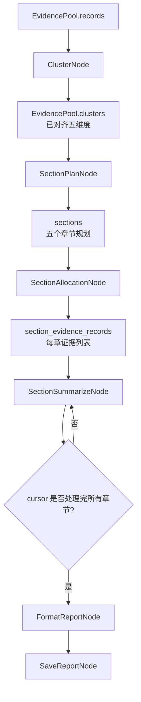
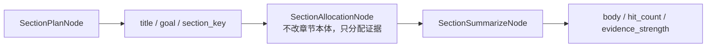
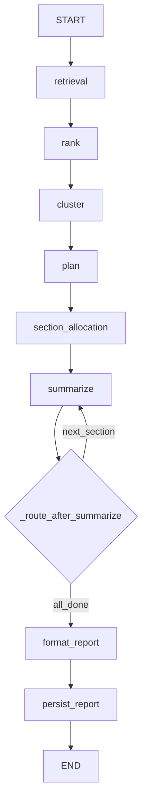
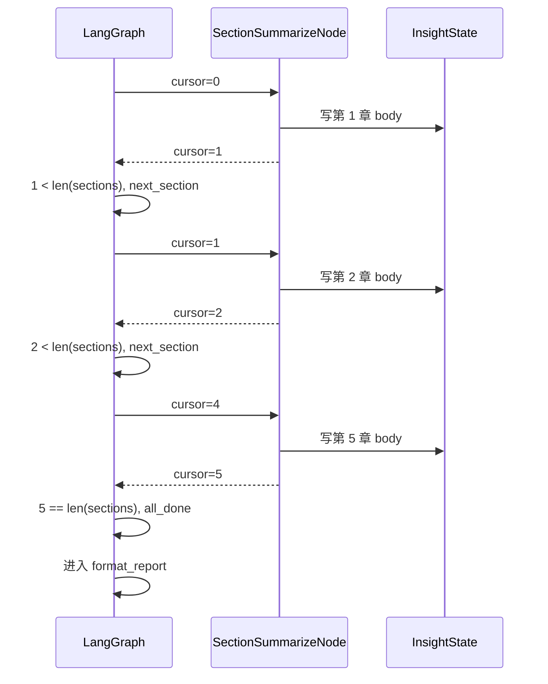
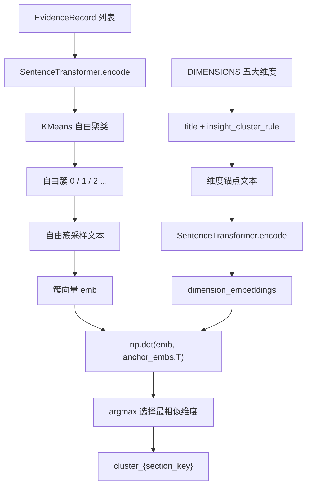
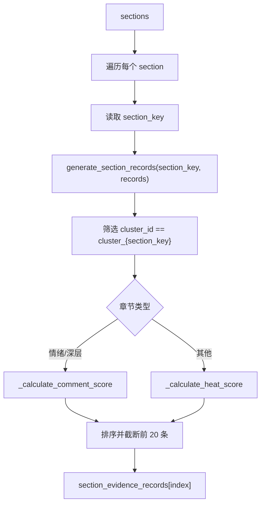
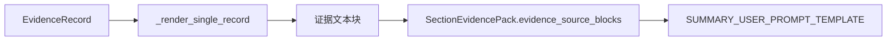
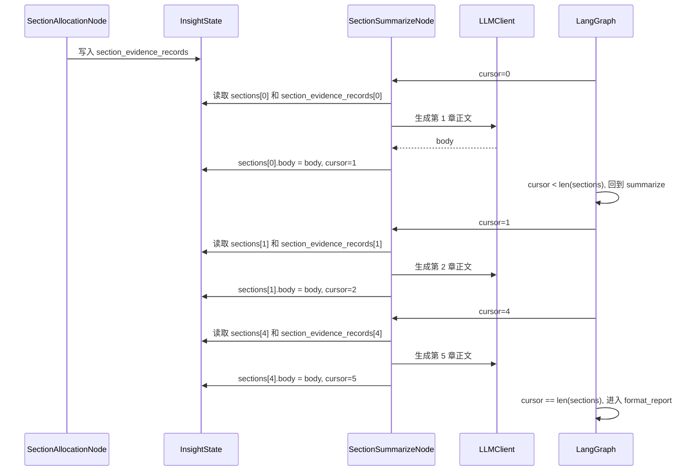
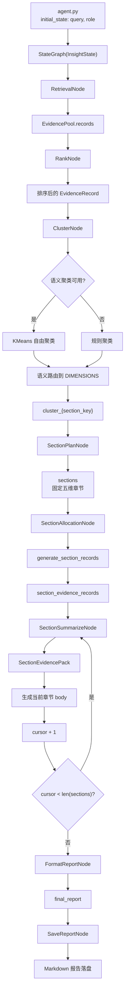

# 06_InsightAgent章节规划证据调拨与循环报告生成

## 课程目标

上一章已经完成了 `InsightAgent` 的证据池治理：

```text
RetrievalNode
    -> 多路召回
    -> EvidenceRecord
    -> EvidencePool

RankNode
    -> 去重
    -> 打分
    -> 通道配额

ClusterNode
    -> 聚类
    -> EvidenceCluster
```

到这里，系统已经不再是一堆零散检索结果，而是拥有了一个可被分析的证据池。但是，报告还没有真正生成，今天要解决的是更重的一层：**把证据池变成结构化报告生产线**。

这一章的重点是：

```text
第一，LangGraph 状态机如何通过 InsightState 管理完整生命周期
第二，固定五维研究框架如何约束报告结构
第三，聚类结果如何通过语义路由对齐到五大固定维度
第四，章节证据如何按 section_key 精准调拨并打包
第五，Summarize 节点如何通过 cursor 游标循环生成多个章节
第六，章节完成后如何进入最终报告排版与落盘
```

如果说上一章解决的是：

```text
哪些证据值得分析
```

那么本章解决的是：

```text
这些证据如何分配到报告章节，并按章节逐步写出来
```


当前依然在这条主线上，只是把命名进行了整理：

```text
SectionPlanNode
SectionAllocationNode
SectionSummarizeNode
FormatReportNode
SaveReportNode
```

有了这条主线以后，我们先不要急着进入某一个函数。今天横跨状态、维度、聚类、章节分配和报告生成，如果不先看清模块边界，后面很容易把“节点职责”和“数据模型职责”混在一起。

## 1. 本章涉及的模块

本章主要涉及这些文件：

```text
└── engines/
    ├── contracts/
    │   └── dimensions.py    # 新建模块
    ├── common/
    │   └── nodes/
    │       ├── format_node.py  # 新建模块 
    │       └── save_report.py  # 新建模块
    └── insight_agent/
        ├── state.py            # 修改模块 
        ├── graph.py            # 修改模块 
        ├── prompts.py          # 新增模块 
        ├── schemas.py          # 新增模块 
        ├── evidence/
        │   ├── models.py       # 修改模块 
        │   └── section.py      # 新增模块 
        └── nodes/
            ├── cluster_node.py    # 修改模块 
            ├── section_plan_node.py   # 新增模块
            ├── section_allocation_node.py   # 新增模块
            └── section_summary_node.py       # 新增模块
```

这些模块可以分为五组：

- `state.py`：定义 LangGraph 全局状态契约。
- `dimensions.py`：定义五大固定研究维度。
- `cluster_node.py`：把证据聚类，并对齐到固定维度。
- `section.py` 与 `section_allocation_node.py`：筛选章节证据并构建证据包。
- `section_summary_node.py`、`format_node.py`、`save_report.py`：循环写章节，整合报告并保存。

整体流程如下：



这一章最重要的不是某一个节点，而是这条状态机链路。

上面这些模块共同组成了一条报告生产线。接下来先从宏观数据流看起：上一章已经有了证据池，本章要做的是把这个证据池一步步加工成可落盘的 Markdown 报告。

## 2. 从证据池到报告流水线

在上一章结束时，`InsightAgent` 的状态大致是：

```text
query
role
evidence_pool
    records
    clusters
```

但完整报告还需要更多中间产物：

```text
sections
section_evidence_records
cursor
final_report
report_title
```

这些字段都被纳入了 `InsightState`。

也就是说，从本章开始，`InsightState` 不只是“节点之间传数据的字典”，而是整条报告生产线的状态契约。

```text
证据池阶段:
    evidence_pool

章节规划阶段:
    sections

证据调拨阶段:
    section_evidence_records

循环生成阶段:
    cursor

最终交付阶段:
    final_report
    report_title
```

既然报告流水线会不断产生中间结果，就必须有一个稳定的位置承载它们。这个位置就是 `InsightState`。理解它之后，后面每个节点“读什么、写什么、为什么能接上”都会清楚很多。

## 3. InsightState：LangGraph 状态机契约

`InsightState` 位于：

```text
engines/insight_agent/state.py
```

当前定义如下：

```python
class InsightState(TypedDict, total=False):
    query: str
    role: str
    evidence_pool: EvidencePool

    sections: list[InsightSection]
    section_evidence_records: list[list[EvidenceRecord]]

    cursor: int

    final_report: str
    report_title: str
```

这里使用了：

```python
TypedDict(total=False)
```

这表示字段不是一开始就全部存在，而是随着节点执行逐步补齐。

这非常符合 LangGraph 的运行方式，只有理解 `InsightState` 的契约地位，后面看节点返回 `{"xxx": value}` 时才不会觉得只是普通字典赋值。

```text
初始状态只有 query / role
RetrievalNode 写入 evidence_pool
SectionPlanNode 写入 sections
SectionAllocationNode 写入 section_evidence_records
SectionSummarizeNode 写入 cursor 和章节 body
FormatReportNode 写入 final_report / report_title
```

### 3.1 为什么 InsightState 很重要

在 LangGraph 中，每个节点都不会直接调用下一个节点。节点只做两件事：

```text
从 state 读取自己需要的数据
返回一个 dict 更新 state
```

因此 `InsightState` 就是节点之间的契约。

例如 `SectionAllocationNode` 依赖：

```text
state["evidence_pool"]
state["sections"]
```

而 `SectionSummarizeNode` 依赖：

```text
state["sections"]
state["section_evidence_records"]
state["cursor"]
```

如果这些字段命名不稳定，或者某个节点没有按约定写入，下游节点就会断。

所以 `InsightState` 的价值是：

```text
定义状态字段
明确字段生命周期
约束节点输入输出
降低节点之间的隐式耦合
```

理解了全局状态，再把镜头缩小到单个章节。因为后续循环写作时，`sections` 列表里的每一项都会被逐步补全。

### 3.2 InsightSection：单章节状态

`InsightSection` 也是一个 `TypedDict`：

```python
class InsightSection(TypedDict, total=False):
    title: str
    goal: list[str]
    section_key: str

    body: str
    hit_count: int
    evidence_strength: EvidenceStrength
```

它分成两类字段。

第一类是plan_node节点规划阶段生成的字段：

```text
title
goal
section_key
```

第二类是summary_node节点摘要阶段补充的字段：

```text
body
hit_count
evidence_strength
```

这体现了“同一个章节对象在流程中逐步变完整”的设计。



有了全局状态和单章节状态的概念之后，最容易混淆的是“哪个字段由哪个节点产生”。所以接下来用生命周期表把这些字段串起来。

### 3.3 InsightState 字段生命周期

用一张表可以更清楚地看出每个字段在哪个阶段产生：

| 字段 | 产生节点 | 消费节点 | 含义 |
| --- | --- | --- | --- |
| `query` | `agent.py` 初始状态 | 全部节点 | 用户研究主题 |
| `role` | `agent.py` 初始状态 | 事件发布、报告保存 | 当前 Agent 角色 |
| `evidence_pool` | `RetrievalNode`，后续 Rank/Cluster 更新 | Plan、Allocation、Summary | 全局证据池 |
| `sections` | `SectionPlanNode` | Allocation、Summary、Format | 五个章节计划与正文 |
| `section_evidence_records` | `SectionAllocationNode` | Summary | 每个章节对应的证据列表 |
| `cursor` | Summary 循环推进 | Graph 条件路由、Summary | 当前正在写第几个章节 |
| `final_report` | `FormatReportNode` | `SaveReportNode` | 最终 Markdown 报告 |
| `report_title` | `FormatReportNode` | `SaveReportNode` | 报告标题 |

从这张表可以看出，`InsightState` 不是随便放字段的地方，而是工作流生命周期本身。

当状态字段讲清楚之后，下一步就要看这些字段是如何沿着图流转的。`InsightState` 是数据契约，`graph.py` 则是执行契约：它决定节点先后顺序，也决定循环什么时候继续、什么时候结束。

## 4. graph.py：状态机主干

`graph.py` 定义完整 LangGraph 流程：

```python
graph.add_edge(START, "retrieval")
graph.add_edge("retrieval", "rank")
graph.add_edge("rank", "cluster")
graph.add_edge("cluster", "plan")
graph.add_edge("plan", "section_allocation")
graph.add_edge("section_allocation", "summarize")
graph.add_conditional_edges(
    "summarize", _route_after_summarize,
    {"next_section": "summarize", "all_done": "format_report"},
)
graph.add_edge("format_report", "persist_report")
graph.add_edge("persist_report", END)
```

这说明当前 `InsightAgent` 已经形成完整链路：

```text
retrieval
    -> rank
    -> cluster
    -> plan
    -> section_allocation
    -> summarize 循环
    -> format_report
    -> persist_report
```

流程图如下：



这里最特别的是 `summarize` 节点。

它不是执行一次就结束，而是通过条件边循环执行多次。每次只生成一个章节，直到所有章节生成完毕。

在这张图里，最值得单独拿出来讲的是 `summarize` 的循环边。普通链式流程只会一路向下执行，而报告生成必须重复写多个章节；这个重复动作不是靠硬编码 `for` 循环完成的，而是靠 `cursor` 和条件边配合完成的。

## 5. cursor 游标：多章节循环的核心

循环控制函数是：

```python
def _route_after_summarize(state: InsightState) -> str:
    cursor = state.get("cursor", 0)
    return "next_section" if cursor < len(state.get("sections", [])) else "all_done"
```

这段代码非常短，但它是第五天状态机的关键。

它表达的是：

```text
如果 cursor 还小于章节数量:
    说明还有章节没写完，回到 summarize

如果 cursor 已经等于或大于章节数量:
    说明所有章节已生成，进入 format_report
```

先从游标的起点讲起。循环能不能稳定执行，第一步取决于第一次进入 `summarize` 时游标是否有一个确定值。

### 5.1 cursor 初始值

`SectionSummarizeNode` 中读取游标：

```python
section_index = state.get("cursor", 0)
```

即使上游节点没有显式写入 `cursor`，它也会从 0 开始。

这意味着第一次进入 `summarize` 时：

```text
cursor = 0
生成第 1 个章节
```

确定了起点之后，就可以看游标如何定位当前章节。这个定位关系是后面“一次写一章”的基础。

### 5.2 每次只处理一个章节

`SectionSummarizeNode` 会用游标取当前章节：

```python
section: InsightSection = sections[section_index]
records = section_evidence_records[section_index]
```

也就是说：

```text
cursor = 0 -> sections[0] -> 第 1 章
cursor = 1 -> sections[1] -> 第 2 章
cursor = 2 -> sections[2] -> 第 3 章
```

既然每次只处理当前章节，那么写完以后必须把游标往后移动。否则状态机会一直重复生成同一章。

### 5.3 写完后推进 cursor

节点最后返回：

```python
return {"sections": sections, "cursor": section_index + 1}
```

这一步会把游标推进到下一个章节。

游标推进只是节点内部动作，真正决定“继续写下一章还是结束”的，是图上的条件边。下面把这两者接起来看。

### 5.4 条件边决定是否继续循环

`summarize` 节点返回后，LangGraph 会调用：

```python
_route_after_summarize(state)
```

如果有 5 个章节，循环过程如下：

```text
第 1 次 summarize:
    cursor 0 -> 写 sections[0] -> 返回 cursor 1
    1 < 5，继续 summarize

第 2 次 summarize:
    cursor 1 -> 写 sections[1] -> 返回 cursor 2
    2 < 5，继续 summarize

第 3 次 summarize:
    cursor 2 -> 写 sections[2] -> 返回 cursor 3
    3 < 5，继续 summarize

第 4 次 summarize:
    cursor 3 -> 写 sections[3] -> 返回 cursor 4
    4 < 5，继续 summarize

第 5 次 summarize:
    cursor 4 -> 写 sections[4] -> 返回 cursor 5
    5 < 5 不成立，进入 format_report
```

文字拆解之后，再用一张时序图把五章循环连起来。这样能看到 `cursor` 如何从局部变量变成整张图的流程控制信号。

### 5.5 cursor 循环流程图



这个设计的好处是：不需要写一个节点内部的 for 循环。每个章节生成都是一次独立的图节点执行，LangGraph 负责调度循环。

游标解决的是“如何一章一章写”的问题，但它还没有回答“到底写哪几章”。这个问题不能完全交给 LLM 自由发挥，所以项目引入了固定五维研究框架。接下来要看的 `dimensions.py`，就是整份报告结构的地基。

## 6. dimensions.py：五维研究框架契约

本章的数据引擎核心从 `dimensions.py` 开始。

文件位置：

```text
engines/contracts/dimensions.py
```

它定义了一个固定研究维度对象：

```python
@dataclass(frozen=True)
class ResearchDimension:
    key: str
    title: str
    insight_goal: str
    media_goal: str
    insight_cluster_rule: tuple[str, ...] | None = None
```

每个维度包含：

```text
key                   程序内部稳定标识，也就是 section_key
title                 展示标题
insight_goal          InsightAgent 私域分析目标
media_goal            MediaAgent 公开媒体分析目标
insight_cluster_rule  Insight 证据聚类规则词
```

当前固定五大维度是：

```text
background_overview       事件背景与概览
heat_and_spread           舆情热度与传播
sentiment_and_opinion     公众情感与观点   # vibe_coding 扩展方向：情感模型进行【1.中性 2.积极、3.消极...】
platform_and_group_diff   平台与群体差异
deep_causes_and_impact    深层原因与影响
```

先说为什么必须固定。只有明确固定维度的必要性，后面 `section_key`、聚类路由和章节分配这些设计才会显得自然。

### 6.1 为什么要固定五维度

LLM 很擅长自由发挥，但报告系统不能完全自由。

如果每次让 LLM 自己决定章节，可能出现：

```text
今天生成 4 章
明天生成 7 章
有时讲事实，有时漏掉情绪
有时章节顺序变化
前端、主持人、双 Agent 对齐都变困难
```

所以当前项目用 `DIMENSIONS` 作为稳定契约。

它的作用是：

```text
约束报告章节数量
约束章节顺序
约束 section_key
约束聚类对齐目标
约束章节证据分配
```

也就是说，五维度不是文案配置，而是整个 Insight 报告流水线的骨架。

固定维度定义好以后，第一类消费者是章节规划节点。它需要把五维框架喂给 LLM，让 LLM 在边界内做规划。

### 6.2 get_insight_dimensions

`SectionPlanNode` 会调用：

```python
get_insight_dimensions()
```

返回给 LLM 的结构是：

```python
[
    {
        "section_key": dimension.key,
        "title": dimension.title,
        "analysis_goal": dimension.insight_goal,
    }
    for dimension in DIMENSIONS.values()
]
```

这让 LLM 在规划章节时必须围绕固定维度生成结果。

除了给 LLM 做章节规划，维度配置还要服务聚类。接下来这个函数就是把维度里的规则词提取出来，交给聚类节点使用。

### 6.3 get_insight_cluster_rules

聚类节点会调用：

```python
get_insight_cluster_rules()
```

它返回：

```python
{
    dimension.key: dimension.insight_cluster_rule
    for dimension in DIMENSIONS.values()
    if dimension.insight_cluster_rule is not None
}
```

这些规则词既用于规则兜底聚类，也用于语义路由的维度构建。

有了五维框架之后，一个新的问题出现了：证据池里的内容并不会天然写着“我属于情绪观点”或“我属于热度传播”。因此，系统必须把证据从自然讨论状态映射到固定维度上，这就是本章数据引擎的第一块**核心逻辑**。

## 7. 数据引擎核心一：语义聚类与维度对齐

上一章的聚类重点是：

```text
把 EvidenceRecord 分成讨论簇
```

当下把聚类重点升级为：

```text
把 EvidenceRecord 分到五大固定报告维度
```

这两者有本质区别。

自由聚类只回答：

```text
哪些证据彼此相似？
```

维度对齐还要回答：

```text
这个相似证据簇应该服务报告的哪个固定章节？
```

所以当前 `cluster_node.py` 的设计是：

```text
先聚类
再路由
最终 cluster_id 必须变成 cluster_{section_key}
```

进入聚类实现时，先不要陷入 K-Means 细节。第一步要看整体策略：系统到底什么时候走语义模型，什么时候降级走规则。

### 7.1 双轨制聚类

`ClusterNode` 的入口逻辑是：

```python
def _cluster_evidence(self, records: list[EvidenceRecord]) -> list[EvidenceCluster]:
    if self._is_semantic_enabled(records):
        return self._cluster_by_semantics(records)
    return self._cluster_by_rules(records)
```

这就是双轨制：

```text
语义聚类可用:
    SentenceTransformer + KMeans + 语义路由

语义聚类不可用:
    规则关键词匹配
```

判断条件是：

```python
settings.INSIGHT_CLUSTERING_ENABLED
and bool(settings.INSIGHT_CLUSTER_MODEL)
and len(records) >= settings.INSIGHT_CLUSTER_MIN_CLUSTER_SIZE
```

必须同时满足：

```text
开关开启
模型已配置
证据数量足够
```

这样设计有一个很实际的好处：模型环境不可用时，系统不会崩掉，而是自动降级为规则聚类。

双轨策略中的第一条路是兜底方案。先看规则聚类，因为它最直接，也能帮助理解最终 `cluster_id` 为什么要绑定 `section_key`。

### 7.2 规则兜底聚类

规则聚类入口：

```python
def _cluster_by_rules(self, records: list[EvidenceRecord]) -> list[EvidenceCluster]:
    partitioned_data: dict[str, list[EvidenceRecord]] = defaultdict(list)

    for record in records:
        cluster_id = self._match_rule_key(record)
        record.cluster_id = cluster_id
        partitioned_data[cluster_id].append(record)

    return self._assemble_clusters(partitioned_data)
```

匹配逻辑：

```python
def _match_rule_key(self, record: EvidenceRecord) -> str:
    text = f"{record.source_keyword} {record.content}"
    for dim_key, keywords in get_insight_cluster_rules().items():
        if any(k in text for k in keywords):
            return f"cluster_{dim_key}"
    return "cluster_other"
```

这里直接把证据文本匹配到固定维度：

```text
命中 background_overview 的规则词 -> cluster_background_overview
命中 heat_and_spread 的规则词     -> cluster_heat_and_spread
命中 sentiment_and_opinion        -> cluster_sentiment_and_opinion
```

规则聚类的优点是稳定、可解释、无模型依赖。

它的缺点是依赖关键词，无法识别更隐晦的语义表达。

规则聚类讲完后，再进入语义聚类。语义聚类解决的是规则词覆盖不到的表达差异，让相似讨论可以靠向量空间聚到一起。

### 7.3 K-Means 语义聚类

语义聚类入口：

```python
def _cluster_by_semantics(self, records: list[EvidenceRecord]) -> list[EvidenceCluster]:
    settings = get_settings()
    sampled = records[:settings.INSIGHT_CLUSTER_MAX_RECORDS]
    contents = [f"{r.source_keyword} {r.content}".strip() for r in sampled]

    embeddings = _get_embedding_model().encode(contents, normalize_embeddings=True, show_progress_bar=False)
    assignments = self._calculate_kmeans_labels(embeddings, len(sampled))
    ...
```

前半段做三件事：

```text
截取最多 INSIGHT_CLUSTER_MAX_RECORDS 条证据
拼接 source_keyword + content 作为编码文本
用 SentenceTransformer 生成语义向量
```

然后调用：

```python
assignments = self._calculate_kmeans_labels(embeddings, len(sampled))
```

K-Means 会给每条证据一个自由簇编号：

```text
0, 1, 2, 0...
```

此时这些簇还不是报告维度，它们只是语义上相近的自然分组。

有了向量之后，K-Means 还需要一个簇数量。这个数量不能拍脑袋写死，因此代码用记录数量和配置项动态估算。

### 7.4 K 值如何决定

K-Means 必须指定 `n_clusters`。

当前由 `_determine_optimal_k()` 决定：

```python
def _determine_optimal_k(self, count: int) -> int:
    settings = get_settings()
    k = count // settings.INSIGHT_CLUSTER_MIN_CLUSTER_SIZE
    return max(2, min(settings.INSIGHT_CLUSTER_MAX_CLUSTERS, k, count))
```

它的思路是：

```text
先按证据数量 / 期望最小簇大小估算 k
再限制 k 至少为 2
再限制 k 不超过最大簇数量
再限制 k 不超过记录总数
```

例如：

```text
count = 50
INSIGHT_CLUSTER_MIN_CLUSTER_SIZE = 3
INSIGHT_CLUSTER_MAX_CLUSTERS = 12

k = 50 // 3 = 16
最终 k = min(12, 16, 50) = 12
```

K-Means 得到的只是自由簇编号，还不能直接服务报告章节。接下来这一步，就是从算法结果走向业务维度的关键桥梁。

### 7.5 从自由簇到标准维度

语义聚类后的临时分组：

```python
temp_groups: dict[int, list[EvidenceRecord]] = defaultdict(list)
for record, label in zip(sampled, assignments):
    temp_groups[label].append(record)
```

此时结构类似：

```text
0 -> [record_a, record_b, record_c]
1 -> [record_d, record_e]
2 -> [record_f, record_g]
```

但最终报告不能使用：

```text
semantic_cluster_0
semantic_cluster_1
semantic_cluster_2
```

因为章节分配依赖固定的 `section_key`。

所以当前项目引入了一个很关键的步骤：**语义路由**。

```python
for cluster_records in temp_groups.values():
    dim_key = self._route_to_dimension(cluster_records)
    cluster_id = f"cluster_{dim_key}"
    for record in cluster_records:
        record.cluster_id = cluster_id
        partitioned_data[cluster_id].append(record)
```

这一步会把自由簇映射到：

```text
cluster_background_overview
cluster_heat_and_spread
cluster_sentiment_and_opinion
cluster_platform_and_group_diff
cluster_deep_causes_and_impact
```

这就是第五天数据引擎的灵魂。

上一节已经看到，K-Means 只能把证据分成自由簇，但自由簇本身并不知道自己属于哪个报告维度。接下来这一步就是关键转折：系统要把“自然形成的讨论簇”投递到“预设的五大章节维度”里。

## 8. 语义路由：用余弦相似度对齐五维度

语义路由由两个函数共同完成：

```text
_get_dimension_anchors()
_route_to_dimension()
```

要把自由簇投递到固定维度，首先要让“固定维度”也能进入同一个语义空间。维度锚点就是为了解决这个问题。

### 8.1 维度锚点是什么

`_get_dimension_anchors()` 会把五大维度也变成向量。

代码如下：

```python
@lru_cache(maxsize=1)
def _get_dimension_anchors():
    rules = get_insight_cluster_rules()

    anchor_texts = [
        f"{dimension_for_key(dim_key).title}: {' '.join(keywords)}"
        for dim_key, keywords in rules.items()
    ]

    dimension_keys = list(rules.keys())
    dimension_embeddings = _get_embedding_model().encode(
        anchor_texts,
        normalize_embeddings=True,
        show_progress_bar=False
    )
    return dimension_keys, dimension_embeddings
```

每个维度锚点文本由两部分组成：

```text
维度标题 + 维度关键词
```

例如：

```text
事件背景与概览: 通报 回应 发布 声明 官方 现场 视频 消息 事件 起因
舆情热度与传播: 热搜 传播 转发 评论 点赞 爆料 关注 刷屏 扩散 趋势
公众情感与观点: 支持 反对 质疑 吐槽 愤怒 担心 理解 争议 态度 看法
```

然后这些文本会被编码成向量。

可以把它理解成：

```text
每个固定维度在语义空间里都有一个标准坐标
```

维度锚点一旦生成，通常不会在一次运行中频繁变化。既然它是稳定数据，就应该缓存起来，避免重复做模型编码。

### 8.2 为什么要缓存维度锚点

`_get_dimension_vector()` 使用了：

```python
@lru_cache(maxsize=1)
```

原因是五大维度的标题和关键词基本不变。

如果每次聚类都重新编码维度锚点，会浪费模型计算。

缓存后：

```text
第一次调用:
    编码五大维度锚点

后续调用:
    直接复用 dimension_embeddings
```

有了维度锚点之后，还需要给每个自由簇也生成一个代表向量。只有两边都在向量空间里，后面才能比较相似度。

### 8.3 自由簇如何生成簇向量

`_route_to_dimension()` 会先把一个自由簇里的证据采样成文本：

```python
sample = " ".join(r.content[:150] for r in records[:10])
emb = _get_embedding_model().encode([sample], normalize_embeddings=True, show_progress_bar=False)
```

这里的策略是：

```text
每条内容最多取前 150 字
一个簇最多取前 10 条
拼成一段 sample
再编码成一个簇向量
```

也就是说：

```text
自由簇 -> 样本文本 -> 簇向量
```

当簇向量和维度锚点向量都准备好之后，路由就变成了一个相似度排序问题。代码里用的是归一化向量的点积。

### 8.4 余弦相似度如何计算

路由核心代码：

```python
keys, anchor_embs = _get_dimension_vector()
similarities = np.dot(emb, anchor_embs.T)[0]
return keys[int(np.argmax(similarities))]
```

因为前面编码时使用了：

```python
normalize_embeddings=True
```

所以向量已经是单位向量。

单位向量之间的点积：

```text
np.dot(a, b)
```

就等价于余弦相似度。

因此这段代码的含义是：

```text
计算当前自由簇向量与五大维度锚点的相似度
选择相似度最高的维度 key
```

例如：

```text
自由簇内容:
    “网友质疑评分标准不透明，很多评论表达担心和不满...”

与五大维度相似度:
    background_overview      0.31
    heat_and_spread          0.42
    sentiment_and_opinion    0.78
    platform_and_group_diff  0.36
    deep_causes_and_impact   0.55

最终路由:
    sentiment_and_opinion
```

公式理解完后，再用流程图把“证据向量、维度锚点、相似度、section_key”串成一条完整路径。

### 8.5 语义路由流程图



这张图是本章最核心的图。

它说明当前项目不是简单地“聚类完就结束”，而是把聚类结果强制接回固定报告结构。

完成语义路由后，聚类结果就不再只是算法输出，而变成了后续章节分配可以直接使用的业务对象。接下来要看的是这个产物如何被封装成 `EvidenceCluster`，以及为什么 `cluster_id` 的命名约定非常关键。

## 9. EvidenceCluster：维度对齐后的聚类产物

无论规则聚类还是语义聚类，最后都会调用：

```python
_assemble_clusters()
```

当前实现如下：

```python
def _assemble_clusters(self, data: dict[str, list[EvidenceRecord]]) -> list[EvidenceCluster]:
    result: list[EvidenceCluster] = []
    for cluster_id, cluster_records in data.items():
        section_key = cluster_id.removeprefix("cluster_")
        label = dimension_for_key(section_key).title

        result.append(EvidenceCluster(
            id=cluster_id,
            label=label,
            summary=f"{label}相关讨论，共 {len(cluster_records)} 条证据。",
            member_record_ids=[r.id for r in cluster_records],
            representative_ids=[r.id for r in cluster_records[:5]],
            size=len(cluster_records),
        ))

    return sorted(result, key=lambda c: c.size, reverse=True)
```

这里有一个非常重要的约定：

```text
cluster_id = cluster_{section_key}
```

例如：

```text
section_key = heat_and_spread
cluster_id  = cluster_heat_and_spread
```

后续 `generate_section_records()` 就靠这个约定筛选证据。

所以 `ClusterNode` 不只是聚类节点，它还是“证据到章节维度”的路由节点。

这里还要特别补充一个很容易被误解、但其实非常漂亮的设计点：**聚类阶段按数据热度排序，交付阶段按业务结构重排**。

聚类节点执行结束时，代码显式使用了：

```python
return sorted(result, key=lambda c: c.size, reverse=True)
```

也就是按照簇规模从大到小排序。

这么做的目的不是决定最终报告章节顺序，而是为了让数据流转阶段更贴近舆情现场：

```text
哪个簇 size 最大
哪个话题就是当前证据池里最显著的讨论方向
```

因此，在聚类节点的日志或调试输出里，按 `size` 倒序非常有价值。它能让开发者和大模型都优先看到主要矛盾，也方便在控制台一眼看出舆情漏斗的分布。

但是，当数据继续流转到 `SectionPlanNode` 后，顺序逻辑会发生切换。`SectionPlanNode` 执行 `generate_insight_section()` 时，不再以聚类结果大小为最终报告顺序，而是以系统内置的五大维度字典为绝对基准进行对齐遍历。

也就是说，进入章节规划及后续节点后，包括证据分发和循环摘要生成，顺序都会被规整回标准业务顺序：

```text
[1/5] background_overview
[2/5] heat_and_spread
[3/5] sentiment_and_opinion
[4/5] platform_and_group_diff
[5/5] deep_causes_and_impact
```

这就是一种典型的“前乱后齐”设计：

```text
数据流阶段:
    按数量 size 排序，让系统优先观察热点簇和主要矛盾。

交付物阶段:
    按固定约束重排，让最终 Markdown 报告符合专家阅读习惯。
```

这种设计在工业级多智能体系统中不仅没有问题，反而是一种很好的架构实践。前半段尊重数据现场，后半段尊重交付结构；既不会因为固定章节顺序遮蔽热点，也不会因为每次聚类结果不同导致报告章节东倒西歪。

所以当前系统的数据分拣是清爽的，结构对齐是严密的，聚类可以按真实证据分布展示热点，报告又能稳定回到标准五维框架。

聚类完成后，证据已经按维度站好队了。但“维度”还不是“章节”，报告还需要标题和分析目标。于是流程从数据引擎进入章节规划阶段：让 LLM 在固定维度框架内生成更贴合本次主题的章节计划。

## 10. SectionPlanNode：生成五章节规划

证据簇已经对齐到固定维度后，下一步是规划报告章节。

`SectionPlanNode` 位于：

```text
engines/insight_agent/nodes/section_plan_node.py
```

核心入口：

```python
async def __call__(self, state: InsightState) -> dict[str, Any]:
    plan_user_prompt = self._build_plan_prompt(state)

    plan: InsightResearchPlan = await self.context.llm_client.generate_object(
        PLAN_SYSTEM_PROMPT, plan_user_prompt, InsightResearchPlan
    )

    sections = self.generate_insight_section(plan)
    return {"sections": sections}
```

它做三件事：

```text
基于证据池构建规划 Prompt
调用 LLM 生成结构化章节计划
将 LLM 计划规范化为固定五章节 InsightSection
```

进入章节规划后，先看 LLM 到底拿到了什么输入。输入设计决定了它会在证据范围内规划，还是脱离证据自由发挥。

### 10.1 规划 Prompt 输入

`_build_plan_prompt()` 会准备三类数据：

```python
research_topic = state["query"]
fixed_dimensions_data = get_insight_dimensions()
plan_overview_evidence = generate_plan_overview(pool)
```

即：

```text
研究主题
固定维度框架
证据池概览
```

这能让 LLM 做规划，但不会让它随意改变报告结构。

固定维度只告诉 LLM 应该写哪几章，证据概览则告诉它每章目前有什么材料。下面这个函数就是把证据池压缩成规划可用的地图。

### 10.2 generate_plan_overview

`generate_plan_overview(pool)` 位于 `evidence/section.py`。

它会从证据池中提取：

```text
total_records
platform_distribution
dimension_clusters
```

其中 `dimension_clusters` 会包含每个聚类簇的：

```text
dimension_goal
label
size
representative_quotes
```

这相当于给 LLM 一个“证据地图”：

```text
当前证据大概覆盖哪些维度
每个维度有多少证据
代表性内容是什么
```

Prompt 输入准备好以后，还需要约束 LLM 的输出格式。否则章节规划可能变成自由文本，后续节点就无法稳定读取。

### 10.3 结构化输出 InsightResearchPlan

`schemas.py` 定义：

```python
class InsightSectionPlan(BaseModel):
    title: str
    section_key: str
    goal_analysis_points: list[str]

class InsightResearchPlan(BaseModel):
    sections: list[InsightSectionPlan]
```

这里通过 Pydantic 约束 LLM 输出：

```text
sections 必须是 5 个
每个 section 必须有 section_key
每个章节要有 1 到 3 个分析目标
```

这比让 LLM 返回自由文本更稳。

结构化输出还不够，系统还要把它重新对齐到固定维度顺序。这样即使 LLM 漏项或顺序不稳，最终章节列表仍然可靠。

### 10.4 generate_insight_section：LLM 结果与固定维度对齐

`generate_insight_section()` 不直接相信 LLM 的顺序，而是遍历 `DIMENSIONS.values()`：

```python
for dimension in DIMENSIONS.values():
    llm_section = next(
        (section for section in plan.sections if section.section_key.strip() == dimension.key),
        None
    )
    ...
```

这意味着最终章节一定按固定五维顺序输出。

如果 LLM 漏掉某个维度：

```python
goals = [dimension.insight_goal]
title = dimension.title
```

系统会用默认维度配置兜底。

最终构建：

```python
InsightSection(
    title=title,
    goal=goals,
    section_key=dimension.key
)
```

这一步很关键：LLM 可以优化标题和目标，但不能破坏 `section_key` 契约。

章节计划出来之后，每个章节已经知道自己要分析什么，但还没有拿到属于自己的材料。接下来进入第二个数据引擎核心：把全局证据池里的记录，按照 `section_key` 精准分发到对应章节。

## 11. 数据引擎核心二：章节证据调拨

章节规划完成后，系统已经有了：

```text
sections:
    第 1 章 background_overview
    第 2 章 heat_and_spread
    第 3 章 sentiment_and_opinion
    第 4 章 platform_and_group_diff
    第 5 章 deep_causes_and_impact
```

但每章还需要自己的证据。

这就是 `SectionAllocationNode` 的职责。

文件位置：

```text
engines/insight_agent/nodes/section_allocation_node.py
```

讲章节调拨时，先看节点入口。它负责从状态里取出全局证据和章节规划，然后构造下游摘要节点需要的二维证据列表。

### 11.1 SectionAllocationNode.__call__

核心逻辑：

```python
pool: EvidencePool = state["evidence_pool"]
records = pool.records
sections: list[InsightSection] = list(state.get("sections", []))

section_evidence_records: list[list[EvidenceRecord]] = []

for section in sections:
    section_key = section["section_key"]
    section_records = generate_section_records(section_key, records)[:20]
    section_evidence_records.append(section_records)

return {
    "sections": sections,
    "section_evidence_records": section_evidence_records
}
```

它不会写正文，只做调拨：

```text
第 1 章拿第 1 章的证据
第 2 章拿第 2 章的证据
...
```

调拨结果保存在：

```text
section_evidence_records
```

这是一个二维列表：

```text
[
    [第 1 章证据列表],
    [第 2 章证据列表],
    [第 3 章证据列表],
    [第 4 章证据列表],
    [第 5 章证据列表],
]
```

这个结构正好和 `sections` 的索引一一对应。

节点入口只是遍历章节，真正决定“某条证据是否属于这一章”的逻辑在 `generate_section_records` 里。

### 11.2 generate_section_records：按 section_key 精准筛选

`generate_section_records()` 位于：

```text
engines/insight_agent/evidence/section.py
```

实现如下：

```python
def generate_section_records(section_key: str, records: list[EvidenceRecord]) -> list[EvidenceRecord]:
    matched_records = [r for r in records if r.cluster_id == f"cluster_{section_key}"]
    if not matched_records:
        return []

    sort_key = _calculate_comment_score if section_key in {"sentiment_and_opinion",
                                                           "deep_causes_and_impact"} else _calculate_heat_score
    return sorted(matched_records, key=sort_key, reverse=True)
```

第一步是精准筛选：

```text
r.cluster_id == f"cluster_{section_key}"
```

例如：

```text
section_key = sentiment_and_opinion
只选择 cluster_id == cluster_sentiment_and_opinion 的证据
```

这依赖前面 `ClusterNode` 的维度对齐。

如果聚类阶段没有把 `cluster_id` 对齐到固定维度，章节调拨就无法精准完成。

筛选只是第一步。属于同一章节的证据也有优先级，所以代码会根据章节类型选择不同排序策略。

### 11.3 不同章节使用不同排序策略

`generate_section_records()` 不是只筛选，还会排序。

对于：

```text
sentiment_and_opinion
deep_causes_and_impact
```

使用：

```python
_calculate_comment_score
```

其他章节使用：

```python
_calculate_heat_score
```

为什么？

因为情绪观点、深层原因这类章节更依赖“有表达质量的评论和内容”，不一定只看热度。

而事件背景、热度传播、平台差异更需要高热内容和高综合分证据。

先看偏观点分析的排序。情绪和深层原因章节需要更重视表达质量，而不只是互动热度。

### 11.4 _calculate_comment_score

```python
def _calculate_comment_score(record: EvidenceRecord) -> float:
    eng = record.engagement
    score = (
        float(record.final_score)
        + min(len(record.content) / 100, 1.0) * 0.5
        + min(float(eng.replies) / 5, 1.0) * 0.3
        + min(float(eng.likes) / 500, 1.0) * 0.2
    )
    return round(score, 3)
```

这个分数关注：

```text
综合排序分 final_score
内容长度
回复数
点赞数
```

内容长度被纳入，是因为太短的评论往往信息量不足。

回复数和点赞数被纳入，是因为它们表示观点被讨论或认可。

再看偏传播和概览的排序。这里更关注热度和综合分，让高影响力内容优先进入章节上下文。

### 11.5 _calculate_heat_score

```python
def _calculate_heat_score(record: EvidenceRecord) -> float:
    score = float(record.hotness_score) + float(record.final_score) * 0.1
    return round(score, 3)
```

这个分数主要看：

```text
热度分 hotness_score
综合分 final_score 的轻微加权
```

它适合热度、传播、背景类章节。

把筛选和排序都拆开后，再用流程图把章节调拨的完整动作串起来。

### 11.6 章节调拨流程图



证据被分配到章节之后，还不能直接原样丢给 LLM。LLM 需要的是结构清楚、信息密度高、带有强度提示的上下文。因此，下一步要把章节记录列表打包成 `SectionEvidencePack`。

## 12. SectionEvidencePack：章节证据包

`SectionSummarizeNode` 不会把原始 `EvidenceRecord` 直接丢给 LLM，而是先构建 `SectionEvidencePack`。

模型定义在：

```text
engines/insight_agent/evidence/models.py
```

```python
@dataclass(slots=True)
class SectionEvidencePack:
    used_query: str = ""
    evidence_count: int = 0
    strength: EvidenceStrength = "missing"
    evidence_source_blocks: list[str] = field(default_factory=list)
```

字段含义：

```text
used_query               当前研究主题
evidence_count           本章证据数量
strength                 证据强度: missing / weak / medium / strong
evidence_source_blocks   渲染给 LLM 的证据文本块
```

先看证据包的入口函数。它把一组 `EvidenceRecord` 转换成 LLM 写作真正会消费的结构。

### 12.1 generate_section_evidence_pack

构建函数如下：

```python
def generate_section_evidence_pack(
    used_query: str,
    selected: list[EvidenceRecord],
) -> SectionEvidencePack:
    count = len(selected)
    return SectionEvidencePack(
        used_query=used_query,
        evidence_count=count,
        strength=_evaluate_evidence_strength(count),
        evidence_source_blocks=_render_evidence_records(selected),
    )
```

它做三件事：

```text
统计证据数量
评估证据强度
把 EvidenceRecord 渲染成文本块
```

证据数量不仅用于展示，也会影响写作策略。接下来这个强度评估就是告诉 LLM：本章材料到底充不充分。

### 12.2 证据强度评估

```python
def _evaluate_evidence_strength(hit_count: int) -> EvidenceStrength:
    if hit_count >= 10:
        return "strong"
    if hit_count >= 5:
        return "medium"
    if hit_count > 0:
        return "weak"
    return "missing"
```

强度规则很直观：

```text
0 条       missing
1-4 条     weak
5-9 条     medium
10 条以上  strong
```

这个字段会传给 LLM，让它知道本章节证据是否充分。

如果证据很弱，LLM 应该更谨慎；如果证据缺失，则不应该硬写。

强度给出整体判断，文本块则提供具体材料。下面这一步把程序对象渲染成可读上下文，让 LLM 能真正引用证据。

### 12.3 证据文本块渲染

```python
def _render_evidence_records(select_records: list[EvidenceRecord]) -> list[str]:
    return [
        _render_single_record(record)
        for record in select_records[:30]
    ]
```

当前最多渲染 30 条。

单条证据渲染为：

```text
标题
发布时间/抓取时间
平台
互动数据
来源关键词
来源表
热度分
综合分
内容
```

这一步的意义是：把程序对象转换成 LLM 能理解的上下文文本。



当章节证据包准备好以后，才真正进入写作阶段。这里要特别注意：`SectionSummarizeNode` 的职责不是生成整份报告，而是消费当前游标指向的一个章节证据包，生成一个章节正文，然后把游标往前推。

## 13. SectionSummarizeNode：单章写作与循环推进

`SectionSummarizeNode` 位于：

```text
engines/insight_agent/nodes/section_summary_node.py
```

这是本章第二个核心节点。

它不是一次写完整份报告，而是一次写一个章节。

进入摘要节点时，还是先看入口。入口方法把游标、章节、证据列表和证据包全部接起来。

### 13.1 SectionSummarizeNode.__call__

核心流程如下：

```python
section_index = state.get("cursor", 0)
sections = list(state.get("sections", []))
section_evidence_records = list(state.get("section_evidence_records", []))

if section_index >= len(sections):
    return {"sections": sections}

section = sections[section_index]
records = section_evidence_records[section_index] if section_index < len(section_evidence_records) else []

pack = generate_section_evidence_pack(state["query"], records)
section["hit_count"] = pack.evidence_count
section["evidence_strength"] = pack.strength
```

这段代码体现了摘要节点的四个输入：

```text
cursor
sections
section_evidence_records
query
```

它每次只处理：

```text
sections[cursor]
section_evidence_records[cursor]
```

入口拿到证据包后，第一件事不是立刻调用 LLM，而是判断有没有证据。没有证据时必须走保守分支。

### 13.2 空证据分支

如果当前章节没有证据：

```python
if pack.evidence_count <= 0:
    section["body"] = FALLBACK_BODY
```

兜底内容是：

```text
该维度未有相关内容，本章节暂不做延展
```

这个设计很重要。

舆情报告最怕的是没有证据还硬写。空证据分支明确告诉后续报告：这个维度数据不足。

如果证据包不为空，节点才进入真正的章节写作分支，把章节计划和证据文本一起交给 LLM。

### 13.3 有证据分支

如果有证据，则调用：

```python
section["body"] = await self._generate_section_body(section, pack)
```

`_generate_section_body()` 会构建：

```python
section_plan = {
    "title": section.get("title", ""),
    "section_key": section.get("section_key", ""),
    "expected_analysis_points": section.get("goal", []),
}
```

然后填充 Prompt：

```python
prompt = PromptTemplate.from_template(SUMMARY_USER_PROMPT_TEMPLATE).format(
    used_query=pack.used_query,
    section_plan=json.dumps(section_plan, ensure_ascii=False, indent=2),
    search_evidence_results="\n\n".join(pack.evidence_source_blocks),
    evidence_strength=pack.strength
)
```

这里 LLM 得到的是：

```text
本章规划目标
证据强度
真实证据文本块
```

因此它不是凭空写，而是围绕证据包写。

章节正文生成后，系统还要把这个阶段性结果发布出去。这样前端可以实时看到每个章节完成，而不是等待整份报告结束。

### 13.4 章节就绪事件

写完章节后：

```python
dispatch_section_ready_event(state, section_index, section)
```

这个函数会构建 `SectionReadyEvent` 并发布。

事件中包含：

```text
agent_name
section_key
section_index
title
query
body
section_metadata
```

`section_metadata` 当前包含：

```text
hit_count
evidence_strength
```

这意味着前端或 SSE 订阅方可以在每章完成时收到实时更新，而不是等整份报告全部完成。

事件发布完成后，当前章节才算真正闭环。最后一步是推进游标，把控制权交还给 LangGraph 的条件路由。

### 13.5 推进 cursor

最后：

```python
sections[section_index] = section
return {"sections": sections, "cursor": section_index + 1}
```

这一步是循环推进的关键。

`SectionSummarizeNode` 每次执行后都会：

```text
写入当前章节 body
推进 cursor
把控制权交还给 graph 条件边
```

单独看 `SectionSummarizeNode` 会理解它如何写一章，但还不够直观。下面把它放回 LangGraph 的循环里，用时序图完整看一遍“调拨证据之后，五个章节如何被逐个生成”。

## 14. Summarize 循环完整时序

把 `SectionAllocationNode` 和 `SectionSummarizeNode` 放在一起看，流程是：



这个循环机制让每章都能独立生成、独立发布事件、独立推进状态。

当 `cursor` 推进到章节末尾，说明五个章节正文都已经写完。此时系统不再需要继续循环，而是进入最终整合阶段：把多个章节正文整理成一份完整报告。

## 15. FormatReportNode：整合章节为最终报告

当 `_route_after_summarize()` 返回 `all_done` 后，流程进入：

```text
format_report
```

节点位于：

```text
engines/common/nodes/format_node.py
```

它读取：

```python
role = state.get("role", "insight")
query = state.get("query", "未知主题")
sections = state.get("sections", [])
```

然后构建：

```python
report_context = json.dumps(
    [{"title": section.get("title"), "body": section.get("body")} for section in sections],
    ensure_ascii=False,
)
```

也就是说，最终报告排版不再直接看原始证据，而是看五个已经生成好的章节正文。

流程如下：

```text
sections[*].body
    -> report_context
    -> role.format_system_prompt
    -> LLM 整合排版
    -> final_report
```

如果 LLM 排版失败，则走程序化兜底：

```python
md_report = _fallback_report(agent_name, query, sections)
```

最后返回：

```python
return {"final_report": md_report, "report_title": query}
```

报告排版完成后，状态机里已经有了 `final_report`，但用户最终需要的是可访问、可保存的文件。因此，最后一步是把 Markdown 内容落盘，让这次研究任务拥有明确的交付物。

## 16. SaveReportNode：最终落盘

最后一个节点是：

```text
persist_report
```

对应文件：

```text
engines/common/nodes/save_report.py
```

它读取：

```python
role = state.get("role")
title = state.get("report_title")
final_report = state.get("final_report")
```

然后调用：

```python
save_md_report(
    self.context.output_dir,
    role,
    title,
    final_report
)
```

到这里，整个 InsightAgent 报告链路完成：

```text
检索证据
治理证据
聚类对齐
规划章节
调拨证据
循环写作
整合排版
保存报告
```

到这里，InsightAgent已经闭环：从用户输入舆论话题到最终生成关于该话题的讨论报告。


## 18. 本章完整流程图

最后用一张完整图串起来：



这张图体现了第五天代码的整体价值：它把证据池真正推进成可交付的报告流水线。

完整流程图已经把技术路径串起来了。最后做一个收束：这一章真正新增的，不只是几个节点，而是一套把“证据池”稳定转化为“结构化报告”的状态机生产方式。

## 18. 本章小结

本章完成了 `InsightAgent` 从“证据治理”到“报告生产”的关键升级。

当前已经具备：

```text
InsightState 完整状态契约
InsightSection 章节交付物
LangGraph 条件边循环
cursor 多章节游标控制
五维 ResearchDimension 契约
KMeans 语义聚类
规则兜底聚类
自由聚类簇到固定维度的语义路由
SectionPlanNode 章节规划
SectionAllocationNode 章节证据调拨
generate_section_records 精准筛选证据
SectionEvidencePack 章节证据包
SectionSummarizeNode 循环生成章节正文
SectionReadyEvent 章节完成事件
FormatReportNode 最终报告排版
SaveReportNode Markdown 落盘
```

这一章最核心的思想有两个。

第一个是 `InsightState` 契约：

```text
所有节点都围绕同一份状态逐步补齐产物
```

第二个是 `section_key` 主线：

```text
DIMENSIONS.key
    -> cluster_{section_key}
    -> section.section_key
    -> generate_section_records(section_key)
    -> SectionEvidencePack
    -> 章节正文
```

只要理解这两条线，就能理解第五天代码为什么能把“检索和聚类结果”稳定地转化为“五章结构化舆情报告”。
