# 07_MediaAgent与证据契约边界重构

## 课程目标

上一章已经把 `InsightAgent` 从“证据池”推进到了“结构化报告生成”：

```text
EvidencePool
    -> ClusterNode
    -> SectionPlanNode
    -> SectionAllocationNode
    -> SectionSummarizeNode
    -> FormatReportNode
    -> SaveReportNode
```

到这里，私域舆情分析链路已经能够完成检索、排序、聚类、章节规划、证据调拨和循环写作。但是舆情项目并不是`InsightAgent`流水线，而是一个多 Agent 协作架构。

```text
InsightAgent  私域舆情库检索专家
MediaAgent    公域媒体检索专家
```

这两个Agent都是围绕同一个舆情主题生成五维报告，但它们的**数据来源、工具调用方式、证据加工方式**并不一样。所以第今天真正要解决的问题不只是是“再写一个 Agent”，而是：

```text
多个 Agent 如何共享一套稳定契约，
同时又不把各自的私有领域模型强行揉在一起。
```

本章重点有四条主线：

```text
第一，工具与五维契约的映射关系。
第二，EvidenceRecord 作为跨 Agent 共享的证据记录。
第三，“谁消费，谁定义；只共享，不强融”的私有领域模型回归。
第四，evidence 与 evidence_processor 的“数据契约”和“处理行为”分离。
```

我们还是先把本章要看的模块摆出来。

## 1. 本章涉及的模块

本章主要涉及这些文件：

```text
└── engines/
    ├── contracts/
    │   ├── dimensions.py
    │   └── evidence/
    │       ├── models.py
    │       └── render.py
    ├── insight_agent/
    │   ├── state.py
    │   ├── graph.py
    │   ├── evidence_processor.py
    │   └── nodes/
    │       ├── retrieval_node.py
    │       ├── rank_node.py
    │       ├── cluster_node.py
    │       ├── section_plan_node.py
    │       ├── section_allocation_node.py
    │       └── section_summary_node.py
    └── media_agent/
        ├── state.py
        ├── graph.py
        ├── context.py
        ├── evidence_processor.py
        ├── schemas.py
        ├── data/
        │   └── web_search/
        │       ├── schemas.py
        │       ├── factory.py
        │       └── providers/
        └── nodes/
            ├── section_plan_node.py
            ├── section_search_node.py
            └── section_summary_node.py
```

这些模块可以分成三层：

```text
contracts 层
    放真正跨 Agent 共享的稳定契约。

insight_agent 层
    放私域舆情库检索、排序、聚类、证据调拨与写摘要逻辑。

media_agent 层
    放公域网页搜索、工具选择、搜索证据打包与写逻辑。
```

用一张图看更直观：

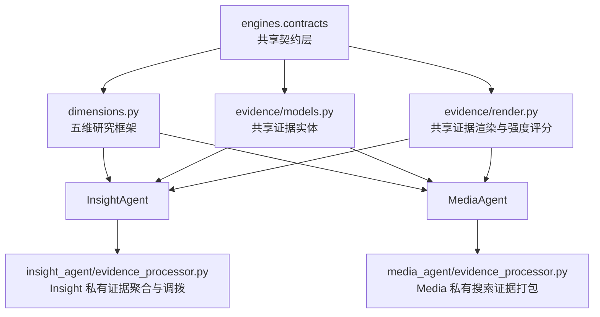

这张图的关键不是模块数量，而是箭头方向。

`contracts` 可以被两个 Agent 依赖，但 `insight_agent` 和 `media_agent` 之间不要互相依赖。否则，后面任何一个 Agent 的私有模型变化，都会影响另一个 Agent。明确了文件结构之后，下一步先看最上层的共同语言：五维契约。

## 2. 多 Agent 的共同语言：五维契约

无论是私域舆情库，还是公域媒体搜索，最终都要交付一份结构稳定的舆情分析报告。

如果两个 Agent 各自决定章节结构，就会出现：

```text
InsightAgent 生成 5 章
MediaAgent 生成 4 章

InsightAgent 的第三章叫“情绪观点”
MediaAgent 的第三章叫“媒体评价”

InsightAgent 先讲热度
MediaAgent 先讲原因
```

这样前端展示、报告合并、主持 Agent 汇总都会变得很难。

所以项目把五维研究框架放在：

```text
engines/contracts/dimensions.py
```

核心模型是：

```python
@dataclass(frozen=True)
class ResearchDimension:
    key: str
    title: str
    insight_goal: str
    media_goal: str
    insight_cluster_rule: tuple[str, ...] | None = None
```

这里一个维度同时包含两套目标：

```text
insight_goal  给 InsightAgent 使用
media_goal    给 MediaAgent 使用
```

这说明五维契约不是某一个 Agent 的私有配置，而是多 Agent 共同对齐的报告结构。

当前固定五维是：

```text
background_overview       事件背景与概览
heat_and_spread           舆情热度与传播
sentiment_and_opinion     公众情感与观点
platform_and_group_diff   平台与群体差异
deep_causes_and_impact    深层原因与影响
```

这五个 `key` 会贯穿后续流程：

```text
DIMENSIONS.key
    -> section_key
    -> cluster_id
    -> 章节规划
    -> 证据调拨
    -> 章节摘要
    -> 最终报告结构
```

也就是说，`section_key` 是系统里非常重要的稳定主键

## 3. 工具与五维契约的映射关系

本章最重要的新增设计之一，就是 `MediaAgent` 开始把“五维章节规划”和“搜索工具选择”绑定起来。

在 `media_agent/nodes/section_plan_node.py` 中有一个工具描述字典：

```python
SEARCH_TOOL_DESCRIPTIONS: dict[SearchTool, str] = {
    "comprehensive_search": "综合搜索,适合全面理解事件、原因、影响和多来源报道。",
    "source_search": "溯源检索,适合获取可核查的网页出处、原始媒体标题和广泛的表面事实。",
    "realtime_search": "实时追踪,适合获取事件的最新进展、舆情热度变化和最新的传播动态。",
}
```

这三个工具不是随便给 LLM 调用的。`PlanNode` 会把两类信息一起放进 Prompt：

```text
fixed_dimensions  固定五维研究框架
available_tools   当前可用搜索工具及描述
```

也就是说，LLM 在做章节规划时，不只是生成标题，还要为每一个维度选择合适的搜索工具和搜索关键词。

流程如下：

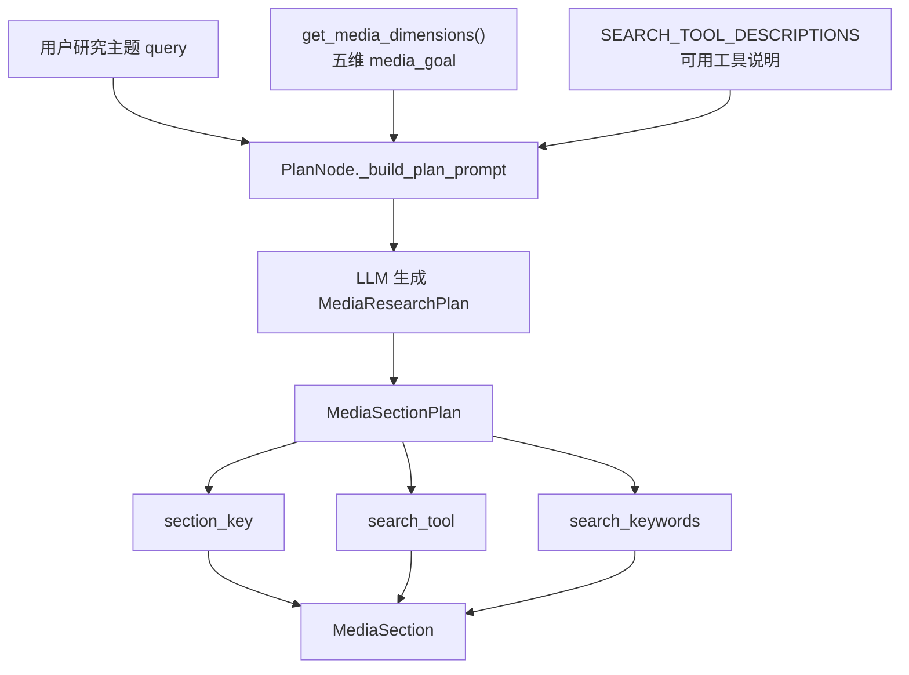

这里的关键是：工具不是全局一次性决定，而是按章节维度决定。

例如：

| 五维契约 | Media 侧分析目标 | 工具选择倾向 |
| --- | --- | --- |
| `background_overview` | 梳理基础报道、首发信息、权威信源 | 适合 `source_search` |
| `heat_and_spread` | 分析报道热度、扩散节点、传播节奏 | 适合 `realtime_search` |
| `sentiment_and_opinion` | 分析公开报道和评论反馈中的情绪倾向 | 适合 `comprehensive_search` |
| `platform_and_group_diff` | 比较官方媒体、市场化媒体、自媒体差异 | 适合 `comprehensive_search` |
| `deep_causes_and_impact` | 分析社会背景、争议成因、外溢影响 | 适合 `comprehensive_search` |

注意，这张表不是硬编码规则，而是业务上的选择倾向。

真正的工具选择由 LLM 根据：

```text
研究主题
固定维度目标
工具描述
```

共同决定。

但是最终章节顺序不能让 LLM 自由打乱，所以 `_generate_media_section()` 仍然以 `DIMENSIONS.values()` 为绝对基准遍历：

```python
for dimension in DIMENSIONS.values():
    llm_section = next(
        (section for section in plan.sections if section.section_key == dimension.key),
        None
    )
```

如果 LLM 漏掉某个维度，代码会使用默认值兜底：

```text
title           使用 dimension.title
goal            使用 dimension.media_goal
search_tool     使用 comprehensive_search
search_keywords 使用 dimension.title
```

这就是一个很典型的工业级设计：

```text
让 LLM 决定弹性部分，
让代码守住结构部分。
```

### 3.1 为什么 MediaAgent 需要这三个工具

`MediaAgent` 面向的是公域媒体检索，它和 `InsightAgent` 的私域数据库召回不一样。

私域检索更关注：

```text
库里有什么
哪些内容更热
哪些评论更能代表观点
哪些证据属于哪个聚类维度
```

公域媒体检索更关注：

```text
事件有没有权威来源
公开报道是否完整
最新进展是什么
不同媒体和平台如何叙事
```

所以当前没有把 Web 搜索工具做成很多碎片化工具，而是收敛成三个稳定入口：

```text
comprehensive_search  综合搜索
source_search         溯源检索
realtime_search       实时追踪
```

这三个工具刚好覆盖媒体分析中最常见的三种信息需求。

| 工具 | 解决的问题 | 适合的证据类型 | 不适合的场景 |
| --- | --- | --- | --- |
| `comprehensive_search` | 这个事件公开报道的全貌是什么 | 多来源报道、背景材料、原因影响、观点综述 | 要求严格限定官方来源时不够精确 |
| `source_search` | 这个信息最早或最权威的出处在哪里 | 官方通报、权威媒体、原始报道、可核查链接 | 需要追热点扩散速度时不够灵活 |
| `realtime_search` | 最近一段时间发生了什么新变化 | 最新进展、热搜变化、传播动态、近期报道 | 做深度背景分析时可能材料太碎 |

也就是说，这三个工具不是按供应商划分的，而是按业务问题划分的。

```text
综合搜索回答“看全”。
溯源检索回答“看准”。
实时追踪回答“看新”。
```

有了这个理解，再看它们和五维契约的映射会更自然。

### 3.2 三个工具如何覆盖五个维度

五个维度并不是平均使用三个工具，而是每个维度有自己的主要信息需求，实际执行时，`PlanNode` 让 LLM 在每个维度上选择一个主要工具；不过后续如果要增强，也可以让一个维度生成主工具和补充工具两组查询，但目前保持一个章节一个工具更清晰也够用了。

| 五维维度 | 核心问题 | 主工具 | 辅助工具 | 原因 |
| --- | --- | --- | --- | --- |
| `background_overview` | 事件事实、首发信息、权威框架 | `source_search` | `comprehensive_search` | 背景章节不能只看二手转述，必须优先找到权威来源和原始报道 |
| `heat_and_spread` | 热度变化、扩散节点、最新传播 | `realtime_search` | `comprehensive_search` | 热度章节最依赖时间窗口，必须优先看近期结果 |
| `sentiment_and_opinion` | 公开观点、情绪倾向、争议表达 | `comprehensive_search` | `realtime_search` | 观点分析需要广覆盖，但热点期也要补近期表达 |
| `platform_and_group_diff` | 官方媒体、市场化媒体、自媒体差异 | `comprehensive_search` | `source_search` | 需要覆盖多个来源类型，再用溯源结果校准权威叙事 |
| `deep_causes_and_impact` | 背景原因、议程设置、风险影响 | `comprehensive_search` | `source_search` | 深层分析需要更充分的背景材料，同时不能脱离可信来源 |

这张表说明了一个核心取舍：

```text
MediaAgent 不需要为五个维度各做一个工具。
它只需要三个足够稳定的工具，再让五维契约决定怎么组合使用。
```

如果工具太多，LLM 在规划阶段反而容易选择困难，工具语义也会互相重叠。

当前三个工具的颗粒度比较合适：

```text
source_search
    负责事实锚点和可信来源。

realtime_search
    负责时间敏感的传播动态。

comprehensive_search
    负责全景材料和深度背景。
```

### 3.3 业务工具与搜索客户端的分层

这里要特别区分两个概念：

```text
业务工具 tool
    comprehensive_search / source_search / realtime_search

底层客户端 provider
    AnspireSearchClient / BochaSearchClient / TavilySearchClient
```

业务工具回答的是：

```text
我现在要解决哪类检索问题？
```

底层客户端回答的是：

```text
哪个搜索供应商更擅长解决这个问题？
```

当前 `WebSearchClient` 会先选择一个底层客户端：

```python
class WebSearchClient:
    CLIENT_MAPPING = {
        "AnspireAPI": AnspireSearchClient,
        "BochaAPI": BochaSearchClient,
        "TavilyAPI": TavilySearchClient,
    }

    def __init__(self, search_switch=None):
        client_class = self.CLIENT_MAPPING.get(search_switch, TavilySearchClient)
        self._client = client_class()
```

然后三个工具都转发给同一个客户端：

```python
async def comprehensive_search(self, query: str):
    return await self._client.comprehensive_search(query)

async def source_search(self, query: str):
    return await self._client.source_search(query)

async def realtime_search(self, query: str):
    return await self._client.realtime_search(query)
```

这个写法虽然扩展性强，但是从业务设计看，它还不够理想。

因为它表达的是：

```text
先选一个客户端，
然后让这个客户端包办三个工具。
```

但真实业务更合理的表达应该是：

```text
先根据五维章节选择业务工具，
再根据业务工具选择最适合的客户端。
```

也就是说，不应该是：

```text
TavilyAPI
    -> comprehensive_search
    -> source_search
    -> realtime_search
```

而应该是：

```text
comprehensive_search
    -> 选择最适合做综合覆盖的客户端

source_search
    -> 选择最适合做权威溯源的客户端

realtime_search
    -> 选择最适合做实时追踪的客户端
```

这个转变很关键。它会让 `MediaAgent` 的工具系统从“客户端优先”变成“业务能力优先”。

为了说明为什么要这样改，先比较三个客户端各自擅长什么。

### 3.4 三个客户端能力对比

当前项目里已经实现了三个搜索客户端：

```text
AnspireSearchClient
BochaSearchClient
TavilySearchClient
```

它们都实现了 `comprehensive_search`、`source_search`、`realtime_search` 三个方法，但这不代表它们做这三件事的效果一样。

真正要看的是每个客户端底层参数能力。

| 客户端 | 当前核心参数 | 更擅长的能力 | 主要优势 | 主要限制 |
| --- | --- | --- | --- | --- |
| `AnspireSearchClient` | `Insite`、`FromTime`、`ToTime`、`top_k` | 定向站点检索、权威源过滤、指定平台搜索 | 可以用 `Insite` 限定官方站点、媒体站点、社交站点，适合做溯源和来源控制 | 如果 `Insite` 配得过窄，召回会不足；不适合单独承担全景搜索 |
| `BochaSearchClient` | `count`、`freshness` | 中文网页广覆盖、通用搜索、近期网页补充 | 参数简单，适合拉一批中文网页材料做综合分析 | 站点约束和深度控制较弱，溯源精确度不如 Anspire |
| `TavilySearchClient` | `search_depth`、`topic`、`time_range`、`days`、`max_results` | 新闻搜索、时间窗口检索、深度相关性搜索 | `topic="news"` 和 `time_range="week"` 适合追新，`search_depth="advanced"` 适合更深的相关性搜索 | 如果用于中文权威站点溯源，需要额外配合域名过滤或查询词约束 |

从这张表可以看出：

```text
Anspire 的核心价值是“限定在哪里搜”。
Bocha 的核心价值是“快速拉取较广的中文网页材料”。
Tavily 的核心价值是“按新闻/时间/深度做更强控制”。
```

所以三个客户端最适合承接的工具并不一样。

### 3.5 工具到客户端的最佳映射

如果按当前三个工具做一对一主映射，建议是：

| 业务工具 | 最适合的主客户端 | 为什么 |
| --- | --- | --- |
| `source_search` | `AnspireSearchClient` | 溯源最重要的是可信来源和可核查出处，Anspire 的 `Insite` 可以把搜索范围限制在官方站点、权威媒体站点或指定平台 |
| `comprehensive_search` | `BochaSearchClient` | 综合搜索需要先获得足够广的中文网页材料，Bocha 的 `count` 模式更适合做全景覆盖和背景材料召回 |
| `realtime_search` | `TavilySearchClient` | 实时追踪最依赖新闻主题和时间窗口，Tavily 的 `topic="news"`、`time_range="week"`、`days=7` 更适合做最新进展检索 |

这三个主映射可以作为 `MediaAgent` 的默认业务策略：

```text
source_search
    -> AnspireSearchClient

comprehensive_search
    -> BochaSearchClient

realtime_search
    -> TavilySearchClient
```

这比当前“选择一个客户端，然后三个工具都走它”更合理，因为这样每个工具都能调用最适合自己的底层能力。不过这里还要补一句：这是一对一的主策略，不代表只能用一个客户端。

在真实业务里可以有主客户端和兜底客户端：

| 业务工具 | 主客户端 | 兜底/增强客户端 | 使用方式 |
| --- | --- | --- | --- |
| `source_search` | `AnspireSearchClient` | `TavilySearchClient` 或 `BochaSearchClient` | Anspire 查不到权威来源时，用 Tavily/Bocha 放宽范围补材料 |
| `comprehensive_search` | `BochaSearchClient` | `TavilySearchClient` | Bocha 做广覆盖，Tavily `advanced` 做更深相关性增强 |
| `realtime_search` | `TavilySearchClient` | `BochaSearchClient` 或 Anspire 社交 `Insite` | Tavily 查新闻近况，Bocha 用 `freshness` 补近期网页，Anspire 可补中文社交平台扩散 |

所以最终设计不是“一个客户端对应所有工具”，而是一个工具有一个最适合的主客户端，必要时再配置兜底客户端。这才符合业务检索的真实情况。

### 3.6 权威溯源能力：Anspire 与 Insite

在当前 `AnspireSearchClient` 中，`Insite` 参数用于限定搜索站点范围。

当前代码里有两组站点：

```python
AUTHORITATIVE_SOURCES = "news.cctv.com"
SOCIAL_SOURCES = "weibo.com,zhihu.com,toutiao.com"
```

`source_search()` 会这样调用：

```python
enhanced_query = f"{query} 通报 OR 回应 OR 官方"
return await self._execute_search(
    query=enhanced_query,
    top_k=10,
    insite=AUTHORITATIVE_SOURCES,
)
```

这段代码说明 `source_search` 的核心不是“多搜一点”，而是“在更可信的地方搜”。

`Insite` 的价值是：

```text
把搜索范围限制在一批可信或目标站点中。
```

它最适合 `source_search`，因为溯源检索最关心可信度。实际业务中可以这样配置：配置 `Insite` 时要注意两个问题。第一，不要过窄。如果只配置一个站点，可信度很高，但召回可能不足。真实业务里更适合配置一个权威站点集合。第二，不要把权威源和社交源混在同一个 `source_search` 里。

更好的做法是分开：

```text
source_search
    Insite = 权威媒体/官方站点

realtime_search 的社交扩散补充
    Insite = 微博/知乎/头条等社交或内容平台 + 时间窗口
```

这样证据包里的来源语义更干净，后续 LLM 也更容易判断材料性质。

### 3.7 综合覆盖能力：Bocha 与中文网页召回

`BochaSearchClient` 的参数相对简单：

```python
async def comprehensive_search(self, query: str) -> SearchProviderResponse:
    return await self._execute_search(query=query, count=15)

async def realtime_search(self, query: str) -> SearchProviderResponse:
    return await self._execute_search(
        query=query,
        count=5,
        freshness="oneWeek",
    )
```

它没有像 Anspire 那样明显的站点白名单参数，也没有像 Tavily 那样明确的 `search_depth`。

但它适合做 `comprehensive_search` 的原因是：

```text
参数简单
中文网页覆盖相对直接
适合先拿一批背景材料、媒体报道、网页摘要
```

综合搜索的目标不是马上找到最权威的一条，也不是只找最近一周，而是先搭建事件全景。

所以它更关心：

```text
材料覆盖面
结果数量
主题相关网页摘要
```

这正好和 Bocha 当前的 `count=15` 比较匹配。

在五维报告中，下面这些章节都可以主要依赖 `comprehensive_search`：

```text
sentiment_and_opinion
platform_and_group_diff
deep_causes_and_impact
```

其中 `deep_causes_and_impact` 如果需要更深分析，可以再补 Tavily 的 `advanced` 搜索；但第一轮全景材料召回，用 Bocha 做主入口更容易保持广覆盖。

### 3.8 实时追踪能力：Tavily 与新闻时间窗口

在当前 `TavilySearchClient` 中，`search_depth`、`topic`、`time_range` 是最关键的能力。当前代码里，`comprehensive_search()` 使用：

```python
async def comprehensive_search(self, query: str) -> SearchProviderResponse:
    return await self._execute_search(
        query=query,
        max_results=10,
        search_depth="advanced",
    )
```

而 `realtime_search()` 更关注时间和新闻主题：

```python
return await self._execute_search(
    query=f"{query} 最新进展",
    max_results=5,
    time_range="week",
    topic="news",
)
```

按照 [Tavily Search API 文档](https://docs.tavily.com/documentation/api-reference/endpoint/search) 和 [Search Best Practices](https://docs.tavily.com/documentation/best-practices/best-practices-search)，`search_depth` 是延迟、相关性和成本之间的取舍。当前代码主要使用 `basic` 和 `advanced`：`basic` 更适合通用搜索，在相关性和延迟之间保持平衡；`advanced` 更适合需要更高相关性、更具体信息的查询，但通常会带来更高延迟和成本。

但是如果把 Tavily 放到三个工具里选“最适合”的位置，它最适合作为：

```text
realtime_search 的主客户端
comprehensive_search 的深度增强客户端
```

原因是实时追踪最依赖：

```text
topic="news"
time_range="week"
days=7
```

这些参数比单纯 `search_depth="advanced"` 更适合回答“最近发生了什么”。

实际业务中可以这样配置：

| 场景 | Tavily 配置 | 说明 |
| --- | --- | --- |
| 最新进展追踪 | `topic="news"`、`time_range="week"`、`days=7`、`max_results=5-10` | 适合 `realtime_search` 主链路 |
| 深度背景增强 | `search_depth="advanced"`、`max_results=8-15` | 适合作为 `comprehensive_search` 的增强补充 |
| 快速低成本预览 | `search_depth="basic"`、`max_results=5` | 适合初筛或兜底 |
| 明确找权威来源 | 优先不用 Tavily 单独承担 | 这类需求更适合 Anspire 的 `Insite` |

所以 `search_depth` 不是越深越好。

更合理的原则是：

```text
需要追新时，优先配置 topic/time_range/days。
需要深度理解时，再使用 advanced。
需要可信溯源时，优先使用 Anspire 的 Insite。
```

### 3.9 检索路由建议：按工具选择客户端

把上面的内容合起来，`MediaAgent` 更合理的搜索结构应该是，按工具路由客户端，而不是按客户端承包工具

```text
五维契约
    -> 选择业务工具
        -> 选择最适合该工具的客户端
            -> 配置该客户端的关键参数
```

推荐主路由如下：

| 业务工具 | 主客户端 | 关键参数 | 主要服务的五维章节 |
| --- | --- | --- | --- |
| `source_search` | `AnspireSearchClient` | `Insite=权威站点集合`、`top_k=5-10` | `background_overview` |
| `comprehensive_search` | `BochaSearchClient` | `count=10-15` | `sentiment_and_opinion`、`platform_and_group_diff`、`deep_causes_and_impact` |
| `realtime_search` | `TavilySearchClient` | `topic="news"`、`time_range="week"`、`days=7`、`max_results=5-10` | `heat_and_spread` |

增强路由如下：

| 主工具 | 可选增强 | 使用场景 |
| --- | --- | --- |
| `source_search` | Tavily basic 或 Bocha | Anspire 权威站点召回不足，需要放宽范围补材料 |
| `comprehensive_search` | Tavily `search_depth="advanced"` | 综合材料已经有了，但深度原因、影响分析还不够 |
| `realtime_search` | Bocha `freshness="oneWeek"` 或 Anspire 社交 `Insite` | 需要补中文近期网页或社交平台扩散材料 |

对应到五维章节：

| 五维章节 | 推荐业务工具 | 推荐客户端策略 |
| --- | --- | --- |
| 事件背景与概览 | `source_search` | Anspire + 权威站点 `Insite`，先锚定事实来源 |
| 舆情热度与传播 | `realtime_search` | Tavily news/week 追新，必要时补 Bocha 近期网页或 Anspire 社交站点 |
| 公众情感与观点 | `comprehensive_search` | Bocha 广覆盖，必要时补社交站点或 Tavily advanced |
| 平台与群体差异 | `comprehensive_search` | Bocha 做多来源覆盖，Anspire 社交 `Insite` 做平台差异补充 |
| 深层原因与影响 | `comprehensive_search` | Bocha 先建全景，Tavily advanced 做深度增强，必要时用 source_search 校准事实 |

现在的结构是：

```text
WebSearchClient(search_switch)
    -> 选择一个客户端
        -> 这个客户端提供三个工具方法
```

更适合真实业务的结构是，所以后续可以继续优化

```text
SearchRouter
    comprehensive_search
        -> BochaSearchClient(count=15)
        -> optional TavilySearchClient(search_depth=advanced)

    source_search
        -> AnspireSearchClient(Insite=authority_domains)
        -> optional BochaSearchClient(count=5)

    realtime_search
        -> TavilySearchClient(topic=news,time_range=week,days=7)
        -> optional BochaSearchClient(freshness=oneWeek)
        -> optional AnspireSearchClient(Insite=social_domains, FromTime/ToTime)
```

这样就不是“虽然有三个客户端，但一次只选择一个客户端来承包全部工具”，而是“每个业务工具选择最适合自己的客户端能力”。

可以用下面这张图表示：

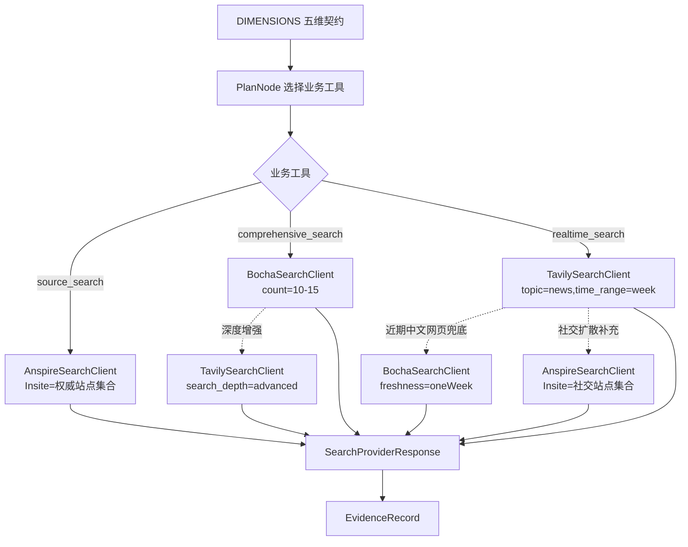

这才是 `MediaAgent` 检索层更理想的业务表达。理解了 MediaAgent 的工具映射，再回头看 InsightAgent，会发现它不是同一种工具选择方式。

## 4. Insight 与 Media 的工具映射差异

`InsightAgent` 的工具链路偏向私域数据引擎：

```text
DB keyword_recall
DB comment_recall
DB hot_recall
Milvus vector_search
hybrid_search
```

这些工具先把私域证据召回到 `EvidencePool.records`，然后通过排序、聚类、语义路由，把自由证据对齐到五维 `section_key`。

`MediaAgent` 的工具链路则偏向网页搜索：

```text
comprehensive_search
source_search
realtime_search
```

它在规划阶段就为每个章节选择搜索工具，然后在 `SearchNode` 中按章节执行搜索。

两者对五维契约的使用方式不同：

| Agent | 数据来源 | 工具映射发生的位置 | 五维契约的作用 |
| --- | --- | --- | --- |
| `InsightAgent` | 私域数据库 + 向量库 | 排序、聚类、章节调拨阶段 | 把证据簇对齐到固定 `section_key` |
| `MediaAgent` | 公域网页搜索 | 章节规划阶段 | 为每个固定维度选择搜索工具和关键词 |

可以用下面这张图概括：

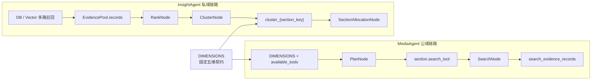

所以这里不要试图把两个 Agent 的工具模型强行统一成一个抽象，它们真正应该共享的是：

```text
五维结构契约
证据记录契约
证据渲染方式
证据强度判断
```

至于“如何检索、如何调拨、如何打包”，应该回到各自 Agent 内部。这就进入本章第二个核心：证据记录。

## 5. EvidenceRecord：跨域共享的标准证据货币

前面已经看到，`InsightAgent` 和 `MediaAgent` 的检索方式完全不同。

`InsightAgent` 从私域数据库和向量库里召回内容，证据天然带有平台表名、互动数据、热度分和聚类信息；`MediaAgent` 从公域搜索客户端里拿网页结果，证据更关注标题、链接、网页摘要和抓取时间。上游差异这么大，如果下游还继续直接消费各自的原始结果，后面的证据渲染、章节写作、事件发布就会不断出现适配分支。

所以这里需要一个中间层：它不抹平两个 Agent 的业务差异，但要给下游提供一个共同能识别的证据形态。这个共同形态就是 `EvidenceRecord`。

`EvidenceRecord` 位于：

```text
engines/contracts/evidence/models.py
```

它是 `InsightAgent` 和 `MediaAgent` 都能理解的统一证据载体。

当前定义可以概括为：

```python
@dataclass(slots=True)
class EvidenceRecord:
    id: str
    platform: str
    source_table: str
    source_keyword: Optional[str]

    content: str
    published_at: str

    hotness_score: float = 0.0
    final_score: float = 0.0

    cluster_id: str = ""
    engagement: Engagement = field(default_factory=Engagement)
    retrieval: RetrievalMeta = field(default_factory=RetrievalMeta)

    url: str = ""
```

先不要急着逐个字段背含义。`EvidenceRecord` 的设计重点不是字段多，而是它把“不同来源的原始结果”整理成了下游统一可消费的证据对象。为了看清这个统一是怎么发生的，可以把字段分成三组：第一组负责说明证据从哪里来，第二组负责承载证据正文，第三组负责保存后续分析会用到的增强信息。

这份模型里有三类字段。

第一类是溯源字段：

```text
id
platform
source_table
source_keyword
url
```

溯源字段解决的是“这条证据是谁、从哪里来、为什么会被召回”的问题。舆情系统里不能只保留一段内容文本，因为报告一旦进入分析和展示阶段，用户一定会追问：这条材料来自哪个平台、哪个工具、哪个关键词、是否能回到原始链接。

`InsightAgent` 的 `source_table` 可能是微博内容表、抖音内容表、评论表。

`MediaAgent` 的 `source_table` 则可以直接记录搜索提供商，例如：

```text
anspire
bocha
tavily
```

可以看到，同一个字段在两个 Agent 中承载的是同一类语义：都在说明来源。但它不要求两边来源形态完全一样。私域证据可以写表名，公域证据可以写搜索 provider，这就是共享模型要保持的弹性。

第二类是核心内容字段：

```text
content
published_at
```

无论证据来自数据库、向量库还是网页搜索，最终给 LLM 分析时都需要正文内容和时间信息。

这一组字段是最小可分析单元。没有 `content`，LLM 没有材料可读；没有 `published_at`，很多舆情判断就会失去时间坐标，比如“事件是否还在发酵”“这是早期报道还是最新进展”“某个说法是否已经被后续信息修正”。

第三类是分析增强字段：

```text
hotness_score
final_score
cluster_id
engagement
retrieval
```

这些字段对 `InsightAgent` 更重要，因为私域舆情分析需要排序、热度、互动、聚类、召回通道分数。

而 `MediaAgent` 的网页证据通常没有互动数据，也不参与 K-Means 聚类，所以这些字段保留默认值即可。

这一点很关键：共享模型不是要求每个字段都被每个 Agent 同等使用。它只是给“可能需要这些信息的下游流程”预留稳定位置。`InsightAgent` 会深度使用热度、互动、聚类字段；`MediaAgent` 只需要填好网页内容和链接，也完全合理。

这就是“统一证据记录”的价值：

```text
不是要求每个 Agent 都填满所有字段，
而是让不同来源的证据能用同一种载体向下游流动。
```

理解了字段分组后，再看转换流程就更清楚了。无论上游是数据库行、向量检索结果，还是网页搜索结果，进入报告写作之前都会先被整理成 `EvidenceRecord`。它像一个“标准入口”，把上游差异挡在证据层之前。

数据转换流程如下：

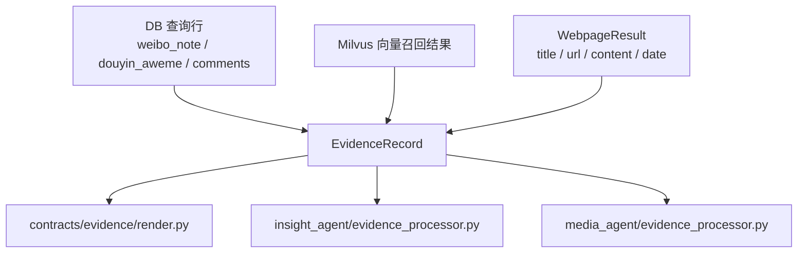

在 `MediaContext._map_to_evidence_records()` 中，网页结果会被转换成 `EvidenceRecord`：

```python
EvidenceRecord(
    id=_generate_content_hash_id(page.content, page.url),
    platform=response.provider,
    source_table=response.provider,
    source_keyword=query,
    content=page.content,
    published_at=page.date,
    url=page.url,
)
```

这里 `id` 使用正文和 URL 生成哈希，主要是为了后续去重。

到这里，跨域共享的实体已经讲清楚了。但这也容易引出一个误区：既然 `EvidenceRecord` 可以共享，那是不是所有证据相关模型都应该共享？答案恰好相反。共享 `EvidenceRecord` 是为了统一证据入口，而不是为了把两个 Agent 的内部处理过程合并在一起。

所以接下来要特别强调：共享 `EvidenceRecord` 不等于共享所有证据处理模型。

## 6. 共享契约与私有领域边界

第 5 章解决的是“哪些证据对象可以跨域流动”。但只要开始做多 Agent 系统，就会遇到另一个更细的问题：哪些模型应该留在共享层，哪些模型必须回到各自 Agent 内部？

这一章要回答的就是边界判断标准。它不是一个代码技巧，而是后续系统能不能持续扩展的架构原则。最重要的一句架构原则：**谁消费，谁定义；只共享，不强融**。意思是：

```text
真正被多个上下文共同消费的模型，才放到 contracts。
只被某一个 Agent 内部消费的模型，就放回这个 Agent 自己的领域边界里。
```

所以当前 `contracts/evidence/models.py` 只保留：

```text
EvidenceRecord
Engagement
RetrievalMeta
EvidenceStrength
```

而下面这些模型不再放在全局契约中：

```text
EvidenceCluster
EvidencePool
Insight SectionEvidencePack
Media SectionEvidencePack
```

原因很简单：它们不是同一种东西。

`EvidencePool` 是 Insight 私域证据池，它服务于私域检索、排序、聚类、章节调拨。

```text
records
clusters
```

`EvidenceCluster` 是 Insight 聚类产物，它服务于 K-Means 聚类、规则兜底聚类和五维语义路由。

```text
member_record_ids
representative_ids
size
summary
```


但是 `MediaAgent` 不做这套聚类流程。它只需要：

```text
网页搜索结果
证据文本块
证据数量
证据强度
```

这说明 Media 侧需要的是“搜索结果如何打包给章节写作”，而不是“证据如何聚类成私域舆情簇”。如果把 Insight 的聚类模型放到共享层，Media 虽然可以 import 到它们，但业务上并不真正需要它们。

所以如果把 `EvidencePool`、`EvidenceCluster` 强行放进全局 contracts，`MediaAgent` 就会被迫“认识” Insight 的私有概念。表面看是复用了模型，实际是边界污染。


正确结构应该是：

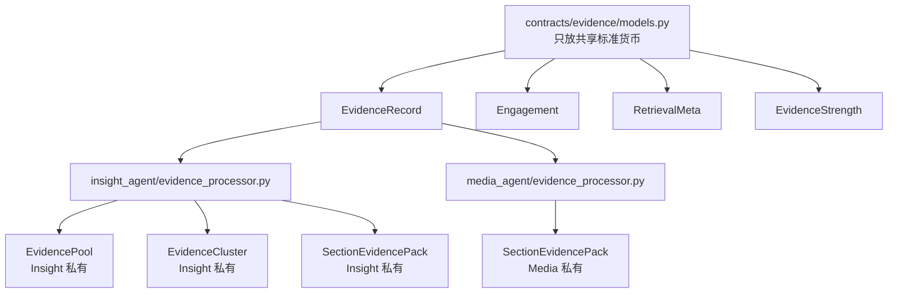

这就是私有领域模型回归。它是为了让每个模块的边界更干净：

```text
共享层只共享真正稳定的标准货币。
Agent 内部保留自己的聚合根和处理行为。
```

有了这个原则以后，下一步就可以把文件职责说清楚：哪些文件负责定义共享实体，哪些文件负责处理这些实体。也就是下面要讲的 `evidence` 和 `evidence_processor` 的分工。

## 7. 证据模型的职责拆分

上一章强调了“不要把私有领域模型强行塞进共享层”。这一章再往下走一步：即使是证据相关代码本身，也不能把“数据长什么样”和“数据怎么被处理”混在一起。当前把证据相关逻辑拆成了两类。

第一类是“数据契约”，位于：

```text
engines/contracts/evidence/models.py
```

它主要定义实体和值对象：

```text
EvidenceRecord
Engagement
RetrievalMeta
EvidenceStrength
```

这些模型表达的是“**数据长什么样**”。

第二类是“处理行为”，位于：

```text
engines/contracts/evidence/render.py
engines/insight_agent/evidence_processor.py
engines/media_agent/evidence_processor.py
```

它们表达的是“**这些数据如何被加工**”。这两类不要混在一起。

换句话说，`models.py` 应该尽量稳定，因为它定义的是跨模块交流的语言；`evidence_processor.py` 可以随着各 Agent 的策略演进，因为它承载的是本领域的处理方法。稳定的契约和可演进的行为分开，系统才不会因为一个节点策略变化就牵动全局模型。

可以用下面这张表理解：

| 位置 | 类型 | 主要内容 | 是否跨 Agent 共享 |
| --- | --- | --- | --- |
| `contracts/evidence/models.py` | 数据契约 | `EvidenceRecord`、`Engagement`、`RetrievalMeta` | 是 |
| `contracts/evidence/render.py` | 通用处理行为 | `evaluate_evidence_strength`、`render_evidence_records` | 是 |
| `insight_agent/evidence_processor.py` | Insight 私有处理行为 | 聚类池、章节证据选择、Insight 证据包 | 否 |
| `media_agent/evidence_processor.py` | Media 私有处理行为 | 搜索证据包、Media 章节事件 | 否 |

这一层拆分非常重要。如果把“证据实体”和“证据处理逻辑”混在一个大文件里，后续会出现两个问题：

```text
第一，任何 Agent 的行为变化都会导致共享契约变化。
第二，新 Agent 想复用 EvidenceRecord 时，会被迫带上不属于自己的处理逻辑。
```

合理拆分架构：

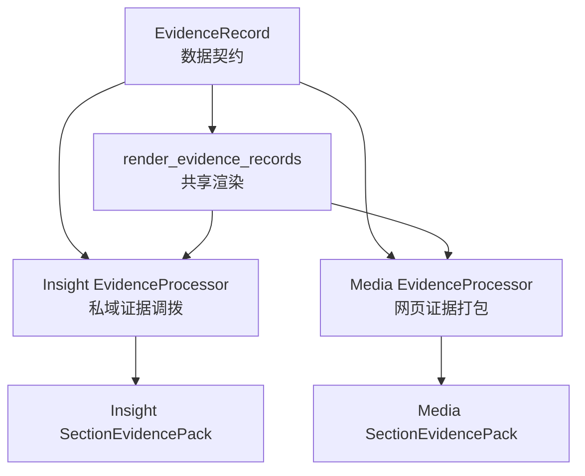

一句话总结：

```text
evidence/models.py 负责“是什么”。
evidence/render.py 负责“通用怎么展示”。
各 Agent 的 evidence_processor.py 负责“本领域怎么消费”。
```

这时再去看两个 Agent 的 `evidence_processor.py`，就不会把它们理解成“重复代码”。它们其实是在各自限界上下文里消费同一种 `EvidenceRecord`。接下来先看已经在上一章出现过的 `InsightAgent`。

## 8. InsightAgent 的私域证据模型

前面讲的是抽象原则：共享实体留在 contracts，私有消费模型回到 Agent 内部。现在把视角落到 `InsightAgent`，看这个原则在私域舆情分析链路里具体长什么样。

`InsightAgent` 的特点是证据处理链路比较重：它不是拿到证据就直接写报告，而是要先做多路召回、排序、聚类、维度对齐和章节调拨。因此它需要的私有模型也更多。

`InsightAgent` 的证据处理器位于：

```text
engines/insight_agent/evidence_processor.py
```

这个文件里定义了三个 Insight 私有领域模型：

```text
EvidenceCluster
EvidencePool
SectionEvidencePack
```

这三个模型刚好对应 Insight 证据加工的三个层次：先有全局池，再有聚类簇，最后有章节写作证据包。下面按这个顺序看。

### 8.1 全局证据池：EvidencePool

先看最外层的 `EvidencePool`。它不是某一章的证据，也不是某一次检索的结果，而是整个 Insight 分析任务的全局证据容器。

`EvidencePool` 当前定义为：

```python
@dataclass(slots=True)
class EvidencePool:
    query: str
    records: list[EvidenceRecord] = field(default_factory=list)
    clusters: list[EvidenceCluster] = field(default_factory=list)
```

它只服务于 `InsightAgent`。

因为只有私域舆情分析链路需要经历：

```text
多路召回
去重排序
语义聚类
章节调拨
```

`MediaAgent` 的网页搜索链路没有 `EvidencePool.clusters` 这个概念，所以不应该复用这个模型。

### 8.2 维度证据簇：EvidenceCluster

有了全局证据池以后，下一步不是立刻写章节，而是要把证据按照语义和业务维度分组。这个分组结果就是 `EvidenceCluster`。

`EvidenceCluster` 当前定义为：

```python
@dataclass(slots=True)
class EvidenceCluster:
    id: str
    label: str
    summary: str
    member_record_ids: list[str] = field(default_factory=list)
    representative_ids: list[str] = field(default_factory=list)
    size: int = 0
```

它的 `id` 通常会对齐到：

```text
cluster_background_overview
cluster_heat_and_spread
cluster_sentiment_and_opinion
cluster_platform_and_group_diff
cluster_deep_causes_and_impact
```

这说明它是 Insight 聚类和五维对齐之后的产物。

### 8.3 章节证据调拨：generate_section_records

聚类簇只是把证据放到了大致正确的维度里，但章节写作还需要一个更具体的动作：从全局记录中取出当前章节需要的证据，并按照适合该章节的方式排序。这个动作由 `generate_section_records` 完成。

上一章重点讲过 `generate_section_records`，这里从边界角度再看一次：

```python
def generate_section_records(section_key: str, records: list[EvidenceRecord]) -> list[EvidenceRecord]:
    matched_records = [r for r in records if r.cluster_id == f"cluster_{section_key}"]
    if not matched_records:
        return []

    sort_key = _calculate_comment_score if section_key in {
        "sentiment_and_opinion",
        "deep_causes_and_impact",
    } else _calculate_heat_score

    return sorted(matched_records, key=sort_key, reverse=True)
```

这个函数明显是 Insight 私有行为。

原因是它依赖：

```text
record.cluster_id
cluster_{section_key}
评论型排序策略
热度型排序策略
```

而这些都来自私域舆情证据池。

所以它应该待在 `insight_agent/evidence_processor.py`，而不是 `contracts/evidence`。

### 8.4 章节写作证据包：SectionEvidencePack

证据调拨完成后，还是不能直接把一堆 `EvidenceRecord` 原样塞给 LLM。章节写作需要的是更适合 prompt 消费的证据包：它要告诉 LLM 当前主题是什么、证据有多少、证据强度如何，以及可读的证据文本块是什么。

Insight 版本的 `SectionEvidencePack` 是：

```python
@dataclass(slots=True)
class SectionEvidencePack:
    used_query: str = ""
    evidence_count: int = 0
    evidence_strength: EvidenceStrength = "missing"
    evidence_source_blocks: list[str] = field(default_factory=list)
```

构建函数是：

```python
def generate_section_evidence_pack(
    used_query: str,
    selected: list[EvidenceRecord],
) -> SectionEvidencePack:
    count = len(selected)
    return SectionEvidencePack(
        used_query=used_query,
        evidence_count=count,
        evidence_strength=evaluate_evidence_strength(count),
        evidence_source_blocks=render_evidence_records(selected[:30]),
    )
```

这里复用了共享函数：

```text
evaluate_evidence_strength
render_evidence_records
```

但 `SectionEvidencePack` 本身仍然是 Insight 私有。

这正好体现了本章原则：

```text
共享通用能力，
不共享私有聚合模型。
```

Insight 的证据处理流程如下：

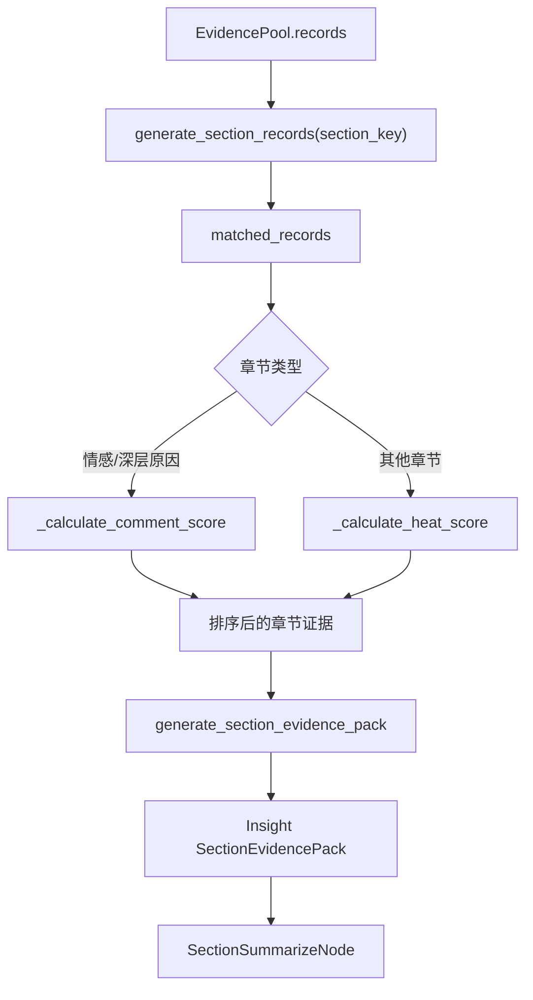

讲完 Insight 这一侧，再看 MediaAgent，会发现它的证据处理器明显更轻。

## 9. MediaAgent 的搜索证据模型

`InsightAgent` 的证据处理器重，是因为它要处理私域证据池、语义聚类和章节调拨。`MediaAgent` 的证据处理器轻，是因为当前 Media 链路的核心不是聚类，而是把网页搜索结果稳定打包给章节写作。

所以进入 Media 侧时，不要拿它和 Insight 逐项对齐。更合适的看法是：它们都消费 `EvidenceRecord`，但消费方式不同。

`MediaAgent` 的证据处理器位于：

```text
engines/media_agent/evidence_processor.py
```

当前它定义的私有模型是：

```python
@dataclass(frozen=True, slots=True)
class SectionEvidencePack:
    used_query: str
    evidence_count: int
    evidence_strength: EvidenceStrength = "missing"
    evidence_source_blocks: list[str] = field(default_factory=list)
```

注意，它也是 `SectionEvidencePack`，但它和 Insight 的 `SectionEvidencePack` 不应该强行合并。

原因是两者的消费场景不同：

| 模型 | 消费者 | 证据来源 | 特点 |
| --- | --- | --- | --- |
| Insight `SectionEvidencePack` | Insight 章节摘要节点 | 私域 EvidencePool 按 `section_key` 调拨后的证据 | 证据经过排序、聚类、章节筛选 |
| Media `SectionEvidencePack` | Media 章节摘要节点 | Web 搜索后的网页证据 | 证据来自公域搜索结果，当前按全局搜索池打包 |

虽然字段现在看起来接近，但语义来源不同。

这里是建模中很容易踩坑的地方。很多时候两个类字段相似，并不代表它们就是同一个领域模型。字段只是表象，真正决定模型归属的是它服务的业务流程。

如果因为字段相似就抽成一个全局 `SectionEvidencePack`，后续 Insight 加上：

```text
missing_notes
cluster_summary
representative_quotes
allocation_strategy
```

或者 Media 加上：

```text
source_urls
provider
search_tool
used_search_keywords
```

全局模型就会不断膨胀，最终变成两个 Agent 都不舒服的大杂烩。

所以当前让它们各自待在自己的 `evidence_processor.py` 中，既满足了单一职责原则，又保证了模块间的绝对物理隔离。

Media 证据包构建逻辑很直接：

```python
def generate_section_evidence_pack(
    used_query: str,
    records: list[EvidenceRecord],
) -> SectionEvidencePack:
    hit_count = len(records)
    return SectionEvidencePack(
        used_query=used_query,
        evidence_count=hit_count,
        evidence_source_blocks=render_evidence_records(records),
        evidence_strength=evaluate_evidence_strength(hit_count),
    )
```

它同样复用了共享能力：

```text
render_evidence_records
evaluate_evidence_strength
```

但它不复用 Insight 的：

```text
EvidencePool
EvidenceCluster
generate_section_records
_calculate_heat_score
_calculate_comment_score
```

这就是边界清楚带来的好处。

到这里，两个 Agent 的证据处理器边界已经清楚了。下一步就可以把视角从“模型怎么放”切换到“MediaAgent 的图怎么跑”：它如何先规划工具，再执行搜索，最后进入章节写作。

## 10. MediaAgent 搜索状态机

第 9 章看到的是 Media 证据包的最终形态，但这个证据包不是凭空来的。它来自一条 LangGraph 状态机：先让 LLM 规划五维搜索策略，再执行网页搜索，再把搜索结果交给章节摘要节点。

这一章就看这条图。先看总流程，再看每个关键节点。

`MediaAgent` 的图结构位于：

```text
engines/media_agent/graph.py
```

当前流程是：

```python
START -> plan -> search -> summarize -> format_report -> persist_report -> END
```

从节点职责上看，这条图可以拆成五段：

| 图节点 | 对应文件 | 核心职责 | 写入状态 |
| --- | --- | --- | --- |
| `plan` | `media_agent/nodes/section_plan_node.py` | 根据主题、五维契约和可用工具生成五章节搜索计划 | `sections`、`cursor` |
| `search` | `media_agent/nodes/section_search_node.py` | 遍历五个章节，按章节工具和关键词执行网页搜索 | `search_evidence_records` |
| `summarize` | `media_agent/nodes/section_summary_node.py` | 使用搜索证据包逐章生成正文，并发布章节就绪事件 | `sections`、`cursor` |
| `format_report` | `common/nodes/format_node.py` | 汇总所有章节正文，生成完整 Markdown 报告 | `final_report`、`report_title` |
| `persist_report` | `common/nodes/save_report.py` | 把最终 Markdown 报告保存到本地 | 报告文件 |

这里能看出一个很清楚的分层：

```text
plan/search/summarize 是 MediaAgent 私有流程
format_report/persist_report 是多个 Agent 可以复用的通用交付流程
```

也就是说，MediaAgent 只在“证据如何来、章节如何写”这部分保持私有；一旦章节正文生成完毕，最终排版和落盘就回到通用节点。

其中 `summarize` 仍然使用条件边循环：

```python
graph.add_conditional_edges(
    "summarize",
    _route_after_summarize,
    {"next_section": "summarize", "all_done": "format_report"},
)
```

所以 MediaAgent 和 InsightAgent 在报告生成阶段保持了同一种 LangGraph 思路：

```text
规划章节
准备证据
cursor 循环生成章节
整合报告
保存报告
```

只是前半段的证据来源不同。

MediaAgent 的图结构可以画成下面这样：

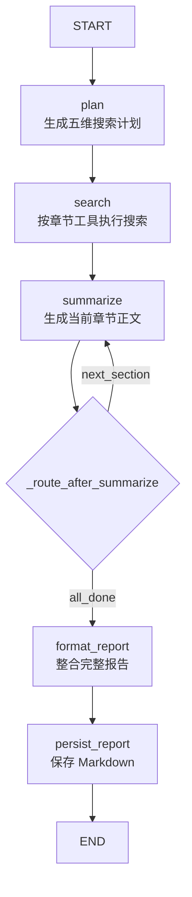

这里最值得注意的是 `search` 节点的位置。

它不是在每个章节写作时临时搜索，而是在章节规划完成后，先把五个章节对应的搜索都执行一遍，聚合成全局 `search_evidence_records`。然后 `summarize` 节点再通过 `cursor` 循环消费这些搜索证据。

这让图的节奏非常清楚：

```text
先规划五维搜索策略
再统一完成公域搜索
最后进入章节循环写作
```

### 10.1 图结构与循环控制

总图看完以后，再进入 `graph.py`。这个文件的价值不是“把节点串起来”这么简单，它定义了 MediaAgent 每一步什么时候执行、哪些节点可以循环、什么时候进入最终报告阶段。

`graph.py` 的核心函数是：

```python
def build_graph(ctx: MediaContext) -> Any:
    graph = StateGraph(MediaState)

    graph.add_node("plan", PlanNode(ctx))
    graph.add_node("search", SearchNode(ctx))
    graph.add_node("summarize", SectionSummarizeNode(ctx))
    graph.add_node("format_report", FormatReportNode(ctx))
    graph.add_node("persist_report", SaveReportNode(ctx))

    graph.add_edge(START, "plan")
    graph.add_edge("plan", "search")
    graph.add_edge("search", "summarize")
    graph.add_conditional_edges(
        "summarize", _route_after_summarize,
        {"next_section": "summarize", "all_done": "format_report"},
    )
    graph.add_edge("format_report", "persist_report")
    graph.add_edge("persist_report", END)

    return graph.compile()
```

这里有两个设计点。

第一个设计点是 `StateGraph(MediaState)`。

这表示整张图的所有节点都围绕同一个 `MediaState` 读写数据，节点之间不直接互相调用，而是通过状态字段交接中间产物。

第二个设计点是 `_route_after_summarize()`：

```python
def _route_after_summarize(state: MediaState) -> str:
    cursor = state.get("cursor", 0)
    return "next_section" if cursor < len(state.get("sections", [])) else "all_done"
```

它和 InsightAgent 的循环控制方式保持一致：

```text
cursor < len(sections)
    说明还有章节没写完，回到 summarize

cursor >= len(sections)
    说明五个章节都写完了，进入 format_report
```

这样 MediaAgent 不需要在一个节点内部写一个大 `for` 循环，而是把“逐章生成”交给 LangGraph 的条件边处理。

### 10.2 五维搜索计划生成

图的第一步是 `PlanNode`。它的职责不是直接搜索，而是先把“研究主题”翻译成“五个章节各自该怎么搜”。如果没有这一步，后面的搜索节点只能拿同一个 query 反复检索，五个章节的证据很容易混在一起。

`PlanNode` 做四件事：

```text
第一，读取 query。
第二，构造包含 fixed_dimensions 和 available_tools 的 Prompt。
第三，让 LLM 生成 MediaResearchPlan。
第四，以 DIMENSIONS 为基准生成稳定的 MediaSection 列表。
```

`MediaSection` 中除了基础章节字段，还多了搜索字段：

```python
class MediaSection(TypedDict, total=False):
    title: str
    section_key: str
    goal: list[str]
    search_tool: SearchTool
    search_keywords: list[str]
```

这意味着章节规划不是纯报告大纲，而是一个“搜索执行计划”。

### 10.3 章节级搜索执行

有了搜索计划以后，`SearchNode` 才真正开始和工具层交互。它不再问“报告要写哪几章”，而是按每个章节已经决定好的 `search_tool` 和 `search_keywords` 执行检索。

`SearchNode` 遍历所有章节：

```python
for section in sections:
    tool = section.get("search_tool", "comprehensive_search")
    search_query = f"{query} {' '.join(section.get('search_keywords'))}".strip()
    records = await self.context.execute_search(tool, search_query)
```

它把全局主题和章节关键词组合起来：

```text
原始主题 query + 章节专属 search_keywords
```

这样每个维度都会形成不同的搜索表达。

例如研究主题是：

```text
某热点公共事件
```

五个章节可能形成：

```text
[source_search] 某热点公共事件 官方通报 首发报道
[realtime_search] 某热点公共事件 最新进展 热搜 传播
[comprehensive_search] 某热点公共事件 公众观点 争议
[comprehensive_search] 某热点公共事件 官方媒体 自媒体 平台差异
[comprehensive_search] 某热点公共事件 原因 影响 风险
```

这就是工具与五维契约结合后的效果。

### 10.4 搜索上下文与客户端分发

`SearchNode` 只负责决定“调用哪个业务工具、用什么搜索词”。真正把工具名落到底层搜索客户端的是 `MediaContext`。把这层单独放出来，是为了让节点逻辑保持干净：节点不需要知道 Anspire、Bocha、Tavily 的细节，只需要调用上下文提供的统一入口。

真正执行搜索的是：

```text
engines/media_agent/context.py
```

入口方法是：

```python
async def execute_search(self, tool_name: SearchTool, query: str) -> list[EvidenceRecord]:
```

它先校验工具名：

```python
validated_tool: SearchTool = (
    tool_name if tool_name in get_args(SearchTool) else "comprehensive_search"
)
```

然后分发到具体网页搜索方法：

```python
match tool_name:
    case "source_search":
        response = await self._web_search_client.source_search(query)
    case "realtime_search":
        response = await self._web_search_client.realtime_search(query)
    case _:
        response = await self._web_search_client.comprehensive_search(query)
```

最后统一转换成 `EvidenceRecord`。

完整流程如下：

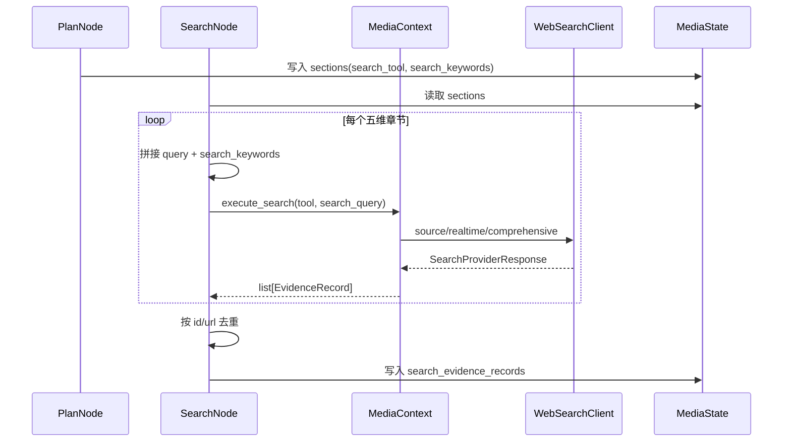

到这里，MediaAgent 得到了全局搜索证据池。接下来它会进入和 Insight 类似的章节循环写作。

## 11. MediaAgent 的状态与数据模型

前面第 10 章讲的是图怎么跑。只看图还不够，因为 LangGraph 的节点并不是靠函数参数一层层传值，而是靠共享状态在节点之间传递中间产物。这个共享状态就是 `MediaState`。

所以这一章先看 MediaAgent 的状态契约，再看这些状态字段背后的数据模型。

`MediaState` 位于：

```text
engines/media_agent/state.py
```

当前定义为：

```python
class MediaState(TypedDict, total=False):
    query: str
    role: str

    search_evidence_records: list[EvidenceRecord]
    sections: list[MediaSection]

    cursor: int

    final_report: str
    report_title: str
```

它和 `InsightState` 很像，但中间产物不同。

`InsightState` 中核心中间产物是：

```text
evidence_pool
section_evidence_records
```

`MediaState` 中核心中间产物是：

```text
search_evidence_records
```

这说明两个 Agent 的状态契约也没有被强行统一。

它们共享最终报告生成方式，保留各自证据阶段的中间产物。

对比如下：

| 状态字段 | InsightAgent | MediaAgent |
| --- | --- | --- |
| 输入主题 | `query` | `query` |
| 角色 | `role` | `role` |
| 全局证据 | `evidence_pool` | `search_evidence_records` |
| 章节规划 | `sections` | `sections` |
| 章节证据 | `section_evidence_records` | 当前由 `search_evidence_records` 打包消费 |
| 循环游标 | `cursor` | `cursor` |
| 最终报告 | `final_report` | `final_report` |

这也是“只共享，不强融”的状态层体现。除了 `MediaState` 这个图状态契约，MediaAgent 里还有几组很重要的数据模型。它们分别对应“章节状态”“LLM 规划输出”“Web 搜索结果”和“章节证据包”。把这些模型放在一起看，能更清楚地理解数据从 LLM、搜索工具一路流到报告章节的过程。

### 11.1 章节运行态：MediaSection

先从 `sections` 里的单个元素看起。因为 MediaAgent 的很多状态变化，最终都会落到每一个章节对象上。

`MediaSection` 是 `sections` 列表中的单个元素。

它分成两类字段：

```python
class MediaSection(TypedDict, total=False):
    title: str
    section_key: str
    goal: list[str]
    search_tool: SearchTool
    search_keywords: list[str]

    body: str
    hit_count: int
    evidence_strength: EvidenceStrength
```

前半部分是规划阶段写入的：

```text
title
section_key
goal
search_tool
search_keywords
```

后半部分是摘要阶段写入的：

```text
body
hit_count
evidence_strength
```

所以 `MediaSection` 和上一章的 `InsightSection` 一样，不是一开始就完整的对象，而是在图执行过程中逐步补齐。

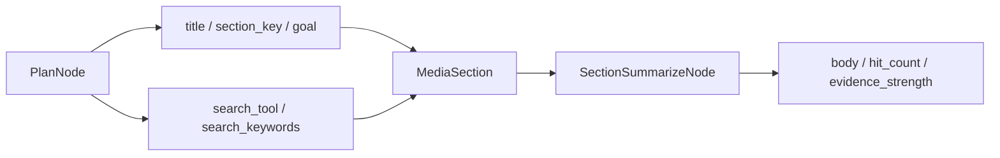

这也是 LangGraph 状态机里很常见的模型设计：同一个状态对象在不同节点阶段承载不同成熟度的数据。

### 11.2 LLM 规划输出：MediaResearchPlan

`MediaSection` 是运行时状态，但它最初不是手写出来的，而是由 LLM 规划结果转换而来。因此还需要看 `MediaResearchPlan`：它是 LLM 和程序之间的结构化输出契约。

`MediaResearchPlan` 位于：

```text
engines/media_agent/schemas.py
```

它是 `PlanNode` 调用 LLM 之后要求返回的结构化对象：

```python
class MediaSectionPlan(BaseModel):
    title: str
    section_key: str
    goal_analysis_points: list[str]
    search_tool: SearchTool
    search_keywords: list[str]

class MediaResearchPlan(BaseModel):
    sections: list[MediaSectionPlan]
```

这里要注意 `MediaSectionPlan` 和 `MediaSection` 的区别。

`MediaSectionPlan` 是 LLM 输出模型，属于“规划结果”。

`MediaSection` 是图状态模型，属于“运行时章节状态”。

两者之间的转换发生在：

```text
PlanNode._generate_media_section()
```

这个转换点会做一件非常重要的事：

```text
不直接相信 LLM 返回顺序，
而是以 DIMENSIONS.values() 为基准重新对齐五维章节。
```

也就是说，LLM 可以帮助生成标题、分析点、工具和关键词，但最终章节结构仍由系统内置五维契约兜住。

### 11.3 章节搜索词：search_keywords

理解了 `MediaResearchPlan` 后，最值得单独拎出来讲的是 `search_keywords`。因为它看起来只是一个普通字段，但实际上决定了 MediaAgent 的搜索质量。

`MediaSectionPlan` 和 `MediaSection` 里都设计了一个字段：

```python
search_keywords: list[str]
```

这个字段不是为了重复用户的原始 `query`，而是为了把“章节分析目标”翻译成“搜索引擎更容易命中的检索词”。

用户输入的 `query` 通常是一个宽泛主题：

```text
某热点公共事件
```

但是五个章节真正要找的信息并不一样。

如果五个章节都只拿原始 `query` 去搜，就会出现两个问题。

第一个问题是结果同质化：

```text
背景章节搜 query
热度章节搜 query
观点章节搜 query
差异章节搜 query
原因章节搜 query
```

这样五次搜索很可能召回一批相似网页，下游章节写作看似分了五章，实际证据来源差不多。

第二个问题是章节目标落不到搜索词上。

例如 `background_overview` 需要找：

```text
官方通报
警方回应
首发报道
事件起因
```

而 `heat_and_spread` 需要找：

```text
最新进展
热搜
传播
关注度
```

如果只有一个原始 `query`，搜索引擎并不知道当前章节到底要偏向“事实溯源”还是“传播热度”。

所以 `search_keywords` 的作用是：

```text
把五维分析目标转换成章节专属检索词。
```

在 `SearchNode` 中，真正执行搜索时会把两者拼起来：

```python
search_query = f"{query} {' '.join(section.get('search_keywords'))}".strip()
```

也就是：

```text
全局主题 query + 章节专属 search_keywords
```

这样既不会丢失用户研究主题，又能让每个章节的搜索方向更明确。

| 章节维度 | 原始 query | search_keywords 示例 | 最终搜索方向 |
| --- | --- | --- | --- |
| `background_overview` | 某热点公共事件 | `官方通报`、`警方回应`、`首发报道` | 找事实锚点和权威来源 |
| `heat_and_spread` | 某热点公共事件 | `最新进展`、`热搜`、`传播` | 找近期变化和扩散动态 |
| `sentiment_and_opinion` | 某热点公共事件 | `网友评价`、`争议`、`观点` | 找公开情绪和观点表达 |
| `platform_and_group_diff` | 某热点公共事件 | `官方媒体`、`自媒体`、`平台差异` | 找不同来源叙事差异 |
| `deep_causes_and_impact` | 某热点公共事件 | `原因`、`影响`、`风险` | 找深层背景和后续影响 |

这里还有一个设计细节：`search_keywords` 放在 `MediaSectionPlan` 和 `MediaSection` 两层模型里。

原因是它的生命周期跨越两个阶段：

```text
PlanNode 阶段
    LLM 根据五维目标生成 search_keywords。

SearchNode 阶段
    SearchNode 读取 MediaSection.search_keywords 拼接真实检索词。
```

所以它既是 LLM 规划结果的一部分，也是运行时章节状态的一部分。

这条数据流如下：

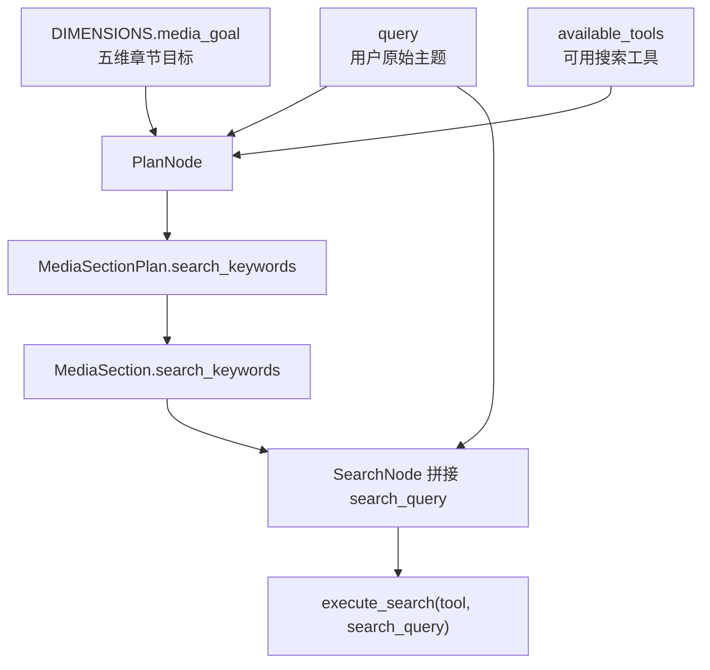

从业务角度看，`search_keywords` 是连接“报告结构”和“搜索引擎”的桥。

```text
section_key 决定这一章要分析什么。
search_tool 决定这一章用哪类工具找。
search_keywords 决定这一章具体怎么搜。
```

如果没有 `search_keywords`，`MediaAgent` 就只能做到“按章节选工具”，但搜索词仍然很粗。

有了 `search_keywords`，`MediaAgent` 才能做到：

```text
同一个主题，
五个章节，
五组不同搜索意图。
```

这也是为什么它应该出现在数据模型里，而不是在 `SearchNode` 中临时硬编码。

### 11.4 Web 搜索返回模型

有了章节搜索词以后，搜索客户端会返回自己的原始网页结果。这个阶段的模型属于“工具返回值”，它还不是下游写作直接消费的证据模型。

MediaAgent 的网页搜索模型位于：

```text
engines/media_agent/data/web_search/schemas.py
```

核心类型有三个：

```python
SearchTool = Literal["comprehensive_search", "source_search", "realtime_search"]
SearchProvider = Literal["anspire", "bocha", "tavily"]

@dataclass(frozen=True, slots=True)
class WebpageResult:
    title: str
    url: str
    content: str
    date: str

@dataclass(frozen=True, slots=True)
class SearchProviderResponse:
    query: str
    provider: SearchProvider
    webpages: list[WebpageResult] = field(default_factory=list)
```

这里有两层模型：

```text
WebpageResult
    表示单条网页结果。

SearchProviderResponse
    表示某个搜索供应商针对一次 query 返回的一组网页结果。
```

但是这些模型不会直接进入下游报告写作。

`MediaContext._map_to_evidence_records()` 会把它们转换为共享的 `EvidenceRecord`：

```text
SearchProviderResponse.webpages
    -> WebpageResult
    -> EvidenceRecord
    -> search_evidence_records
```

这样做的好处是，搜索供应商可以变，网页字段可以变，但下游证据处理器仍然只消费统一的 `EvidenceRecord`。

### 11.5 写作证据包：SectionEvidencePack

网页结果被统一成 `EvidenceRecord` 后，还需要再往前走一步：把一组证据记录整理成 LLM 写当前章节时最方便使用的包。这就是 Media 侧的 `SectionEvidencePack`。

MediaAgent 的章节证据包位于：

```text
engines/media_agent/evidence_processor.py
```

当前模型是：

```python
@dataclass(frozen=True, slots=True)
class SectionEvidencePack:
    used_query: str
    evidence_count: int
    evidence_strength: EvidenceStrength = "missing"
    evidence_source_blocks: list[str] = field(default_factory=list)
```

它和前面的模型处在不同阶段：

```text
MediaSectionPlan       LLM 规划阶段
MediaSection           LangGraph 运行时章节状态
WebpageResult          搜索供应商原始网页结果
EvidenceRecord         跨域共享证据记录
SectionEvidencePack    写作前的章节证据包
```

完整数据模型流转可以画成：

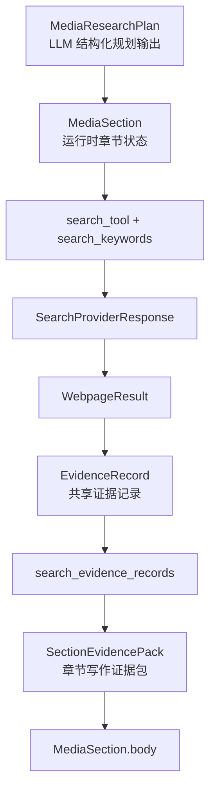

这张图把 MediaAgent 的数据模型串成了一条线。

它也再次说明：MediaAgent 并不是缺少模型，而是模型各自承担不同阶段的职责。规划模型、搜索模型、共享证据模型、写作证据包之间不混用，后续维护会轻很多。

状态契约和数据模型讲清楚后，再看章节写作节点就很顺了。

## 12. MediaAgent 的章节循环写作

第 10 章讲了图，第 11 章讲了状态和数据模型。现在可以进入 MediaAgent 的实际写作节点了。`SectionSummarizeNode` 是把前面所有准备工作真正转成章节正文的地方。

它的核心思路和 Insight 的摘要节点一致：一次只写一个章节，写完推进 `cursor`，然后交给 LangGraph 判断是否继续循环。

`MediaAgent` 的章节摘要节点位于：

```text
engines/media_agent/nodes/section_summary_node.py
```

它和 Insight 的摘要节点一样，使用 `cursor` 每次只生成一个章节：

```python
cursor = state.get("cursor", 0)
sections = list(state.get("sections"))

if cursor >= len(sections):
    return {"sections": sections}

section = sections[cursor]
```

然后读取全局搜索证据：

```python
query = state.get("query")
records = state.get("search_evidence_records", [])
```

当前版本为了保持链路简单，使用前 8 条搜索证据构建证据包：

```python
evidence_pack = generate_section_evidence_pack(
    records=records[:8],
    used_query=query
)
```

这里和 Insight 的 `SectionAllocationNode` 不同。

Insight 是：

```text
先按 section_key 精准调拨证据
再把对应章节证据给 Summary 节点
```

Media 当前是：

```text
先形成全局网页搜索证据池
Summary 节点按当前简化策略取证据包
```

这不是边界错误，而是两个 Agent 的阶段不同。

`MediaAgent` 当前更关注：

```text
工具选择
网页搜索
统一证据记录
章节写作闭环
```

后续如果要增强 Media 的章节证据分发，可以在 `media_agent/evidence_processor.py` 内部继续演进，而不需要污染 contracts。

Media 摘要节点流程如下：

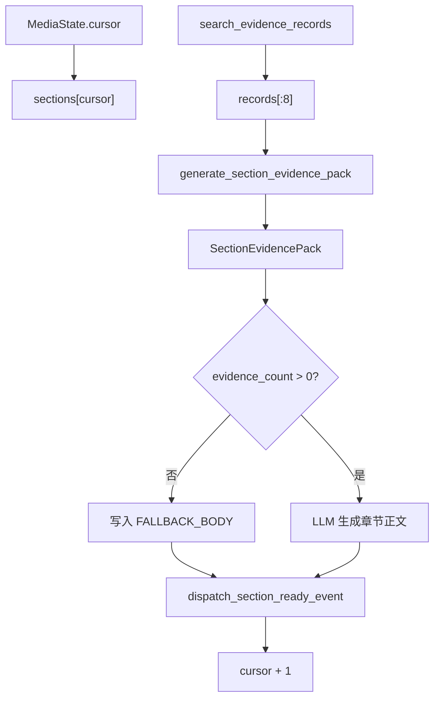

到这里，MediaAgent 已经有了和 InsightAgent 类似的报告闭环。

接下来把两个 Agent 放到一张图里对比，会更容易理解本章为什么一直强调“共享契约”和“私有处理器”。

## 13. Insight 与 Media 的证据链路对比

`InsightAgent` 和 `MediaAgent` 的共同点是：

```text
都围绕 query 生成报告。
都使用 DIMENSIONS 对齐五维结构。
都把证据转换成 EvidenceRecord。
都使用证据强度和证据文本块辅助 LLM 写作。
都通过 cursor 循环生成多个章节。
都复用 FormatReportNode 和 SaveReportNode。
```

但它们的不同点也很明显：

| 对比项 | InsightAgent | MediaAgent |
| --- | --- | --- |
| 数据来源 | 私域数据库、向量库 | 公域网页搜索 |
| 工具形态 | DB/Vector 检索工具 | Web 搜索工具 |
| 工具映射 | 召回后通过聚类对齐五维 | 规划阶段按五维选择工具 |
| 核心中间模型 | `EvidencePool`、`EvidenceCluster` | `search_evidence_records` |
| 章节证据分配 | `generate_section_records(section_key)` | 当前从全局搜索证据池打包 |
| 私有证据包 | Insight `SectionEvidencePack` | Media `SectionEvidencePack` |
| 共享模型 | `EvidenceRecord` | `EvidenceRecord` |

完整对比图如下：

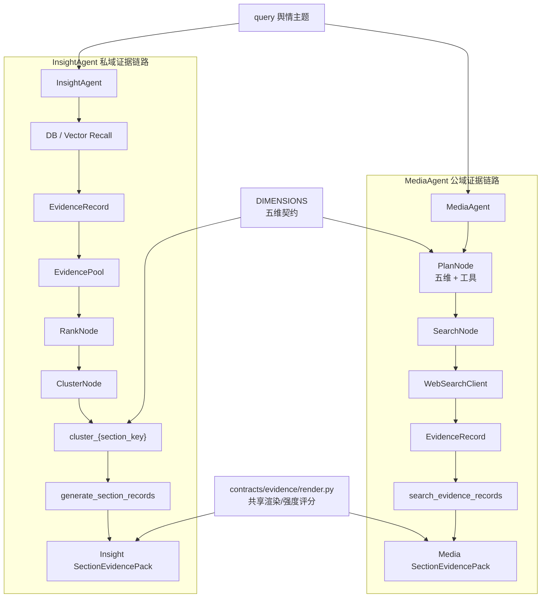

这张图可以看出一条很重要的分界线：

```text
EvidenceRecord 之前，各自有不同的数据源。
EvidenceRecord 之后，各自有不同的证据处理器。
只有 EvidenceRecord 和通用渲染能力是共享的。
```

这就是当前代码最值得保留的设计。

## 14. 共享证据渲染与强度评估

前面一直强调私有模型不要强合并，但 `render.py` 又被两个 Agent 共用。

这是否矛盾？

不矛盾。

因为 `render.py` 处理的是 `EvidenceRecord` 的通用展示能力，而不是某个 Agent 的私有流程。

当前 `render.py` 里有两个核心函数：

```python
def evaluate_evidence_strength(hit_count: int) -> EvidenceStrength:
    if hit_count >= 10:
        return "strong"
    if hit_count >= 5:
        return "medium"
    if hit_count > 0:
        return "weak"
    return "missing"
```

以及：

```python
def render_evidence_records(records: list[EvidenceRecord]) -> list[str]:
    return [_render_single_record(record) for record in records]
```

它们的输入都是通用的：

```text
hit_count
EvidenceRecord
```

它们不关心：

```text
这个证据来自 DB 还是网页
这个证据是否经过聚类
这个证据属于 Insight 还是 Media
这个章节是如何规划出来的
```

所以它们适合放在共享层。

共享层的判断标准不是“代码能不能复用”，而是：

```text
这个能力是否不属于任何一个具体 Agent 的私有业务流程。
```

如果答案是“是”，就可以进入 contracts 或 common。

如果答案是“否”，就应该留在对应 Agent 内部。

这条判断标准比“字段长得像不像”更可靠。


## 15. 全链路总览

最后用一张完整图把本章内容串起来：

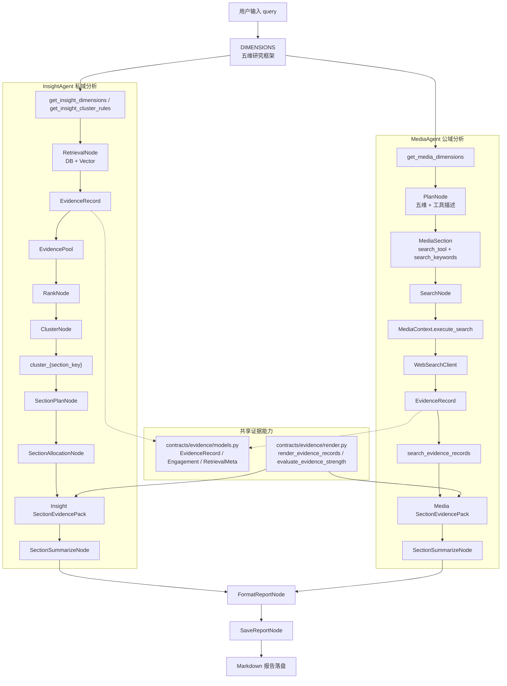

这张图里最重要的是三条边界：

```text
第一，DIMENSIONS 是报告结构和工具规划的共同契约。
第二，EvidenceRecord 是跨域流动的标准证据记录。
第三，EvidencePool / EvidenceCluster / SectionEvidencePack 等消费模型回到各自 Agent。
```

如果把这三条边界守住，后面继续扩展新 Agent、新工具、新证据源时，系统不会很快变成互相依赖的一团。

## 16. 本章小结

本章完成的是一次架构边界升级。

从代码表面看，好像只是新增了 `MediaAgent` 的一部分链路，并把证据模型拆到了 `contracts/evidence` 子包。

但从系统设计看，真正完成的是：

```text
用 DIMENSIONS 统一多 Agent 的报告结构。
用工具描述让 MediaAgent 按五维选择搜索工具。
用 EvidenceRecord 统一不同数据来源的证据载体。
用 render.py 共享通用证据渲染和强度评分。
用各自的 evidence_processor.py 保留私有领域模型和处理行为。
```

本章最重要的一句话是：

```text
谁消费，谁定义；只共享，不强融。
```

`EvidenceRecord` 是共享的，因为它是跨 Agent 流动的标准证据货币。

`EvidencePool`、`EvidenceCluster`、`SectionEvidencePack` 不应该盲目共享，因为它们属于具体 Agent 的消费模型。

这种设计让 `sentiment_bak` 和 `sentiment_platform_v1` 保持了架构方向上的连续性，同时又比完整项目更适合逐步讲解：

```text
先讲共享契约，
再讲私有处理器，
最后再让多个 Agent 在同一套五维框架下协同工作。
```

到这里，第六天代码就不只是“补了 MediaAgent”，而是让整个项目开始具备多 Agent 扩展时最关键的边界意识。
