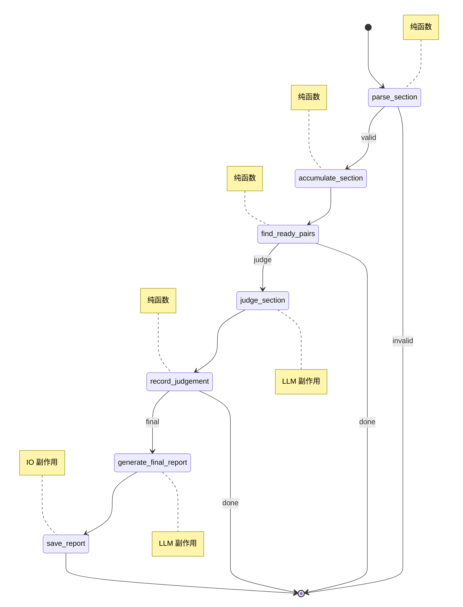
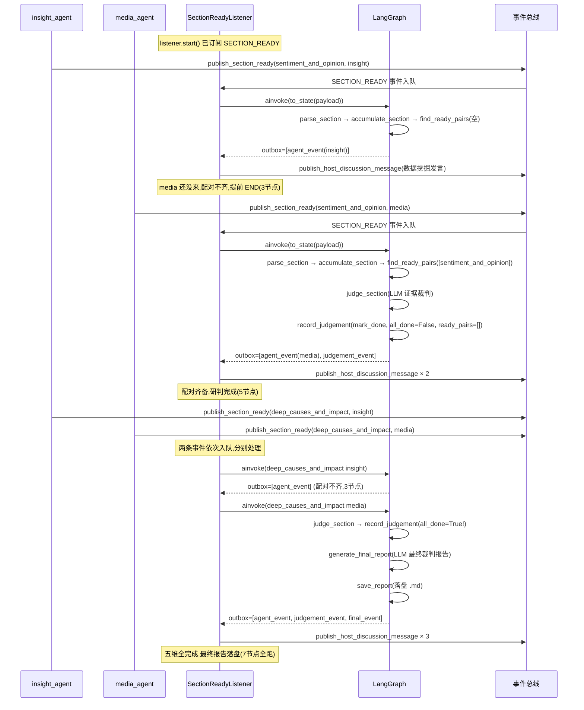

# HostAgent 主持人研判引擎

## 1. 多 Agent 协作与主持人定位

### 1.1 平台全景：两个搜索 Agent + 一个主持人

在多 Agent 舆情中，当用户输入一个研究主题，系统会启动两个独立的搜索 Agent，分别从不同信道对该主题进行五维度深度分析：

**insight_agent（私域舆情研究员）** 基于私有舆情数据库，搜索库内真实讨论、用户评论、平台差异和历史趋势。它的视角更接地气——能听到普通用户的原始声音，看到库内沉淀的历史趋势，但受限于数据覆盖范围，对事件的外部传播和媒体报道缺乏感知。

**media_agent（公开媒体研究员）** 基于网络媒体和公开信息检索，分析媒体叙事、传播节点、公开报道和外部舆论场。它的视角更宏观——能捕捉到权威信源、媒体报道议程和舆论扩散节点，但对库内私域讨论和用户真实情绪缺乏触达。

两个 Agent 各自独立运行，各自产出五个维度的章节报告。每个维度完成后，Agent 通过进程内事件总线发布 `section_ready` 事件，把章节分析结果以 JSON 载荷的形式广播出去。

### 1.2 事件载荷契约

`section_ready` 事件的载荷结构如下（以 insight_agent 发布「事件背景与概览」维度为例）：

```json
{
  "source": "insight",
  "agent_name": "数据挖掘",
  "section_key": "background_overview",
  "section_index": 0,
  "title": "事件背景与概览",
  "query": "某知名品牌食品安全事件",
  "body": "## 事件背景与概览\n\n6月15日，某知名连锁餐饮品牌被曝出后厨卫生问题...\n\n核心发现：\n1. 事件起源于一段抖音曝光视频\n2. 品牌方在事发后6小时发布声明\n3. 库内相关讨论集中在6月15-17日",
  "section_metadata": {
    "hit_count": 35,
    "strength": "strong"
  }
}
```

| 字段 | 说明 |
|---|---|
| `source` | Agent 的角色 key（`"insight"` 或 `"media"`），用于配对分桶和入口校验 |
| `agent_name` | Agent 显示名（如「数据挖掘」「舆情分析」），用于讨论消息的发送者展示 |
| `section_key` | 维度标识，取值固定为五维 key 之一 |
| `section_index` | 维度序号（0-4） |
| `title` | 维度标题 |
| `query` | 研究主题 |
| `body` | 章节分析正文（Markdown） |
| `section_metadata` | 嵌套元数据，含 `hit_count`（命中证据数）和 `strength`（证据强度等级） |

每个 Agent 会对五个维度各发一条 `section_ready` 事件——总共 10 条事件（insight 5 条 + media 5 条）。事件的到达顺序不固定，两个 Agent 各自独立运行、互不感知。

### 1.3 为什么需要主持人

两个 Agent 对同一维度的结论经常出现分歧甚至矛盾——私域说「用户情绪以愤怒为主」，公域说「媒体报道偏理性客观」；私域的证据来自 35 条库内讨论，公域的证据来自 10 篇媒体报道。谁更可信？分歧的根源是什么？需要怎样的综合判断？

这些问题的答案不能靠简单拼接两个 Agent 的报告得出。它需要一个**主持人（Judge）**——对齐两个 Agent 的同维度输出，做证据裁判、冲突检测和阶段性研判，最终生成一份以**主持人综合判断**为主的最终裁判报告。

这就是 HostAgent 的职责。它不产生新的检索，只做**裁判**。它订阅两个Agent的 `section_ready` 事件，等两个Agent 的结果到齐后配对，调用 LLM 做证据裁判，累积研判，五维全完成后生成最终报告并落盘。整个过程由 LangGraph 图驱动，跨 10 条事件异步累积。

## 2. 架构总览

HostAgent 内部按单一职责拆分为 10 个文件，依赖关系无环：

| 文件 | 核心实体 | 职责 |
|---|---|---|
| `schemas.py` | `SectionResult` / `SectionPair` / `SectionJudgement` | 纯领域数据契约 + 事件载荷解析 |
| `pair_store.py` | `PairStore` | 维度配对存储（声明式状态机） |
| `prompts.py` | 4 个字符串常量 | 纯 prompt 模板（零框架依赖） |
| `mappers.py` | `build_*_event` / `append_event` | 领域对象 → 外部事件映射（防腐层） |
| `judge.py` | `Judge` | LLM 研判 + payload 装配 + 重试降级 |
| `state.py` | `State` / `Session` | LangGraph 运行时 State + 跨事件 Session |
| `nodes.py` | 7 个节点函数 + `build_nodes` | 图节点（纯状态流转 + Judge 注入） |
| `graph.py` | `build_graph` + 3 个路由函数 | 图拓扑编排 |
| `listener.py` | `SectionReadyListener` | 事件入口 + asyncio worker |
| `__init__.py` | 包导出 | 对外 API |

外部调用链只有一条：

```
ModerationService.begin_moderation()
  → SectionReadyListener()       # 零参构造
      judge = Judge()
      session = Session()
      graph = build_graph(judge)
  → listener.start()             # 订阅 SECTION_READY 事件 + 启动 worker
```

`ModerationService` 不感知 `Judge` / `Session` / `graph` 的存在——这些全部封装在 `SectionReadyListener.__init__` 内部。服务层只调 `start()` / `stop()`，干净利落。

## 3. LangGraph 图拓扑

### 3.1 七节点与三条条件路由

整个研判流程被编排为一张 LangGraph 状态图，包含 7 个节点和 3 处条件分支。节点分为两类：**纯函数计算节点**（只做状态流转与校验，不调外部服务）和 **LLM 副作用节点**（调用 LLM 生成研判或报告）。



5 个纯函数节点负责状态流转——解析事件、入队配对、查就绪、记录研判、落盘。2 个 LLM 节点负责最重的认知工作——单维证据裁判和最终报告综合。这种分离让图的大部分执行路径极快（纯内存操作），只有真正需要 LLM 时才触发昂贵的 API 调用。

### 3.2 三种执行路径

一条 `section_ready` 事件到达后，图并不总是跑完全部 7 个节点。实际执行路径取决于当时配对状态：

**路径 A — 单边到达（3 节点）**：最常见。insight 发来「事件背景与概览」维度，但 media 还没发 → 配对不齐 → `find_ready_pairs` 返空 → 提前 END。不调 LLM。

**路径 B — 配对齐备（5 节点）**：media 补齐了 insight 之前发的维度 → `find_ready_pairs` 返回 1 个就绪配对 → `judge_section` 调 LLM 研判 → `record_judgement` 记录 → `all_done=False` 且 `ready_pairs=[]` → END。

**路径 C — 五维全完成（7 节点全跑）**：最后一个维度的对侧到齐 → 路径 B 的流程走完后 `all_done=True` → `generate_final_report` 调 LLM 生成最终报告 → `save_report` 落盘 → END。整个会话只发生一次。

### 3.3 研判后的状态刷新与路由

`record_judgement` 是研判流程的收尾节点，它在标记维度 done 后一次算齐三个值写入 state：`all_done`（五维是否全完成）、`ready_pairs`（刷新后的就绪列表）和 `judgements`（追加本次研判）。这样后续的路由函数 `_route_after_record` 读到的是标记 done 之后的最新状态，不需要一个独立的 `check_completion` 节点来做这件事。

`_route_after_record` 基于这两个值决定下一步：

- `all_done=True` → `"final"` → 进入 `generate_final_report`，生成最终报告
- `all_done=False` → `"done"` → END，等待下一个事件

在当前事件模型下（一条 `section_ready` 事件只携带一个维度的一个 Agent 结果），一次 `ainvoke` 内最多让一个维度从「不就绪」变为「就绪」。研判完这一个维度后 `all_done` 要么为 `True`（五维全完成，进最终报告），要么为 `False`（还有维度没齐，等下一个事件）。`_route_after_record` 只在这两个分支之间二选一，没有第三条路。

## 4. 双层状态管理

### 4.1 框架局限与双层突围

LangGraph 的节点函数签名是 `def node(state: State) -> State`——框架只把 `state` 传给节点，节点也只返回 state 的增量更新。这意味着节点无法直接访问任何外部上下文对象。

同时，`state` 的生命周期是**单次 `ainvoke`**——`graph.ainvoke(state)` 返回后，`state` 字典就被调用方丢弃。下一次事件到来时，`Session.to_state()` 重新构建一个全新的 `state`。

问题来了：HostAgent 需要跨多次事件累积配对进度和历史研判。如果状态只在单次 `ainvoke` 内存在，那「insight 发了维度 A → 等 media 发维度 A → 配对齐备 → 研判」这个跨事件过程就无从维系。

解决方案是**双层状态**：

- **State**（`TypedDict`）：LangGraph 单次 `ainvoke` 的运行时状态。节点读写它，`ainvoke` 结束后丢弃。
- **Session**（`@dataclass`）：跨多次 `ainvoke` 的会话状态。`SectionReadyListener` 持有它，在事件的间隙存活。`to_state()` 把 Session 的累积状态注入 State，`apply_state()` 把 State 的最终值回收 Session。

两个方法就是两层之间的唯一接缝。

### 4.2 共享引用

`pair_store` 是一个有状态的 `PairStore` 实例，被 `Session` 持有。`to_state()` 把**同一个对象引用**注入 `state["pair_store"]`。节点通过 `state["pair_store"]` 拿到这个引用后，调用 `pair_store.add(result)` 或 `pair_store.mark_done(section_key)` ——这些方法**原地修改** `PairStore` 的内部字典和集合。

因为整个 `ainvoke` 期间 `state["pair_store"]` 和 `Session.pair_store` 指向同一个对象，原地修改对双方都可见。所以节点**不需要在返回字典里带上 `pair_store`**——LangGraph 会保留未被返回字段覆盖的现有值，而 mutation 已经通过共享引用生效。

这和 `judgements` 列表的处理方式不同。`judgements` 是一个裸 `list`，节点用不可变更新（`[*old, new]`）生成新列表，LangGraph 用新列表覆盖旧值。`Session` 在 `ainvoke` 结束后通过 `apply_state()` 把最终列表回收。两种模式各有适用场景：有状态对象用共享引用，裸集合用不可变更新。

### 4.3 State 与 Session 字段一览

`State` 是 LangGraph 单次 `ainvoke` 内的运行时状态，节点函数通过读写它来推进流程。12 个字段按职责分为四组：

**入口与校验**——由 `parse_section` 写入，驱动首次条件路由：

| 字段 | 类型 | 写入者 | 作用 |
|---|---|---|---|
| `incoming` | `dict[str, Any]` | `Session.to_state` | 本次 `section_ready` 事件原始载荷 |
| `section_result` | `SectionResult` | `parse_section` | 从 `incoming` 解析出的领域对象 |
| `valid` | `bool` | `parse_section` | 入口校验结果，驱动 `_route_after_parse` 走 `valid` 或 `invalid` |

**配对与流转**——由 `accumulate_section`、`find_ready_pairs`、`record_judgement` 写入，驱动研判循环：

| 字段 | 类型 | 写入者 | 作用 |
|---|---|---|---|
| `pair_store` | `PairStore` | `Session.to_state` | 共享可变引用 |
| `query` | `str` | `accumulate_section` | 研究主题，从 `result.query` 写入，`save_report` 同 invoke 读取 |
| `ready_pairs` | `list[SectionPair]` | `find_ready_pairs` | 当前就绪的维度配对列表，`judge_section` 取 `[0]` 研判 |
| `current_pair` | `SectionPair` | `judge_section` | 正在研判的配对，`record_judgement` 据此 `mark_done` |
| `current_judgement` | `SectionJudgement \| None` | `judge_section` | 本次 LLM 研判输出，`None` 表示降级 |
| `all_done` | `bool` | `record_judgement` | 五维是否全完成，驱动 `_route_after_record` 走 `final` |

**累积与输出**——跨节点累积，在 `ainvoke` 结束后由 `Session.apply_state` 回收或由 `listener` 读取：

| 字段 | 类型 | 写入者 | 作用 |
|---|---|---|---|
| `judgements` | `list[SectionJudgement]` | `record_judgement` | 本轮图执行累积的维度研判列表（在 invoke 结束时覆盖回 `Session`） |
| `final_report` | `str \| None` | `generate_final_report` | 最终裁判报告内容，`save_report` 据此落盘 |
| `outbox` | `list[HostDiscussionMessageEvent]` | 多节点追加 | 本次 invoke 产出的讨论事件列表，`listener` 逐条广播 |

`Session` 只持有**真正需要跨 invoke 存活**的两个字段，其余都在单次 invoke 内自生自灭：

| 字段 | 类型 | 设计目的 |
|---|---|---|
| `pair_store` | `PairStore` | 跨事件长存的维度配对存储——累积 insight/media 各维结果，直到同维度齐备才触发研判 |
| `judgements` | `list[SectionJudgement]` | 跨事件长存的阶段性研判历史——既作为后续维度的 `previous` 上下文，也作为最终报告的源材料 |

`to_state()` 在每次 invoke 前把这两个字段注入 `State`（`pair_store` 传引用、`judgements` 传副本）；`apply_state()` 在 invoke 后把 `State.judgements` 的最终值覆盖回 `Session`（`pair_store` 因共享引用已实时同步，无需回写）。

## 5. PairStore 配对机制

### 5.1 累积与就绪

`PairStore` 按 `section_key` 维度累积 insight 和 media 的章节结果。内部维护两个结构：`_results`（按维度 → 按 source → SectionResult 的嵌套字典）和 `_done`（已研判维度 key 的集合）。

一个维度「就绪」的条件是：不在 `_done` 中，且 `insight` 和 `media` 两个 source 都有结果。`ready_pairs()` 遍历固定的五维 key 列表，返回所有就绪维度的 `SectionPair`。

### 5.2 `_done` 的双重作用

`_done` 是一个 `set[str]`，记录已完成研判的维度 key。它在两个地方被检查，作用不同但互补：

**第一道 `_is_ready()` 的循环终止**：

```python
def _is_ready(self, section_key: str) -> bool:
    return section_key not in self._done and all(source in bucket for source in _REQUIRED_SOURCES)
```

`record_judgement` 调 `mark_done(A)` 后立即调 `ready_pairs()` 刷新 state。如果 `_done` 不排除 A，`ready_pairs()` 会再次返回 A（两个 source 的结果还在 `_results` 里），`_route_after_record` 就会路由 `"judge"` → 重新研判 A → 又 `mark_done` → 又返回 A……**死循环**。`_done` 是这个循环的终止条件——这是它存在的根本原因。

**第二道 `add()` 的重复入队拒绝**：

```python
def add(self, result: SectionResult) -> bool:
    if self._is_done(result.section_key):
        return False    # 已研判维度,拒绝新结果
```

如果 agent 重发了一个已研判维度的结果（比如 insight 重跑了 `background_overview`），`add()` 直接拒绝。没有这道防线，新结果会进 `_results`——但因为第一道防线 `_is_ready()` 已经排除了 `_done` 中的维度，`ready_pairs()` 不会返回它，所以**不会触发重复研判**。第二道防线只是让拒绝更早发生（在 `add` 时就挡掉，而不是让数据进了 `_results` 再被 `ready_pairs` 排除）。

**低质量去重（独立于 `_done`）**：当同一个 Agent 对同一个维度在被研判之前发来了两次结果时（可能因 agent 内部节点重试、LangGraph 循环边重新执行等），`_is_weaker_duplicate` 检查同一 `(section_key, source)` 是否已有结果——如果有，比较质量评分（`_quality_score`），三元组 `(证据强度等级, 命中数, 正文长度)` 按字典序比较。旧结果 score ≥ 新结果 score 时拒绝新结果，保留高质量的那个；新结果 score 更高时接受并覆盖。这确保异常重发场景下不会用低质量结果覆盖已有好结果。

### 5.3 研判后状态产出

`record_judgement` 在调用 `mark_done()` 后计算 `all_done()`，把 `all_done` 和 `judgements` 写入 state。`_route_after_record` 据此决定走 `"final"`（五维全完成，进最终报告）还是 `"done"`（等待下一个事件）。

## 6. 两阶段 LLM 管线

### 6.1 逐维研判

当某个维度的 insight + media 齐备时，`judge_section` 节点调用 `Judge.judge_section(pair, previous)`。`pair` 是该维度的 `SectionPair`（含 insight 和 media 的 `SectionResult`），`previous` 是已完成的其他维度研判列表。

`Judge` 把 `pair` 的两个 SectionResult 和 `previous[-3:]`（最近 3 条研判）序列化为 JSON，填入 `SECTION_USER_PROMPT_TEMPLATE` 模板的 `{evidence}` 占位符，连同 `SYSTEM_PROMPT` 一起发给 LLM。

`previous[-3:]` 的滑窗设计让主持人在研判第 N 维时能看到自己最近 3 条研判，保持跨维度一致性——不会自相矛盾、可以递进引用。控制在 3 条是为了避免 prompt token 爆炸。

### 6.2 最终报告综合

五维全部研判完成后，`generate_final_report` 节点调用 `Judge.generate_final_report(results)`，`results` 是全部 5 条 `SectionJudgement`。`Judge` 把它们序列化为 JSON 填入 `FINAL_USER_PROMPT_TEMPLATE`，发给 LLM。

关键点：最终报告的源材料是**主持人自己的 5 条阶段性研判**，不是 insight/media 的原始发言。这是一个两阶段管线：

```
阶段1（逐维）: insight+media 发言 + previous judgements → LLM → SectionJudgement × 5
阶段2（最终）: 5 条 SectionJudgement                → LLM → 最终报告 str
```

`judgements` 列表在这两个阶段中扮演双重角色：横向（逐维研判时作为 `previous` 上下文）和纵向（生成最终报告时作为 `results` 源材料）。


## 7. 事件流转

### 7.1 五维研判框架

平台的五维研究框架定义在 `engines/contracts/dimensions.py` 中，每个维度对 insight 和 media 有不同的分析目标：

| 序号 | 维度 key | 标题 | insight_goal（私域） | media_goal（公域） |
|---|---|---|---|---|
| 1 | `background_overview` | 事件背景与概览 | 说明事件主线、库内可见讨论范围、关键时间点和基础事实 | 梳理媒体侧基础报道、首发信息、权威信源和事实框架 |
| 2 | `heat_and_spread` | 舆情热度与传播 | 分析高热内容、传播节奏、互动特征和平台热度差异 | 分析报道热度、扩散节点、传播节奏和关键媒体/平台来源 |
| 3 | `sentiment_and_opinion` | 公众情感与观点 | 提炼主要情绪倾向、观点类型、代表性用户声音和共识/分歧 | 分析公开报道和评论反馈中的情绪倾向、观点阵营和意见领袖表达 |
| 4 | `platform_and_group_diff` | 平台与群体差异 | 比较微博/抖音、帖子/评论之间的讨论重点、表达风格和人群侧重 | 比较官方媒体、市场化媒体、自媒体及不同平台渠道的叙事差异 |
| 5 | `deep_causes_and_impact` | 深层原因与影响 | 分析社会心理、争议成因、潜在影响和后续舆情风险 | 分析媒体议程设置、社会背景、争议成因、外溢影响和传播风险 |

假设以「安全事件」为研究主题。`insight_agent` 基于私域数据库搜索用户讨论和评论，`media_agent` 基于公开互联网搜索媒体报道和社交媒体吐槽。两个 Agent 各自独立运行，每完成一个维度的分析就发布一条 `section_ready` 事件。

### 7.2 事件载荷示例

当 `insight_agent` 完成第 3 维度「公众情感与观点」的私域分析后，发布事件：

```json
{
  "source": "insight",
  "agent_name": "数据挖掘",
  "section_key": "sentiment_and_opinion",
  "section_index": 2,
  "title": "公众情感与观点",
  "query": "某知名连锁餐饮品牌食品安全事件",
  "body": "## 公众情感与观点（私域）\n\n库内相关讨论共 17 条，情绪分布如下：\n\n1. **愤怒（47%）**：集中质疑品牌方回应诚意，典型声音：'声明里连赔偿方案都没有'\n2. **担忧（29%）**：关注食品安全监管长效机制，'今天能曝光这家，明天呢？'\n3. **理解（12%）**：认为品牌方响应速度可接受\n4. **观望（12%）**：等待最终调查结果\n\n共识：品牌方应在 24 小时内公布具体赔偿方案。\n分歧：是否应追究加盟商个人责任。",
  "section_metadata": {
    "hit_count": 17,
    "strength": "medium"
  }
}
```

随后 `media_agent` 也完成了同一维度的公开舆情分析，发布事件：

```json
{
  "source": "media",
  "agent_name": "舆情分析",
  "section_key": "sentiment_and_opinion",
  "section_index": 2,
  "title": "公众情感与观点",
  "query": "某知名连锁餐饮品牌食品安全事件",
  "body": "## 公众情感与观点（公域）\n\n公开渠道共检索到 9 条相关报道和评论：\n\n1. **权威媒体定调**：新华网发表评论《食品安全没有侥幸》，强调监管常态化\n2. **市场化媒体追问**：新京报追问'加盟模式下的品控漏洞'\n3. **自媒体情绪放大**：多个美食博主发布'避雷指南'，引发转发热潮\n4. **社交平台分化**：微博以愤怒为主（'又一家塌房'），小红书偏理性分析\n\n意见领袖 @食品观察者 发文获得 2.3 万转发，核心观点：'问题不在一家店，在整套加盟品控体系'。",
  "section_metadata": {
    "hit_count": 9,
    "strength": "strong"
  }
}
```

两条事件的 `section_key` 相同（`sentiment_and_opinion`），`source` 不同（`insight` vs `media`）。HostAgent 的 `PairStore` 把它们配成一对，触发主持人研判。

### 7.3 累积与研判时间线

以下序列图展示两个 Agent 发出事件、HostAgent 内部累积配对、研判、最终落盘和广播的完整时间线。以 `sentiment_and_opinion`（第 3 维）和 `deep_causes_and_impact`（第 5 维，最后一个）为例：



### 7.4 outbox 累积机制

LangGraph 对普通 `TypedDict` 字段执行**整体覆盖**：节点返回 `{"outbox": new_list}` 会用 `new_list` 替换 `state["outbox"]`，不是追加。这意味着如果 `record_judgement` 只返回 `{"outbox": [judgement_event]}`，之前 `accumulate_section` 写入的 `agent_event` 就会被覆盖丢失。

解决方案是 `append_event` 函数——节点返回前先读取当前 outbox，追加新事件，返回完整的新列表：

```python
"outbox": append_event(state.get("outbox", []), build_judgement_event(judgement))
```

`append_event` 的实现是 `return [*outbox, event]`——生成新列表，不原地修改。这符合 LangGraph 不可变 state 更新约定。

一次 `ainvoke` 内可能有 2~3 个节点各产一条事件（agent 发言 + 主持人研判 + 最终报告），outbox 必须在节点间累积传递。`ainvoke` 结束后，`listener._run` 读取 `final_state["outbox"]` 并逐条 `publish_host_discussion_message`，前端 `/api/host/discussion` 轮询拿到完整讨论流。

以 `deep_causes_and_impact` 维度的最后一次 invoke 为例，outbox 累积过程：

| 节点 | 产出事件 | outbox 累积 |
|---|---|---|
| `accumulate_section` | `build_agent_event(media_result)` | `[agent_event]` |
| `judge_section` | （不产事件，只设 current_judgement） | `[agent_event]`（不变） |
| `record_judgement` | `build_judgement_event(judgement)` | `[agent_event, judgement_event]` |
| `generate_final_report` | `build_final_event(final_report)` | `[agent_event, judgement_event, final_event]` |
| `save_report` | （不产事件，只落盘） | `[agent_event, judgement_event, final_event]`（不变） |

最终 `listener._run` 拿到 3 条事件，逐条广播到事件总线，前端的讨论区显示完整的「舆情分析发言 → 主持人研判 → 主持人最终裁判」讨论流。

### 7.5 完整会话的消息产出

理解了单次 invoke 内 outbox 如何累积后，来看一个完整会话最终产出多少条讨论消息。假设两个 Agent 各发 5 个维度（共 10 条 `section_ready` 事件），LLM 全部成功：

| 消息类型 | 产出节点 | 数量 | 内容 |
|---|---|---|---|
| Agent 发言 | `accumulate_section` | 10 | 5 条 insight + 5 条 media，每条是该 Agent 对某维度的章节分析正文（截断 2000 字） |
| 主持人阶段裁判 | `record_judgement` | 5 | 每个维度配对齐备后 LLM 研判一次，共 5 个维度 5 条 |
| 主持人最终裁判 | `generate_final_report` | 1 | 五维全完成后 LLM 综合生成的最终报告 |
| **合计** | | **16** | |

#### 7.5.1 两层累积

消息从产出到前端经过两层累积，职责不同：

| 层 | 范围 | 谁负责 | 重置时机 |
|---|---|---|---|
| **outbox**（State 字段） | 单次 invoke 内 | `to_state()` 设为 `[]`，节点用 `append_event` 追加 | 每次 invoke 开始时重置为空 |
| **前端 buffer**（`DiscussionTranscriptBuffer`） | 跨全部 invoke | `listener._run` 每次 invoke 结束后逐条 `publish_host_discussion_message` → buffer 追加 | `stop()` 时清空 |

outbox 回答「这一轮 invoke 产了几条消息」，buffer 回答「整个会话从开始到现在累积了多少条」。前端轮询 `/api/host/discussion` 拿的是 buffer 的完整快照。

#### 7.5.2 逐事件追踪

以「insight 先发完全部 5 维，media 再发完全部 5 维」为例，追踪 10 次 invoke 各自的 outbox 和前端 buffer 累积：

| 事件 | 配对状态 | 图执行路径 | outbox 产出 | 广播条数 | buffer 累积 |
|---|---|---|---|---|---|
| 1: insight/背景 | 不齐 | parse → accumulate → find(空) → END | `[agent_event]` | 1 | 1 |
| 2: insight/热度 | 不齐 | 同上 | `[agent_event]` | 1 | 2 |
| 3: insight/情感 | 不齐 | 同上 | `[agent_event]` | 1 | 3 |
| 4: insight/平台 | 不齐 | 同上 | `[agent_event]` | 1 | 4 |
| 5: insight/深层 | 不齐 | 同上 | `[agent_event]` | 1 | 5 |
| 6: media/背景 | **齐备** | parse → accumulate → find([背景]) → judge → record → END | `[agent_event, judgement_event]` | 2 | 7 |
| 7: media/热度 | **齐备** | 同上（热度） | `[agent_event, judgement_event]` | 2 | 9 |
| 8: media/情感 | **齐备** | 同上（情感） | `[agent_event, judgement_event]` | 2 | 11 |
| 9: media/平台 | **齐备** | 同上（平台） | `[agent_event, judgement_event]` | 2 | 13 |
| 10: media/深层 | **齐备 + 全完成** | parse → accumulate → find([深层]) → judge → record(all_done!) → final → save → END | `[agent_event, judgement_event, final_event]` | 3 | **16** |

事件到达顺序不影响总数——无论 insight 和媒体如何交错，每个 Agent 的 5 条发言都会被接受（10 条），5 个维度各产生 1 条裁判（5 条），最终报告 1 条，总计始终 16 条。

#### 7.5.3 前端展示结构

前端 `HostDiscussionView.vue` 把 16 条消息按维度分组展示：

```
最终裁判区（1 条，无维度归属）
  └─ 主持人最终裁判

五维面板（每个面板 3 条：insight 发言 + media 发言 + 主持人裁判）
  ├─ 事件背景与概览:  数据挖掘发言 → 舆情分析发言 → 主持人裁判
  ├─ 舆情热度与传播:  数据挖掘发言 → 舆情分析发言 → 主持人裁判
  ├─ 公众情感与观点:  数据挖掘发言 → 舆情分析发言 → 主持人裁判
  ├─ 平台与群体差异:  数据挖掘发言 → 舆情分析发言 → 主持人裁判
  └─ 深层原因与影响:  数据挖掘发言 → 舆情分析发言 → 主持人裁判
```

如果 LLM 降级（某维度研判返回 `None`），对应维度的主持人裁判会缺失——agent 发言还在，但裁判那栏空白。最终报告同理——如果 `generate_final_report` 降级，最终裁判区为空。

### 7.6 映射器

节点不直接构造 `HostDiscussionMessageEvent`。这个职责集中在 `mappers.py`，作为领域模型与事件总线 DTO 之间的转换：

| 映射器 | 输入（领域对象） | 输出（事件 DTO） |
|---|---|---|
| `build_agent_event` | `SectionResult` | `HostDiscussionMessageEvent(type="agent")` |
| `build_judgement_event` | `SectionJudgement` | `HostDiscussionMessageEvent(type="host")` |
| `build_final_event` | `str`（最终报告内容） | `HostDiscussionMessageEvent(type="host")` |

如果 `HostDiscussionMessageEvent` 的字段结构未来变化（比如新增 `sentiment_score` 字段），只需要改 `mappers.py`，图节点不受影响。

## 8. 生命周期

### 8.1 启停幂等

`SectionReadyListener` 的 `start()` 和 `stop()` 都是幂等的——重复调用不会出错也不会重复创建 worker。`start()` 检查 `self._worker is not None`，已有 worker 则直接返回。`stop()` 检查 `self._worker is None`，未启动则直接返回。

`stop()` 保持同步签名（`ModerationService.stop_moderation()` 是同步调用）。`unsubscribe` 先于置空 queue，在单线程 asyncio 下无事件竞态。worker 的 `cancel()` 是 fire-and-forget——worker 在下一个 `await` 点收到 `CancelledError` 并退出。

### 8.2 Worker 循环与并发安全

`_run()` 是一个 `while True` 循环，每次从 `asyncio.Queue` 取一条事件载荷，执行 `to_state → ainvoke → apply_state → publish` 四步。`try/except Exception` 包住 `ainvoke` 和 `apply_state`，单条事件失败不会杀死循环——记日志后 `continue` 处理下一条。`CancelledError` 是 `BaseException`，不被 `except Exception` 捕获，能正确终止循环。

**串行执行，无需锁**。整个系统是单线程 asyncio，`Session` 和 `PairStore` 在任何时刻只被一个 `ainvoke` 访问。这源于三个保证：

1. **单 worker**：`start()` 幂等，只创建一个 `asyncio.create_task(self._run())`。不存在两个 `_run()` 协程实例交错执行。

2. **单执行指针**：`_run()` 是一个协程，只有一个执行指针。当它挂在 `await self.graph.ainvoke(state)`（内部 `await self.llm.generate_text(...)` 等 LLM 响应）时，event loop 可以调度其他协程，但**不会重新进入这个协程**——不会从 `while True` 循环顶部再次 `queue.get()` 取下一条事件。协程在 `ainvoke` 返回后从挂起点继续（`apply_state` → `publish` → 循环回 `get()`），下一条事件才开始处理。

3. **回调不碰共享状态**：`_on_callback` 是普通同步函数（非 `async def`），当新事件到达时它只执行 `self._queue.put_nowait(data)`——往队列塞数据后立即返回。不经过 `await`，不让出 event loop，更不会执行 `queue.get()` 或访问 `Session`。新事件安静地在队列里排队，等当前 `ainvoke` 全部完成后才被消费。

因此，即使 `judge_section` 的 LLM 调用耗时数秒，期间 event loop 在跑其他事情（如接收新事件入队、处理 FastAPI 请求），`Session` 和 `PairStore` 不会被并发修改——唯一的消费者（worker 协程）正挂在 `await` 上，没有人碰它们。

### 8.3 会话重置

`stop()` 调用 `session.clear()`，清空 `pair_store`（已配对维度和已 done 集合）和 `judgements`（历史研判）。`ModerationService.stop_moderation()` 还会把 `_listener` 置 `None`。下次 `begin_moderation()` 创建全新的 `SectionReadyListener()`——新 `Judge`、新 `Session`、新 graph——进入新一轮会话。

### 8.4 静止完成态

最终报告生成并落盘后，`Session` 的状态是：`pair_store._done` 含全部 5 维，`judgements` 含 5 条研判。此时 worker 仍在运行（`while True`），但后续任何 `section_ready` 事件都会被 `PairStore.add()` 的 `_is_done` 防线拒绝（返回 `False`），`accumulate_section` 不发 agent 事件，`find_ready_pairs` 返空（全 done），图在 `find_ready_pairs` 处提前 END。

也就是说，最终报告生成后、用户点停止前，Session 处于**静止完成态**——worker 持续消费但所有事件都是 no-op，不会再产生 LLM 调用或重复落盘。

### 8.5 跨查询会话隔离

`_done` 按 `section_key` 索引，不含 `query`。这意味着如果在同一会话内来了一个**新研究主题**的事件，已研判维度的 `_done` 记录会阻止新主题的同维度结果入队：

```
查询 A "品牌食品安全事件":
  invoke 1-10: 5 维全部研判完成, _done = {5 个 section_key}, 最终报告已落盘

查询 B "高考改革争议" (未 stop 直接提交):
  invoke 11: insight 发 background_overview, query="高考改革争议"
           → add() → _is_done("background_overview") → True → 拒绝!
```

这不是 bug，而是**设计约束**——host_agent 是单查询设计，host_agent 的整个流程是围绕一个研究主题设计：

```text
一个 query → 5 个维度 → 5 条 judgement → 1 份最终报告
```

**一个研究主题**对应一场研判会话，`judgements` 列表中的 `previous[-3:]` 上下文和最终报告的综合都假设所有研判属于同一主题。两个主题的研判混在同一个 `judgements` 列表里会破坏 LLM 的跨维度连贯性，最终报告也无法综合两个不同主题。

InsightAgent — 跨维度上下文（`previous[-3:]`）：研判第 3 维时，LLM 看到自己前 2 维的研判，保持连贯性。如果 `judgements` 里混入了另一个查询的研判，LLM 的上下文就被污染了——「品牌食品安全事件」的公众情感研判里突然出现「高考改革」的传播分析作为 previous，这毫无意义。

MediaAgent — 最终报告源材料：`generate_final_report` 拿全部 5 条 judgement 综合成一份报告。如果 5 条里有 3 条是「食品安全」、2 条是「高考改革」，LLM 要怎么综合？产出什么主题的报告？

**解决方案是前端编排**：提交新查询时自动 stop → start，清空旧 Session 再创建新的：

```javascript
async function handleResearch() {
  await stopHost()       // 清空旧 Session（_done / pair_store / judgements）
  await startHost()      // 创建全新 SectionReadyListener + 新 Session
  await startResearch()  // 提交查询,agent 开始发事件,host 已就绪接收
}
```

顺序保证 host 先订阅 `SECTION_READY` 事件再放 agent 发事件，不会丢事件。后端 API 零改动——`stop` 清空 Session + 销毁 listener，`start` 创建全新 listener，这两个接口的幂等性保证了安全。

